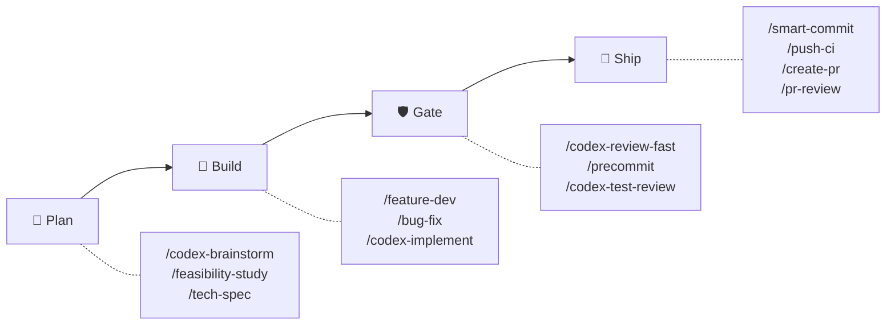
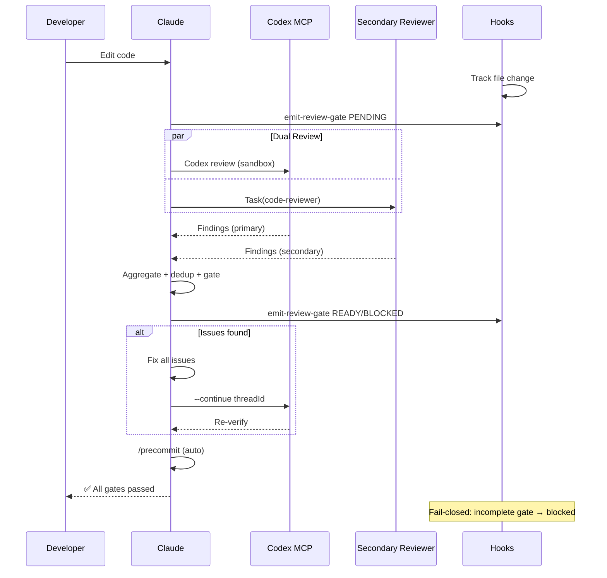

# sd0x-dev-flow

**언어**: [English](README.md) | [繁體中文](README.zh-TW.md) | [简体中文](README.zh-CN.md) | [日本語](README.ja.md) | 한국어 | [Español](README.es.md)

**[Claude Code](https://claude.com/claude-code)용 자율 개발 워크플로 엔진.**

- **수동 게이트 제로** — 코드 편집, 자동 리뷰, 자동 수정, 배포
- **듀얼 리뷰어 아키텍처** — Codex MCP + 보조 리뷰어 병렬 실행, fail-closed
- **~4% 컨텍스트 사용량** — Claude 200k 윈도우의 96%를 코드에 활용

73 commands | 56 skills | 14 agents | 6 hooks | 14 rules | 13 scripts

## 빠른 시작

```bash
# 플러그인 설치
/plugin marketplace add sd0xdev/sd0x-dev-flow
/plugin install sd0x-dev-flow@sd0xdev-marketplace

# 프로젝트 설정
/project-setup
```

하나의 명령어로 프레임워크, 패키지 매니저, 데이터베이스, 엔트리포인트, 스크립트를 자동 감지합니다. 12개 Rules + 5개 Hooks를 설치합니다.

`--lite`로 CLAUDE.md만 설정 (Rules/Hooks 스킵).

## 작동 원리



**Auto-Loop 엔진**이 품질 Gate를 자동으로 적용합니다. 코드가 편집되면 Claude가 같은 응답 내에서 **듀얼 리뷰**(Codex MCP + 보조 리뷰어 병렬 실행)를 트리거합니다. Findings는 중복 제거, 심각도 정규화 후 단일 gate로 집계됩니다. Hooks는 fail-closed를 강제합니다: 집계 gate가 미완료이면 stop-guard가 차단합니다.

<details>
<summary>상세: 듀얼 리뷰 시퀀스 다이어그램</summary>



</details>

## 기능 하이라이트: 듀얼 리뷰어 아키텍처

v2.0은 두 개의 독립적인 리뷰어를 병렬로 디스패치합니다 — 단일 장애점 제로:

| 리뷰어 | 역할 | 폴백 |
|--------|------|------|
| Codex MCP | 프라이머리 (sandbox, 전체 diff) | 항상 사용 가능 |
| 보조 (pr-review-toolkit) | 신뢰도 스코어링 리뷰 | strict-reviewer → 싱글 모드 |

Findings는 **심각도 정규화** (P0-Nit), **중복 제거** (파일 + 이슈 키, ±5줄 허용), **소스 귀속** (`codex` | `toolkit` | `both`)됩니다.

Gate: `✅ Ready` 또는 `⛔ Blocked` — fail-closed (미완료 gate = blocked).

## 사용 시나리오

| 적합 | 부적합 |
|------|--------|
| Claude Code를 사용하는 개인/소규모 팀 프로젝트 | Claude Code를 전혀 사용하지 않는 팀 |
| 자동화된 리뷰 게이트가 필요한 프로젝트 | CI가 없는 일회성 스크립트 |
| Codex CLI / Cursor / Windsurf 사용자 (skills 서브셋) | 커스텀 LLM 프로바이더가 필요한 프로젝트 |
| 품질 게이트로 리그레션을 방지하는 리포지토리 | 테스트 인프라가 없는 리포지토리 |

## 설치

### Codex CLI / 기타 AI 에이전트

```bash
# Agent Skills 표준으로 개별 스킬 설치
npx skills add sd0xdev/sd0x-dev-flow

# AGENTS.md 생성 + hooks 설치 (Claude Code 내에서 실행)
/codex-setup init
```

| 방법 | 지원 도구 | 커버리지 |
|------|----------|---------|
| 플러그인 설치 | Claude Code | 전체 (73 commands, hooks, rules, auto-loop) |
| `npx skills add` | Codex CLI, Cursor, Windsurf, Aider | Skills만 (56 skills) |
| `/codex-setup init` | Codex CLI | AGENTS.md 커널 + git hooks |

**요구 사항**: Claude Code 2.1+ | [Codex MCP](https://github.com/openai/codex) (선택 사항, `/codex-*` 명령어용)

## 워크플로 트랙

| 워크플로 | 명령어 | Gate | 적용 방식 |
|----------|--------|------|-----------|
| 기능 개발 | `/feature-dev` → `/verify` → `/codex-review-fast` → `/precommit` | ✅/⛔ | Hook + Behavior |
| 버그 수정 | `/issue-analyze` → `/bug-fix` → `/verify` → `/precommit` | ✅/⛔ | Hook + Behavior |
| Auto-Loop | 코드 편집 → `/codex-review-fast` → `/precommit` | ✅/⛔ | Hook |
| 문서 리뷰 | `.md` 편집 → `/codex-review-doc` | ✅/⛔ | Hook |
| 기획 | `/codex-brainstorm` → `/feasibility-study` → `/tech-spec` | — | — |
| 온보딩 | `/project-setup` → `/repo-intake` | — | — |

```mermaid
flowchart TD
    subgraph feat ["🔨 Feature Development"]
        F1["/feature-dev"] --> F2["Code + Tests"]
        F2 --> F3["/verify"]
        F3 --> F4["/codex-review-fast"]
        F4 --> F5["/precommit"]
        F5 --> F6["/update-docs"]
    end

    subgraph fix ["🐛 Bug Fix"]
        B1["/issue-analyze"] --> B2["/bug-fix"]
        B2 --> B3["Fix + Regression test"]
        B3 --> B4["/verify"]
        B4 --> B5["/codex-review-fast"]
        B5 --> B6["/precommit"]
    end

    subgraph docs ["📝 Docs Only"]
        D1["Edit .md"] --> D2["/codex-review-doc"]
        D2 --> D3["Done"]
    end

    subgraph plan ["🎯 Planning"]
        P1["/codex-brainstorm"] --> P2["/feasibility-study"]
        P2 --> P3["/tech-spec"]
        P3 --> P4["/codex-architect"]
        P4 --> P5["Implementation ready"]
    end

    subgraph ops ["⚙️ Operations"]
        O1["/project-setup"] --> O2["/repo-intake"]
        O2 --> O3["Develop"]
        O3 --> O4["/project-audit"]
        O3 --> O7["/best-practices"]
        O3 --> O5["/risk-assess"]
        O4 --> O6["/next-step --go"]
        O5 --> O6
        O7 --> O6
    end
```

<details>
<summary>시각화: 워크플로 플로차트</summary>



</details>

## 포함 내용

| 카테고리 | 수량 | 예시 |
|----------|------|------|
| Commands | 73 | `/project-setup`, `/codex-review-fast`, `/verify`, `/smart-commit`, `/deep-research` |
| Skills | 56 | project-setup, code-explore, smart-commit, contract-decode, deep-research |
| Agents | 14 | strict-reviewer, verify-app, coverage-analyst |
| Hooks | 6 | pre-edit-guard, auto-format, review state tracking, stop guard, namespace hint, post-compact-auto-loop |
| Rules | 14 | auto-loop, auto-loop-project, codex-invocation, security, testing, git-workflow, self-improvement, context-management |
| Scripts | 13 | precommit runner, verify runner, dep audit, namespace hint, skill runner, commit-msg guard, pre-push gate, utils, emit-review-gate, worktree-claude-sync, build-codex-artifacts, resolve-feature, generate-skills-manifest |

### 최소한의 Context 사용량

Claude의 200k context window 중 ~4%만 사용합니다. 나머지 96%는 코드에 활용할 수 있습니다.

| 구성 요소 | 토큰 수 | 200k 대비 비율 |
|-----------|---------|---------------|
| Rules (상시 로드) | 5.1k | 2.6% |
| Skills (온디맨드) | 1.9k | 1.0% |
| Agents | 791 | 0.4% |
| **합계** | **~8k** | **~4%** |

Skills는 온디맨드로 로드됩니다. 미사용 Skills는 토큰을 소비하지 않습니다.

## 명령어 레퍼런스

| 명령어 | 설명 |
|--------|------|
| `/project-setup` | 프로젝트 자동 감지 및 설정 |
| `/feature-dev` | 기능 개발 워크플로 |
| `/bug-fix` | Bug/Issue 수정 워크플로 |
| `/codex-review-fast` | 빠른 리뷰 (diff만) |
| `/codex-review-doc` | 문서 리뷰 |
| `/precommit` | lint:fix → build → test |
| `/precommit-fast` | lint:fix → test (빌드 없음) |
| `/verify` | 전체 검증 체인 |
| `/smart-commit` | 스마트 배치 커밋 |
| `/push-ci` | 푸시 + CI 모니터링 |
| `/create-pr` | GitHub PR 생성 |
| `/codex-brainstorm` | 대립형 브레인스토밍 (내시 균형) |
| `/tech-spec` | 기술 스펙 작성 |
| `/pr-review` | PR 셀프 리뷰 |
| `/codex-security` | OWASP Top 10 감사 |

<details>
<summary>전체 73개 명령어</summary>

### 개발

| 명령어 | 설명 |
|--------|------|
| `/project-setup` | 프로젝트 자동 감지 및 설정 |
| `/repo-intake` | 프로젝트 초기 스캔 (최초 1회) |
| `/install-rules` | 플러그인 규칙을 `.claude/rules/`에 설치 |
| `/install-hooks` | 플러그인 hooks를 `.claude/`에 설치 |
| `/install-scripts` | 플러그인 러너 스크립트 설치 |
| `/codex-setup` | Codex CLI 인프라 초기화 (AGENTS.md + hooks) |
| `/bug-fix` | Bug/Issue 수정 워크플로 |
| `/codex-implement` | Codex가 코드 작성 |
| `/codex-architect` | 아키텍처 자문 (제3의 두뇌) |
| `/code-explore` | 코드베이스 빠른 탐색 |
| `/git-investigate` | 코드 변경 이력 추적 |
| `/issue-analyze` | Issue 심층 분석 |
| `/post-dev-test` | 개발 후 테스트 보완 |
| `/feature-dev` | 기능 개발 워크플로 (설계 → 구현 → 검증 → 리뷰) |
| `/feature-verify` | 시스템 진단 (읽기 전용 검증, 이중 관점 확인) |
| `/load-pr-review` | GitHub PR 리뷰 코멘트를 세션에 로드 |
| `/pr-comment` | GitHub PR에 친절한 리뷰 코멘트 게시 |
| `/code-investigate` | 이중 관점 코드 조사 (Claude + Codex 독립 탐색) |
| `/next-step` | 컨텍스트 인식 다음 단계 어드바이저 |
| `/smart-commit` | 스마트 배치 커밋 (그룹화 + 메시지 + 명령어) |
| `/git-profile` | Git 아이덴티티 및 GPG 서명 프로파일 관리 |
| `/push-ci` | 푸시 (승인 필요) + CI 모니터링 |
| `/create-pr` | 브랜치에서 GitHub PR 생성 |
| `/git-worktree` | git worktree 관리 (.claude/ 자동 동기화) |
| `/merge-prep` | 병합 전 분석 및 준비 |
| `/smart-rebase` | squash-merge 리포지토리용 스마트 부분 rebase |
| `/deep-explore` | 멀티웨이브 병렬 코드 탐색 |
| `/remind` | 경량 모델 교정 (규칙 재로딩) |
| `/bump-version` | 패키지 + 플러그인 버전 동기 업데이트 |
| `/watch-ci` | GitHub Actions CI 실행 모니터링 |
| `/jira` | Jira 연동 (조회/브랜치 생성/상태 전환) |

### 리뷰 (Codex MCP)

| 명령어 | 설명 | Loop 지원 |
|--------|------|-----------|
| `/codex-review-fast` | 빠른 리뷰 (diff만) | `--continue <threadId>` |
| `/codex-review` | 전체 리뷰 (lint + build) | `--continue <threadId>` |
| `/codex-review-branch` | 브랜치 전체 리뷰 | - |
| `/codex-cli-review` | CLI 리뷰 (전체 디스크 읽기) | - |
| `/codex-review-doc` | 문서 리뷰 | `--continue <threadId>` |
| `/codex-security` | OWASP Top 10 감사 | `--continue <threadId>` |
| `/codex-test-gen` | 유닛 테스트 생성 | - |
| `/codex-test-review` | 테스트 커버리지 리뷰 | `--continue <threadId>` |
| `/codex-explain` | 복잡한 코드 설명 | - |
| `/seek-verdict` | P2 dismiss 블라인드 검증 | - |

### 검증

| 명령어 | 설명 |
|--------|------|
| `/verify` | lint -> typecheck -> unit -> integration -> e2e |
| `/precommit` | lint:fix -> build -> test:unit |
| `/precommit-fast` | lint:fix -> test:unit |
| `/dep-audit` | 디펜던시 보안 감사 |
| `/project-audit` | 프로젝트 헬스 감사 (결정론적 스코어링) |
| `/best-practices` | 업계 모범 사례 감사 (적대적 토론 포함) |
| `/risk-assess` | 미커밋 코드 리스크 평가 |
| `/pre-pr-audit` | PR 전 신뢰도 감사 (5차원 스코어링) |
| `/test-deep` | 컨텍스트 인식 테스트 오케스트레이션 |

### 기획

| 명령어 | 설명 |
|--------|------|
| `/codex-brainstorm` | 대립형 브레인스토밍 (내시 균형) |
| `/feasibility-study` | 타당성 분석 |
| `/tech-spec` | 기술 스펙 작성 |
| `/review-spec` | 기술 스펙 리뷰 |
| `/deep-analyze` | 심층 분석 + 로드맵 |
| `/project-brief` | PM/CTO용 요약 보고서 |
| `/deep-research` | 멀티 에이전트 심층 리서치 오케스트레이션 |

### 문서 & 도구

| 명령어 | 설명 |
|--------|------|
| `/update-docs` | 문서-코드 동기화 |
| `/check-coverage` | 테스트 커버리지 분석 |
| `/create-request` | 요구사항 문서 생성/업데이트 |
| `/doc-refactor` | 문서 간소화 |
| `/simplify` | 코드 간소화 |
| `/de-ai-flavor` | AI 생성 흔적 제거 |
| `/safe-remove` | 플러그인 에셋 안전 제거 |

| `/pr-review` | PR 셀프 리뷰 |
| `/pr-summary` | PR 상태 요약 (티켓별 그룹) |
| `/contract-decode` | EVM 컨트랙트 에러/calldata 디코더 |
| `/skill-health-check` | 스킬 품질 및 라우팅 검증 |
| `/statusline-config` | 상태 표시줄 세그먼트 및 테마 커스터마이즈 |
| `/claude-health` | Claude Code 설정 상태 점검 |
| `/op-session` | 1Password CLI 세션 초기화 (반복 생체 인증 방지) |
| `/obsidian-cli` | Obsidian vault 연동 (공식 CLI 경유) |
| `/zh-tw` | 번체 중국어로 변환 |

</details>

## Rules

| Rule | 설명 |
|------|------|
| `auto-loop` | 수정 -> 재리뷰 -> 수정 -> ... -> Pass (자동 순환) |
| `auto-loop-project` | 프로젝트별 auto-loop 오버라이드 (사용자 소유, 플러그인 미관리) |
| `codex-invocation` | Codex는 독립적으로 조사해야 하며, 결론 주입 금지 |
| `fix-all-issues` | 제로 톨러런스: 발견된 이슈 전부 수정 |
| `self-improvement` | 수정 사항 → 교훈 기록 → 재발 방지 |
| `framework` | 프레임워크별 컨벤션 (커스터마이즈 가능) |
| `testing` | Unit/Integration/E2E 격리 |
| `security` | OWASP Top 10 체크리스트 |
| `git-workflow` | 브랜치 네이밍, 커밋 컨벤션 |
| `docs-writing` | 테이블 > 문단, Mermaid > 텍스트 |
| `docs-numbering` | 문서 접두사 컨벤션 (0-feasibility, 2-spec) |
| `logging` | 구조화된 JSON, 시크릿 금지 |

> **커스터마이징**: `auto-loop-project.md`를 편집하여 프로젝트별 auto-loop 동작을 오버라이드할 수 있습니다. 플러그인 업데이트와 충돌하지 않습니다 — [Rule Override Pattern](docs/features/rule-override-pattern/2-tech-spec.md) 참조.

## Hooks

| Hook | 트리거 | 용도 |
|------|--------|------|
| `namespace-hint` | SessionStart | Claude context에 플러그인 명령어 네임스페이스 안내를 주입 |
| `post-edit-format` | Edit/Write 후 | 자동 prettier + 편집 시 리뷰 상태 리셋 |
| `post-tool-review-state` | Bash / MCP 도구 후 | 리뷰 상태 트래킹 (sentinel 라우팅, 네임스페이스 명령어 지원) |
| `pre-edit-guard` | Edit/Write 전 | .env/.git 편집 방지 |
| `stop-guard` | 중지 전 | 리뷰 미완료 시 차단 또는 경고 + stale-state git 체크 (설치 후 strict, plugin runtime warn) |

Hook은 기본적으로 안전합니다. 환경 변수로 동작을 커스터마이즈할 수 있습니다:

| 변수 | 기본값 | 설명 |
|------|--------|------|
| `STOP_GUARD_MODE` | `strict` (설치 후) / `warn` (plugin runtime) | `strict`는 리뷰 단계 누락 시 중지 차단; `warn`은 경고만 |
| `HOOK_NO_FORMAT` | (미설정) | `1`로 설정 시 자동 포맷팅 비활성화 |
| `HOOK_BYPASS` | (미설정) | `1`로 설정 시 stop-guard 체크 전부 스킵 |
| `HOOK_DEBUG` | (미설정) | `1`로 설정 시 디버그 정보 출력 |
| `GUARD_EXTRA_PATTERNS` | (미설정) | 추가 보호 경로 정규식 (예: `src/locales/.*\.json$`) |

**디펜던시**: Hook에는 `jq`가 필요합니다. 자동 포맷팅에는 `prettier`가 필요합니다. 없으면 자동으로 스킵됩니다.

## 커스터마이즈

`/project-setup`으로 모든 placeholder를 자동 감지/설정하거나, `.claude/CLAUDE.md`를 직접 편집하세요:

| Placeholder | 설명 | 예시 |
|-------------|------|------|
| `{PROJECT_NAME}` | 프로젝트 이름 | my-app |
| `{FRAMEWORK}` | 프레임워크 | MidwayJS 3.x, NestJS, Express |
| `{CONFIG_FILE}` | 메인 설정 파일 | src/configuration.ts |
| `{BOOTSTRAP_FILE}` | 부트스트랩 엔트리 | bootstrap.js, main.ts |
| `{DATABASE}` | 데이터베이스 | MongoDB, PostgreSQL |
| `{TEST_COMMAND}` | 테스트 명령어 | yarn test:unit |
| `{LINT_FIX_COMMAND}` | Lint 자동 수정 | yarn lint:fix |
| `{BUILD_COMMAND}` | 빌드 명령어 | yarn build |
| `{TYPECHECK_COMMAND}` | 타입 체크 | yarn typecheck |

## 쇼케이스: StatusLine Config

Claude Code의 statusline 커스터마이즈 — 세그먼트, 테마, 색상. 단독 설치 가능:

```bash
npx skills add sd0xdev/sd0x-dev-flow --skill statusline-config
```

| 특징 | 내용 |
|------|------|
| Segments | Directory, Git branch, Model, Context %, Cost, >200k alert |
| Themes | ansi-default, catppuccin-mocha, dracula, nord, none |
| Engine | POSIX shell + JSON stdin + semantic color tokens |
| Accessibility | WCAG AA contrast, NO\_COLOR support |

[전체 문서](docs/features/statusline-config/2-tech-spec.md)

## 아키텍처

```
Command (진입점) → Skill (기능) → Agent (실행 환경)
```

- **Commands**: 사용자가 `/...`로 실행
- **Skills**: 요청 시 로드되는 지식 베이스
- **Agents**: 전용 도구를 가진 격리된 서브에이전트
- **Hooks**: 자동화 가드레일 (포맷팅, 리뷰 상태, 스톱 가드)
- **Rules**: 항상 활성화된 컨벤션 (자동 로드)

고급 아키텍처에 대한 자세한 내용(agentic control stack, 제어 루프 이론, 샌드박스 규칙)은 [docs/architecture.md](docs/architecture.md)를 참고하세요.

## 기여

PR 환영합니다. 다음 사항을 지켜주세요:

1. 기존 네이밍 컨벤션 준수 (kebab-case)
2. 스킬에 `When to Use` / `When NOT to Use` 포함
3. 위험한 작업에는 `disable-model-invocation: true` 추가
4. 제출 전 Claude Code로 테스트

## 라이선스

MIT

## Star History

[](https://www.star-history.com/#sd0xdev/sd0x-dev-flow&type=date&legend=top-left)
