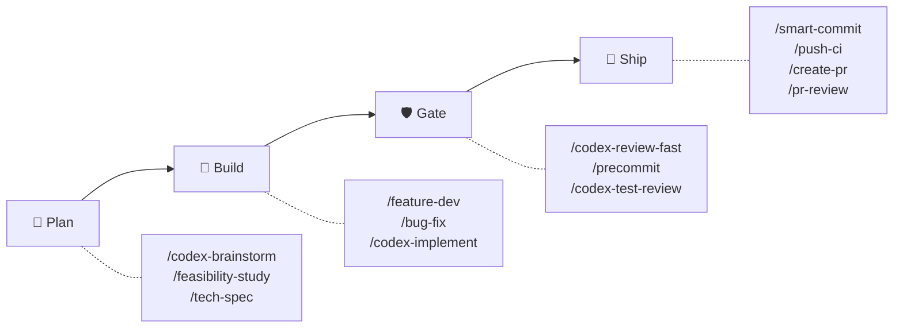
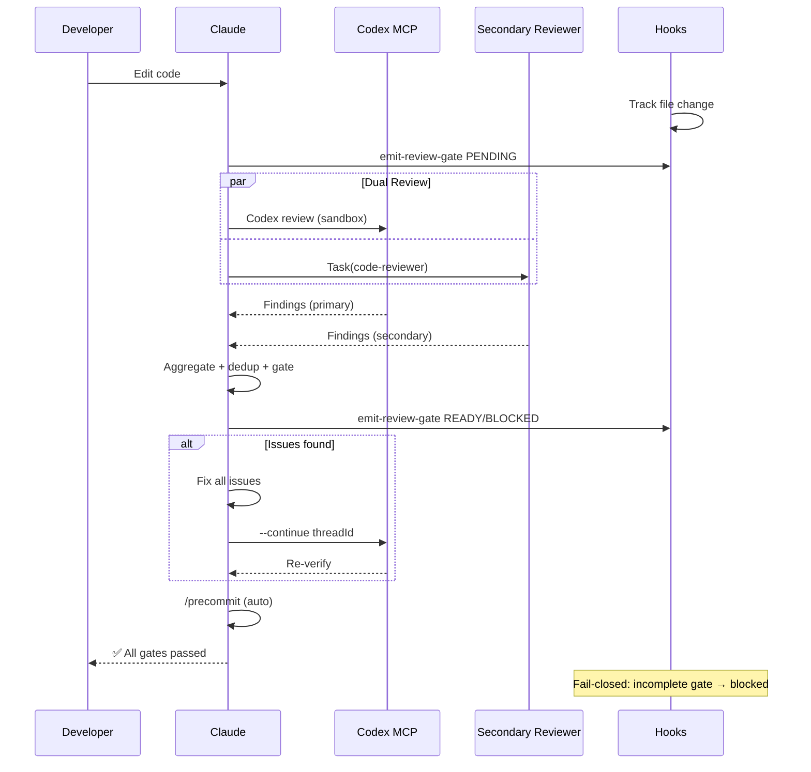

# sd0x-dev-flow

**Language**: English | [繁體中文](README.zh-TW.md) | [简体中文](README.zh-CN.md) | [日本語](README.ja.md) | [한국어](README.ko.md) | [Español](README.es.md)

**The autonomous development workflow engine for [Claude Code](https://claude.com/claude-code).**

- **Zero manual gates** — edit code, auto-review, auto-fix, ship
- **Dual-reviewer architecture** — Codex MCP + secondary reviewer in parallel, fail-closed
- **~4% context footprint** — 96% of Claude's 200k window stays for your code

65 commands | 49 skills | 14 agents | 5 hooks | 11 rules | 11 scripts

## Quick Start

```bash
# Install plugin
/plugin marketplace add sd0xdev/sd0x-dev-flow
/plugin install sd0x-dev-flow@sd0xdev-marketplace

# Configure your project
/project-setup
```

One command auto-detects framework, package manager, database, entrypoints, and scripts. Installs 11 rules + 5 hooks.

Use `--lite` to only configure CLAUDE.md (skip rules/hooks).

## How It Works



The **auto-loop engine** enforces quality gates automatically — after any code edit, Claude triggers **dual review** (Codex MCP + secondary reviewer in parallel) in the same reply. Findings are deduplicated, severity-normalized, and aggregated into a single gate. Hooks enforce fail-closed semantics: if the aggregate gate is incomplete, stop-guard blocks.

<details>
<summary>Detailed: Dual-Review Sequence Diagram</summary>



</details>

## Feature Spotlight: Dual-Reviewer Architecture

v2.0 dispatches two independent reviewers in parallel — zero single-point-of-failure:

| Reviewer | Role | Fallback |
|----------|------|----------|
| Codex MCP | Primary (sandbox, full diff) | Always available |
| Secondary (pr-review-toolkit) | Confidence-scored review | strict-reviewer → single mode |

Findings are **severity-normalized** (P0-Nit), **deduplicated** (file + issue key, ±5 line tolerance), and **source-attributed** (`codex` | `toolkit` | `both`).

Gate: `✅ Ready` or `⛔ Blocked` — fail-closed (incomplete gate = blocked).

## When to Use

| Good Fit | Not Ideal |
|----------|-----------|
| Solo or small-team projects with Claude Code | Teams not using Claude Code |
| Projects needing automated review gates | One-off scripts with no CI |
| Codex CLI / Cursor / Windsurf users (skills subset) | Projects requiring custom LLM providers |
| Repos where quality gates prevent regressions | Repos with no test infrastructure |

## Install

### Codex CLI / Other AI Agents

```bash
# Install individual skills via Agent Skills standard
npx skills add sd0xdev/sd0x-dev-flow

# Generate AGENTS.md + install hooks (in Claude Code)
/codex-setup init
```

| Method | Tools | Coverage |
|--------|-------|----------|
| Plugin install | Claude Code | Full (65 commands, hooks, rules, auto-loop) |
| `npx skills add` | Codex CLI, Cursor, Windsurf, Aider | Skills only (49 skills) |
| `/codex-setup init` | Codex CLI | AGENTS.md kernel + git hooks |

**Requirements**: Claude Code 2.1+ | [Codex MCP](https://github.com/openai/codex) (optional, for `/codex-*` commands)

## Workflow Tracks

| Workflow | Commands | Gate | Enforced By |
|----------|----------|------|-------------|
| Feature | `/feature-dev` → `/verify` → `/codex-review-fast` → `/precommit` | ✅/⛔ | Hook + Behavior |
| Bug Fix | `/issue-analyze` → `/bug-fix` → `/verify` → `/precommit` | ✅/⛔ | Hook + Behavior |
| Auto-Loop | Code edit → `/codex-review-fast` → `/precommit` | ✅/⛔ | Hook |
| Doc Review | `.md` edit → `/codex-review-doc` | ✅/⛔ | Hook |
| Planning | `/codex-brainstorm` → `/feasibility-study` → `/tech-spec` | — | — |
| Onboarding | `/project-setup` → `/repo-intake` | — | — |

```mermaid
flowchart TD
    subgraph feat ["🔨 Feature Development"]
        F1["/feature-dev"] --> F2["Code + Tests"]
        F2 --> F3["/verify"]
        F3 --> F4["/codex-review-fast"]
        F4 --> F5["/precommit"]
        F5 --> F6["/update-docs"]
    end

    subgraph fix ["🐛 Bug Fix"]
        B1["/issue-analyze"] --> B2["/bug-fix"]
        B2 --> B3["Fix + Regression test"]
        B3 --> B4["/verify"]
        B4 --> B5["/codex-review-fast"]
        B5 --> B6["/precommit"]
    end

    subgraph docs ["📝 Docs Only"]
        D1["Edit .md"] --> D2["/codex-review-doc"]
        D2 --> D3["Done"]
    end

    subgraph plan ["🎯 Planning"]
        P1["/codex-brainstorm"] --> P2["/feasibility-study"]
        P2 --> P3["/tech-spec"]
        P3 --> P4["/codex-architect"]
        P4 --> P5["Implementation ready"]
    end

    subgraph ops ["⚙️ Operations"]
        O1["/project-setup"] --> O2["/repo-intake"]
        O2 --> O3["Develop"]
        O3 --> O4["/project-audit"]
        O3 --> O7["/best-practices"]
        O3 --> O5["/risk-assess"]
        O4 --> O6["/next-step --go"]
        O5 --> O6
        O7 --> O6
    end
```

<details>
<summary>Visual: Workflow Flowcharts</summary>



</details>

## What's Included

| Category | Count | Examples |
|----------|-------|---------|
| Commands | 65 | `/project-setup`, `/codex-review-fast`, `/verify`, `/smart-commit` |
| Skills | 49 | project-setup, code-explore, smart-commit, contract-decode |
| Agents | 14 | strict-reviewer, verify-app, coverage-analyst |
| Hooks | 5 | pre-edit-guard, auto-format, review state tracking, stop guard, namespace hint |
| Rules | 11 | auto-loop, codex-invocation, security, testing, git-workflow, self-improvement |
| Scripts | 11 | precommit runner, verify runner, dep audit, namespace hint, skill runner, commit-msg guard, pre-push gate, utils (shared lib), emit-review-gate, worktree-claude-sync, build-codex-artifacts |

### Minimal Context Footprint

~4% of Claude's 200k context window — 96% remains for your code.

| Component | Tokens | % of 200k |
|-----------|--------|-----------|
| Rules (always loaded) | 5.1k | 2.6% |
| Skills (on-demand) | 1.9k | 1.0% |
| Agents | 791 | 0.4% |
| **Total** | **~8k** | **~4%** |

Skills load on-demand. Idle skills cost zero tokens.

## Commands Reference

| Command | Description |
|---------|-------------|
| `/project-setup` | Auto-detect and configure project |
| `/feature-dev` | Feature development workflow |
| `/bug-fix` | Bug/Issue fix workflow |
| `/codex-review-fast` | Quick review (diff only) |
| `/codex-review-doc` | Document review |
| `/precommit` | lint:fix → build → test |
| `/precommit-fast` | lint:fix → test (no build) |
| `/verify` | Full verification chain |
| `/smart-commit` | Smart batch commit |
| `/push-ci` | Push + CI monitor |
| `/create-pr` | Create GitHub PR |
| `/codex-brainstorm` | Adversarial brainstorm (Nash equilibrium) |
| `/tech-spec` | Generate tech spec |
| `/pr-review` | PR self-review |
| `/codex-security` | OWASP Top 10 audit |

<details>
<summary>All 65 commands</summary>

### Development

| Command | Description |
|---------|-------------|
| `/project-setup` | Auto-detect and configure project |
| `/repo-intake` | One-time project intake scan |
| `/install-rules` | Install plugin rules to `.claude/rules/` |
| `/install-hooks` | Install plugin hooks to `.claude/` |
| `/install-scripts` | Install plugin runner scripts |
| `/codex-setup` | Initialize Codex CLI infrastructure (AGENTS.md + hooks) |
| `/bug-fix` | Bug/Issue fix workflow |
| `/codex-implement` | Codex writes code |
| `/codex-architect` | Architecture advice (third brain) |
| `/code-explore` | Fast codebase exploration |
| `/git-investigate` | Track code history |
| `/issue-analyze` | Deep issue analysis |
| `/post-dev-test` | Post-dev test completion |
| `/feature-dev` | Feature development workflow (design → implement → verify → review) |
| `/feature-verify` | System diagnosis (read-only verification with dual-perspective) |
| `/load-pr-review` | Load GitHub PR review comments into session |
| `/pr-comment` | Post friendly review comments to a GitHub PR |
| `/code-investigate` | Dual-perspective code investigation (Claude + Codex independent) |
| `/next-step` | Context-aware next step advisor |
| `/smart-commit` | Smart batch commit (group + message + commands) |
| `/git-profile` | Git identity and GPG signing profile manager |
| `/push-ci` | Push (with approval) + CI monitor |
| `/create-pr` | Create GitHub PR from branch |
| `/git-worktree` | Manage git worktrees (auto-syncs .claude/) |
| `/merge-prep` | Pre-merge analysis and preparation |
| `/smart-rebase` | Smart partial rebase for squash-merge repos |

### Review (Codex MCP)

| Command | Description | Loop Support |
|---------|-------------|--------------|
| `/codex-review-fast` | Quick review (diff only) | `--continue <threadId>` |
| `/codex-review` | Full review (lint + build) | `--continue <threadId>` |
| `/codex-review-branch` | Full branch review | - |
| `/codex-cli-review` | CLI review (full disk read) | - |
| `/codex-review-doc` | Document review | `--continue <threadId>` |
| `/codex-security` | OWASP Top 10 audit | `--continue <threadId>` |
| `/codex-test-gen` | Generate unit tests | - |
| `/codex-test-review` | Review test coverage | `--continue <threadId>` |
| `/codex-explain` | Explain complex code | - |
| `/seek-verdict` | P2 dismiss blind verification | - |

### Verification

| Command | Description |
|---------|-------------|
| `/verify` | lint -> typecheck -> unit -> integration -> e2e |
| `/precommit` | lint:fix -> build -> test:unit |
| `/precommit-fast` | lint:fix -> test:unit |
| `/dep-audit` | Dependency security audit |
| `/project-audit` | Project health audit (deterministic scoring) |
| `/best-practices` | Industry best practices audit with adversarial debate |
| `/risk-assess` | Uncommitted code risk assessment |

### Planning

| Command | Description |
|---------|-------------|
| `/codex-brainstorm` | Adversarial brainstorm (Nash equilibrium) |
| `/feasibility-study` | Feasibility analysis |
| `/tech-spec` | Generate tech spec |
| `/review-spec` | Review tech spec |
| `/deep-analyze` | Deep analysis + roadmap |
| `/project-brief` | PM/CTO executive summary |

### Documentation & Tooling

| Command | Description |
|---------|-------------|
| `/update-docs` | Sync docs with code |
| `/check-coverage` | Test coverage analysis |
| `/create-request` | Create/update request docs |
| `/doc-refactor` | Simplify documents |
| `/simplify` | Code simplification |
| `/de-ai-flavor` | Remove AI-generated artifacts from documents |
| `/safe-remove` | Safely remove plugin assets |
| `/skill-creator` | Create new skills (external plugin) |
| `/pr-review` | PR self-review |
| `/pr-summary` | PR status summary (grouped by ticket) |
| `/contract-decode` | EVM contract error/calldata decoder |
| `/skill-health-check` | Validate skill quality and routing |
| `/statusline-config` | Customize statusline segments and themes |
| `/claude-health` | Claude Code config health check |
| `/op-session` | Initialize 1Password CLI session (avoids repeated biometric prompts) |
| `/obsidian-cli` | Obsidian vault integration via official CLI |
| `/zh-tw` | Rewrite in Traditional Chinese |

</details>

## Rules

| Rule | Description |
|------|-------------|
| `auto-loop` | Fix -> re-review -> fix -> ... -> Pass (auto cycle) |
| `codex-invocation` | Codex must independently research, never feed conclusions |
| `fix-all-issues` | Zero tolerance: fix every issue found |
| `self-improvement` | Corrected → record lesson → prevent recurrence |
| `framework` | Framework-specific conventions (customizable) |
| `testing` | Unit/Integration/E2E isolation |
| `security` | OWASP Top 10 checklist |
| `git-workflow` | Branch naming, commit conventions |
| `docs-writing` | Tables > paragraphs, Mermaid > text |
| `docs-numbering` | Document prefix convention (0-feasibility, 2-spec) |
| `logging` | Structured JSON, no secrets |

## Hooks

| Hook | Trigger | Purpose |
|------|---------|---------|
| `namespace-hint` | SessionStart | Inject plugin command namespace guidance into Claude context |
| `post-edit-format` | After Edit/Write | Auto prettier + invalidate review state on edit |
| `post-tool-review-state` | After Bash / MCP tools | Track review state (sentinel routing, supports namespaced commands) |
| `pre-edit-guard` | Before Edit/Write | Prevent editing .env/.git |
| `stop-guard` | Before stop | Block or warn on incomplete reviews + stale-state git check (strict after install, warn in plugin runtime) |

Hooks are safe by default. Use environment variables to customize:

| Variable | Default | Description |
|----------|---------|-------------|
| `STOP_GUARD_MODE` | `strict` (installed) / `warn` (plugin runtime) | `strict` blocks stop on missing review steps; `warn` only warns |
| `HOOK_NO_FORMAT` | (unset) | Set `1` to disable auto-formatting |
| `HOOK_BYPASS` | (unset) | Set `1` to skip all stop-guard checks |
| `HOOK_DEBUG` | (unset) | Set `1` to output debug info |
| `GUARD_EXTRA_PATTERNS` | (unset) | Regex patterns for extra protected paths (e.g. `src/locales/.*\.json$`) |

**Dependencies**: Hooks require `jq`. Auto-format requires `prettier`. Missing dependencies are handled gracefully.

## Customization

Run `/project-setup` to auto-detect and configure all placeholders, or manually edit `.claude/CLAUDE.md`:

| Placeholder | Description | Example |
|-------------|-------------|---------|
| `{PROJECT_NAME}` | Your project name | my-app |
| `{FRAMEWORK}` | Your framework | MidwayJS 3.x, NestJS, Express |
| `{CONFIG_FILE}` | Main config file | src/configuration.ts |
| `{BOOTSTRAP_FILE}` | Bootstrap entry | bootstrap.js, main.ts |
| `{DATABASE}` | Database | MongoDB, PostgreSQL |
| `{TEST_COMMAND}` | Test command | yarn test:unit |
| `{LINT_FIX_COMMAND}` | Lint auto-fix | yarn lint:fix |
| `{BUILD_COMMAND}` | Build command | yarn build |
| `{TYPECHECK_COMMAND}` | Type checking | yarn typecheck |

## Showcase: StatusLine Config

Customize Claude Code's statusline — segments, themes, and colors. Install as a standalone skill:

```bash
npx skills add sd0xdev/sd0x-dev-flow --skill statusline-config
```

| Feature | Details |
|---------|---------|
| Segments | Directory, Git branch, Model, Context %, Cost, >200k alert |
| Themes | ansi-default, catppuccin-mocha, dracula, nord, none |
| Engine | POSIX shell + JSON stdin + semantic color tokens |
| Accessibility | WCAG AA contrast, NO\_COLOR support |

[Full documentation](docs/features/statusline-config/2-tech-spec.md)

## Architecture

```
Command (entry) → Skill (capability) → Agent (environment)
```

- **Commands**: User-triggered via `/...`
- **Skills**: Knowledge bases loaded on demand
- **Agents**: Isolated subagents with specific tools
- **Hooks**: Automated guardrails (format, review state, stop guard)
- **Rules**: Always-on conventions (auto-loaded)

For advanced architecture details (agentic control stack, control loop theory, sandbox rules), see [docs/architecture.md](docs/architecture.md).

## Contributing

PRs welcome. Please:

1. Follow existing naming conventions (kebab-case)
2. Include `When to Use` / `When NOT to Use` in skills
3. Add `disable-model-invocation: true` for dangerous operations
4. Test with Claude Code before submitting

## License

MIT

## Star History

[](https://www.star-history.com/#sd0xdev/sd0x-dev-flow&type=date&legend=top-left)
