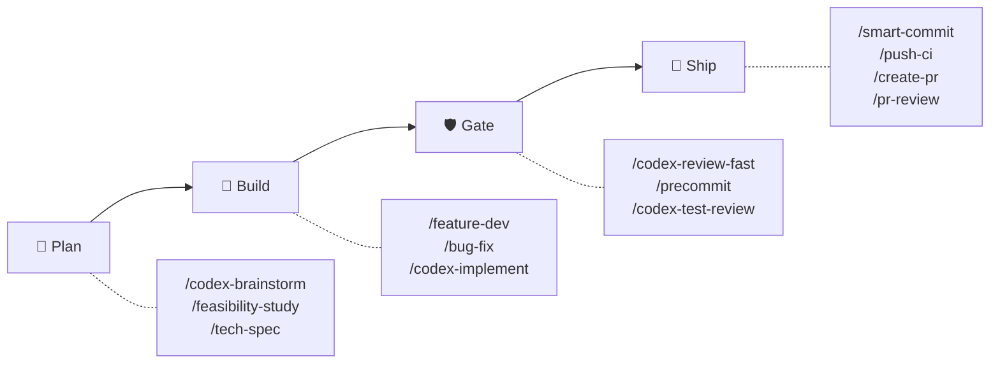
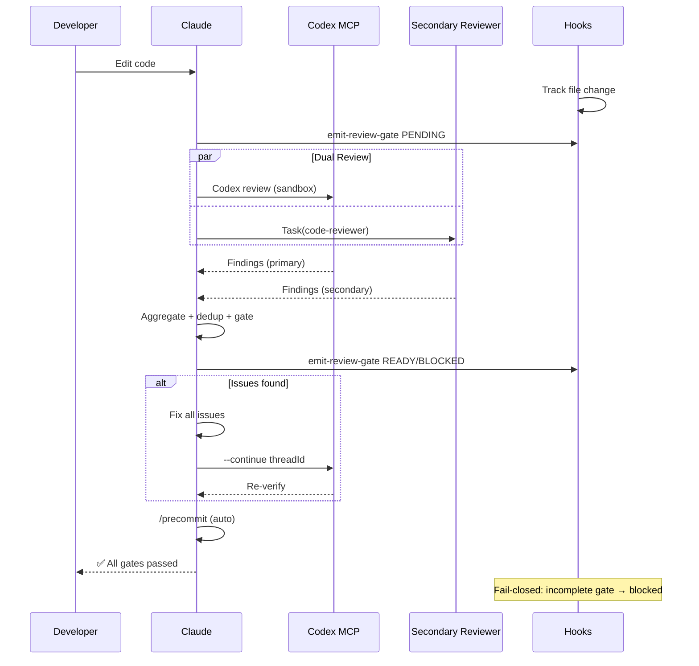

# sd0x-dev-flow

**语言**: [English](README.md) | [繁體中文](README.zh-TW.md) | 简体中文 | [日本語](README.ja.md) | [한국어](README.ko.md) | [Español](README.es.md)

**[Claude Code](https://claude.com/claude-code) 的自主开发工作流引擎。**

- **零手动关卡** — 编辑代码、自动审查、自动修复、交付
- **双 Reviewer 架构** — Codex MCP + 次要 reviewer 并行审查，fail-closed
- **~4% context 占用** — Claude 200k window 的 96% 留给你的代码

65 commands | 49 skills | 14 agents | 5 hooks | 12 rules | 11 scripts

## 快速开始

```bash
# 安装插件
/plugin marketplace add sd0xdev/sd0x-dev-flow
/plugin install sd0x-dev-flow@sd0xdev-marketplace

# 配置项目
/project-setup
```

一个命令自动检测框架、包管理器、数据库、入口文件和脚本命令。安装 12 条 rules + 5 个 hooks。

使用 `--lite` 仅配置 CLAUDE.md（跳过 rules/hooks）。

## 工作原理



**Auto-Loop 引擎**自动执行质量关卡——任何代码编辑后，Claude 会在同一回复中触发**双 Reviewer 并行审查**（Codex MCP + 次要 reviewer 同步进行）。Findings 会去重、severity 正规化，并汇整为单一 gate。Hooks 强制 fail-closed 语义：汇整 gate 未完成时，stop-guard 会阻止停止。

<details>
<summary>详细：双 Reviewer 时序图</summary>



</details>

## 功能亮点：双 Reviewer 架构

v2.0 并行分派两个独立 reviewer — 零单点故障：

| Reviewer | 角色 | 降级策略 |
|----------|------|----------|
| Codex MCP | 主要（sandbox，完整 diff） | 始终可用 |
| 次要（pr-review-toolkit） | 置信度评分制审查 | strict-reviewer → 单 reviewer 模式 |

Findings 会**严重度正规化**（P0-Nit）、**去重**（file + issue key，±5 行容差），并**标记来源**（`codex` | `toolkit` | `both`）。

Gate：`✅ Ready` 或 `⛔ Blocked` — fail-closed（未完成 gate = blocked）。

## 适用场景

| 适合 | 不太适合 |
|------|----------|
| 使用 Claude Code 的个人或小团队项目 | 完全不使用 Claude Code 的团队 |
| 需要自动化审查关卡的项目 | 没有 CI 的一次性脚本 |
| Codex CLI / Cursor / Windsurf 用户（skills 子集） | 需要自定义 LLM provider 的项目 |
| 质量关卡可防止 regression 的仓库 | 没有测试基础设施的仓库 |

## 安装

### Codex CLI / 其他 AI Agent

```bash
# 通过 Agent Skills 标准安装单个 skill
npx skills add sd0xdev/sd0x-dev-flow

# 生成 AGENTS.md + 安装 hooks（在 Claude Code 中执行）
/codex-setup init
```

| 方式 | 适用工具 | 覆盖范围 |
|------|---------|---------|
| 插件安装 | Claude Code | 完整（65 commands、hooks、rules、auto-loop） |
| `npx skills add` | Codex CLI、Cursor、Windsurf、Aider | 仅 Skills（49 skills） |
| `/codex-setup init` | Codex CLI | AGENTS.md kernel + git hooks |

**环境要求**：Claude Code 2.1+ | [Codex MCP](https://github.com/openai/codex)（可选，用于 `/codex-*` 命令）

## 工作流路径

| 工作流 | 命令 | Gate | 执行层 |
|--------|------|------|--------|
| 功能开发 | `/feature-dev` → `/verify` → `/codex-review-fast` → `/precommit` | ✅/⛔ | Hook + 行为层 |
| 缺陷修复 | `/issue-analyze` → `/bug-fix` → `/verify` → `/precommit` | ✅/⛔ | Hook + 行为层 |
| Auto-Loop | 代码编辑 → `/codex-review-fast` → `/precommit` | ✅/⛔ | Hook |
| 文档审查 | `.md` 编辑 → `/codex-review-doc` | ✅/⛔ | Hook |
| 规划 | `/codex-brainstorm` → `/feasibility-study` → `/tech-spec` | — | — |
| 入门引导 | `/project-setup` → `/repo-intake` | — | — |

```mermaid
flowchart TD
    subgraph feat ["🔨 Feature Development"]
        F1["/feature-dev"] --> F2["Code + Tests"]
        F2 --> F3["/verify"]
        F3 --> F4["/codex-review-fast"]
        F4 --> F5["/precommit"]
        F5 --> F6["/update-docs"]
    end

    subgraph fix ["🐛 Bug Fix"]
        B1["/issue-analyze"] --> B2["/bug-fix"]
        B2 --> B3["Fix + Regression test"]
        B3 --> B4["/verify"]
        B4 --> B5["/codex-review-fast"]
        B5 --> B6["/precommit"]
    end

    subgraph docs ["📝 Docs Only"]
        D1["Edit .md"] --> D2["/codex-review-doc"]
        D2 --> D3["Done"]
    end

    subgraph plan ["🎯 Planning"]
        P1["/codex-brainstorm"] --> P2["/feasibility-study"]
        P2 --> P3["/tech-spec"]
        P3 --> P4["/codex-architect"]
        P4 --> P5["Implementation ready"]
    end

    subgraph ops ["⚙️ Operations"]
        O1["/project-setup"] --> O2["/repo-intake"]
        O2 --> O3["Develop"]
        O3 --> O4["/project-audit"]
        O3 --> O7["/best-practices"]
        O3 --> O5["/risk-assess"]
        O4 --> O6["/next-step --go"]
        O5 --> O6
        O7 --> O6
    end
```

<details>
<summary>可视化：工作流程图</summary>



</details>

## 包含内容

| 类别 | 数量 | 示例 |
|------|------|------|
| 命令 | 65 | `/project-setup`, `/codex-review-fast`, `/verify`, `/smart-commit` |
| 技能 | 49 | project-setup, code-explore, smart-commit, contract-decode |
| 代理 | 14 | strict-reviewer, verify-app, coverage-analyst |
| 钩子 | 5 | pre-edit-guard, auto-format, review state tracking, stop guard, namespace hint |
| 规则 | 12 | auto-loop, auto-loop-project, codex-invocation, security, testing, git-workflow, self-improvement |
| 脚本 | 11 | precommit runner, verify runner, dep audit, namespace hint, skill runner, commit-msg guard, pre-push gate, utils (shared lib), emit-review-gate, worktree-claude-sync, build-codex-artifacts |

### 极小的 Context 占用

~4% 的 Claude 200k context window——96% 留给你的代码。

| 组件 | Tokens | 占 200k 比例 |
|------|--------|-------------|
| Rules（常驻加载） | 5.1k | 2.6% |
| Skills（按需加载） | 1.9k | 1.0% |
| Agents | 791 | 0.4% |
| **合计** | **~8k** | **~4%** |

Skills 按需加载。闲置 Skill 不占用任何 Token。

## 命令参考

| 命令 | 说明 |
|------|------|
| `/project-setup` | 自动检测并配置项目 |
| `/feature-dev` | 功能开发流程 |
| `/bug-fix` | 缺陷修复工作流 |
| `/codex-review-fast` | 快速审查（仅 diff） |
| `/codex-review-doc` | 文档审查 |
| `/precommit` | lint:fix → build → test |
| `/precommit-fast` | lint:fix → test（跳过 build） |
| `/verify` | 完整验证链 |
| `/smart-commit` | 智能批量 commit |
| `/push-ci` | 推送 + CI 监控 |
| `/create-pr` | 创建 GitHub PR |
| `/codex-brainstorm` | 对抗式头脑风暴（纳什均衡） |
| `/tech-spec` | 生成技术规格书 |
| `/pr-review` | PR 自查 |
| `/codex-security` | OWASP Top 10 审计 |

<details>
<summary>全部 65 个命令</summary>

### 开发

| 命令 | 说明 |
|------|------|
| `/project-setup` | 自动检测并配置项目 |
| `/repo-intake` | 一次性项目盘点扫描 |
| `/install-rules` | 安装插件规则到 `.claude/rules/` |
| `/install-hooks` | 安装插件 hooks 到 `.claude/` |
| `/install-scripts` | 安装插件 runner 脚本 |
| `/codex-setup` | 初始化 Codex CLI 基础设施（AGENTS.md + hooks） |
| `/bug-fix` | 缺陷修复工作流 |
| `/codex-implement` | Codex 编写代码 |
| `/codex-architect` | 架构建议（第三大脑） |
| `/code-explore` | 快速代码探索 |
| `/git-investigate` | 追踪代码历史 |
| `/issue-analyze` | 深度问题分析 |
| `/post-dev-test` | 开发后补充测试 |
| `/feature-dev` | 功能开发流程（设计 → 实现 → 验证 → 审查） |
| `/feature-verify` | 系统诊断（只读验证，双视角确认） |
| `/load-pr-review` | 加载 GitHub PR 审查评论到 session |
| `/pr-comment` | 在 GitHub PR 上发布友善的审查评论 |
| `/code-investigate` | 双视角代码调查（Claude + Codex 独立探索） |
| `/next-step` | 情境感知的下一步建议 |
| `/smart-commit` | 智能批量 commit（分组 + 消息 + 命令） |
| `/git-profile` | Git 身份与 GPG 签名 profile 管理 |
| `/push-ci` | 推送（需审批）+ CI 监控 |
| `/create-pr` | 从分支创建 GitHub PR |
| `/git-worktree` | 管理 git worktree（自动同步 .claude/） |
| `/merge-prep` | 合并前分析与准备 |
| `/smart-rebase` | 智能局部 rebase（squash-merge 仓库适用） |

### 审查（Codex MCP）

| 命令 | 说明 | 循环支持 |
|------|------|----------|
| `/codex-review-fast` | 快速审查（仅 diff） | `--continue <threadId>` |
| `/codex-review` | 完整审查（lint + build） | `--continue <threadId>` |
| `/codex-review-branch` | 完整分支审查 | - |
| `/codex-cli-review` | CLI 审查（全盘读取） | - |
| `/codex-review-doc` | 文档审查 | `--continue <threadId>` |
| `/codex-security` | OWASP Top 10 审计 | `--continue <threadId>` |
| `/codex-test-gen` | 生成单元测试 | - |
| `/codex-test-review` | 审查测试覆盖率 | `--continue <threadId>` |
| `/codex-explain` | 解释复杂代码 | - |
| `/seek-verdict` | P2 dismiss 盲审验证 | - |

### 验证

| 命令 | 说明 |
|------|------|
| `/verify` | lint -> typecheck -> unit -> integration -> e2e |
| `/precommit` | lint:fix -> build -> test:unit |
| `/precommit-fast` | lint:fix -> test:unit |
| `/dep-audit` | 依赖安全审计 |
| `/project-audit` | 项目健康审计（确定性评分） |
| `/best-practices` | 行业最佳实践审计（含对抗式辩论） |
| `/risk-assess` | 未提交代码风险评估 |

### 规划

| 命令 | 说明 |
|------|------|
| `/codex-brainstorm` | 对抗式头脑风暴（纳什均衡） |
| `/feasibility-study` | 可行性分析 |
| `/tech-spec` | 生成技术规格书 |
| `/review-spec` | 审查技术规格书 |
| `/deep-analyze` | 深度分析 + 路线图 |
| `/project-brief` | PM/CTO 执行摘要 |

### 文档与工具

| 命令 | 说明 |
|------|------|
| `/update-docs` | 同步文档与代码 |
| `/check-coverage` | 测试覆盖率分析 |
| `/create-request` | 创建/更新需求文档 |
| `/doc-refactor` | 精简文档 |
| `/simplify` | 代码精简 |
| `/de-ai-flavor` | 去除 AI 痕迹 |
| `/safe-remove` | 安全移除插件资产 |
| `/skill-creator` | 创建新技能（外部 plugin） |
| `/pr-review` | PR 自查 |
| `/pr-summary` | PR 状态摘要（按 ticket 分组） |
| `/contract-decode` | EVM 合约错误/calldata 解码器 |
| `/skill-health-check` | 验证 Skill 质量与 routing |
| `/statusline-config` | 自定义状态栏区段与主题 |
| `/claude-health` | Claude Code 配置健康检查 |
| `/op-session` | 初始化 1Password CLI session（避免重复生物识别提示） |
| `/obsidian-cli` | Obsidian vault 集成（通过官方 CLI） |
| `/zh-tw` | 改写为繁体中文 |

</details>

## 规则

| 规则 | 说明 |
|------|------|
| `auto-loop` | 修复 -> 重新审查 -> 修复 -> ... -> 通过（自动循环） |
| `auto-loop-project` | 项目定制的 auto-loop 覆写规则（用户所有，不受插件管理） |
| `codex-invocation` | Codex 必须自主调研，禁止喂结论 |
| `fix-all-issues` | 零容忍：修复所有发现的问题 |
| `self-improvement` | 被纠正 → 记录教训 → 防止再犯 |
| `framework` | 框架专属规范（可自定义） |
| `testing` | 单元/集成/端到端测试隔离 |
| `security` | OWASP Top 10 检查清单 |
| `git-workflow` | 分支命名、提交规范 |
| `docs-writing` | 表格 > 段落，Mermaid > 文字 |
| `docs-numbering` | 文档前缀规范（0-feasibility, 2-spec） |
| `logging` | 结构化 JSON，禁止泄露敏感信息 |

> **定制化**：编辑 `auto-loop-project.md` 可覆写项目的 auto-loop 行为。插件更新不会冲突 — 详见 [Rule Override Pattern](docs/features/rule-override-pattern/2-tech-spec.md)。

## 钩子

| 钩子 | 触发时机 | 用途 |
|------|----------|------|
| `namespace-hint` | SessionStart | 在 Claude context 中注入插件命令命名空间指引 |
| `post-edit-format` | 编辑/写入之后 | 自动格式化 + 编辑后重置审查状态 |
| `post-tool-review-state` | Bash / MCP 工具之后 | 追踪审查状态（sentinel 路由，支持命名空间命令） |
| `pre-edit-guard` | 编辑/写入之前 | 禁止编辑 .env/.git |
| `stop-guard` | 停止之前 | 未完成审查时阻止或告警 + stale-state git 检查（安装后 strict，plugin runtime warn） |

钩子默认安全。通过环境变量自定义行为：

| 变量 | 默认值 | 说明 |
|------|--------|------|
| `STOP_GUARD_MODE` | `strict`（安装后）/ `warn`（plugin runtime） | `strict` 在缺少审查步骤时阻止停止；`warn` 仅告警 |
| `HOOK_NO_FORMAT` | （未设置） | 设为 `1` 禁用自动格式化 |
| `HOOK_BYPASS` | （未设置） | 设为 `1` 跳过所有停止守卫检查 |
| `HOOK_DEBUG` | （未设置） | 设为 `1` 输出调试信息 |
| `GUARD_EXTRA_PATTERNS` | （未设置） | 额外保护路径的正则表达式（例如 `src/locales/.*\.json$`） |

**依赖**：钩子需要 `jq`。自动格式化需要项目已装 `prettier`。缺少依赖时会自动跳过。

## 自定义配置

运行 `/project-setup` 自动检测并配置所有占位符，或手动编辑 `.claude/CLAUDE.md`：

| 占位符 | 说明 | 示例 |
|--------|------|------|
| `{PROJECT_NAME}` | 项目名称 | my-app |
| `{FRAMEWORK}` | 框架 | MidwayJS 3.x, NestJS, Express |
| `{CONFIG_FILE}` | 主配置文件 | src/configuration.ts |
| `{BOOTSTRAP_FILE}` | 启动入口 | bootstrap.js, main.ts |
| `{DATABASE}` | 数据库 | MongoDB, PostgreSQL |
| `{TEST_COMMAND}` | 测试命令 | yarn test:unit |
| `{LINT_FIX_COMMAND}` | Lint 自动修复 | yarn lint:fix |
| `{BUILD_COMMAND}` | 构建命令 | yarn build |
| `{TYPECHECK_COMMAND}` | 类型检查 | yarn typecheck |

## 展示：StatusLine Config

自定义 Claude Code 的状态栏 — 区段、主题与色彩。可单独安装：

```bash
npx skills add sd0xdev/sd0x-dev-flow --skill statusline-config
```

| 特性 | 内容 |
|------|------|
| Segments | Directory, Git branch, Model, Context %, Cost, >200k alert |
| Themes | ansi-default, catppuccin-mocha, dracula, nord, none |
| Engine | POSIX shell + JSON stdin + semantic color tokens |
| Accessibility | WCAG AA contrast, NO\_COLOR support |

[完整文档](docs/features/statusline-config/2-tech-spec.md)

## 架构

```
Command (entry) → Skill (capability) → Agent (environment)
```

- **Commands**：用户通过 `/...` 触发
- **Skills**：按需加载的知识库
- **Agents**：拥有特定工具的隔离子代理
- **Hooks**：自动化防护栏（格式化、审查状态、停止守卫）
- **Rules**：始终生效的规范（自动加载）

高级架构详情（agentic control stack、控制回路理论、沙箱规则）参见 [docs/architecture.md](docs/architecture.md)。

## 贡献

欢迎 PR。请：

1. 遵循现有命名规范（kebab-case）
2. 在技能中包含 `When to Use` / `When NOT to Use`
3. 对危险操作添加 `disable-model-invocation: true`
4. 提交前用 Claude Code 测试

## 许可证

MIT

## Star History

[](https://www.star-history.com/#sd0xdev/sd0x-dev-flow&type=date&legend=top-left)
