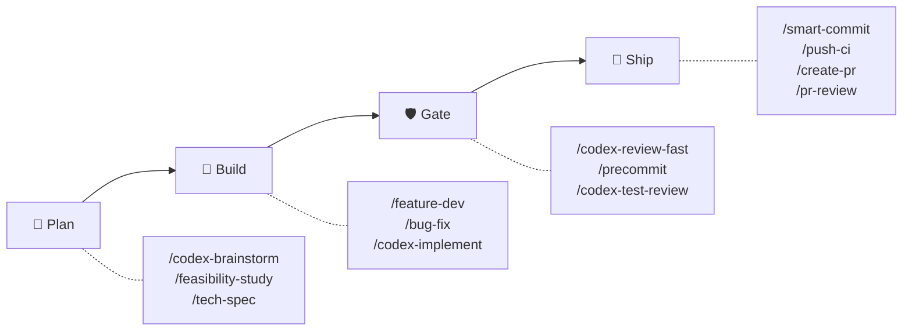
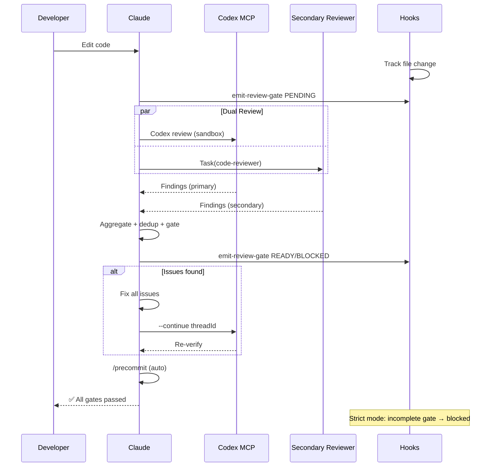

# sd0x-dev-flow


**語言**: [English](README.md) | 繁體中文 | [简体中文](README.zh-CN.md) | [日本語](README.ja.md) | [한국어](README.ko.md) | [Español](README.es.md)

> AI 可以跑很快，但沒有護欄，速度令人不安。

**AI 跳不過的品質關卡。** 具備 hook 強制雙 review、自動修正迴圈與 fail-closed 語意的 [Claude Code](https://claude.com/claude-code) plugin — 讓你的程式碼出得快，也出得對。

<!-- BEGIN:HERO-COUNT -->
90 skills · 15 agents — 僅佔 Claude context window 的 ~4%
<!-- END:HERO-COUNT -->

[](LICENSE) [](https://www.npmjs.com/package/skills)

## 為什麼選擇 sd0x-dev-flow？

| 沒有護欄時 | 有 sd0x-dev-flow |
|---|---|
| Context 過長時 AI 跳過 review | **Hook 強制**：stop-guard 阻止未完成的 review |
| 單一 reviewer 遺漏問題 | **雙 Reviewer 分派**：Codex + 次要 reviewer 並行 |
| 「已修正」卻沒有重新驗證 | **Auto-loop**：修正 → 重新 review → 通過 → 繼續 |
| Review 狀態在 compact 後遺失 | **狀態追蹤**：SessionStart hook 重新注入 |

## 快速開始

```bash
# 安裝 plugin
/plugin marketplace add sd0xdev/sd0x-dev-flow
/plugin install sd0x-dev-flow@sd0xdev-marketplace

# 設定你的專案
/project-setup
```

一個指令自動偵測 framework、package manager、資料庫、entry point 和 script 指令。安裝部分 rules 與 hooks；完整 plugin 包含 14 條 rules + 9 個 hooks。

使用 `--lite` 僅設定 CLAUDE.md（跳過 rules/hooks）。

## 運作方式



**Auto-loop 引擎**自動執行品質關卡——程式碼編輯後，review 指令會分派**雙 Reviewer 並行審查**（Codex MCP + 次要 reviewer 同步進行）。Findings 會去重、severity 正規化，並彙整為單一 gate。在 strict 模式下，Hooks 強制 fail-closed 語意：彙整 gate 未完成時，stop-guard 會阻止停止。詳見 [docs/hooks.md](docs/hooks.md)。

<details>
<summary>詳細：雙 Reviewer 時序圖</summary>



</details>

## 功能亮點：雙 Reviewer 架構

v2.0 預設平行分派兩個獨立 reviewer，支援降級 fallback 模式：

| Reviewer | 角色 | 降級策略 |
|----------|------|----------|
| Codex MCP | 主要（sandbox，完整 diff） | 不可用時退回單 reviewer 模式 |
| 次要（pr-review-toolkit） | 信心分數制審查 | strict-reviewer → 單 reviewer 模式 |

Findings 會**嚴重度正規化**（P0-Nit）、**去重**（file + issue key，±5 行容差），並**標記來源**（`codex` | `toolkit` | `both`）。

Gate：`✅ Ready` 或 `⛔ Blocked` — strict 模式下，未完成 gate = blocked。

## 如何比較

| 能力 | sd0x-dev-flow | gstack | 通用 prompts |
|---|---|---|---|
| 強制 review 關卡 | Hook + 行為層 | 僅建議 | 無 |
| 雙 Reviewer | Codex + 次要（並行） | 單一 /review | 無 |
| 自動修正迴圈 | 修正 → 重新 review → 通過 | 手動 | 無 |
| 多 Agent 研究 | /deep-research（3 agents） | 無 | 無 |
| 對抗式驗證 | Nash 均衡辯論 | 無 | 無 |
| 自我改進 | 教訓記錄 + 規則提升 | 僅 /retro 統計 | 無 |
| 跨工具支援 | Codex/Cursor/Windsurf | Claude/Codex/Gemini/Cursor | N/A |

## 適用場景

| 適合 | 不太適合 |
|------|----------|
| 使用 Claude Code 的個人或小團隊專案 | 完全不使用 Claude Code 的團隊 |
| 需要自動化 review 關卡的專案 | 沒有 CI 的一次性腳本 |
| Codex CLI / Cursor / Windsurf 使用者（skills 子集） | 需要自訂 LLM provider 的專案 |
| 品質關卡可防止 regression 的 repo | 沒有測試基礎建設的 repo |

## 安裝

### Codex CLI / 其他 AI Agent

```bash
# 透過 Agent Skills 標準安裝個別 skill
npx skills add sd0xdev/sd0x-dev-flow

# 產生 AGENTS.md + 安裝 hooks（在 Claude Code 中執行）
/codex-setup init
```

| 方式 | 適用工具 | 涵蓋範圍 |
|------|---------|---------|
<!-- BEGIN:INSTALL-COVERAGE -->
| Plugin 安裝 | Claude Code | 完整（90 skills、hooks、rules、auto-loop） |
| `npx skills add` | Codex CLI、Cursor、Windsurf、Aider | 僅 Skills（90 skills） |
<!-- END:INSTALL-COVERAGE -->
| `/codex-setup init` | Codex CLI | AGENTS.md kernel + git hooks |

**需求**：Claude Code 2.1+ | [Codex MCP](https://github.com/openai/codex)（選用 — `/codex-*` skill 需要；未安裝時退回單 reviewer 模式）

## Workflow Tracks

| Workflow | 指令 | Gate | 執行層 |
|----------|------|------|--------|
| 功能開發 | `/feature-dev` → `/verify` → `/codex-review-fast` → `/precommit` | ✅/⛔ | Hook + 行為層 |
| Bug 修正 | `/issue-analyze` → `/bug-fix` → `/verify` → `/precommit` | ✅/⛔ | Hook + 行為層 |
| Auto-Loop | Code 編輯 → `/codex-review-fast` → `/precommit` | ✅/⛔ | Hook |
| 文件 Review | `.md` 編輯 → `/codex-review-doc` | ✅/⛔ | Hook |
| 規劃 | `/codex-brainstorm` → `/feasibility-study` → `/tech-spec` | — | — |
| 上手流程 | `/project-setup` → `/repo-intake` | — | — |

```mermaid
flowchart TD
    subgraph feat ["🔨 Feature Development"]
        F1["/feature-dev"] --> F2["Code + Tests"]
        F2 --> F3["/verify"]
        F3 --> F4["/codex-review-fast"]
        F4 --> F5["/precommit"]
        F5 --> F6["/update-docs"]
    end

    subgraph fix ["🐛 Bug Fix"]
        B1["/issue-analyze"] --> B2["/bug-fix"]
        B2 --> B3["Fix + Regression test"]
        B3 --> B4["/verify"]
        B4 --> B5["/codex-review-fast"]
        B5 --> B6["/precommit"]
    end

    subgraph docs ["📝 Docs Only"]
        D1["Edit .md"] --> D2["/codex-review-doc"]
        D2 --> D3["Done"]
    end

    subgraph plan ["🎯 Planning"]
        P1["/codex-brainstorm"] --> P2["/feasibility-study"]
        P2 --> P3["/tech-spec"]
        P3 --> P4["/codex-architect"]
        P4 --> P5["Implementation ready"]
    end

    subgraph ops ["⚙️ Operations"]
        O1["/project-setup"] --> O2["/repo-intake"]
        O2 --> O3["Develop"]
        O3 --> O4["/project-audit"]
        O3 --> O7["/best-practices"]
        O3 --> O5["/risk-assess"]
        O4 --> O6["/next-step --go"]
        O5 --> O6
        O7 --> O6
    end
```

<details>
<summary>視覺化：工作流程圖</summary>



</details>

## 實戰指南（Cookbook）

真實情境示範——哪些技能要搭配使用、按什麼順序執行。

| 情境 | 流程 | 說明 |
|------|------|------|
| 第一天進入新 repo | `/project-setup` → `/repo-intake` → `/next-step` | [→](docs/cookbook/first-day.md) |
| 實作新功能 | `/feature-dev` → `/verify` → `/codex-test-review` → `/codex-review-fast` → `/precommit` | [→](docs/cookbook/new-feature.md) |
| 處理 PR 審查意見 | `/load-pr-review` → 修正 → `/codex-review-fast` → `/push-ci` | [→](docs/cookbook/pr-review-comments.md) |
| 合併前安全審查 | `/codex-security` → `/dep-audit` → `/risk-assess` → `/pre-pr-audit` | [→](docs/cookbook/security-pre-merge.md) |
| **精選組合：** 驗證方向 | `/deep-research` → `/best-practices` → `/feasibility-study` → `/codex-brainstorm` | [→](docs/cookbook/validate-direction.md) |
| **精選組合：** 對抗式設計 | `/codex-brainstorm`（Nash 均衡辯論）→ `/codex-architect` | [→](docs/cookbook/adversarial-design.md) |

[全部 10 個情境 →](docs/cookbook/)

## 包含內容

| 類別 | 數量 | 範例 |
|------|------|------|
<!-- BEGIN:WHATS-INCLUDED-COUNT -->
| Skills | 90 | `/project-setup`, `/codex-review-fast`, `/verify`, `/smart-commit`, `/deep-research` |
<!-- END:WHATS-INCLUDED-COUNT -->
| Agents | 15 | strict-reviewer, verify-app, coverage-analyst, architecture-designer |
| Hooks | 9 | pre-edit-guard, auto-format, review state tracking, stop guard, namespace hint, post-compact-auto-loop, post-skill-auto-loop, user-prompt-review-guard, session-init |
| Rules | 14 | auto-loop, auto-loop-project, codex-invocation, security, testing, git-workflow, self-improvement, context-management |
| Scripts | 13 | precommit runner, verify runner, dep audit, namespace hint, skill runner, commit-msg guard, pre-push gate, utils, emit-review-gate, build-codex-artifacts, resolve-feature (CLI + shell), feature-resolver |

### 極小的 Context 佔用

~4% 的 Claude 200k context window——96% 留給你的程式碼。

| 組件 | Tokens | 佔 200k 比例 |
|------|--------|-------------|
| Rules（常駐載入） | 5.1k | 2.6% |
| Skills（按需載入） | 1.9k | 1.0% |
| Agents | 791 | 0.4% |
| **合計** | **~8k** | **~4%** |

Skills 按需載入。閒置 Skill 不佔用任何 Token。

## 技能參考

<!-- BEGIN:ESSENTIAL-SKILLS -->
| Skill | 使用時機 |
|-------|----------|
| `/project-setup` | 首次設定專案 |
| `/bug-fix` | 修正 bug 與解決問題 |
| `/feature-dev` | 端到端實作新功能 |
| `/smart-commit` | 智慧分組提交變更 |
| `/push-ci` | 推送程式碼並監控 CI |
| `/create-pr` | 建立 GitHub pull request |
| `/codex-review-fast` | 快速 code review（僅 diff） |
| `/codex-review-doc` | 審查文件變更 |
| `/codex-security` | OWASP Top 10 安全稽核 |
| `/verify` | 執行完整測試驗證鏈 |
| `/precommit` | Pre-commit 品質關卡（lint + build + test） |
| `/precommit-fast` | 快速 pre-commit（lint + test，跳過 build） |
| `/codex-brainstorm` | 對抗式 brainstorming（Nash 均衡） |
| `/tech-spec` | 撰寫技術規格 |
| `/pr-review` | 合併前 PR self-review |
<!-- END:ESSENTIAL-SKILLS -->

<!-- BEGIN:FULL-CATALOG -->
<details>
<summary>所有 90 個技能</summary>

### 開發 (31)

| Skill | Description |
|-------|-------------|
| `/bug-fix` | Bug fix workflow. |
| `/bump-version` | Bump package and plugin version in sync. |
| `/code-explore` | Pure Claude code investigation. |
| `/code-investigate` | Dual-perspective code investigation. |
| `/codex-architect` | Codex architecture consulting. |
| `/codex-implement` | Implement features via Codex MCP. |
| `/codex-setup` | Initialize sd0x-dev-flow infrastructure for Codex CLI and other non-Claude agents. |
| `/create-pr` | Create or update GitHub PR with gh CLI. |
| `/debug` | Interactive debugging workflow with hypothesis-driven probe loop. |
| `/deep-explore` | Multi-wave parallel code exploration orchestrator. |
| `/feature-dev` | Feature development workflow. |
| `/feature-verify` | Feature verification (READ-ONLY, P0-P5). |
| `/git-investigate` | Git history investigation. |
| `/git-profile` | Git identity and GPG signing profile manager. |
| `/install-hooks` | Install plugin hooks into project .claude/ for persistent use without plugin loaded |
| `/install-rules` | Install plugin rules into project .claude/rules/ for persistent use without plugin loaded |
| `/install-scripts` | Install plugin runner scripts into project .claude/scripts/ for persistent use without plugin loaded |
| `/issue-analyze` | GitHub Issue and PR review thread deep analysis with Codex blind verdict. |
| `/jira` | Jira integration — view issues, generate branches, create tickets, transition status. |
| `/load-pr-review` | Load GitHub PR review comments into AI session — analyze, triage, plan. |
| `/merge-prep` | Pre-merge analysis and preparation. |
| `/next-step` | Change-aware next step advisor. |
| `/post-dev-test` | Post-development test completion. |
| `/pr-comment` | Post friendly review comments to a GitHub PR — prepare locally, preview, then submit as atomic review. |
| `/project-setup` | Project configuration initialization. |
| `/push-ci` | Push to remote and monitor CI. |
| `/remind` | Lightweight model correction with context-aware rule loading. |
| `/repo-intake` | Project initialization inventory (one-time). |
| `/smart-commit` | Smart batch commit. |
| `/smart-rebase` | Smart partial rebase for squash-merge repositories. |
| `/watch-ci` | Monitor GitHub Actions CI runs until completion. |

### 審查 (Codex MCP) (14)

| Skill | Description | 循環支援 |
|-------|-------------|----------|
| `/codex-cli-review` | Code review via Codex CLI with full disk access. | - |
| `/codex-code-review` | Code review using Codex MCP. | - |
| `/codex-explain` | Explain complex code via Codex MCP. | - |
| `/codex-review` | Full second-opinion using Codex MCP (with lint:fix + build). | `--continue <threadId>` |
| `/codex-review-branch` | Fully automated review of an entire feature branch using Codex MCP | - |
| `/codex-review-doc` | Review documents using Codex MCP. | `--continue <threadId>` |
| `/codex-review-fast` | Quick second-opinion using Codex MCP (diff only, no tests). | `--continue <threadId>` |
| `/codex-security` | OWASP Top 10 security review using Codex MCP. | `--continue <threadId>` |
| `/codex-test-gen` | Generate unit tests for specified functions using Codex MCP | - |
| `/codex-test-review` | Review test case sufficiency using Codex MCP, suggest additional edge cases. | `--continue <threadId>` |
| `/doc-review` | Document review via Codex MCP. | - |
| `/security-review` | Security review via Codex MCP. | - |
| `/seek-verdict` | Independent second-opinion verification for any finding. | - |
| `/test-review` | Test coverage review via Codex MCP. | - |

### 驗證 (12)

| Skill | Description |
|-------|-------------|
| `/best-practices` | Industry best practices conformance audit with mandatory adversarial debate. |
| `/check-coverage` | Comprehensive assessment of Unit / Integration / E2E three-layer test coverage, identify gaps and provide actionable ... |
| `/dep-audit` | Audit dependency security risks |
| `/dev-security-audit` | Comprehensive developer workstation security audit — scans for exposed credentials, compromised application data, per... |
| `/pre-pr-audit` | Pre-PR confidence audit with 5-dimension scoring. |
| `/precommit` | Pre-commit checks — lint:fix -> build -> test |
| `/precommit-fast` | Quick pre-commit checks — lint:fix -> test |
| `/project-audit` | Project health audit with deterministic scoring. |
| `/risk-assess` | Uncommitted code risk assessment with breaking change detection, blast radius analysis, and scope metrics. |
| `/test-deep` | Context-aware test orchestration. |
| `/test-health` | Holistic test coverage measurement. |
| `/verify` | Verification loop — lint -> typecheck -> unit -> integration -> e2e |

### 規劃 (12)

| Skill | Description |
|-------|-------------|
| `/architecture` | Architecture design and documentation. |
| `/codex-brainstorm` | Adversarial brainstorming via Claude+Codex debate. |
| `/deep-analyze` | Deep-dive analysis of an initial proposal — research code implementation, produce an actionable roadmap and alternatives |
| `/deep-research` | Universal multi-source research orchestration. |
| `/feasibility-study` | Feasibility analysis from first principles. |
| `/fp-brief` | First-principles briefing from technical documents. |
| `/project-brief` | Convert a technical spec into a PM/CTO-readable executive summary. |
| `/req-analyze` | Requirements analysis — problem decomposition, stakeholder scan, requirement structuring. |
| `/request-tracking` | Request tracking knowledge base. |
| `/review-spec` | Review technical spec documents from completeness, feasibility, risk, and code consistency perspectives. |
| `/tech-brief` | Technical briefing for developer sharing. |
| `/tech-spec` | Tech spec generation and review. |

### 文件與工具 (21)

| Skill | Description |
|-------|-------------|
| `/claude-health` | Claude Code config health check + plugin sync. |
| `/contract-decode` | EVM contract error and calldata decoder. |
| `/create-request` | Create, update, or scan request documents. |
| `/de-ai-flavor` | Remove AI artifacts from documents. |
| `/doc-refactor` | Refactor documents — simplify without losing information, visualize flows with sequenceDiagram. |
| `/generate-runner` | Generate a customized precommit runner for any ecosystem. |
| `/obsidian-cli` | Obsidian vault integration via official CLI. |
| `/op-session` | Initialize 1Password CLI session for Claude Code. |
| `/portfolio` | Portfolio system knowledge base. |
| `/pr-review` | PR self-review — review changes, produce checklist, update rules |
| `/pr-summary` | List open PRs, filter automation PRs, group by ticket ID, format as Markdown. |
| `/refactor` | Multi-target refactoring orchestrator. |
| `/runbook` | Generate/update feature release runbook |
| `/safe-remove` | Safely remove plugin assets (skill/agent/rule/script/hook) with dependency detection and reference cleanup. |
| `/sharingan` | Replicate knowledge from any source as sd0x-dev-flow skill definition. |
| `/simplify` | Wrap-up refactoring — simplify code, eliminate duplication, preserve behavior |
| `/skill-health-check` | Validate skill quality against routing, progressive loading, and verification criteria. |
| `/statusline-config` | Customize Claude Code statusline. |
| `/update-docs` | Research current code state then update corresponding docs, ensuring docs stay in sync with code. |
| `/update-readme` | Regenerate README skill catalog + sync locales |
| `/zh-tw` | Rewrite the previous reply in Traditional Chinese |

</details>
<!-- END:FULL-CATALOG -->

## Rules & Hooks

14 條 rules（常駐載入的慣例）+ 9 個 hooks（自動化護欄）。

> **客製化**：編輯 `auto-loop-project.md` 可覆寫專案的 auto-loop 行為。Plugin 更新不會衝突 — 詳見 [Rule Override Pattern](docs/features/rule-override-pattern/2-tech-spec.md)。

完整的 rules、hooks 與環境變數參考，請見 [docs/rules.md](docs/rules.md) 與 [docs/hooks.md](docs/hooks.md)。

## 自訂設定

執行 `/project-setup` 自動偵測並設定所有 placeholder，或手動編輯 `.claude/CLAUDE.md`：

| Placeholder | 說明 | 範例 |
|-------------|------|------|
| `{PROJECT_NAME}` | 你的專案名稱 | my-app |
| `{FRAMEWORK}` | 你的 framework | MidwayJS 3.x, NestJS, Express |
| `{CONFIG_FILE}` | 主設定檔 | src/configuration.ts |
| `{BOOTSTRAP_FILE}` | Bootstrap entry | bootstrap.js, main.ts |
| `{DATABASE}` | 資料庫 | MongoDB, PostgreSQL |
| `{TEST_COMMAND}` | 測試指令 | yarn test:unit |
| `{LINT_FIX_COMMAND}` | Lint 自動修正 | yarn lint:fix |
| `{BUILD_COMMAND}` | Build 指令 | yarn build |
| `{TYPECHECK_COMMAND}` | Type check | yarn typecheck |

## 展示：多 Agent 研究

執行 `/deep-research` 可調度 2-3 個並行研究 agent，跨越網路來源、程式碼庫與社群知識 — 搭配 claim registry 綜合與條件式對抗辯論。

| 特色 | 內容 |
|------|------|
| Agents | 2-3 個並行（web + code + community） |
| 綜合 | Claim registry 共識偵測 |
| 驗證 | 條件式 /codex-brainstorm 辯論 |
| 評分 | 4 訊號完整度模型 |

[完整文件](docs/features/deep-research/)

## 架構

```
Command（入口）→ Skill（能力）→ Agent（環境）
```

- **Commands**：使用者透過 `/...` 觸發
- **Skills**：按需載入的知識庫
- **Agents**：擁有特定工具的隔離 sub-agent
- **Hooks**：自動化 guardrails（format、review 狀態、stop guard）
- **Rules**：始終啟用的慣例（自動載入）

進階架構細節（agentic control stack、控制迴圈理論、sandbox 規則）請參閱 [docs/architecture.md](docs/architecture.md)。

## 貢獻

歡迎 PR。請：

1. 遵循現有命名慣例（kebab-case）
2. 在 skill 中包含 `When to Use` / `When NOT to Use`
3. 對危險操作加上 `disable-model-invocation: true`
4. 提交前用 Claude Code 測試

## License

MIT

## Star History

<a href="https://www.star-history.com/?repos=sd0xdev%2Fsd0x-dev-flow&type=date&legend=top-left">
 <picture>
   <source media="(prefers-color-scheme: dark)" srcset="https://api.star-history.com/image?repos=sd0xdev/sd0x-dev-flow&type=date&theme=dark&legend=top-left" />
   <source media="(prefers-color-scheme: light)" srcset="https://api.star-history.com/image?repos=sd0xdev/sd0x-dev-flow&type=date&legend=top-left" />
   
 </picture>
</a>
