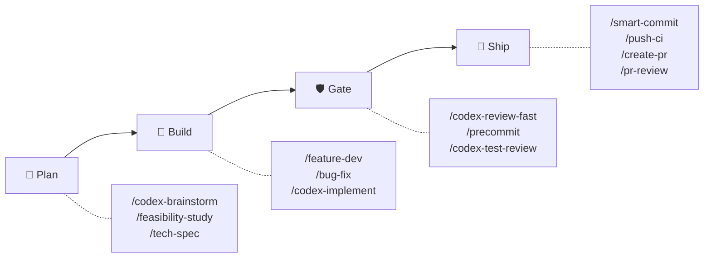
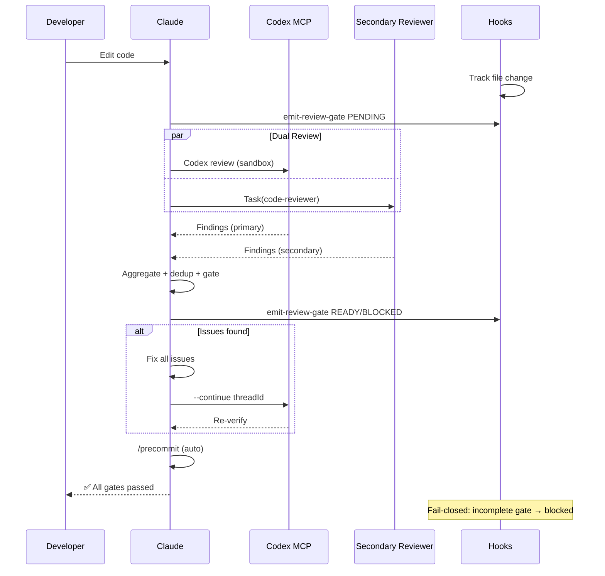

# sd0x-dev-flow

**語言**: [English](README.md) | 繁體中文 | [简体中文](README.zh-CN.md) | [日本語](README.ja.md) | [한국어](README.ko.md) | [Español](README.es.md)

**[Claude Code](https://claude.com/claude-code) 的自主開發 Workflow 引擎。**

- **零手動關卡** — 編輯程式碼、自動 review、自動修正、交付
- **雙 Reviewer 架構** — Codex MCP + 次要 reviewer 並行審查，fail-closed
- **~4% context 佔用** — Claude 200k window 的 96% 留給你的程式碼

65 commands | 49 skills | 14 agents | 5 hooks | 12 rules | 11 scripts

## 快速開始

```bash
# 安裝 plugin
/plugin marketplace add sd0xdev/sd0x-dev-flow
/plugin install sd0x-dev-flow@sd0xdev-marketplace

# 設定你的專案
/project-setup
```

一個指令自動偵測 framework、package manager、資料庫、entry point 和 script 指令。安裝 12 條 rules + 5 個 hooks。

使用 `--lite` 僅設定 CLAUDE.md（跳過 rules/hooks）。

## 運作方式



**Auto-loop 引擎**自動執行品質關卡——任何程式碼編輯後，Claude 在同一回覆中觸發**雙 Reviewer 並行審查**（Codex MCP + 次要 reviewer 同步進行）。Findings 會去重、severity 正規化，並彙整為單一 gate。Hooks 強制 fail-closed 語意：彙整 gate 未完成時，stop-guard 會阻止停止。

<details>
<summary>詳細：雙 Reviewer 時序圖</summary>



</details>

## 功能亮點：雙 Reviewer 架構

v2.0 平行分派兩個獨立 reviewer — 零單點故障：

| Reviewer | 角色 | 降級策略 |
|----------|------|----------|
| Codex MCP | 主要（sandbox，完整 diff） | 始終可用 |
| 次要（pr-review-toolkit） | 信心分數制審查 | strict-reviewer → 單 reviewer 模式 |

Findings 會**嚴重度正規化**（P0-Nit）、**去重**（file + issue key，±5 行容差），並**標記來源**（`codex` | `toolkit` | `both`）。

Gate：`✅ Ready` 或 `⛔ Blocked` — fail-closed（未完成 gate = blocked）。

## 適用場景

| 適合 | 不太適合 |
|------|----------|
| 使用 Claude Code 的個人或小團隊專案 | 完全不使用 Claude Code 的團隊 |
| 需要自動化 review 關卡的專案 | 沒有 CI 的一次性腳本 |
| Codex CLI / Cursor / Windsurf 使用者（skills 子集） | 需要自訂 LLM provider 的專案 |
| 品質關卡可防止 regression 的 repo | 沒有測試基礎建設的 repo |

## 安裝

### Codex CLI / 其他 AI Agent

```bash
# 透過 Agent Skills 標準安裝個別 skill
npx skills add sd0xdev/sd0x-dev-flow

# 產生 AGENTS.md + 安裝 hooks（在 Claude Code 中執行）
/codex-setup init
```

| 方式 | 適用工具 | 涵蓋範圍 |
|------|---------|---------|
| Plugin 安裝 | Claude Code | 完整（65 commands、hooks、rules、auto-loop） |
| `npx skills add` | Codex CLI、Cursor、Windsurf、Aider | 僅 Skills（49 skills） |
| `/codex-setup init` | Codex CLI | AGENTS.md kernel + git hooks |

**需求**：Claude Code 2.1+ | [Codex MCP](https://github.com/openai/codex)（選用，供 `/codex-*` 指令使用）

## Workflow Tracks

| Workflow | 指令 | Gate | 執行層 |
|----------|------|------|--------|
| 功能開發 | `/feature-dev` → `/verify` → `/codex-review-fast` → `/precommit` | ✅/⛔ | Hook + 行為層 |
| Bug 修正 | `/issue-analyze` → `/bug-fix` → `/verify` → `/precommit` | ✅/⛔ | Hook + 行為層 |
| Auto-Loop | Code 編輯 → `/codex-review-fast` → `/precommit` | ✅/⛔ | Hook |
| 文件 Review | `.md` 編輯 → `/codex-review-doc` | ✅/⛔ | Hook |
| 規劃 | `/codex-brainstorm` → `/feasibility-study` → `/tech-spec` | — | — |
| 上手流程 | `/project-setup` → `/repo-intake` | — | — |

```mermaid
flowchart TD
    subgraph feat ["🔨 Feature Development"]
        F1["/feature-dev"] --> F2["Code + Tests"]
        F2 --> F3["/verify"]
        F3 --> F4["/codex-review-fast"]
        F4 --> F5["/precommit"]
        F5 --> F6["/update-docs"]
    end

    subgraph fix ["🐛 Bug Fix"]
        B1["/issue-analyze"] --> B2["/bug-fix"]
        B2 --> B3["Fix + Regression test"]
        B3 --> B4["/verify"]
        B4 --> B5["/codex-review-fast"]
        B5 --> B6["/precommit"]
    end

    subgraph docs ["📝 Docs Only"]
        D1["Edit .md"] --> D2["/codex-review-doc"]
        D2 --> D3["Done"]
    end

    subgraph plan ["🎯 Planning"]
        P1["/codex-brainstorm"] --> P2["/feasibility-study"]
        P2 --> P3["/tech-spec"]
        P3 --> P4["/codex-architect"]
        P4 --> P5["Implementation ready"]
    end

    subgraph ops ["⚙️ Operations"]
        O1["/project-setup"] --> O2["/repo-intake"]
        O2 --> O3["Develop"]
        O3 --> O4["/project-audit"]
        O3 --> O7["/best-practices"]
        O3 --> O5["/risk-assess"]
        O4 --> O6["/next-step --go"]
        O5 --> O6
        O7 --> O6
    end
```

<details>
<summary>視覺化：工作流程圖</summary>



</details>

## 包含內容

| 類別 | 數量 | 範例 |
|------|------|------|
| Commands | 65 | `/project-setup`, `/codex-review-fast`, `/verify`, `/smart-commit` |
| Skills | 49 | project-setup, code-explore, smart-commit, contract-decode |
| Agents | 14 | strict-reviewer, verify-app, coverage-analyst |
| Hooks | 5 | pre-edit-guard, auto-format, review state tracking, stop guard, namespace hint |
| Rules | 12 | auto-loop, auto-loop-project, codex-invocation, security, testing, git-workflow, self-improvement |
| Scripts | 11 | precommit runner, verify runner, dep audit, namespace hint, skill runner, commit-msg guard, pre-push gate, utils (shared lib), emit-review-gate, worktree-claude-sync, build-codex-artifacts |

### 極小的 Context 佔用

~4% 的 Claude 200k context window——96% 留給你的程式碼。

| 組件 | Tokens | 佔 200k 比例 |
|------|--------|-------------|
| Rules（常駐載入） | 5.1k | 2.6% |
| Skills（按需載入） | 1.9k | 1.0% |
| Agents | 791 | 0.4% |
| **合計** | **~8k** | **~4%** |

Skills 按需載入。閒置 Skill 不佔用任何 Token。

## 指令參考

| 指令 | 說明 |
|------|------|
| `/project-setup` | 自動偵測並設定專案 |
| `/feature-dev` | 功能開發流程 |
| `/bug-fix` | Bug/Issue 修正 workflow |
| `/codex-review-fast` | 快速 review（僅 diff） |
| `/codex-review-doc` | 文件 review |
| `/precommit` | lint:fix → build → test |
| `/precommit-fast` | lint:fix → test（跳過 build） |
| `/verify` | 完整驗證鏈 |
| `/smart-commit` | 智慧批次 commit |
| `/push-ci` | 推送 + CI 監控 |
| `/create-pr` | 建立 GitHub PR |
| `/codex-brainstorm` | 對抗式 brainstorming（Nash 均衡） |
| `/tech-spec` | 產生 tech spec |
| `/pr-review` | PR self-review |
| `/codex-security` | OWASP Top 10 audit |

<details>
<summary>全部 65 個指令</summary>

### 開發

| 指令 | 說明 |
|------|------|
| `/project-setup` | 自動偵測並設定專案 |
| `/repo-intake` | 一次性專案盤點掃描 |
| `/install-rules` | 安裝 plugin 規則到 `.claude/rules/` |
| `/install-hooks` | 安裝 plugin hooks 到 `.claude/` |
| `/install-scripts` | 安裝 plugin runner 腳本 |
| `/codex-setup` | 初始化 Codex CLI 基建（AGENTS.md + hooks） |
| `/bug-fix` | Bug/Issue 修正 workflow |
| `/codex-implement` | Codex 寫 code |
| `/codex-architect` | 架構建議（第三大腦） |
| `/code-explore` | 快速 codebase 探索 |
| `/git-investigate` | 追蹤 code 歷史 |
| `/issue-analyze` | 深度 Issue 分析 |
| `/post-dev-test` | 開發後測試補全 |
| `/feature-dev` | 功能開發流程（設計 → 實作 → 驗證 → Review） |
| `/feature-verify` | 系統診斷（唯讀驗證，雙視角確認） |
| `/load-pr-review` | 載入 GitHub PR review 評論至 session |
| `/pr-comment` | 在 GitHub PR 上發佈友善的 review 評論 |
| `/code-investigate` | 雙視角程式碼調查（Claude + Codex 獨立探索） |
| `/next-step` | 情境感知的下一步建議 |
| `/smart-commit` | 智慧批次 commit（分組 + 訊息 + 指令） |
| `/git-profile` | Git 身份與 GPG 簽名 profile 管理 |
| `/push-ci` | 推送（需核准）+ CI 監控 |
| `/create-pr` | 從 branch 建立 GitHub PR |
| `/git-worktree` | 管理 git worktree（自動同步 .claude/） |
| `/merge-prep` | 合併前分析與準備 |
| `/smart-rebase` | 智慧局部 rebase（squash-merge 倉庫適用） |

### Review（Codex MCP）

| 指令 | 說明 | Loop 支援 |
|------|------|-----------|
| `/codex-review-fast` | 快速 review（僅 diff） | `--continue <threadId>` |
| `/codex-review` | 完整 review（lint + build） | `--continue <threadId>` |
| `/codex-review-branch` | 完整 branch review | - |
| `/codex-cli-review` | CLI review（完整磁碟讀取） | - |
| `/codex-review-doc` | 文件 review | `--continue <threadId>` |
| `/codex-security` | OWASP Top 10 audit | `--continue <threadId>` |
| `/codex-test-gen` | 產生 unit test | - |
| `/codex-test-review` | Review test coverage | `--continue <threadId>` |
| `/codex-explain` | 解釋複雜 code | - |
| `/seek-verdict` | P2 dismiss 盲審驗證 | - |

### 驗證

| 指令 | 說明 |
|------|------|
| `/verify` | lint -> typecheck -> unit -> integration -> e2e |
| `/precommit` | lint:fix -> build -> test:unit |
| `/precommit-fast` | lint:fix -> test:unit |
| `/dep-audit` | 依賴套件安全稽核 |
| `/project-audit` | 專案健康審計（確定性評分） |
| `/best-practices` | 業界最佳實踐審計（含對抗式辯論） |
| `/risk-assess` | 未提交程式碼風險評估 |

### 規劃

| 指令 | 說明 |
|------|------|
| `/codex-brainstorm` | 對抗式 brainstorming（Nash 均衡） |
| `/feasibility-study` | 可行性分析 |
| `/tech-spec` | 產生 tech spec |
| `/review-spec` | Review tech spec |
| `/deep-analyze` | 深度分析 + roadmap |
| `/project-brief` | PM/CTO 執行摘要 |

### 文件與工具

| 指令 | 說明 |
|------|------|
| `/update-docs` | 同步文件與 code |
| `/check-coverage` | Test coverage 分析 |
| `/create-request` | 建立/更新需求文件 |
| `/doc-refactor` | 簡化文件 |
| `/simplify` | Code 簡化 |
| `/de-ai-flavor` | 移除 AI 痕跡 |
| `/safe-remove` | 安全移除 plugin 資產 |
| `/skill-creator` | 建立新 skill（外部 plugin） |
| `/pr-review` | PR self-review |
| `/pr-summary` | PR 狀態摘要（依 ticket 分組） |
| `/contract-decode` | EVM 合約錯誤/calldata 解碼器 |
| `/skill-health-check` | 驗證 Skill 品質與 routing |
| `/statusline-config` | 自訂 statusline 區段與主題 |
| `/claude-health` | Claude Code 設定健康檢查 |
| `/op-session` | 初始化 1Password CLI session（避免重複生物辨識提示） |
| `/obsidian-cli` | Obsidian vault 整合（透過官方 CLI） |
| `/zh-tw` | 以繁體中文改寫 |

</details>

## Rules

| Rule | 說明 |
|------|------|
| `auto-loop` | 修正 -> 重新 review -> 修正 -> ... -> Pass（自動循環） |
| `auto-loop-project` | 專案客製化的 auto-loop 覆寫規則（使用者擁有，不受 plugin 管理） |
| `codex-invocation` | Codex 必須自主調研，禁止餵結論 |
| `fix-all-issues` | 零容忍：修正所有發現的問題 |
| `self-improvement` | 被修正 → 記錄教訓 → 防止再犯 |
| `framework` | Framework 專屬慣例（可自訂） |
| `testing` | Unit/Integration/E2E 隔離 |
| `security` | OWASP Top 10 checklist |
| `git-workflow` | Branch 命名、commit 慣例 |
| `docs-writing` | 表格 > 段落，Mermaid > 文字 |
| `docs-numbering` | 文件前綴慣例（0-feasibility, 2-spec） |
| `logging` | 結構化 JSON，禁止 secrets |

> **客製化**：編輯 `auto-loop-project.md` 可覆寫專案的 auto-loop 行為。Plugin 更新不會衝突 — 詳見 [Rule Override Pattern](docs/features/rule-override-pattern/2-tech-spec.md)。

## Hooks

| Hook | 觸發時機 | 用途 |
|------|----------|------|
| `namespace-hint` | SessionStart | 在 Claude context 中注入外掛指令命名空間指引 |
| `post-edit-format` | Edit/Write 之後 | 自動 prettier + 編輯後重設 review 狀態 |
| `post-tool-review-state` | Bash / MCP 工具之後 | 追蹤 review 狀態（sentinel routing，支援命名空間指令） |
| `pre-edit-guard` | Edit/Write 之前 | 防止編輯 .env/.git |
| `stop-guard` | 停止之前 | 未完成 review 時阻止或警告 + stale-state git 檢查（安裝後 strict，plugin runtime warn） |

Hook 預設是安全的。使用環境變數自訂行為：

| 變數 | 預設值 | 說明 |
|------|--------|------|
| `STOP_GUARD_MODE` | `strict`（安裝後）/ `warn`（plugin runtime） | `strict` 在缺少 review 步驟時阻止停止；`warn` 僅警告 |
| `HOOK_NO_FORMAT` | （未設定） | 設為 `1` 停用自動 format |
| `HOOK_BYPASS` | （未設定） | 設為 `1` 跳過所有 stop-guard 檢查 |
| `HOOK_DEBUG` | （未設定） | 設為 `1` 輸出 debug 資訊 |
| `GUARD_EXTRA_PATTERNS` | （未設定） | 額外保護路徑的 regex（例如 `src/locales/.*\.json$`） |

**Dependencies**：Hook 需要 `jq`。自動 format 需要專案已安裝 `prettier`。缺少 dependency 時會自動略過。

## 自訂設定

執行 `/project-setup` 自動偵測並設定所有 placeholder，或手動編輯 `.claude/CLAUDE.md`：

| Placeholder | 說明 | 範例 |
|-------------|------|------|
| `{PROJECT_NAME}` | 你的專案名稱 | my-app |
| `{FRAMEWORK}` | 你的 framework | MidwayJS 3.x, NestJS, Express |
| `{CONFIG_FILE}` | 主設定檔 | src/configuration.ts |
| `{BOOTSTRAP_FILE}` | Bootstrap entry | bootstrap.js, main.ts |
| `{DATABASE}` | 資料庫 | MongoDB, PostgreSQL |
| `{TEST_COMMAND}` | 測試指令 | yarn test:unit |
| `{LINT_FIX_COMMAND}` | Lint 自動修正 | yarn lint:fix |
| `{BUILD_COMMAND}` | Build 指令 | yarn build |
| `{TYPECHECK_COMMAND}` | Type check | yarn typecheck |

## 展示：StatusLine Config

自訂 Claude Code 的 statusline — 區段、主題與色彩。可單獨安裝：

```bash
npx skills add sd0xdev/sd0x-dev-flow --skill statusline-config
```

| 特色 | 內容 |
|------|------|
| Segments | Directory, Git branch, Model, Context %, Cost, >200k alert |
| Themes | ansi-default, catppuccin-mocha, dracula, nord, none |
| Engine | POSIX shell + JSON stdin + semantic color tokens |
| Accessibility | WCAG AA contrast, NO\_COLOR support |

[完整文件](docs/features/statusline-config/2-tech-spec.md)

## 架構

```
Command（入口）→ Skill（能力）→ Agent（環境）
```

- **Commands**：使用者透過 `/...` 觸發
- **Skills**：按需載入的知識庫
- **Agents**：擁有特定工具的隔離 sub-agent
- **Hooks**：自動化 guardrails（format、review 狀態、stop guard）
- **Rules**：始終啟用的慣例（自動載入）

進階架構細節（agentic control stack、控制迴圈理論、sandbox 規則）請參閱 [docs/architecture.md](docs/architecture.md)。

## 貢獻

歡迎 PR。請：

1. 遵循現有命名慣例（kebab-case）
2. 在 skill 中包含 `When to Use` / `When NOT to Use`
3. 對危險操作加上 `disable-model-invocation: true`
4. 提交前用 Claude Code 測試

## License

MIT

## Star History

[](https://www.star-history.com/#sd0xdev/sd0x-dev-flow&type=date&legend=top-left)
