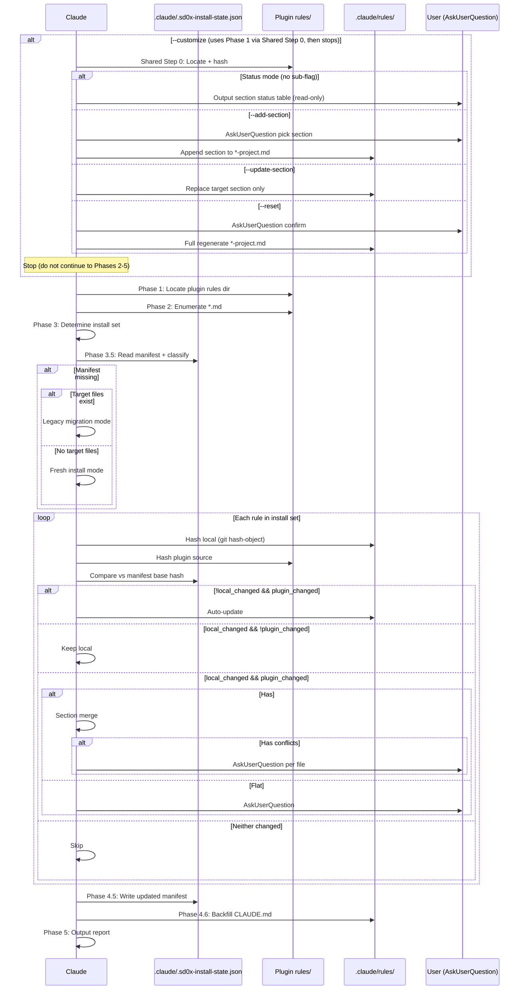

## Context

- Repo root: !`git rev-parse --show-toplevel`
- Existing local rules: !`ls .claude/rules/ 2>/dev/null || echo "(none)"`

## Task

Install sd0x-dev-flow plugin rules into the current project's `.claude/rules/` directory so they persist even without the plugin loaded. Uses manifest-tracked smart merge to auto-upgrade unchanged rules, preserve user edits, and intelligently handle conflicts.

> **Note**: Installed rules are behavioral guidance for Claude. They reference commands in short form (`/codex-review-fast`). When the sd0x-dev-flow plugin is loaded, commands are auto-namespaced as `/sd0x-dev-flow:codex-review-fast`. For full command execution support without the plugin, also run `/install-hooks` to set up the hook scripts locally.

### Workflow



### Arguments

```
$ARGUMENTS
```

| Argument | Description |
|----------|-------------|
| `--all` | Install all available rules |
| `--list` | List available rules without installing |
| `--dry-run` | Show what would be installed, no changes |
| `--force` | Overwrite all rules with plugin source + update manifest |
| `--legacy-strategy prompt\|keep-local\|use-plugin\|unmanaged` | Strategy for legacy migration (no manifest, files exist). Default: `prompt` |
| `--customize <rule>` | Configure project override file incrementally (e.g., `auto-loop`). Default: show override status. Sub-flags: `--add-section`, `--update-section`, `--reset`. Mutually exclusive with `--all`, `--list`, `--force`, `--dry-run`, `--legacy-strategy`, and `rule-names` |
| `--add-section` | (Under `--customize`) Append a new section from base or custom heading |
| `--update-section <name>` | (Under `--customize`) Replace only the named `##` section in override file |
| `--reset` | (Under `--customize`) Full regenerate from template with AskUserQuestion confirmation |
| `rule-names...` | Space-separated rule names (without .md extension) |

### Customize Mode (`--customize`)

When `--customize` is present in `$ARGUMENTS`:

**Mode Gate** — Reject if combined with `--all`, `--list`, `--force`, `--dry-run`, `--legacy-strategy`, or `rule-names`:

```
Error: --customize cannot be combined with --all, --list, --force, --dry-run, --legacy-strategy, or rule-names.
Usage: /install-rules --customize <rule> [--add-section|--update-section <name>|--reset]
```

**Sub-flag mutual exclusion** — `--add-section`, `--update-section`, `--reset` are mutually exclusive:

| Combination | Result |
|-------------|--------|
| No sub-flag | Status mode (read-only) |
| `--add-section` alone | Add mode |
| `--update-section "X"` alone | Update mode |
| `--reset` alone | Reset mode |
| Any two sub-flags together | Error: `--add-section, --update-section, and --reset are mutually exclusive` |

**Supported Rules**:

| Rule | Customize Target |
|------|-----------------|
| `auto-loop` | `.claude/rules/auto-loop-project.md` |

If the rule name is not in the table above, output error and stop:

```
Error: --customize does not support rule "<name>". Supported: auto-loop
```

#### Shared Step 0: Locate + Hash

Locate plugin rules directory using Phase 1 logic, then compute `based_on` blob hash:

```bash
git hash-object --no-filters <PLUGIN_RULES_DIR>/auto-loop.md
```

Store the short blob hash (first 7 chars) and current date. Uses blob hash (not commit hash) for content-level drift detection, consistent with Phase 3.5 hash semantics.

#### Status Mode (default — no sub-flag)

```
/install-rules --customize auto-loop
```

1. Run Shared Step 0
2. Parse base `auto-loop.md` → extract all `##` headings
3. Read existing `.claude/rules/auto-loop-project.md` (if exists)
4. Classify each section:

| Classification | Condition | Display |
|---------------|-----------|---------|
| `active` | Override file has uncommented `## <heading>` | `[ACTIVE]` |
| `commented` | Override file has `<!-- ## <heading>` | `[COMMENTED]` |
| `missing` | Section exists in base but not in override | `[BASE ONLY]` |
| `custom` | Section exists in override but not in base | `[CUSTOM]` |

1. Output status table:

```markdown
## Override Status: auto-loop

**Base**: auto-loop.md @ {SHORT_HASH}
**Override**: .claude/rules/auto-loop-project.md

| # | Section | Status | Source |
|---|---------|--------|--------|
| 1 | Auto-Trigger | [COMMENTED] | base |
| 2 | Dual Review Mode | [BASE ONLY] | base |
| 3 | P2/Nit Quality Sweep | [BASE ONLY] | base |
| 4 | Exit Conditions (Only) | [COMMENTED] | base |
| 5 | My Custom Integration Tests | [ACTIVE] | custom |

Use `--add-section` to add a new override, `--update-section "<heading>"` to update existing.
```

**Stop** — status mode is read-only, do not modify any files.

#### Add Section Mode (`--add-section`)

```
/install-rules --customize auto-loop --add-section
```

1. Run Shared Step 0 + show status table (same as Status Mode)
2. AskUserQuestion:

> Which section to add?

Options (dynamic, based on status):
- Each `[BASE ONLY]` or `[COMMENTED]` section → "Override: `## <heading>` (from base)"
- "Custom: Enter your own section heading"

3a. **Base section selected**: Copy section content from base `auto-loop.md`, append to override file after last section.

3b. **Custom section selected**: AskUserQuestion for heading text (raw text without `##` prefix, e.g. `My Integration Tests` → tool writes `## My Integration Tests`), then generate stub:

```markdown
## {heading}

<!-- TODO: Add your custom rules here -->
```

**Input validation for custom heading**:

| Check | Rule | Error |
|-------|------|-------|
| Heading level | Must be `##` (not `#`, `###`) | "Custom sections must use `##` level headings" |
| Length | 3-80 characters (excluding `##` prefix) | "Heading too short/long" |
| Characters | Alphanumeric + spaces + hyphens + parentheses | "Heading contains invalid characters" |
| Duplicate | Must not match existing active heading in override | Redirect to `--update-section` |

1. **Duplicate check**: If `## <heading>` already exists as active section in override → error:

```
Error: Section "## <heading>" already exists in override file.
Use `--update-section "<heading>"` to replace it.
```

1. Update `<!-- Based on -->` hash **only when content was copied from base** (custom sections do not change the base reference).
2. Ensure `.claude/CLAUDE.md` has `@rules/auto-loop-project.md` reference (reuse Phase 4.6 backfill logic).
3. Output:

```markdown
## Section Added

**Section**: ## <heading>
**Source**: base / custom
**File**: .claude/rules/auto-loop-project.md

Edit the section content to customize your project's behavior.
```

**Stop** — do not continue to install phases.

#### Update Section Mode (`--update-section`)

```
/install-rules --customize auto-loop --update-section "Auto-Trigger"
```

1. Run Shared Step 0
2. Read override file, locate target `## <heading>` section
3. If not found → error: `Section "## <heading>" not found in override file. Use --add-section first.`
4. AskUserQuestion: Show current section content, offer options:
   - "Re-copy from base (latest version)"
   - "Keep current and edit manually"
5. If re-copy: replace only the target section content, preserve all other sections
6. Update `<!-- Based on -->` hash
7. Output: `Section "## <heading>" updated in .claude/rules/auto-loop-project.md`

**Stop** — do not continue to install phases.

#### Reset Mode (`--reset`)

```
/install-rules --customize auto-loop --reset
```

1. Run Shared Step 0
2. **Sentinel-based content detection** to check if file has active content:

```
in_comment = false
for each line in file:
  stripped = line.trim()
  if "<!--" in stripped and "-->" in stripped:
    // Single-line comment: if text exists BEFORE "<!--", treat as active content
    prefix = stripped.split("<!--")[0].trim()
    if prefix != "":
      has_active_content = true; break
    continue  // pure single-line comment, skip
  if "<!--" in stripped and "-->" not in stripped:
    in_comment = true; continue
  if in_comment:
    if "-->" in stripped: in_comment = false
    continue
  if stripped starts with "#": continue
  if stripped is empty: continue
  // Non-empty, non-comment, non-heading = active content
  has_active_content = true; break
```

1. If has active content → AskUserQuestion: "This will regenerate `auto-loop-project.md` from template, replacing ALL current content including custom sections. Continue?"
   - "Yes, reset to template"
   - "No, cancel"
2. If no active content or user confirms: copy from plugin template source `rules/auto-loop-project.md`
3. Update `<!-- Based on -->` hash + `<!-- Generated by: /install-rules -->` sentinel
4. Ensure CLAUDE.md reference (Phase 4.6 backfill)

**Stop** — do not continue to install phases.

### Phase 1: Locate Plugin Rules Directory

Find the plugin's `rules/` directory using this priority:

1. **Glob search** — search known Claude plugin locations in order, short-circuit on first match:

   ```
   Glob: ~/.claude/plugins/**/sd0x-dev-flow/rules/auto-loop.md
   Glob: ${REPO_ROOT}/node_modules/sd0x-dev-flow/rules/auto-loop.md
   ```

2. **Plugin-relative fallback** — since this command is loaded from the plugin, try reading `@rules/auto-loop.md` to confirm the plugin's rules are accessible. If readable, derive the rules directory by resolving the path returned (parent of `auto-loop.md`).
3. **Error** — if no rules directory found, report error and stop.

The `rules/` directory is the parent of whichever `auto-loop.md` is found first.

### Phase 2: Enumerate Available Rules

Read all `.md` files from the discovered rules directory. The expected rules are:

| Rule | Purpose |
|------|---------|
| `auto-loop.md` | Auto review loop enforcement |
| `codex-invocation.md` | Codex independent research requirement |
| `fix-all-issues.md` | Zero tolerance for unfixed issues |
| `framework.md` | Framework conventions |
| `testing.md` | Test structure and requirements |
| `security.md` | OWASP security checklist |
| `git-workflow.md` | Git branch and commit conventions |
| `logging.md` | Structured logging standards |
| `docs-writing.md` | Documentation writing conventions |
| `docs-numbering.md` | Document numbering scheme |
| `self-improvement.md` | Self-improvement loop (corrected → record → prevent) |
| `context-management.md` | Data-driven context monitoring (measure before deciding) |

> **Exclusion**: `*-project.md` files (e.g., `auto-loop-project.md`) are NOT managed rules. They are user-owned override templates — see Phase 3.6.

If `--list` is specified, output this table and **stop**.

### Phase 3: Determine Installation Set

- `--all`: install all rules found in Phase 2
- Specific `rule-names`: install only those (validate they exist in the enumerated list)
- Neither: present the list and use AskUserQuestion to let the user select

### Phase 3.5: Read Manifest and Classify

1. **Read manifest**: `Read` tool to read `.claude/.sd0x-install-state.json`
   - Not found → `{}`
   - JSON parse fails → warn + treat as missing

2. **Read plugin version**: `.claude-plugin/plugin.json` → `package.json` → `"unknown"`

3. **Compute hashes**: Per rule in install set:

   ```bash
   # manifest_hash: from manifest.rules[filename].hash (null if missing)
   # local_hash:
   git hash-object --no-filters ${REPO_ROOT}/.claude/rules/<filename>   # null if file missing
   # plugin_hash:
   git hash-object --no-filters <plugin-rules-dir>/<filename>
   ```

4. **Multi-state classification** (single if/elif chain, first match wins):

   | Priority | Condition | Classification |
   |----------|-----------|---------------|
   | 0 | `deleted:true` AND local missing | SKIP_DELETED |
   | 0b | `deleted:true` AND local exists | Clear flag, re-classify |
   | 1 | manifest_hash is null AND local missing | FRESH_INSTALL |
   | 2 | manifest_hash is null AND local exists | LEGACY |
   | 3 | local_hash is null | DELETED_LOCAL |
   | 4 | local==manifest AND plugin==manifest | SKIP |
   | 5 | local==manifest AND plugin!=manifest | AUTO_UPDATE |
   | 6 | local!=manifest AND plugin==manifest | KEEP_LOCAL |
   | 7 | local!=manifest AND plugin!=manifest | CONFLICT |

   Note: treat missing manifest entry as `{ deleted: false }`

5. **DELETED_LOCAL sub-handling**:
   - plugin changed (plugin_hash != manifest_hash) → AskUserQuestion: "Rule `<file>` was deleted locally but plugin has updates." Options: "Reinstall (Recommended)" / "Keep deleted"
   - plugin unchanged → keep deleted silently + write tombstone

6. Store classifications in memory for Phase 4.

### Phase 3.6: Override Template Creation

After processing managed rules, create unmanaged override templates:

```
# Override templates are NOT part of the managed install set
override_templates = { "auto-loop.md": "auto-loop-project.md" }

For each (base_rule, project_file) in override_templates:
  if project_file NOT exists in .claude/rules/:
    Copy from <PLUGIN_RULES_DIR>/{project_file} as template
    Do NOT write manifest entry for project_file
    Log: "Created project override template: {project_file}"
  else:
    Skip (user already has it)
```

> **Important**: `*-project.md` files must be explicitly excluded from the managed rule enumeration (`rules/*.md`). They are template sources only, never manifest-tracked.

### Phase 3.7: CLAUDE.md Reference Backfill

After override template creation, perform idempotent reference check:

```
If @rules/auto-loop.md reference exists in CLAUDE.md ## Rules
  AND @rules/auto-loop-project.md is absent:
    Insert @rules/auto-loop-project.md line after @rules/auto-loop.md
    Log: "Added project override reference to CLAUDE.md"
```

### Phase 4: Smart Merge and Install

**4.0** Ensure target directory exists:

```bash
mkdir -p ${REPO_ROOT}/.claude/rules
```

**4.1** `--dry-run` gate → output classification table (see Phase 5 dry-run format) and **stop**.

**4.2** `--force` short-circuit → overwrite all files with plugin source + set manifest hash = plugin_hash + clear all deleted flags. Status = `Forced`.

**4.3** Per-file action table:

| Classification | Action | Manifest Update |
|---------------|--------|-----------------|
| SKIP | No action | Unchanged |
| SKIP_DELETED | No action | Unchanged (tombstone stays) |
| FRESH_INSTALL | Write plugin source | hash = plugin_hash |
| AUTO_UPDATE | Write plugin source | hash = plugin_hash |
| KEEP_LOCAL | No file change | Unchanged |
| CONFLICT | Merge strategy (4.3a/4.3b) | hash = plugin_hash |
| LEGACY | Legacy migration (4.3c) | Per user choice |
| DELETED_LOCAL | Per AskUserQuestion from Phase 3.5 | reinstall: hash=plugin_hash / keep: tombstone |

**4.3a** Section merge (structured rules — has `##` headings):

- Parse both files by `^##` into ordered sections (heading text = key)
- Preamble (content before first `##`): keep local
- Plugin sections in order:
  - identical → keep
  - both-differ → conflict
  - plugin-only → add
- Append local-only sections
- If conflicts → AskUserQuestion per file:
  - "Keep local version (Recommended)"
  - "Use plugin version"
  - "Apply non-conflicting merge + keep local for conflicts"

**4.3b** Flat file conflict (no `##` headings):

- AskUserQuestion: "Rule `<filename>` was modified both locally and in the plugin update."
  - "Keep local version (Recommended)"
  - "Use plugin version"

**4.3c** Legacy migration (no manifest, local file exists):

- hash equal → auto-adopt (write manifest hash, no file change)
- hash differs → `--legacy-strategy` or AskUserQuestion:
  - `keep-local` → manifest hash = plugin_hash (enroll for future tracking)
  - `use-plugin` → overwrite + manifest hash = plugin_hash
  - `unmanaged` → no manifest entry (opt out)
  - `prompt` (default) → AskUserQuestion with above 3 options

### Phase 4.5: Write Manifest

1. Re-read existing manifest via `Read` tool (reduce race window)
2. Update in-memory:
   - `schema_version: 1`
   - `installed_at`: current ISO-8601
   - `plugin_version`: from Phase 3.5
   - `rules`: update each processed file's hash/deleted flag
   - Preserve `hook_scripts` / `scripts` keys from existing manifest
3. Write via `Write` tool to `.claude/.sd0x-install-state.json`
4. Error: warn + continue (next run → legacy migration)

### Phase 4.6: Backfill CLAUDE.md (Closed-Loop Guarantee)

Ensure `.claude/CLAUDE.md` contains `@rules/` references so the auto-loop engine can activate. This guarantees a closed loop even when `/install-rules` is run standalone (without `/project-setup`).

1. Grep `.claude/CLAUDE.md` for `@rules/auto-loop.md`
2. **Found** → check if `@rules/auto-loop-project.md` also present:
   - **Both present** → skip (fully configured)
   - **`auto-loop.md` present, `auto-loop-project.md` missing** → insert `- @rules/auto-loop-project.md -- Project-specific auto-loop overrides (user-owned)` after the `auto-loop.md` line
3. **Not found but file exists** → append the following `## Rules` block at end of file:

   ```markdown
   ## Rules

   - @rules/auto-loop.md -- Auto review loop (highest priority)
   - @rules/auto-loop-project.md -- Project-specific auto-loop overrides (user-owned)
   - @rules/codex-invocation.md -- Codex must independently research (critical)
   - @rules/fix-all-issues.md -- Zero tolerance
   - @rules/testing.md
   - @rules/framework.md
   - @rules/security.md
   - @rules/docs-writing.md
   - @rules/docs-numbering.md
   - @rules/git-workflow.md
   - @rules/logging.md
   - @rules/self-improvement.md -- Corrected → record → prevent recurrence
   - @rules/context-management.md -- Data-driven context monitoring (measure before deciding)
   ```

4. **File does not exist** → extract from plugin's `CLAUDE.template.md`: `## Required Checks` through `### Auto-Loop Rule` sections + `## Rules` section → create minimal `.claude/CLAUDE.md`. Remove ecosystem block markers and leave unresolved placeholders as `{PLACEHOLDER}`.

### Phase 5: Output Report

## Output

### Dry-run output (when `--dry-run`):

```markdown
## Smart Merge Dry Run

**Plugin**: v<old> → v<new>
**Manifest**: .claude/.sd0x-install-state.json (found|missing)

| Rule | Local | Plugin | Classification | Action |
|------|-------|--------|---------------|--------|
| auto-loop.md | modified | updated | CONFLICT | Section merge (2 conflicts) |
| security.md | original | updated | AUTO_UPDATE | Auto-update |
| git-workflow.md | modified | original | KEEP_LOCAL | Keep local |
| testing.md | original | original | SKIP | Skip |
| docs-writing.md | — | new | FRESH_INSTALL | Install |
| framework.md | deleted | — | SKIP_DELETED | Skip (tombstone) |

**Summary**: 1 auto-update, 1 install, 1 section merge (needs interaction), 1 keep, 1 skip, 1 skip-deleted
```

### Report output (normal run):

```markdown
## Install Rules Report (Smart Merge)

**Source**: <plugin-rules-path>
**Target**: <repo-root>/.claude/rules/
**Plugin**: v<old> → v<new>
**Manifest**: .claude/.sd0x-install-state.json

| Rule | Status | Detail |
|------|--------|--------|
| auto-loop.md | ✅ Merged | 2 sections merged, 0 conflicts |
| security.md | ✅ Auto-updated | Plugin updated, no local edits |
| git-workflow.md | ⏭️ Kept local | User edited, plugin unchanged |
| testing.md | ⏭️ Skipped | No changes |
| docs-writing.md | ✅ Installed | New file |
| framework.md | 🗑️ Skip (deleted) | User previously deleted; tombstone active |

**Auto-updated**: N / **Merged**: N / **Kept local**: N / **Installed**: N / **Skipped**: N / **Skip-deleted**: N
```

Status icons: ✅=Installed/Auto-updated/Merged/Adopted, ⏭️=Kept/Skipped/Enrolled, 🗑️=Skip-deleted, ⚡=Forced, ➖=Unmanaged

### Next Steps

- Review any conflicts or skipped items manually
- Rules in `.claude/rules/` are auto-loaded by Claude Code for this project
- Use `--force` to overwrite all rules with plugin versions
- Manifest tracks installed state at `.claude/.sd0x-install-state.json`

## Examples

```bash
# List available rules
/install-rules --list

# Install all rules
/install-rules --all

# Install specific rules only
/install-rules auto-loop fix-all-issues security

# Preview what would happen (smart merge classification)
/install-rules --all --dry-run

# Force overwrite existing rules
/install-rules --all --force

# Smart merge with legacy migration (keep all local)
/install-rules --all --legacy-strategy keep-local

# Show override status for auto-loop
/install-rules --customize auto-loop

# Add a section to auto-loop project overrides
/install-rules --customize auto-loop --add-section

# Update a specific section in auto-loop project overrides
/install-rules --customize auto-loop --update-section "Auto-Trigger"

# Reset auto-loop project overrides to template
/install-rules --customize auto-loop --reset
```
