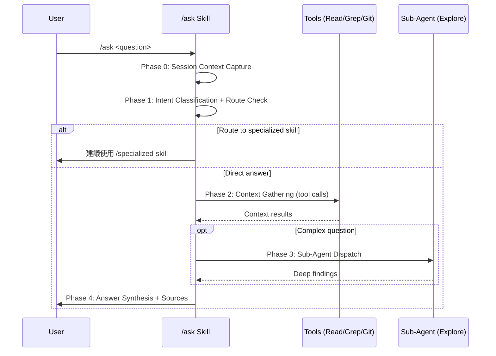

# `/ask` — Context-Aware Q&A Skill Tech Spec

> **Requirements**: 從 `/req-analyze` 階段整理（未產出獨立 `1-requirements.md`，需求直接整合於 §1）

## 1. Requirement Summary

### Problem

開發者在 sd0x-dev-flow 開發過程中，經常需要快速了解 codebase、git history、rules、docs、skills 等上下文資訊。目前的選項：

| 現有方式 | 缺點 |
|----------|------|
| 直接問 Claude | 缺少系統化 context 收集，只用已知 conversation context |
| `/code-explore` | 只做 code tracing，不處理 git/docs/rules 問題 |
| `/deep-research` | 多波多 agent 重量級流程，回答簡單問題太慢太貴 |
| `/codex-explain` | 只解釋特定 code，不自動收集上下文 |

**Root Problem**（5-Why 結論）：需要一個「輕量級智慧 Q&A」機制——根據問題類型自動決定需要什麼 context（code / git / docs / rules / skills），用最小成本回答。

### Goals

| Goal | Description |
|------|-------------|
| G1 | 單一入口問任何專案相關問題 |
| G2 | 自動偵測問題意圖，收集必要 context |
| G3 | 按需調用 sub-agent，不過度消耗資源 |
| G4 | 嚴格 read-only，不觸發 auto-loop |
| G5 | 當問題更適合其他 skill 時，主動路由建議 |

### Scope

| In Scope | Out of Scope |
|----------|-------------|
| Codebase 問題（函數、模組、架構） | 程式碼修改（→ `/feature-dev`） |
| Git history（commits、diff、blame） | Code review（→ `/codex-review-fast`） |
| Rules / conventions 查詢 | Bug fixing（→ `/bug-fix`） |
| Docs / tech spec 查詢 | 外部服務查詢（→ `/deep-research`） |
| Skill 系統查詢 | Workflow 執行（→ 各專門 skill） |
| Architecture 理解 | — |

### Stakeholders

| Role | Key Concern |
|------|-------------|
| 開發者（使用者） | 快速獲得準確答案，不需組合多個 skill |
| 其他 skill | 不與 `/code-explore`、`/deep-research` 等職責衝突 |
| Auto-loop 系統 | read-only，不觸發 review loop |

## 2. Existing Code Analysis

### Related Skills — Boundary Definition

| Skill | Overlap Zone | `/ask` 邊界 |
|-------|-------------|-------------|
| `/code-explore` | Code investigation | `/ask` question-driven；`/code-explore` exploration-driven（系統化 trace） |
| `/deep-research` | Multi-source research | `/ask` 輕量 Q&A（max 2 agents）；`/deep-research` 重量級多波 orchestration |
| `/codex-explain` | Code explanation | `/ask` 自動收集 context；`/codex-explain` 需指定 code target |
| `/next-step` | Advisory | `/ask` 回答問題；`/next-step` 建議下一步動作 |
| `/remind` | Rule loading | `/ask` 回答關於 rules 的問題；`/remind` 糾正違規行為 |
| `/git-investigate` | Git history | `/ask` 快速回答 git 問題；`/git-investigate` 深度 code archaeology |

### Reusable Components

| Component | Location | Usage |
|-----------|----------|-------|
| Feature resolver | `scripts/lib/feature-resolver.js` | Feature-scoped 問題的 context detection（`canonical_docs` / `doc_inventory`） |
| Explore agent | Agent tool `subagent_type: "Explore"` | 複雜問題的 code analysis delegation |
| Grep / Glob / Read | Built-in tools | 直接 context 收集 |
| Git read commands | `Bash(git:*)` entitlement + policy-enforced read-only subset | Git history 查詢（status / log / diff / blame / branch / rev-parse） |

## 3. Technical Solution

### 3.1 Architecture Overview



### 3.2 Phase 0: Session Context Capture

每次呼叫自動收集 session 狀態，作為問題理解的背景：

使用 dedicated tools 和 git read-only subcommands 收集（policy-enforced，見 §3.7）：

| # | Action | Tool | Limit |
|---|--------|------|-------|
| 1 | Current branch | `Bash("git branch --show-current")` | — |
| 2 | Feature detection | `Bash("node scripts/resolve-feature-cli.js")` | Graceful: empty `{}` on failure |
| 3 | Changed files | `Bash("git status --porcelain")` | Top 20 lines |
| 4 | Recent commits | `Bash("git log --oneline -5")` | 5 commits |

**產出**：Session context object（branch、feature key、changed files、recent commits）。

**成本控制**：Phase 0 的 4 個命令並行執行，overhead < 2 秒。

**Read-only 保證**：Phase 0 僅使用 git read-only subcommands（見 §3.7 Read-Only Enforcement）。

### 3.3 Phase 1: Intent Classification + Skill Routing

#### Intent Classification

模型根據問題文字 + session context 推斷意圖。LLM-inferred（非 rules-based），因為問題是開放式的。

| Intent | Signal Examples | Context Actions |
|--------|----------------|-----------------|
| `code` | "function X 做什麼"、"module Y 怎麼運作"、file paths | Grep keywords → Read files → trace 1 level |
| `git` | "最近改了什麼"、"誰改的"、"什麼時候" | git log / diff / blame |
| `docs` | "需求是什麼"、"spec 寫了什麼"、"request doc" | Feature resolve → `canonical_docs` → fallback Glob |
| `rules` | "規則是什麼"、"convention"、"allowed" | Read rules/ files |
| `skill` | "有沒有 skill"、"怎麼用 /X"、"command" | Glob skills/ → Read SKILL.md |
| `arch` | "系統架構"、"how does the system"、"整體設計" | Multi-file + Explore agent |
| `multi` | 多個意圖混合 | 合併多個 intent 的 actions |

#### Skill Routing Check

在執行 context gathering 之前，檢查問題是否更適合其他 skill：

| Signal Pattern | Route To | Reason |
|---------------|----------|--------|
| 修改/實作意圖 | `/feature-dev` | Action-oriented，非 Q&A |
| Code review / 檢查程式碼 | `/codex-review-fast` | Code review workflow |
| Tech spec review / 檢查規格 | `/review-spec` | Spec review workflow |
| Doc review / 檢查文件 | `/codex-review-doc` | Doc review workflow |
| Bug/Error 意圖 | `/bug-fix` | Bug fix workflow |
| "下一步"、"該做什麼" | `/next-step` | Advisory workflow |
| 深度研究、survey | `/deep-research` | Heavy research |
| 完整 code trace | `/code-explore` | Systematic exploration |

**Routing 行為**：輸出建議（「這個問題更適合 `/X`，要改用嗎？」），不自動跳轉。使用者可以選擇繼續用 `/ask` 或切換。

### 3.4 Phase 2: Context Gathering Pipeline

根據 Phase 1 的 intent 分類，執行對應的 tool call sequence：

#### `code` Intent

| Step | Action | Limit |
|------|--------|-------|
| 1 | `Grep` question keywords → identify files | Top 10 files |
| 2 | `Read` most relevant files | Max 5 files |
| 3 | Trace imports/dependencies（if needed） | 1 level deep |

#### `git` Intent

| Step | Action | Limit |
|------|--------|-------|
| 1 | `git log --oneline -20`（可加 path filter） | 20 commits |
| 2 | `git diff`（if asking about recent changes） | Changed files only |
| 3 | `git blame <file>`（if asking about specific lines） | Single file |

#### `docs` Intent

Feature-first document discovery（aligned with `canonical_docs` / `doc_inventory` model）：

| Step | Action | Limit |
|------|--------|-------|
| 1 | Resolve feature via `resolve-feature-cli.js`（if not already in Phase 0） | — |
| 2a | **Feature resolved**: use `canonical_docs` map（tech_spec, requirements, architecture） | Direct read |
| 2b | **Feature not resolved**: fallback to `Glob "docs/**/*.md"` keyword matching | Top 5 matches |
| 3 | Read relevant documents | Max 3 files |

#### `rules` Intent

| Step | Action | Limit |
|------|--------|-------|
| 1 | `Glob "rules/*.md"` + `".claude/rules/*.md"` | All rule files |
| 2 | `Grep` question keywords in rule files | Matching sections |
| 3 | Read + quote relevant sections | Max 3 files |

#### `skill` Intent

| Step | Action | Limit |
|------|--------|-------|
| 1 | `Glob "skills/*/SKILL.md"` | All skill files |
| 2 | `Grep` question keywords in SKILL.md files | Top 5 matches |
| 3 | Read matching SKILL.md | Max 3 files |

#### `arch` Intent

| Step | Action | Limit |
|------|--------|-------|
| 1 | Read CLAUDE.md + key entrypoints | 2 files |
| 2 | Dispatch Explore agent with architecture prompt | 1 agent |
| 3 | Merge findings | — |

#### `multi` Intent

合併多個 intent 的 step 1-2，parallel 執行。hard limit: 合計 max 8 file reads。

### 3.5 Phase 3: Sub-Agent Dispatch（Optional）

| Complexity Level | Criteria | Strategy |
|-----------------|----------|----------|
| **Simple** | 單一 intent、目標明確、< 5 files | Direct tool calls only（0 agents） |
| **Medium** | 多文件、有些模糊、跨模組 | 1 Explore agent |
| **Complex** | 多 intent、cross-cutting、architecture | 2 agents parallel（hard max） |

**Dispatch 判斷**：
- Grep 返回 > 10 files 且問題跨多模組 → dispatch agent
- 問題涉及 architecture 或 cross-cutting concerns → dispatch agent
- Default: direct tool calls（lower cost, faster）

**Agent Prompt Template**：

```
Agent({
  description: "Gather context for: <question summary>",
  subagent_type: "Explore",
  prompt: "The user is asking: <question>
    Session context: branch=<branch>, feature=<key>, changed files=<files>
    Research the codebase to answer this question.
    Focus on: <intent-specific focus>
    Report: key findings with file:line references.
    Thoroughness: quick"
})
```

### 3.6 Phase 4: Answer Synthesis

將所有收集到的 context 整合為結構化答案。

#### Output Format

```markdown
## Answer

{直接、簡潔的答案}

### Sources

| Type | Reference | Relevance |
|------|-----------|-----------|
| file | `path/file.js:42` | {為什麼相關} |
| commit | `abc1234 — commit message` | {為什麼相關} |
| command | `git log --oneline -5` | {查詢的結果摘要} |

### See Also

- `/code-explore` — 如需完整 trace
- {其他相關 skill 或 doc}
```

#### Source Evidence Types

| Type | Format | When Used |
|------|--------|-----------|
| `file` | `path/file.js:line` | Code、docs、rules 引用 |
| `commit` | `<short-hash> — <message>` | Git history 相關答案 |
| `command` | `<command>` + output summary | Git diff/status/blame 等命令衍生事實 |

#### Output Constraints

| Rule | Description |
|------|-------------|
| 答案在前 | 先給答案，再列 sources |
| Source attribution | 每個 claim 必須對應至少一個 source evidence |
| 簡潔 | 答案 < 500 字（除非使用者要求詳細） |
| No secrets | 不輸出 secrets/tokens（per security rules，見 §3.7） |

### 3.7 Read-Only Enforcement + Path Security

#### Read-Only Guarantee

| Layer | Mechanism |
|-------|-----------|
| Tool entitlements | `allowed-tools` 使用 repo 標準 `Bash(git:*)` 前綴；不含 Edit、Write、NotebookEdit |
| Policy enforcement | SKILL.md 內明確列出 prohibited git subcommands（見下表） |
| Custom test | `test/skills/ask.test.js` 驗證 SKILL.md 包含 prohibited commands 清單 |
| Auto-loop exempt | Skill 標記 `context: fork`，不產生 file changes，不觸發 auto-loop state tracking |

#### Prohibited Git Commands

以下 git subcommands 明確禁止（不在 `allowed-tools` 中）：

```
git add | git commit | git push | git pull | git reset | git stash
git rebase | git merge | git checkout -- | git restore | git clean
```

#### Path Security / Redaction

| Control | Implementation |
|---------|---------------|
| Repo boundary | 所有 Read/Glob 操作限制在 repo root 以內（`git rev-parse --show-toplevel`） |
| Traversal rejection | 拒絕 `..` 路徑片段、絕對路徑（除非在 repo root 下）、symlink 跳出 repo |
| Secret redaction | 讀取檔案後、輸出前進行 2-tier secret scan |
| Tier 1（high-confidence） | 偵測到 API key / token / password pattern → 以 `[REDACTED]` 替代 |
| Tier 2（medium-confidence） | 疑似敏感值 → mask 前後各保留 4 字元 |
| Skip patterns | 不讀取 `.env`、`credentials.*`、`*secret*` 檔案 |

#### Verification Items

- [ ] `allowed-tools` 不含 Edit / Write / mutating git commands
- [ ] 所有 Bash 呼叫限制在 allowlisted git read subcommands + `node scripts/resolve-feature-cli.js`
- [ ] 輸出不含 secrets（spot-check output for patterns）
- [ ] Path 操作不超出 repo boundary

## 4. SKILL.md Design

### Frontmatter

```yaml
---
name: ask
description: "Context-aware Q&A with auto context gathering. Use when: user has a quick question about codebase, git history, rules, docs, or skills during development. Not for: code changes (use feature-dev), code review (use codex-review-fast), deep research (use deep-research), full code trace (use code-explore). Output: structured answer with source attribution."
allowed-tools: Read, Grep, Glob, Bash(git:*), Bash(node:*), Agent
context: fork
---
```

> **Note**: 使用 repo 標準 `Bash(git:*)` 前綴。Read-only 保證透過 SKILL.md 內的 prohibited commands policy + 專屬 test case 實現（見 §3.7），而非 entitlement 層級拆分。此做法與 `code-explore`、`next-step` 等現有 read-only skill 一致。

### SKILL.md Structure（estimated ~120 lines）

| Section | Content |
|---------|---------|
| Trigger | ask, quick question, context question, 問一下, 想了解, project question（不含 what/how/why 等通用詞，避免與 `/codex-explain`、`/tech-brief`、`/deep-research` 衝突） |
| When NOT to Use | Routing table（→ specialized skills） |
| Procedure | Phase 0-4 workflow |
| Intent Classification | Table with signals and actions |
| Context Gathering | Per-intent pipeline |
| Sub-Agent Dispatch | Criteria table |
| Output Format | Answer + Sources + See Also |
| Verification | Read-only check + source attribution check |

### References

| File | Purpose | When to Read |
|------|---------|-------------|
| `references/intent-patterns.md` | Detailed intent classification examples | When classifying ambiguous questions |
| `references/routing-table.md` | Full skill routing decision table | When checking if another skill is better |

## 5. Risks and Dependencies

| Risk | Impact | Likelihood | Mitigation |
|------|--------|-----------|------------|
| Over-fetching（讀太多檔案） | 慢、token 浪費 | Medium | Hard limit: max 5 direct reads, max 2 agents |
| Misclassification（意圖判斷錯誤） | 收集無關 context | Low | Multi-intent fallback: 不確定時合併多個 category |
| Skill 重疊混淆 | 使用者不知道用 `/ask` 還是 `/code-explore` | Medium | Clear routing table + description routing cues |
| Agent 對簡單問題 overkill | 不必要的成本 | Low | Default to direct tools; agent 只用於 complex |
| Session context capture 失敗 | 缺少 session 背景 | Low | Graceful degradation: 跳過失敗步驟，用已知 context |

## 6. Work Breakdown

| Task | Size | Dependencies | Description |
|------|------|-------------|-------------|
| T1 | S | — | Create `skills/ask/SKILL.md` with full workflow |
| T2 | S | T1 | Create `skills/ask/references/intent-patterns.md` |
| T3 | XS | T1 | Create `skills/ask/references/routing-table.md` |
| T4 | XS | T1-T3 | Run `/skill-health-check` validation |
| T5 | M | T1 | Write tests（`test/skills/ask.test.js`）：skill lint、routing、provenance shape、resolver-based doc lookup、read-only enforcement（prohibited commands 清單存在）、path security |
| T6 | S | T1 | Manual verification（7 intent types × happy path） |
| T7 | XS | T1 | Update `docs/skill-catalog.yml`（add ask entry） |
| T8 | XS | T7 | Update CLAUDE.md command table（add `/ask` entry） |
| T9 | XS | T8 | Regenerate README catalog（if applicable, via `scripts/generate-readme-catalog.js`） |

**Total estimate**: M（skill prompt engineering + catalog integration + focused tests）

## 7. Testing Strategy

| Test Type | Coverage | Method |
|-----------|----------|--------|
| Skill lint | `skill-lint.js` passes（P0/P1/P2 checks） | `test/skills/ask.test.js` |
| Routing correctness | Action-oriented questions → suggest specialized skill | `test/skills/ask.test.js` |
| Provenance shape | Output sources 包含 file / commit / command evidence types | `test/skills/ask.test.js` |
| Resolver-based doc lookup | `docs` intent 使用 `canonical_docs` 而非 blind glob | `test/skills/ask.test.js` |
| Read-only enforcement | SKILL.md 含 prohibited commands 清單 + `allowed-tools` 無 Edit/Write | Custom test（`test/skills/ask.test.js`）+ manual audit |
| Intent classification | 7 intent types × representative question | Manual |
| Source attribution | 每個答案都有 source evidence | Manual |
| Graceful degradation | Feature resolver 失敗時仍能回答 | Manual |
| Path security | 不讀取 `.env`、不輸出 secrets | Manual |

## 8. Open Questions

- [ ] **Naming**: `/ask` 是否足夠清楚？或者 `/q`（更短）/ `/dig`（暗示挖掘）更好？
- [ ] **Conversation context**: 是否應考慮 conversation 中先前的訊息，還是只看問題文字 + session state？
- [x] **Response language**: 遵循 `rules/docs-writing.md` Locale-Aware Writing 規則（zh-TW 繁體中文、台灣慣用詞彙），技術名詞保留英文
- [ ] **Agent budget**: max 2 agents 是否合理？是否需要 configurable？
