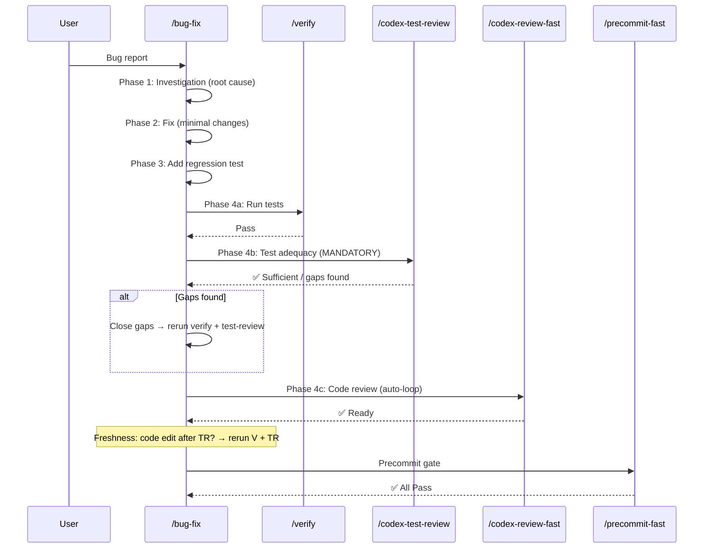

# Bug-Fix Skill Redesign — Technical Spec

## 1. Requirement Summary

- **Problem**: `/bug-fix` skill 缺少 `/feature-dev` 修正後的安全機制 — 無 git 禁止區塊、`/codex-test-review` 非 mandatory、`allowed-tools` 包含 `Bash(git:*)` 允許 `git commit`、`testing-guide.md` hardcoded TypeScript/Jest、無 freshness rule。
- **Goals**:
  1. 加入 Prohibited Actions 區塊（git add/commit/push）
  2. `allowed-tools` 改為 `Bash`（與 feature-dev 一致）
  3. `/codex-test-review` 改為 mandatory step + gap closure routing
  4. 加入 freshness rule（post-review code edit → rerun verify + test-review）
  5. Migrate bug-type matrix into SKILL.md，刪除 `testing-guide.md`
  6. 引用 `@rules/testing.md` + `@rules/testing-project.md`
  7. 對齊 `commands/bug-fix.md` 與 SKILL.md
- **Scope**: SKILL.md rewrite + command update + testing-guide.md removal + test update
- **Source**: `/best-practices` audit + `/codex-brainstorm` Nash Equilibrium (threadId: `019cff9f-8946-78c0-8c7e-9d3edf594530`)

## 2. Existing Code Analysis

### Related Modules

| Module | 關聯 | Action |
|--------|------|--------|
| `skills/bug-fix/SKILL.md` | 主 skill 定義 | Rewrite |
| `skills/bug-fix/references/testing-guide.md` | Bug-specific testing guide (TS/Jest hardcoded) | Delete |
| `commands/bug-fix.md` | Command wrapper | Update |
| `skills/feature-dev/SKILL.md` | 安全機制參考模板 | Reference pattern |
| `rules/testing.md` | 測試規範（evidence model, adequacy gate） | Reference |
| `rules/testing-project.md` | Project-specific testing overrides | Reference |
| `rules/git-workflow.md` | Git 禁止策略 | Reference |
| `rules/auto-loop.md` | Doc Sync behavior-layer rule | Pointer |
| `test/commands/bug-fix.test.js` | Skill tests (if exists) | Update/Create |

### Reusable Patterns (from feature-dev redesign)

| Pattern | Source | Reuse |
|---------|--------|-------|
| Prohibited Actions block | `skills/feature-dev/SKILL.md:20-26` | Copy + adapt |
| Mandatory test review step | `skills/feature-dev/SKILL.md:68-74` | Copy + adapt |
| Gap closure routing | `skills/feature-dev/SKILL.md:76-82` | Copy |
| Freshness rule | `skills/feature-dev/SKILL.md:91-93` | Copy |
| Testing rules reference | `skills/feature-dev/SKILL.md:97-98` | Copy |
| Verification checklist (incl. no-git) | `skills/feature-dev/SKILL.md:128-132` | Copy + adapt |

## 3. Technical Solution

### 3.1 Architecture — Before vs After



### 3.2 SKILL.md Changes

#### 3.2.1 Frontmatter

```diff
- allowed-tools: Read, Grep, Glob, Edit, Write, Bash(git:*), Bash(yarn:*), Bash(gh:*)
+ allowed-tools: Read, Grep, Glob, Edit, Write, Bash
```

#### 3.2.2 New: Prohibited Actions (after Trigger)

```markdown
## Prohibited Actions

\`\`\`
❌ git add | git commit | git push — per @rules/git-workflow.md
\`\`\`

This skill fixes bugs but does **not** commit. To commit, the user must invoke `/smart-commit --execute` separately.
```

#### 3.2.3 Phase 3: Migrate bug-type matrix

Keep the existing bug-type → test-level table, add cross-service row, add rules reference:

```markdown
## Phase 3: Add Regression Test ⚠️

Follow `@rules/testing.md` for conventions (AAA, naming, evidence model).
Follow `@rules/testing-project.md` for project-specific overrides.

| Bug Type | Required | Recommended |
|----------|----------|-------------|
| Logic error | Unit | - |
| Service issue | Unit | Integration |
| API issue | Integration | E2E |
| Cross-service/data flow | Integration | E2E |
| User flow | E2E | - |
```

#### 3.2.4 Phase 4: Restructure as 3 explicit steps

```markdown
## Phase 4: Verify + Review

### Step 1: Run tests

/verify → all pass? Yes → Step 2. No → fix → rerun.

### Step 2: Test adequacy review (mandatory for code changes)

/codex-test-review → ✅ Tests sufficient?
  Yes → Step 3
  No → close gaps → /codex-test-review --continue

### Step 2a: Gap closure

| Gap Type | Remediation |
|----------|-------------|
| Unit test missing | `/codex-test-gen` → write → `/verify` |
| Integration/E2E missing | `/post-dev-test` → write → `/verify` |

### Step 3: Code review (auto-loop)

/codex-review-fast → ✅ Ready → Precommit gate

### Freshness rule

If code changes after `✅ Tests sufficient` (e.g., review fixes), rerun `/verify` then `/codex-test-review --continue`.
```

#### 3.2.5 New: Auto-loop pointer (after Review Loop)

```markdown
## Doc Sync

Doc Sync is governed by `@rules/auto-loop.md` (behavior-layer rule). After precommit pass, triggers conditionally when changes map to `docs/features/`.
```

#### 3.2.6 Updated Verification Checklist

```markdown
- [ ] Root cause identified and documented
- [ ] Regression test written at appropriate level
- [ ] All tests pass (`/verify`)
- [ ] Test adequacy reviewed (`/codex-test-review`)
- [ ] Code review passed (`/codex-review-fast` ✅ Ready)
- [ ] Precommit passed (`/precommit-fast` ✅ All Pass)
- [ ] No `git add/commit/push` executed
```

### 3.3 commands/bug-fix.md Changes

| Change | Before | After |
|--------|--------|-------|
| `allowed-tools` | `Bash(git:*), Bash(yarn:*), Bash(gh:*)` | `Bash` |
| References | `@skills/bug-fix/references/testing-guide.md` | Remove |
| Review workflow | Missing `/codex-test-review` | Add `/codex-test-review` row |
| Key rules | None | Add "No git commit" + "Mandatory test review" |
| Precommit | Implied | Explicit `/precommit-fast` in review workflow |

### 3.4 Delete testing-guide.md

After matrix migration is complete, delete `skills/bug-fix/references/testing-guide.md`.

Verify no other files reference it:

```bash
grep -r "testing-guide" skills/ commands/ --include="*.md" -l
```

Expected: **zero matches** (all references removed during T1 + T2). Any remaining match = migration incomplete.

## 4. Risks and Dependencies

| Risk | Impact | Mitigation |
|------|--------|-----------|
| Hotfix 速度降低 | Mandatory test review 增加 cycle time | `@rules/testing.md` exception model (3-gate: reason class `ENV_UNAVAILABLE` / `UNSAFE_TO_AUTOMATE` + Codex verification + expiry) — exception 不豁免 Security/Data-integrity/Regression AC |
| Codex 不可用 | Strict flow blocked | `⚠️ Need Human` sentinel fallback |
| Bash 權限過廣 | 比 scoped tools 更大 command surface | Prohibited block + `@rules/git-workflow.md` 雙重防護 |
| testing-guide.md 移除遺漏 | 外部引用斷裂 | grep 確認 + test assertion |
| Matrix migration 遺漏 | 缺少 cross-service row | 遷移後對比原 testing-guide.md |

| Dependency | Status |
|-----------|--------|
| `rules/testing.md` enrichment (Phase A) | ✅ Completed |
| `rules/testing-project.md` | ✅ Completed |
| `skills/feature-dev/SKILL.md` redesign | ✅ Completed |

## 5. Work Breakdown

| Task | Size | Description |
|------|------|-------------|
| T1: Rewrite `skills/bug-fix/SKILL.md` | M | Prohibited + mandatory test review + freshness + matrix migration + auto-loop pointer |
| T2: Update `commands/bug-fix.md` | S | allowed-tools + review workflow + key rules + remove testing-guide ref |
| T3: Delete `testing-guide.md` | S | Remove file + verify no dangling refs |
| T4: Update/create tests | S | Content assertions for SKILL.md + command |
| T5: Verify | S | `/codex-review-doc` + `/precommit-fast` |

Execution order: T1 → T2 + T3 (parallel) → T4 → T5

## 6. Testing Strategy

| Test | Assertion |
|------|-----------|
| SKILL.md has Prohibited block | `match(content, /git add.*git commit.*git push/)` |
| SKILL.md has exact allowed-tools | `match(content, /allowed-tools:.*Read, Grep, Glob, Edit, Write, Bash/)` + `doesNotMatch(content, /Bash\(git/)` |
| SKILL.md has mandatory test review | `match(content, /mandatory/i)` + `match(content, /codex-test-review/)` + `match(content, /gap closure/i)` |
| SKILL.md has freshness rule | `match(content, /freshness/i)` |
| SKILL.md references testing.md | `match(content, /rules\/testing\.md/)` |
| SKILL.md has bug-type matrix | `match(content, /Cross-service/)` |
| SKILL.md has auto-loop pointer | `match(content, /auto-loop/)` |
| commands/bug-fix.md has exact allowed-tools | `match(content, /allowed-tools:.*Read, Grep, Glob, Edit, Write, Bash/)` + `doesNotMatch(content, /Bash\(git/)` |
| commands/bug-fix.md has test-review | `match(content, /codex-test-review/)` |
| commands/bug-fix.md no testing-guide ref | `doesNotMatch(content, /testing-guide\.md/)` |
| SKILL.md no testing-guide ref | `doesNotMatch(skillContent, /testing-guide\.md/)` |
| testing-guide.md does not exist | `!existsSync(path)` |
| Verification checklist has no-git | `match(content, /No.*git add/)` |

## 7. Open Questions

None — all debate points resolved at Nash Equilibrium (threadId: `019cff9f-8946-78c0-8c7e-9d3edf594530`).
