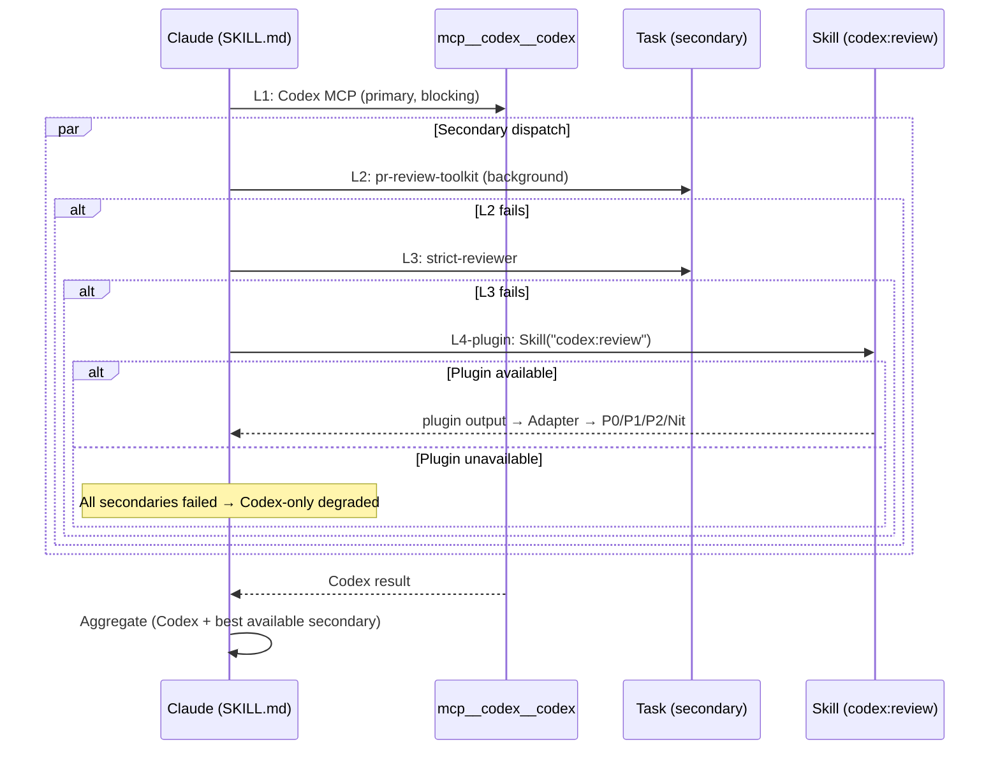

# Codex Plugin Fallback Integration — Technical Spec

## 1. Requirement Summary

- **Problem**: 當 Codex MCP server 不可用（API quota、網路問題、CLI 未安裝）時，現有 degradation cascade 只到 `pr-review-toolkit:code-reviewer` → `strict-reviewer` → `⚠️ Need Human`。缺少利用 OpenAI codex-plugin-cc 的中間層。
- **Goals**:
  1. 將 `openai/codex-plugin-cc` 整合為 degradation cascade L4
  2. 設計 output adapter 統一 plugin 輸出為 P0/P1/P2/Nit 格式
  3. 保持 backward compatible — 不影響現有 L1-L3 流程
- **Scope**:
  - IN: `codex-code-review` skill degradation matrix、output adapter、安裝指引
  - OUT: codex-plugin-cc 本身的 bug 修復、MCP server 實作、多模型 review MCP

## 2. Existing Code Analysis

### Related Modules

| File | Purpose | Impact |
|------|---------|--------|
| `skills/codex-code-review/SKILL.md` | Review workflow + dual dispatch | 新增 L4 fallback 路徑 |
| `skills/codex-code-review/references/review-common.md` | Degradation matrix + severity mapping | 新增 plugin source mapping |
| `scripts/emit-review-gate.sh` | Gate state management | 無變動 |
| `commands/codex-review-fast.md` | Fast variant command | 新增 `Skill` 到 `allowed-tools`（若 L4 走 Skill 路線） |
| `.claude/settings.json` | Hook matchers | 視環境而定：若 PostToolUse matcher 包含 `Skill`，則 plugin 呼叫會觸發 state update |

### Current Degradation Cascade（per SKILL.md:138-144）

```
L1: mcp__codex__codex (Codex MCP)          → primary, blocking
L2: pr-review-toolkit:code-reviewer (Task) → secondary, background
L3: strict-reviewer (Task)                 → if L2 fails/times out
L4: Codex-only (degraded)                  → if L2+L3 both unavailable, proceed with Codex results only
    Codex ❌ + all secondaries ❌ → ⛔ Blocked + ⚠️ Need Human
```

> **Note**: `codex-cli-review` 是獨立 skill（`/codex-cli-review`），不在 `codex-code-review` 的 cascade 內。本 spec 提議將 codex-plugin-cc 插入為 cascade 的新一層。

### Reusable Components

- `review-common.md § Severity Mapping` — 已有 toolkit→P0-Nit 轉換邏輯，可擴展
- `review-common.md § Deduplication Algorithm` — 可復用於 plugin 輸出
- `review-common.md § Source Attribution` — 新增 `plugin` source tag

## 3. Technical Solution

### 3.1 Architecture Design



### 3.2 Output Adapter

codex-plugin-cc `/codex:review` 輸出為自由文字（非結構化）。Adapter 需解析為標準格式。

**Parsing Strategy**:

```
Plugin 輸出 → regex 抽取 severity markers → normalize → deduplicate
```

| Plugin Pattern | Mapping | Confidence |
|---------------|---------|------------|
| `CRITICAL` / `BLOCKER` / `security vulnerability` | P0 | High |
| `BUG` / `ERROR` / `should fix` | P1 | High |
| `SUGGESTION` / `improvement` / `consider` | P2 | Medium |
| `STYLE` / `nit` / `minor` | Nit | Medium |
| Unrecognized (has file:line) | P2 (conservative) | Low |
| Unparseable (no file:line) | `unparsed` bucket → fall through to Codex-only degraded | — |

**File:line 抽取規則**:

```
Pattern: /([a-zA-Z0-9_./-]+\.(?:js|ts|py|sh|md)):(\d+)/
```

**Parse failure 路徑**: 若 plugin 輸出無法抽取任何 `file:line` findings → 視為 parse failure → fall through to Codex-only degraded (Priority 4) with `⚠️ Plugin output unparseable`。

**Adapter 輸出格式**（與現有一致）:

```
- [P0/P1/P2/Nit] file:line issue → fix [source: plugin]
```

### 3.3 Integration Point

在 `codex-code-review/SKILL.md` Step 3 Dual Review 的 fallback cascade 擴展：

**Proposed Cascade（新增 L4-plugin）**:

```markdown
| Priority | Reviewer | Tool Type | Condition |
|----------|----------|-----------|-----------|
| 1 | pr-review-toolkit:code-reviewer | Task | Default secondary |
| 2 | strict-reviewer | Task | Priority 1 fails/times out |
| 3 | codex-plugin-cc /codex:review | Skill | Priority 2 fails + plugin available |
| 4 | Codex-only (degraded) | — | All secondary unavailable |
```

> **Note**: Priority 3（plugin）加入後，原「Both ❌ → ⛔ Blocked」改為「All 3 secondaries ❌ → Codex-only degraded or ⛔ Blocked」。

**Plugin 偵測（runtime capability probing）**:

與現有 reviewer fallback 一致（SKILL.md:144），採用 execution-time probing 而非靜態偵測：

1. 嘗試 `Skill("codex:review", ...)` 呼叫，設 30s timeout
2. 若 Skill tool 回傳錯誤（plugin 未安裝）→ catch failure，fall through to Priority 4
3. 若 timeout → fall through to Priority 4

不使用 `claude plugins list`（無使用先例，且非所有環境可用）。

**`allowed-tools` 變更**：`codex-code-review/SKILL.md` 和 `commands/codex-review-fast.md` 等 frontmatter 需新增 `Skill` 到 allowed-tools 列表。此為 WBS Task 4 範圍。

### 3.4 Degradation Matrix 擴展

在 `review-common.md` 新增：

| Scenario | Behavior | Gate Source | Output |
|----------|----------|------------|--------|
| Codex ✅ + Secondary(any) ✅ | Union aggregation | `codex+secondary` | Standard dual findings |
| Codex ✅ + All secondary ❌ | Codex-only + degradation warning | `codex-only` | `⚠️ All secondaries unavailable` |
| Codex ❌ + Plugin ✅ | Plugin-only + degradation warning | `plugin-only` | `⚠️ Codex MCP unavailable, using plugin` |
| Codex ❌ + All ❌ | `⛔ Blocked` + `⚠️ Need Human` | `none` | All reviewers failed |

### 3.5 Constraints

| Constraint | Detail |
|-----------|--------|
| Plugin 成熟度 | v1.0.0，2026-03-30 發布，13 open issues |
| 無 session persistence | 每次 `/codex:review` 獨立，不支援 `--continue` |
| 無 sandbox 參數 | 繼承 Codex CLI config，非 per-call 控制 |
| Output 非結構化 | 需 adapter parsing（可能不穩定） |

## 4. Risks and Dependencies

| Risk | Impact | Probability | Mitigation |
|------|--------|-------------|------------|
| codex-plugin-cc 穩定性不足 | Fallback 本身 crash | High（v1.0.0） | Gate: 有 timeout + try/catch；觀望 1-2 週再啟用 |
| Plugin output 格式變動 | Adapter 解析失敗 | Medium | Conservative fallback（解析失敗 → fall through to Codex-only degraded (Priority 4)） |
| Plugin 未安裝 | L4 不可用 | Low（使用者未安裝） | 偵測 + graceful skip |
| Hook 仲裁回歸 | Plugin 的 stop hook 與 stop-guard.sh 的 hook 仲裁可能回歸 | Medium | 直接測試 hook 仲裁路徑（hooks/ 已有 arbitration 機制） |

**Dependencies**:

| Dependency | Status | Notes |
|-----------|--------|-------|
| `@openai/codex` CLI | Required | codex-plugin-cc 的底層 |
| ChatGPT subscription 或 OpenAI API key | Required | Authentication |
| Claude Code plugin system | Available | 現有基礎設施 |

## 5. Work Breakdown

| # | Task | Est. | Priority | Dependency |
|---|------|------|----------|------------|
| 1 | 安裝 codex-plugin-cc 並驗證基本功能 | — | P0 | Plugin 穩定 |
| 2 | 設計 output adapter（regex patterns + test） | — | P0 | Task 1 |
| 3 | 擴展 `review-common.md` degradation matrix | — | P0 | Task 2 |
| 4 | 更新 `codex-code-review/SKILL.md` Step 3 cascade | — | P0 | Task 3 |
| 5 | 寫 adapter unit tests | — | P1 | Task 2 |
| 6 | Review Gate 衝突測試（stop-guard.sh 互斥） | — | P1 | Task 1 |
| 7 | 文件化安裝指引 + 互斥設定 | — | P2 | Task 1 |

**Implementation Gate**: Task 1（安裝驗證）是 hard dependency。進入 Task 2 的條件：
- 本地安裝 codex-plugin-cc 後 `/codex:review` 連續 3 次 crash-free
- Adapter parser 對 3+ 種輸出格式成功率 >= 80%
- 非外部指標依賴（不用 open issues count）

## 6. Testing Strategy

| Type | Scope | Method |
|------|-------|--------|
| Unit | Output adapter parsing | `test/scripts/codex-plugin-adapter.test.js` — fixture-driven：提供 5+ 種 plugin 輸出格式（含 structured/unstructured/empty/error），斷言 P0-Nit 映射 + file:line 抽取 + unparsed bucket |
| Unit | Parse failure path | 同上 — 輸入無 file:line 的文字 → 斷言回傳 `{ parseable: false }` + degrade signal |
| Integration | L4 runtime probing | Mock `Skill` tool 回傳 error（模擬 plugin 未安裝）→ 斷言 fall through to Codex-only degraded (Priority 4) 且無 crash。注入方式：`SKILL_MOCK_RESULT=error` 環境變數或 test-only flag |
| Integration | L4 timeout | Mock `Skill` tool 超過 30s → 斷言 timeout + fall through to Codex-only degraded (Priority 4) |
| E2E | 完整 fallback cascade | codex-plugin-cc 安裝後，手動觸發 `/codex-review-fast` 於 Codex MCP 不可用場景（`ENV CODEX_MCP_DISABLED=1`） |

**Test Harness**:

| Injection Point | Mechanism | Coverage |
|----------------|-----------|----------|
| Adapter input | Fixture files in `test/fixtures/plugin-output/` | Parser correctness |
| Skill availability | `Skill` tool mock return code (error/timeout) | Fallback cascade |
| MCP availability | Environment flag `CODEX_MCP_DISABLED` | E2E cascade |

**Test Evidence**:

| AC | Evidence Type |
|----|--------------|
| Adapter 正確解析 plugin 輸出 | Automated test (fixture-driven) |
| Adapter parse failure → degrade | Automated test |
| L4 graceful skip（plugin 未安裝） | Automated test (mock injection) |
| L4 timeout → skip | Automated test |
| Hook 仲裁回歸 | Automated test (hook coexistence) |

## 7. Open Questions

| # | Question | Impact | Owner |
|---|----------|--------|-------|
| 1 | codex-plugin-cc 是否計畫暴露 MCP tool？ | 若是，可 drop-in 替換而非 adapter | 追蹤 GitHub issues |
| 2 | Review Gate hook 與 stop-guard.sh 能否共存？ | 決定是否需互斥配置 | 需實測 |
| 3 | Plugin output 格式是否會標準化？ | 影響 adapter 穩定性 | 追蹤 plugin changelog |
| 4 | `/codex:review` 是否支援 branch diff？ | 影響 branch variant 覆蓋 | 檢查 plugin 文件 |
