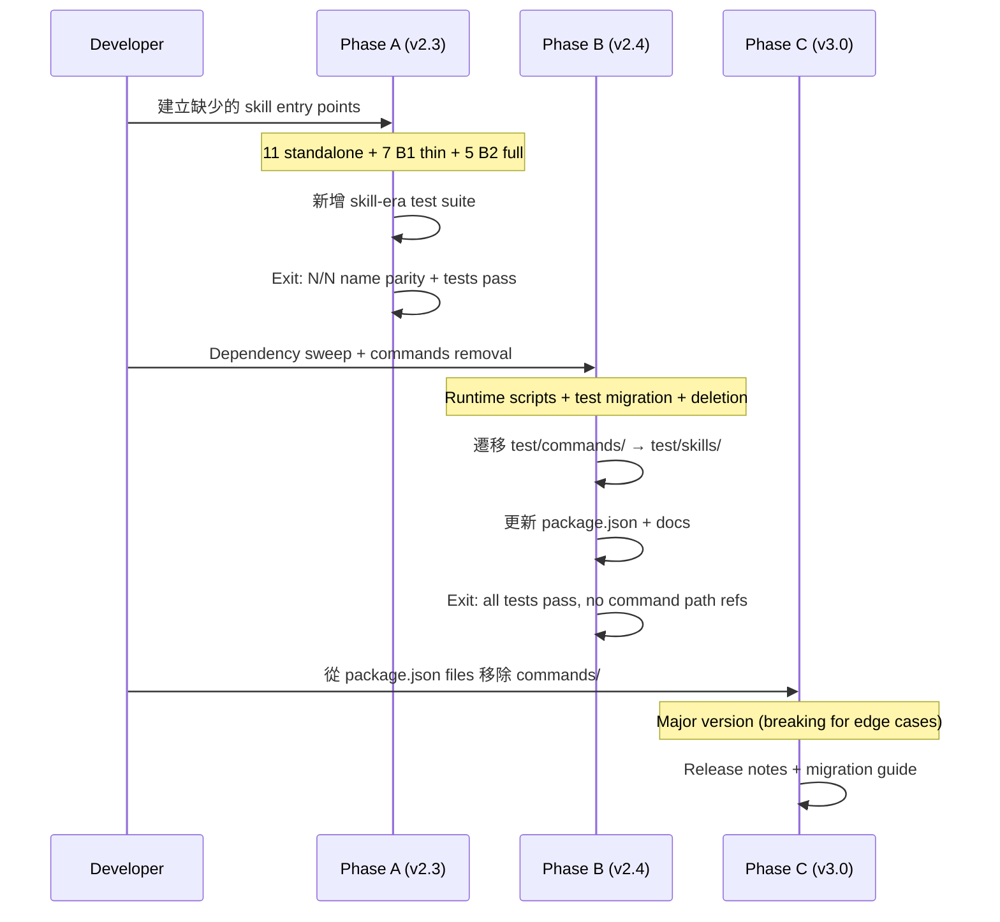

# Commands → Skills 遷移技術規格

## 1. 需求摘要

- **問題**: Claude Code 已正式棄用 `commands/` 架構，推薦使用 `skills/`。sd0x-dev-flow 目前維持雙軌（78 commands + 62 skills），部分 wrapper commands 的 `allowed-tools` 已與 skill 不一致（精確數量由 audit script 動態計算），維護成本遞增。
- **目標**: 在零使用者中斷的前提下，將所有 commands 遷移至 skills-only 架構，消除雙軌維護稅。
- **範圍**: 78 個 command 檔案、23 個缺少同名 skill 的 command、test infrastructure、package.json distribution、runtime script 依賴更新、文件更新。
- **來源**: `/best-practices` audit (2026-04-01)，含 Claude + Codex adversarial debate（threadId: `019d48ed-ea50-7623-a8f6-d52b3edaecbf`）

## 2. 現有程式碼分析

### 2.1 Inventory

| 分類 | 數量 | 說明 |
|------|------|------|
| Commands 總數 | 78 | `commands/*.md`（含新增的 debug, test-health） |
| Skills 總數 | 62 | `skills/*/SKILL.md`（含新增的 debug, test-health） |
| 有同名 skill 的 commands | 55 | 可直接刪除（skill-first resolution 自動接管） |
| 無同名 skill 的 commands | 23 | 需建立 skill entry point |

> **注意**: 數量會隨開發持續增長。Phase A 應建立 audit script 動態計算，而非依賴靜態數字。

### 2.2 23 個缺少同名 skill 的 Commands 分類

#### Category A: True Standalone（11 個）— 需建立新 SKILL.md

無 `@skills/` 引用，所有邏輯內嵌於 command 檔案中。

| Command | 行數 | 複雜度 | 備註 |
|---------|------|--------|------|
| `install-rules` | 593 | High | 最複雜，含 manifest-tracked smart merge |
| `install-hooks` | 256 | High | Hook 安裝 + conflict handling |
| `install-scripts` | 215 | Medium | Script 安裝 + auto-install |
| `verify` | 138 | Medium | Multi-ecosystem verification loop，使用 `intent:` |
| `project-brief` | 129 | Medium | PM/CTO executive summary |
| `precommit` | 125 | Medium | Pre-commit gate，使用 `intent:` |
| `precommit-fast` | 114 | Medium | 同上，skip build |
| `simplify` | 59 | Low | Agent dispatch wrapper |
| `doc-refactor` | 57 | Low | Agent dispatch wrapper |
| `zh-tw` | 40 | Low | 翻譯指令 |
| `pr-review` | 37 | Low | PR self-review checklist |

#### Category B: Multi-Command（12 個）— 需依行為複雜度分類

有 `@skills/` 引用但 skill 目錄名稱不同。依行為 parity 分為 B1 (thin alias) 和 B2 (has unique logic)。

| Command | 目標 Skill | 類型 | Parity | 備註 |
|---------|-----------|------|--------|------|
| `codex-review-fast` | `codex-code-review` | B1 thin | Full | 僅 variant 選擇 |
| `codex-review` | `codex-code-review` | B1 thin | Full | 僅 variant 選擇 |
| `codex-review-branch` | `codex-code-review` | B1 thin | Full | 僅 variant 選擇 |
| `codex-review-doc` | `doc-review` | B1 thin | Full | 1:1 rename |
| `codex-security` | `security-review` | B1 thin | Full | 僅 variant 選擇 |
| `codex-test-review` | `test-review` | B1 thin | Full | 僅 variant 選擇 |
| `codex-test-gen` | `test-review` | B1 thin | Full | 僅 variant 選擇 |
| `dep-audit` | `security-review` | **B2 unique** | Partial | 106L，有 `intent:` + ecosystem fallback + runner script |
| `check-coverage` | `test-review` | **B2 unique** | Partial | 153L，dispatches `coverage-analyst` agent + 5 steps |
| `update-docs` | `tech-spec` (ref only) | **B2 unique** | Partial | 151L，僅引用 reference file，5 steps + auto-trigger logic |
| `deep-analyze` | `tech-spec` | **B2 unique** | Partial | 146L，dispatches agent + 2 steps |
| `review-spec` | `tech-spec` | **B2 unique** | Partial | 147L，dispatches agent |

> **B2 commands 不可用 thin entry-point skill 處理**。需建立完整 skill 並遷移 command body 中的獨特邏輯（ecosystem fallback、agent dispatch、step workflow）。

### 2.3 需修改檔案 Summary

| 變更類型 | 檔案數 | 說明 |
|----------|--------|------|
| 新增 SKILL.md（Cat. A） | ~11 | Category A standalone skills |
| 新增 SKILL.md（Cat. B1 thin） | ~7 | Category B1 thin entry-point skills |
| 新增 SKILL.md（Cat. B2 full） | ~5 | Category B2 full skills with unique logic |
| 刪除 commands/*.md | 78 | Phase B |
| 新增 test/skills/*.test.js | ~3 | Skill-era test suite |
| 遷移 test/commands/*.test.js | 28 | Phase B 遷移或刪除（見下方 test migration plan） |
| 修改 runtime scripts | 3 | `scripts/lib/feature-resolver.js`, `skills/next-step/scripts/analyze.js`, `skills/skill-health-check/scripts/skill-lint.js` |
| 修改 package.json | 1 | test scripts + files array |
| 修改 CLAUDE.md | 2 | Root + .claude/ |
| 修改 rules/*.md | ~5 | 移除 command 引用 |

### 2.4 Frontmatter 相容性分析

| Frontmatter Key | Commands 使用 | Skills 使用 | Gap |
|----------------|--------------|-------------|-----|
| `description` | 78/78 | 62/62 (`description`) | None |
| `argument-hint` | 78/78 | 1/62 | Skills 支援但少用 |
| `allowed-tools` | 77/78 | 54/62 | None |
| `intent` | 4/78 | 0/62 | **Gap**: skills 不支援 |
| `name` | 0/78 | 62/62 | Skills 必填 |
| `agent` | 0/78 | 6/62 | Skills-only |
| `context` | 0/78 | 14/62 | Skills-only |
| `disable-model-invocation` | 2/78 | 3/62 | None |

**`intent:` gap 評估**: `intent:` 用於 4 個 runner commands（precommit, precommit-fast, verify, dep-audit），定義步驟順序與 skip/safety 語意。此為 advisory metadata（模型消費），非 Claude Code harness 解析。遷移時可轉換為 SKILL.md body 中的 structured workflow section，功能等價。

## 3. 技術方案

### 3.1 架構設計：三階段 Clean-Cut Migration



### 3.2 Phase A Detail: Skill Parity（v2.3）

#### 3.2.1 Category A: Standalone → New Skill

每個 standalone command 需轉換為完整 skill 結構：

```
skills/<name>/
├── SKILL.md          # Frontmatter + 主要邏輯（從 command 遷移）
└── references/       # 若有需要
    └── template.md
```

**遷移邏輯**:

```
1. 複製 command body → SKILL.md body
2. 轉換 frontmatter:
   - description → description（保留）
   - argument-hint → argument-hint（保留）
   - allowed-tools → allowed-tools（保留）
   - intent → 轉為 SKILL.md body 中的 ## Workflow section
   - 新增 name: <command-name>
3. 若 command 行數 > 100: 考慮拆分 references/
```

**`intent:` 轉換範例** (precommit):

```yaml
# Before (command frontmatter)
intent:
  goal: Run pre-commit quality checks
  steps:
    - name: lint-fix
      goal: Auto-fix code style issues
      preferred: ["lint:fix"]
      skip-if-missing: true
```

```markdown
# After (SKILL.md body)
## Workflow

| Step | Goal | Preferred | Skip if Missing | Safety |
|------|------|-----------|-----------------|--------|
| lint-fix | Auto-fix code style issues | `lint:fix` | Yes | read-write |
| build | Verify compilation | `build` | Yes | read-only |
| test-unit | Run test suite | `test:ci`, `test` | Yes | read-only |
```

#### 3.2.2 Category B1: Thin Alias → Entry-Point Skill

僅適用於 **B1 thin** commands（7 個，行為完全在 canonical skill 中）。

```
skills/<alias-name>/
└── SKILL.md    # 3-5 行 frontmatter + 引用 canonical skill
```

**範例** (`skills/codex-review-fast/SKILL.md`):

```markdown
---
name: codex-review-fast
description: "Quick second-opinion using Codex MCP (diff only, no tests). Supports review loop with context preservation."
allowed-tools: mcp__codex__codex, mcp__codex__codex-reply, Bash(git:*), Bash(bash:*), Read, Grep, Glob, Task
---

@skills/codex-code-review/SKILL.md
@skills/codex-code-review/references/codex-prompt-fast.md
@skills/codex-code-review/references/review-common.md
@skills/codex-code-review/references/codex-research-instructions.md

## Task

Quick code review using Codex MCP (diff only, no lint/build/test).
Variant: **fast** (see canonical skill for full workflow).
```

#### 3.2.3 Skill-Era Test Suite

新增三個測試檔案取代 `test/commands/schema.test.js` 的職責：

| 測試檔 | 職責 | 驗證項目 |
|--------|------|----------|
| `test/skills/schema.test.js` | Skill frontmatter schema 驗證 | `name` + `description` 必填、`allowed-tools` 格式正確 |
| `test/skills/alias-entrypoints.test.js` | Entry-point skill 對應驗證 | 每個 alias skill 引用的 canonical skill 存在且有效 |
| `test/skills/reference-coverage.test.js` | Reference 引用完整性 | `references/` 下的檔案都被 SKILL.md 引用 |

### 3.3 Phase B Detail: Commands Removal（v2.4）

#### 3.3.1 Dependency Sweep Checklist

刪除 `commands/` 前，必須完成以下 repo-wide dependency sweep：

| 依賴位置 | 檔案 | 引用類型 | 處理 |
|----------|------|----------|------|
| Runtime script | `scripts/lib/feature-resolver.js` | `commands/<name>.md` 路徑解析 | 改為 `skills/<name>/SKILL.md` |
| Runtime script | `skills/next-step/scripts/analyze.js` | `commands/` 目錄掃描 | 改為 `skills/` 目錄掃描 |
| Test | `test/scripts/feature-resolver.test.js` | command path assertions | 更新為 skill path |
| Test | `test/scripts/next-step-analyze.test.js` | command 引用 | 更新為 skill 引用 |
| Test | `test/commands/*.test.js` (28 files) | 見下方 test migration plan | 遷移或刪除 |
| Skill lint | `skills/skill-health-check/scripts/skill-lint.js` | `commands/` 交叉驗證 | 移除 command 交叉驗證邏輯 |
| Docs | `CLAUDE.md`, `.claude/CLAUDE.md`, `README.md` | Command 說明 | 更新為 skills-only |
| Rules | `rules/*.md` | command 引用 | 確認引用是 `/command-name` 格式（不受影響）而非路徑 |

#### 3.3.2 Test Migration Plan

`test/commands/` 現有 28 個測試檔案，分為三類處理：

| 類型 | 檔案 | 處理 |
|------|------|------|
| **Schema tests** | `schema.test.js`, `skills-schema.test.js` | 合併遷移至 `test/skills/schema.test.js`（新增 command-era 驗證項） |
| **Feature behavior tests** | `architecture.test.js`, `bug-fix.test.js`, `deep-explore.test.js` 等 24 個 | 遷移至 `test/skills/<name>.test.js`，更新 path references |
| **Plugin manifest test** | `plugin-manifest.test.js` | 保留，更新 `files` array assertion |
| **CLAUDE.md coverage test** | `claude-md-coverage.test.js` | 更新：從 command name coverage 改為 skill name coverage |

#### 3.3.3 Deletion Steps

```
1. 完成 dependency sweep checklist（所有引用已更新）
2. 遷移 test/commands/ → test/skills/（保留測試邏輯，更新路徑）
3. rm -rf commands/
4. rm -rf test/commands/（已遷移完畢）
5. 更新 package.json:
   - scripts["test:schema"]: "node --test test/skills/*.test.js"
   - scripts["test:fast"]: 移除 test/commands 引用
6. 更新文件:
   - CLAUDE.md, .claude/CLAUDE.md, README.md
7. 驗證: `npm test` 全部 pass + `grep -r "commands/" skills/ scripts/ test/ rules/ CLAUDE*.md README*` 無殘留路徑引用
```

### 3.4 Phase C Detail: Clean Distribution（v3.0）

```json
// package.json files array — before
"files": ["scripts/", "commands/", "skills/", "agents/", "hooks/", "rules/", "CLAUDE.md", "CLAUDE.template.md"]

// package.json files array — after
"files": ["scripts/", "skills/", "agents/", "hooks/", "rules/", "CLAUDE.md", "CLAUDE.template.md"]
```

## 4. 風險與依賴

| 風險 | 機率 | 影響 | 緩解策略 |
|------|------|------|----------|
| `intent:` 語意在轉換中遺失 | Low | Runner commands 行為不一致 | Parity test: 比較轉換前後的步驟順序 |
| 使用者本地已安裝舊 commands | Medium | `/install-*` 安裝的檔案仍在 `.claude/commands/` | Release notes 提供遷移指引；新版 `/install-*` skill 自動偵測並更新 |
| Anthropic 在 Phase B 前移除 commands 支援 | Low | Emergency migration | Phase A 可 1-2 sprint 完成，降低風險窗口 |
| Test infrastructure 空窗期 | Medium | 品質下降 | Phase A 中 skill-era tests 與 command tests 並行 |
| `allowed-tools` drift（audit script 動態計算，baseline ~5-10 個） | Existing | Dual-source-of-truth bug | Phase A audit script (A1) 精確計算後修正 |
| Hook scripts 仍解析 command-era sentinel | Low | Stop guard 行為異常 | Hook 已使用 sentinel string matching（與來源無關），確認不受影響 |

### 依賴

| 依賴 | 類型 | 狀態 |
|------|------|------|
| Claude Code skill-first resolution | Runtime | **已可用** — skills 優先於 commands |
| Claude Code 支援 SKILL.md `argument-hint` | Runtime | **已可用** — 1/62 skills 已使用 |
| npm publish pipeline | CI | **已可用** — 現有 `npm publish` 流程 |

## 5. 工作分解

### Phase A (v2.3) — 7 個任務

| # | 任務 | 類型 | 依賴 | 複雜度 |
|---|------|------|------|--------|
| A1 | Audit script: 自動比對 commands/ vs skills/ name coverage，輸出 `migration-inventory.json` | Script | - | Low |
| A2 | Category A: 建立 11 個 standalone skills（分批：Low 4個 → Medium 5個 → High 2個） | Skill creation | A1 | High |
| A3 | Category B1: 建立 7 個 thin entry-point skills | Skill creation | A1 | Low |
| A4 | Category B2: 建立 5 個 full skills（遷移 dep-audit/check-coverage/update-docs/deep-analyze/review-spec 的獨特邏輯） | Skill creation | A1 | High |
| A5 | Skill-era test suite（3 個測試檔 + 遷移 `test/commands/` 中可先遷移的 feature tests） | Test | A2-A4 | Medium |
| A6 | 修正已 drift 的 `allowed-tools`（數量由 A1 audit script 動態計算） | Fix | A1 | Low |
| A7 | Parity verification: N/N name coverage 確認（N = 動態計算） | QA | A2-A6 | Low |

### Phase B (v2.4) — 5 個任務

| # | 任務 | 類型 | 依賴 | 複雜度 |
|---|------|------|------|--------|
| B1 | Dependency sweep: 更新 runtime scripts (`feature-resolver.js`, `analyze.js`, `skill-lint.js`) | Fix | A7 pass | Medium |
| B2 | 遷移 `test/commands/` → `test/skills/`（28 files） | Test migration | A5 | Medium |
| B3 | 刪除 `commands/` 目錄 | Delete | B1, B2 | Low |
| B4 | 更新 `package.json` test scripts | Config | B2 | Low |
| B5 | 更新 CLAUDE.md、README、rules 文件 | Docs | B3 | Medium |

### Phase C (v3.0) — 3 個任務

| # | 任務 | 類型 | 依賴 | 複雜度 |
|---|------|------|------|--------|
| C1 | 從 `package.json files` 移除 `commands/` | Config | B4 | Low |
| C2 | Major version bump + CHANGELOG | Release | C1 | Low |
| C3 | Migration guide for downstream users | Docs | C1 | Medium |

## 6. 測試策略

### Phase A 測試

| 測試層 | 範圍 | 方法 |
|--------|------|------|
| Unit | 每個新 SKILL.md 的 frontmatter 合法性 | `test/skills/schema.test.js` |
| Unit | Alias skill 引用的 canonical skill 存在 | `test/skills/alias-entrypoints.test.js` |
| Unit | Reference 檔案被正確引用 | `test/skills/reference-coverage.test.js` |
| Integration | N/N name parity（N = audit script 動態計算） | Audit script output (`migration-inventory.json`) |
| Integration | `intent:` 轉換後步驟順序一致 | Manual review per runner skill |

### Phase B 測試

| 測試層 | 範圍 | 方法 |
|--------|------|------|
| Regression | 所有 skill-era tests pass | `npm test` |
| Regression | 無殘留 command 路徑引用 | `grep -r "commands/" skills/ scripts/ test/ rules/ CLAUDE*.md README*` (audited scope) |
| E2E | Plugin install + skill invocation | 在空專案中 `npm install sd0x-dev-flow` → 驗證 `/precommit` 等核心 skill 可用 |

### Acceptance Criteria

| # | AC | 驗證方式 |
|---|-----|----------|
| AC1 | N/N command 名稱都有對應 skill entry point（N = audit script 動態計算） | Audit script (`migration-inventory.json`) |
| AC2 | `intent:` 語意在 SKILL.md 中保留 | Runner skills 人工 review |
| AC3 | Skill-era test suite 涵蓋 schema + alias + reference | `npm run test:schema` pass |
| AC4 | Phase B 後無殘留 command 路徑引用（audited scope: `skills/`, `scripts/`, `rules/`, `test/`, `CLAUDE*.md`, `README*`） | Grep verification |
| AC5 | npm publish 後 downstream user 功能不中斷 | E2E test in clean project |

## 7. Open Questions

| # | 問題 | 影響 | 建議 |
|---|------|------|------|
| Q1 | Claude Code 是否計劃支援 skill alias 機制（避免 7 個 B1 thin entry-point 目錄）？ | B1 category 實作方式 | 追蹤 anthropics/claude-code issues；目前先建 entry-point skills |
| Q2 | `intent:` frontmatter 是否有未知的 harness-level 消費者？ | Runner skill 行為 | 在 Phase A 中 parity test 驗證 |
| Q3 | 已安裝到使用者本地 `.claude/commands/` 的檔案如何處理？ | 使用者體驗 | 新版 `/install-*` skill 增加 `--migrate` flag，自動偵測舊 command 檔案並提示更新 |
| Q4 | Phase B 是否需要 deprecation warning 過渡期（v2.3 → v2.4 之間）？ | 使用者預期管理 | 建議 v2.3 release notes 預告 v2.4 將移除 commands/ |
