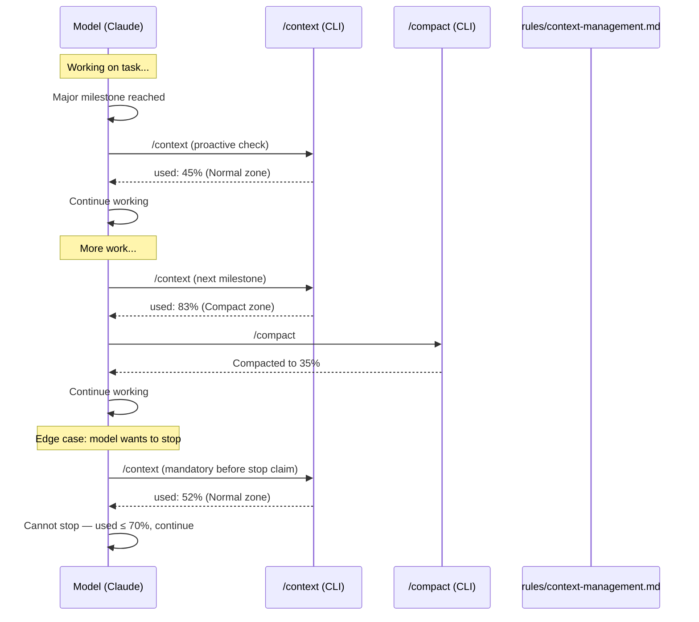

# Context Management Rule — Technical Spec

## 1. Requirement Summary

- **Problem**: 模型在 Claude Code session 中經常未經測量就聲稱「context 太長」而停止工作，實際上 context window 可能只用了 30-40%。目前 `auto-loop.md:12` 只禁止用 context 當藉口跳過 review，但沒有正面指導模型何時該 compact、何時該繼續。
- **Goals**:
  1. 建立 data-driven context awareness — 模型必須用 `/context` 測量再決策
  2. 定義三級 threshold 對應行動（continue / compact / new session）
  3. 定義 compact 時必須保留的資訊項目
  4. 與 auto-loop 規則互補，不衝突
- **Scope**:
  - 新建 `rules/context-management.md` 規則檔
  - 更新 `auto-loop.md:12` 加入 cross-reference
  - 更新 CLAUDE.md Rules section 加入引用
- **Non-goals**:
  - 不修改 Claude Code CLI 行為（`/context`, `/compact` 是 built-in）
  - 不實作程式化 hook（context 管理是 behavior-layer rule）
  - 不修改 statusline 或 auto-compact threshold
- **Evidence**: `/best-practices` audit（threadId: `019cfb5c-14eb-7500-9fd1-5cfb6ced6a29`，Chroma/Anthropic/HumanLayer 研究 + Claude-Codex adversarial debate，Round 2 Nash Equilibrium）

## 2. Existing Code Analysis

### Related Modules

| File | Purpose | Impact |
|------|---------|--------|
| `rules/auto-loop.md:12` | Context/token excuse prohibition | Add cross-reference to new rule |
| `CLAUDE.md` | Project rules list | Add `@rules/context-management.md` reference |
| `.claude/CLAUDE.md` | Installed rules list | Add reference |
| `rules/` directory | All behavioral rules | New file `context-management.md` |

### Reusable Components

- `auto-loop.md` precedence pattern — new rule follows same structure（Core Principle → Prohibited → Correct Behavior）
- CLAUDE.md `## Rules` section — append one line
- `/best-practices` audit equilibrium — threshold design evidence

### Current State

| Aspect | Status |
|--------|--------|
| Context measurement | CLI built-in `/context` exists, but no rule instructs model to use it |
| Compaction | CLI built-in `/compact` exists, auto-compact at ~80% usage |
| Session scoping | No guidance |
| Premature stop prevention | Only `auto-loop.md:12` prohibition (negative), no positive guidance |

## 3. Technical Solution

### 3.1 Architecture Design



### 3.2 Three-Tier Policy

| Zone | Condition | Action | Rationale |
|------|-----------|--------|-----------|
| **Normal** | used < 80% | Continue. `/context` at milestones | Anthropic: <5% degradation across full Claude 4 window |
| **Compact** | 80% ≤ used < 92% | `/compact` at next major boundary before starting new large subtask | Chroma: degradation accelerates past 80% of practical limit |
| **Critical** | used ≥ 92% | Complete pending auto-loop obligations (review/precommit) first. Then `/compact`. If still ≥ 92% → propose new session with handoff | Auto-compact fires at ~80% but summary quality is better when proactive |

### 3.3 Global Invariants

| # | Invariant | Enforcement |
|---|-----------|-------------|
| 1 | **Evidence requirement**: Must run `/context` before claiming context limitation | Behavior-layer (rule text) |
| 2 | **Recovery attempt**: Must `/compact` and retry once before proposing new session | Behavior-layer |
| 3 | **Anti-false-exhaustion**: used ≤ 70% → context cannot be cited as stop reason | Behavior-layer |
| 4 | **Auto-loop precedence**: Context state cannot justify skipping review/precommit | Cross-reference to `auto-loop.md:12` |

### 3.4 Milestone Context Check

「Major milestone」的定義（觸發 `/context` 檢查的時機）：

| Milestone | Example |
|-----------|---------|
| Precommit pass | `/precommit-fast` ✅ All Pass |
| Review complete | `/codex-review-doc` ✅ Mergeable |
| Task group done | Smart-commit 完成一個 commit group |
| `/compact` 後 | 確認 compact 效果 |
| 使用者要求 | 使用者說「繼續」或問「context 還夠嗎」 |

### 3.5 Compact Preservation Contract

When running `/compact`, the summary MUST preserve:

| Item | Example | Why |
|------|---------|-----|
| Pending task list | "Task 6, 7 remaining" | 避免 compact 後遺忘進度 |
| Architectural decisions | "Chose 3-tier over 4-tier" | 避免決策翻轉 |
| Active review threadIds | `019cfb04-b6dd-...` | 用於 `--continue` re-review |
| Uncommitted file list | `commands/install-rules.md` modified | 避免遺漏 staged changes |
| Current plan file path | `.claude/plans/xxx.md` | 長任務需參考 plan |
| No secrets | Never include tokens/passwords/keys | Per @rules/security.md |

**Cooldown**: Skip `/context` milestone check if checked within the last 2 tool calls.

### 3.6 Rule File Content

Target: `rules/context-management.md`

```markdown
# Context Management Rule

**Measure → decide → act. Never guess.**

## Prohibited Behaviors

❌ Claiming "context too long" or "running low on context" without first running `/context` (if `/context` is unavailable or errors, proceed with work — unavailability is not evidence of exhaustion)
❌ Stopping or deferring work when context used ≤ 70%
❌ Using context state to skip auto-loop obligations (review/precommit)
❌ Proposing new session without first attempting `/compact` + retry

## Three-Tier Policy

| Zone | Condition | Action |
|------|-----------|--------|
| Normal | used < 80% | Continue. Run `/context` at major milestones |
| Compact | 80% ≤ used < 92% | `/compact` at next major boundary, then continue |
| Critical | used ≥ 92% | Complete pending auto-loop obligations first → `/compact` → if still ≥ 92% → propose new session with handoff |

## Milestone Check

At major milestones (precommit pass, review complete, task group done), run `/context`.
This is diagnostic — do not stop or change behavior based solely on a check.
**Cooldown**: Skip if `/context` was checked within the last 2 tool calls (avoid overhead in dense review loops).

## Compact Preservation

When compacting, ensure summary preserves:
- Pending task list and current progress
- Architectural decisions from this session
- Active review threadIds (for --continue)
- Uncommitted file list
- Current plan file path (if any)
- Never include secrets, tokens, or passwords in compact summary (per @rules/security.md)

## Auto-Loop Precedence

Context management cannot override auto-loop:
- Even at Critical zone, must attempt review/precommit before stopping
- See @rules/auto-loop.md for full obligations
```

### 3.7 Cross-Reference Updates

**`rules/auto-loop.md:12`** — update the context/token excuse line to add cross-reference:

Current:

```
❌ **Context/token excuse**: Citing context window limits, long session, or token budget as reason to skip or defer review. If context is genuinely exhausted, the model must still attempt the review — failure to invoke is a violation regardless of reason
```

Updated:

```
❌ **Context/token excuse**: Citing context window limits, long session, or token budget as reason to skip or defer review. If context is genuinely exhausted, the model must still attempt the review — failure to invoke is a violation regardless of reason. See @rules/context-management.md for measurement-based context policy.
```

**`CLAUDE.md` + `.claude/CLAUDE.md` `## Rules` section** — add line:

```
- @rules/context-management.md -- Data-driven context monitoring (measure before deciding)
```

## 4. Risks and Dependencies

| Risk | Probability | Impact | Mitigation |
|------|------------|--------|------------|
| `/context` command unavailable in some environments | Low | Medium | Rule text includes explicit exception: "if `/context` unavailable or errors, proceed with work" (§3.6 Prohibited line 1) |
| Over-compaction drops critical details | Medium | Medium | Compact Preservation Contract defines must-keep items |
| Threshold too permissive (80%) for smaller models | Low | Low | Rule applies to Claude Code only; smaller models have different thresholds |
| Model ignores rule and stops anyway | Medium | Low | `stop-guard.sh` + auto-loop hooks provide independent enforcement for review |

### Dependencies

| Dependency | Status | Risk |
|-----------|--------|------|
| `/context` CLI built-in | Exists | None |
| `/compact` CLI built-in | Exists | None |
| `auto-loop.md` rule | Implemented | None — add cross-reference only |

## 5. Work Breakdown

| # | Task | Files | Effort | Depends On |
|---|------|-------|--------|-----------|
| 1 | Create `rules/context-management.md` | `rules/context-management.md` (new) | **S** | — |
| 2 | Add cross-reference in `auto-loop.md:12` | `rules/auto-loop.md` | **S** | 1 |
| 3 | Add to CLAUDE.md + .claude/CLAUDE.md Rules section | `CLAUDE.md`, `.claude/CLAUDE.md` | **S** | 1 |
| 4 | Update install-rules Phase 2 enumeration + Phase 4.6 backfill block | `commands/install-rules.md` (Phase 2 table + Phase 4.6 fallback `## Rules` block) | **S** | 1 |
| 5 | Update CLAUDE.template.md rules list | `CLAUDE.template.md` | **S** | 1 |
| 6 | Add test for rule file structure + CLAUDE.md reference | `test/commands/context-management-rule.test.js` (new) | **S** | 1, 3 |

**Total**: 6S

## 6. Testing Strategy

| Type | Scope | File |
|------|-------|------|
| Unit | Rule file exists at `rules/context-management.md` | `test/commands/context-management-rule.test.js` (new) |
| Unit | Rule contains required sections: `## Prohibited`, `## Three-Tier Policy`, `## Compact Preservation` | Same |
| Unit | `CLAUDE.md` contains `@rules/context-management.md` reference | Same |
| Unit | `commands/install-rules.md` Phase 2 table includes `context-management.md` | Same |
| Unit | `commands/install-rules.md` Phase 4.6 fallback block includes `context-management.md` | Same |
| Manual | Trigger premature stop scenario → verify model checks `/context` first | Manual session test |

## 7. Open Questions

| # | Question | Decision Owner | Notes |
|---|---------|---------------|-------|
| 1 | 是否需要 hook-level enforcement（like stop-guard for context）？ | Plugin maintainer | v1 用 behavior-layer；若違規頻繁，v2 考慮 hook |
| 2 | 是否需要 auto-loop-project.md 中加入 context-management 可覆寫 section？ | UX decision | 建議 v2 擴展 |
