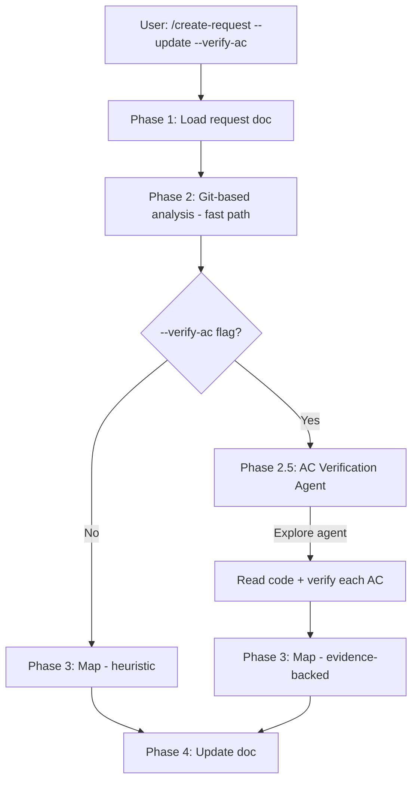

# /create-request AC Verification Enhancement Technical Spec

## 1. Requirement Summary

### Problem

`/create-request --update` 使用 git log 偵測進度（commit 有無 = AC 完成與否），false positive rate ~20-30%。當 `--update-all` 批次將 10+ requests 標為 Completed，stub implementations 或 partial logic 會被錯誤標記為完成，造成 request doc 的 data integrity 問題。

### Goals

| Goal | Metric |
|------|--------|
| G1 | 新增 `--verify-ac` opt-in closure-grade AC verification |
| G2 | 新增 `Candidate Complete` 中間狀態，防止 heuristic-only 假完成 |
| G3 | 複用現有 AC parsing infra（codex-code-review 的 SPEC_CHECKLIST） |
| G4 | 保持 default path <10 sec（不影響 auto-trigger） |

### Scope

| In Scope | Out of Scope |
|----------|-------------|
| `--verify-ac` flag + single Explore agent | Multi-wave deep-explore integration |
| `Candidate Complete` status + scan mode support | Full AC parser centralization（追蹤為 P2） |
| Timeout + `Inconclusive` fallback | Automatic closure (human-in-the-loop preserved) |

## 2. Existing Code Analysis

### Related Modules

| File | Role | Changes Needed |
|------|------|---------------|
| `skills/create-request/SKILL.md` | Skill definition | Add `--verify-ac` to arguments, Phase 3 agent dispatch, Candidate Complete status |
| `commands/create-request.md` | Command mirror | Add `--verify-ac` argument |
| `skills/codex-code-review/SKILL.md` | AC injection source | Reference for AC parsing pattern (no change) |
| `skills/codex-code-review/references/review-common.md` | AC Coverage output schema | Reference for output format (no change) |
| `scripts/lib/feature-resolver.js` | Feature context | No change (reuse) |

### Reusable Components

| Component | Source | Reuse Type |
|-----------|--------|-----------|
| Feature context resolution | `scripts/lib/feature-resolver.js` | Direct (detect feature + request doc) |
| AC parsing | `skills/codex-code-review/SKILL.md` Step 1.5 | Pattern (extract AC from request doc, filter quality-gates) |
| AC Coverage output | `skills/codex-code-review/references/review-common.md` § AC Coverage Format | Direct (reuse output schema) |
| Explore agent dispatch | Agent tool with `subagent_type: "Explore"` | Direct |

## 3. Technical Solution

### 3.1 Architecture



### 3.2 `--verify-ac` Flow

**Trigger**: `--verify-ac` flag on single-request `--update` only（`--update-all` 不支援）

**Phase 2.5: AC Verification Agent**

```
Agent({
  description: "Verify AC completion for <feature>",
  subagent_type: "Explore",
  prompt: `You are an AC verification specialist.

## Request Doc
Path: ${REQUEST_PATH}

## Acceptance Criteria (${AC_COUNT} items)
${AC_LIST}

## Related Files
${RELATED_FILES}

## Task
For each AC, verify whether it is fully implemented by reading the actual code.

## 80/20 Contract
- 80% effort: verify each AC (read code, check logic, trace imports)
- 20% peripheral: note quality concerns (stubs, missing error handling)

## Output Format
For each AC:
- AC#: [Complete | Partial | Not Found | Inconclusive]
- Evidence: file:line references
- Confidence: High | Medium | Low
- Gap (if Partial): what's missing`
})
```

**Timeout**: 60 sec hard limit. Timeout → all unverified ACs marked `Inconclusive`.

**Graceful degradation**: Agent dispatch fails → warn user, fall back to git-based heuristic.

### 3.3 Candidate Complete Status

新增 lifecycle 狀態：

```
Pending → In Progress → Candidate Complete → Completed
```

| Condition | Status |
|-----------|--------|
| All AC checked by git heuristic only（`--update-all` 或未用 `--verify-ac`） | `Candidate Complete` |
| All AC checked by `--verify-ac` with High confidence | `Completed` |
| All AC checked by `--verify-ac` with any Medium/Low | `Candidate Complete` + verification summary |
| Some AC unchecked | `In Progress` |

### 3.4 Scan Mode Integration

`--status` scan mode（Phase 3 Filter）需支援新狀態：

| Status | Classification | Include in Report |
|--------|---------------|-------------------|
| Candidate Complete | Active (needs verification) | Yes — group after In Progress |

Stale detection: `Candidate Complete` 超過 7 天 → 標記 `[needs-verify]`。

### 3.5 Phase 3 Map Updates

AC checkbox 更新策略：

| Source | Auto-check? | Condition |
|--------|-------------|-----------|
| Git heuristic | ⚠️ Tentative（加 `<!-- heuristic -->` comment） | Default path |
| Agent verification (High) | ✅ Firm | `--verify-ac` + confidence High |
| Agent verification (Medium/Low) | ❌ No auto-check | Log in Progress.Note |

## 4. Risks and Dependencies

| Risk | Impact | Mitigation |
|------|--------|-----------|
| Candidate Complete breaks existing consumers | Medium | Audit: `--status` scan grouping, `/next-step` suggestions, `--update-all` classification logic |
| Agent verifier scope too narrow | Low | Agent prompt includes import/caller expansion guidance |
| Timeout flakiness | Low | 60 sec hard limit + `Inconclusive` fallback |
| AC parser drift across skills | Medium | P2 follow-up: centralize AC parser as shared module |

| Dependency | Type | Status |
|-----------|------|--------|
| `scripts/lib/feature-resolver.js` | Code | Exists |
| Agent tool (Explore subagent) | Runtime | Available |
| AC parsing pattern (Step 1.5) | Pattern | Exists in codex-code-review |

## 5. Work Breakdown

| Task | Est. | Depends On | Files |
|------|------|-----------|-------|
| A: Add `--verify-ac` to SKILL.md + command mirror | 0.5d | — | `skills/create-request/SKILL.md`, `commands/create-request.md` |
| B: Implement Phase 2.5 agent dispatch spec | 0.5d | A | `skills/create-request/SKILL.md` |
| C: Add Candidate Complete status to lifecycle | 0.5d | — | `skills/create-request/SKILL.md` |
| D: Update scan mode to support new status | 0.5d | C | `skills/create-request/SKILL.md` |
| E: Tests | 0.5d | A+B+C | `test/commands/create-request.test.js` |

**Total**: ~2.5 person-days

## 6. Testing Strategy

| Test | Type | File |
|------|------|------|
| SKILL.md has `--verify-ac` argument | Unit | `test/commands/create-request.test.js` |
| Candidate Complete in lifecycle table | Unit | Same |
| Scan mode groups Candidate Complete correctly | Unit | Same |
| Phase 2.5 agent prompt has AC list + Related Files | Content | Same |
| Timeout + Inconclusive fallback documented | Content | Same |

## 7. Open Questions

- [ ] Should `Candidate Complete` be a separate status string or a flag on `Completed`（e.g., `Completed (unverified)`）?
- [ ] Should `--verify-ac` work on `--update` without explicit path（auto-detect from feature context）?
- [ ] AC parser centralization timeline — P2 or defer to separate request?

> **Source**: [Best Practices Audit](../../../) | Debate threadId: `019d2d1c-ec19-7743-aa5c-72d5259303ad`
