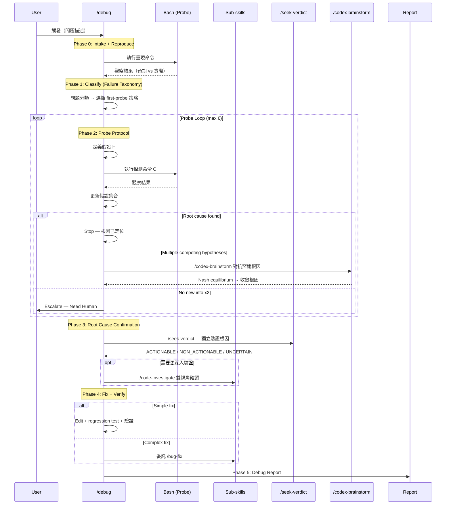
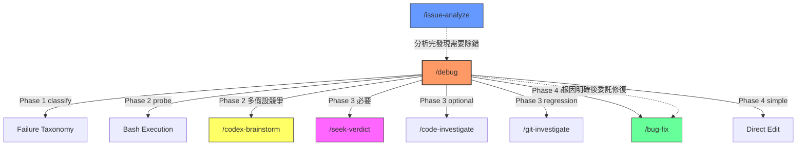

# Debug Skill — Technical Spec

## 1. Requirement Summary

- **Problem**: sd0x-dev-flow 有分析工具（`/issue-analyze`）和修復工具（`/bug-fix`），但缺少系統化的**互動式除錯**能力。實際除錯場景（如 `ks-status.sh` 的 `api/v1` → `apps/v1` 案例）需要「執行 → 觀察 → 假設 → 探測 → 定位根因」的迴圈，現有 skill 無法完整覆蓋。
- **Goals**:
  1. 提供系統化除錯工作流：Reproduce → Classify → Probe → Root Cause → Fix → Verify
  2. 編碼 Probe Protocol — 假設驅動的互動式探測迴圈
  3. 支援不同問題類型的探測策略路由（Failure Taxonomy）
  4. 維護探測歷程記錄（Probe Journal）
  5. 與現有 skill 生態系整合（可調度 `/code-explore`、`/code-investigate`、`/bug-fix`）
- **Scope**:
  - 本地腳本 bug、API 錯誤、配置問題、靜默失敗的互動式除錯
  - Probe Loop（max 6 rounds）+ 結構化終止判據
  - 簡單修復直接 Edit；複雜修復委託 `/bug-fix`
- **Non-goals**:
  - 不取代 `/issue-analyze`（GitHub Issue/PR thread 分析仍用 issue-analyze）
  - 不取代 `/bug-fix`（已知根因的修復仍用 bug-fix）
  - 不處理分散式系統的跨服務 tracing（需專用 observability 工具）
  - 不建立 debug session 持久化（v1 不跨 conversation 保留狀態）
- **Design origin**: Best practices audit（Agans 9 Rules + Zeller Scientific Debugging + Google SRE Troubleshooting）+ Claude/Codex adversarial debate（threadId: `019d48c7-417b-7062-9341-f75c5f80130b`）

## 2. Existing Code Analysis

### Related Modules

| File | Relevance | Gap |
|------|-----------|-----|
| `skills/issue-analyze/SKILL.md` | 分類 + 調度調查策略 | 不含互動式探測迴圈 |
| `skills/bug-fix/SKILL.md` | 修復 + regression test + review gate | 假設根因已知，跳過探測 |
| `skills/code-explore/SKILL.md` | 靜態碼讀取調查 | 不含 runtime 執行探測 |
| `skills/code-investigate/SKILL.md` | Claude + Codex 雙視角調查 | 不含假設驅動探測 |
| `skills/git-investigate/SKILL.md` | Git history 追蹤 | 僅處理 regression 類型 |
| `skills/seek-verdict/SKILL.md` | 獨立第二視角驗證 | Phase 3 根因驗證的核心工具 |
| `skills/codex-brainstorm/SKILL.md` | 對抗辯論 | Phase 2 多假設競爭時收斂根因 |
| `skills/feature-dev/SKILL.md` | Orchestrating skill 參考模式 | 設計模式可複用 |
| `rules/auto-loop.md` | Review loop 規則 | `/debug` fix 階段需整合 |

### Reusable Components

| Component | Reuse Point |
|-----------|-------------|
| `feature-dev` 的 orchestrating pattern | Phase 結構、gate 設計 |
| `issue-analyze` 的 classification decision tree | Phase 1 問題分類可參考延伸 |
| `code-investigate` 的 dual-view pattern | Phase 3 可選的雙重驗證 |
| `bug-fix` 的 fix + test + review workflow | Phase 4 複雜修復委託路徑 |

### MECE Boundary

| 情境 | 使用 `/debug` | 使用其他 |
|------|:---:|------|
| 「程式有 bug，但我不知道在哪」 | **Yes** | — |
| 「程式出錯了，幫我查」 | **Yes** | — |
| 「這個 GitHub Issue 需要分析」 | — | `/issue-analyze` |
| 「我知道 bug 在哪，幫我修」 | — | `/bug-fix` |
| 「這段 code 怎麼運作的？」 | — | `/code-explore` |
| 「部署後功能異常」 | **Yes** | 或 `/feature-verify`（唯讀驗證） |
| 「需要雙重確認這段邏輯」 | — | `/code-investigate` |

## 3. Technical Solution

### 3.1 Architecture Design



### 3.2 Skill File Structure

```
skills/debug/
├── SKILL.md                     # 核心 skill 定義
└── references/
    ├── failure-taxonomy.md      # 問題分類 + first-probe 路由表
    ├── probe-protocol.md        # Probe Loop 規則 + 終止判據
    └── report-template.md       # Debug Report 模板

commands/
  debug.md                       # Command 定義

test/commands/
  debug.test.js                  # 測試
```

### 3.3 Workflow Phases

#### Phase 0: Intake + Reproduce

| Step | Action | Output |
|------|--------|--------|
| 0a | 解析問題描述（症狀、範圍、環境） | 結構化問題描述 |
| 0b | 嘗試重現（執行命令/腳本） | 預期 vs 實際結果 |
| 0c | 重現成功？ | Yes → Phase 1 / No → `⚠️ Need Human` |

**重現合約（Repro Contract）**：根因聲稱必須基於可重現的觀察，不可基於靜態推測。

#### Phase 1: Classify (Failure Taxonomy)

根據觀察到的失敗模式分類，選擇最有效的 first-probe 策略：

| 問題類型 | 辨識信號 | First Probe | Escalation |
|----------|---------|-------------|------------|
| Script Bug | 腳本執行失敗、非預期輸出 | `bash -x` trace / 直接執行 | `/code-explore` |
| API Error | HTTP 錯誤碼、回應格式異常 | `curl` 直接探測端點 | `/code-investigate` |
| Config Issue | 環境差異、路徑/變數錯誤 | 列印有效配置 + env diff | `/git-investigate` |
| Silent Failure | 表面正常但結果錯誤 | 追蹤 catch/fallback/default 路徑 | 強制 error surfacing |
| Race Condition | 間歇性失敗、時序相關 | 多次執行 + 時間戳記錄 | `/code-investigate` |
| Dependency Issue | 版本/相容性問題 | 檢查 lock file + changelog | `npm audit` / dep tree |

**分類決策樹**：

```
觀察到的失敗
    │
    ├─ 有 error message / stack trace?
    │   ├─ Yes + 明確 → Script Bug 或 API Error
    │   └─ Yes + 模糊 → Silent Failure（錯誤被吞掉）
    │
    ├─ 表面正常但結果錯誤?
    │   └─ Silent Failure
    │
    ├─ 時有時無?
    │   └─ Race Condition
    │
    ├─ 環境相關（其他環境正常）?
    │   └─ Config Issue
    │
    └─ 升級後才出現?
        └─ Dependency Issue 或 Regression → `/git-investigate`
```

#### Phase 2: Probe Loop (Core Innovation)

每個 probe 是一個假設測試：

```
┌─ 1. 定義假設 H（「API 路徑應為 apps/v1 而非 api/v1」）
│  2. 設計探測命令 C（「curl ... /apps/v1/...」）
│  3. 預測「若 H 成立 → 期望 O」（「應回傳 200 + 完整 JSON」）
│  4. 執行 C → 觀察實際結果
│  5. 比對預期 vs 實際 → 更新假設集合
└─ 6. 選下一個最具鑑別力的探測
```

**Probe Journal 格式**（每輪記錄）：

```markdown
### Probe R<N>
- **Hypothesis**: <假設內容>
- **Command**: `<探測命令>`
- **Expected**: <預期結果>
- **Actual**: <實際結果>
- **Conclusion**: <假設成立/駁斥/需進一步探測>
```

**終止判據**：

| 條件 | 動作 |
|------|------|
| 根因已定位 + ≥1 個執行結果佐證 | **Stop** — 進入 Phase 3 |
| 多個競爭假設、無法透過 probe 區分 | **Brainstorm** — 調度 `/codex-brainstorm` 對抗辯論，收斂至最可能根因 |
| 連續 2 輪無新資訊（stagnation） | **Escalate** — `⚠️ Need Human` |
| 達到 max rounds (6) | **Escalate** — `⚠️ Need Human`，輸出已知資訊 |

**`/codex-brainstorm` 整合**：當 probe loop 產生 ≥2 個同等可信的根因假設時，不再盲目探測，而是調度 `/codex-brainstorm` 讓 Claude 和 Codex 對各假設進行對抗辯論，透過 Nash equilibrium 收斂至最可能的根因。辯論結果作為 Phase 3 的輸入。

**Max rounds** 可在 SKILL.md 的 `## Config` section 覆寫（`debug.max_probe_rounds`），與 auto-loop 的 `max_rounds` 為獨立配置，避免 cross-loop coupling。

#### Phase 3: Root Cause Confirmation

| Step | Action | Required |
|------|--------|----------|
| 3a | 總結根因（What + Why + Impact + Evidence） | ✅ 必要 |
| 3b | `/seek-verdict` — Codex 獨立驗證根因是否成立 | ✅ 必要 |
| 3c | 可選：調度 `/code-investigate` 進行雙視角深入驗證 | 可選 |
| 3d | 若根因涉及 regression → 調度 `/git-investigate` 追蹤引入點 | 條件觸發 |

**`/seek-verdict` 整合（Step 3b — 必要）**：

根因定位後，**必須**調度 `/seek-verdict --intent confirm` 取得 Codex 獨立驗證：

| Step | Action | Required |
|------|--------|----------|
| 3b-1 | `/seek-verdict --intent confirm` — 驗證根因是否真實存在 | ✅ 必要 |
| 3b-2 | `/seek-verdict --intent clarify` — 釐清影響範圍（可選，僅在需要時） | 可選 |

**Anti-anchoring 合約**（遵循 `@skills/seek-verdict/SKILL.md` 3-phase protocol）：
- **Fresh thread**：必須使用新的 `mcp__codex__codex` 呼叫，不可重用現有 thread
- **No Claude conclusions**：Codex prompt 中不可包含 Claude 的 probe 結論或根因判斷
- **Finding packet only**：僅提供 finding 的客觀描述（症狀、相關檔案、觀察到的行為），讓 Codex 獨立判斷

**結果路由**：

| `/seek-verdict` 結果 | 動作 |
|---------------------|------|
| ACTIONABLE（confirm） | 進入 Phase 4 修復 |
| NON_ACTIONABLE（高信心） | 根因可能是 false positive — 重新進入 Phase 2 或 `⚠️ Need Human` |
| UNCERTAIN | 進入 Phase 4（保守處理），報告中標記信心不足 |

**設計理由**：Debug 的根因判斷完全由 Claude 的 probe loop 產出，存在 confirmation bias 風險。`/seek-verdict` 作為獨立第二視角，避免「自己出題自己答」的盲點。

**Root Cause Statement 格式**：

```markdown
## Root Cause
- **What**: <具體缺陷描述>
- **Why**: <根本原因（非表面原因）>
- **Impact**: <影響範圍>
- **Evidence**: <佐證的 probe 結果>
```

#### Phase 4: Fix + Verify

**路由決策**：

| 條件 | 路徑 |
|------|------|
| 簡單修復（≤3 行改動） | 直接 Edit + 執行驗證 + regression test |
| 複雜修復（多檔案、跨模組） | 委託 `/bug-fix` workflow |
| 需要架構層級變更 | `⛔ Need Human` — 報告根因 + 建議，不自行修復 |

**所有修復路徑均須符合 `@rules/testing.md` 的 evidence model** — 無論修復規模，code 變更必須有對應層級的 regression test。

簡單修復路徑：
1. Edit 修復
2. 撰寫 regression test（依 `@rules/testing.md` bug type → test level mapping）
3. 重新執行 Phase 0 的重現命令（verify fix）
4. 若有 auto-loop 義務（code file 變更）→ 進入 review loop

#### Phase 5: Debug Report

整合所有 phase 的產出。預設僅在 conversation 中輸出；若指定 `--export`，額外寫入檔案（遵循 Probe Safety Rules 的 redaction 規則）。

```markdown
## Debug Report: <問題標題>

### Classification
- **Type**: <問題分類>
- **Severity**: <嚴重度>

### Probe Journal
<Phase 2 的所有 probe 記錄>

### Root Cause
<Phase 3 的 root cause statement>

### Fix
- **Change**: <修改內容>
- **Verification**: <驗證結果>

### Prevention
- <如何避免同類問題>
```

### 3.4 Integration with Existing Skills



**調度規則**：

| 從 | 到 | 條件 | Phase |
|----|-----|------|-------|
| `/issue-analyze` | `/debug` | 分析結果顯示需要互動式探測 | — |
| `/debug` | `/codex-brainstorm` | Probe 產生多個競爭根因假設 | Phase 2 |
| `/debug` | `/seek-verdict` | 根因定位後獨立驗證 | Phase 3 (**必要**) |
| `/debug` | `/code-explore` | Probe 需要靜態碼理解 | Phase 2 |
| `/debug` | `/code-investigate` | 根因需要雙視角深入驗證 | Phase 3 |
| `/debug` | `/git-investigate` | 偵測到 regression | Phase 3 |
| `/debug` | `/bug-fix` | 根因已定位 + 修復複雜 | Phase 4 |

### 3.5 Allowed Tools

```yaml
allowed-tools: Read, Grep, Glob, Edit, Write, Bash, Skill, mcp__codex__codex, mcp__codex__codex-reply
```

| Tool | 用途 |
|------|------|
| `Bash` | 執行探測命令 |
| `Skill` | 調度子 skill（`/codex-brainstorm`、`/bug-fix` 等） |
| `Edit`/`Write` | 簡單修復 |
| `mcp__codex__codex` | `/seek-verdict` Phase 3 獨立驗證（需 fresh thread） |
| `mcp__codex__codex-reply` | `/seek-verdict` rebuttal round |

### 3.6 Command Definition (`commands/debug.md`)

**Required frontmatter fields**（參照 `commands/feature-dev.md` 慣例）：

```yaml
---
allowed-tools: Read, Grep, Glob, Edit, Write, Bash, Skill, mcp__codex__codex, mcp__codex__codex-reply
description: "Interactive debugging workflow with hypothesis-driven probe loop"
---
```

> **Note**: `allowed-tools` 在 SKILL.md 和 command .md 中保持一致。`mcp__codex__codex` 用於 `/seek-verdict` Phase 3 獨立驗證。

**Trigger keywords**: debug, 除錯, troubleshoot, diagnose, 查問題, 找 bug, 為什麼不動, 為什麼不 work

**Arguments**: 問題描述（自然語言）或腳本/命令路徑

**Options**:

| Flag | Description | Default |
|------|-------------|---------|
| `--export [path]` | 完成後匯出完整 Debug Report 至檔案 | 不匯出（僅 conversation 內輸出） |

`--export` 預設路徑：`docs/features/<feature>/debug-report-<YYYY-MM-DD>.md`（若無 feature context 則 `.debug-report-<YYYY-MM-DD>.md`）

**Skill reference**: `@skills/debug/SKILL.md`

## 4. Risks and Dependencies

| Risk | Impact | Mitigation |
|------|--------|------------|
| Probe 迴圈消耗過多 token | 高 | Max 6 rounds + stagnation gate |
| 探測命令可能有副作用 | 高 | Probe Safety Rules（見下方）；生產環境探測需用戶許可 |
| 與 `/issue-analyze` 邊界混淆 | 中 | MECE 邊界表 + trigger keyword 區分 |
| 簡單修復後未觸發 auto-loop | 中 | Phase 4 明確整合 auto-loop 義務 |
| Silent failure 類型難以偵測 | 中 | Failure taxonomy 提供專門的探測策略 |
| v1 不保留跨 conversation debug session | 低 | 未來可透過 memory 或狀態檔案擴展 |

### Probe Safety Rules

| Rule | Description |
|------|-------------|
| Read-first default | v1 預設探測命令為唯讀（`cat`, `curl -s`, `grep`, `ls`, `git log`） |
| Write-probe gate | 任何可能修改狀態的探測（`bash -x script.sh`）須標記為 `[WRITE_PROBE]`，在非 sandbox 環境需用戶確認 |
| Timeout | 每個探測命令 timeout ≤ 30 秒（`--max-time 30`） |
| Output budget | 單次探測輸出 ≤ 500 行（超出 truncate） |
| Redaction | Probe Journal 禁止記錄：API keys, tokens, passwords, 完整 credentials（遵循 `@rules/security.md`）。Command 輸出若包含敏感資料，以 `[REDACTED]` 取代 |
| Deny list | 禁止探測命令：`rm`, `drop`, `delete`, `truncate`, 任何 destructive 操作 |

### Dependencies

| Dependency | Type | Status |
|------------|------|--------|
| `skills/bug-fix/` | 調度目標 | 已存在 |
| `skills/code-investigate/` | 調度目標 | 已存在 |
| `skills/code-explore/` | 調度目標 | 已存在 |
| `skills/git-investigate/` | 調度目標 | 已存在 |
| `skills/seek-verdict/` | Phase 3 根因驗證 | 已存在（**必要**） |
| `skills/codex-brainstorm/` | Phase 2 多假設辯論 | 已存在 |
| `rules/auto-loop.md` | 規則整合 | Phase 4 需遵守 |

## 5. Work Breakdown

| # | Task | Output | Estimated Complexity |
|---|------|--------|---------------------|
| 1 | 建立 `skills/debug/SKILL.md` | 核心 skill 定義 | Medium |
| 2 | 撰寫 `references/failure-taxonomy.md` | 問題分類路由表 | Low |
| 3 | 撰寫 `references/probe-protocol.md` | Probe Loop 規則 | Medium |
| 4 | 撰寫 `references/report-template.md` | Debug Report 模板 | Low |
| 5 | 建立 `commands/debug.md` | Command 定義 | Low |
| 6 | 撰寫 `test/commands/debug.test.js` | 測試 | Medium |
| 7 | 更新 CLAUDE.md + CLAUDE.template.md 命令表 | 新增 `/debug` 行 | Low |

## 6. Testing Strategy

### Test Mapping

| Source | Test |
|--------|------|
| `commands/debug.md` | `test/commands/debug.test.js` |
| `skills/debug/SKILL.md` | `test/commands/debug.test.js` (frontmatter schema) |
| CLAUDE.md command table | `test/commands/claude-md-coverage.test.js` (existing, auto-covers) |

### Test Cases

| Category | Test Case | Level |
|----------|-----------|-------|
| Schema | `commands/debug.md` frontmatter 結構正確 | Unit |
| Schema | `skills/debug/SKILL.md` frontmatter 結構正確 | Unit |
| Trigger | `/debug` keyword 正確觸發 | Unit |
| Trigger | 不與 `/bug-fix`、`/issue-analyze` 衝突 | Unit |
| Phase 0 | 問題描述解析 | Unit |
| Phase 1 | 各問題類型正確分類 | Unit |
| Phase 2 | Probe journal 格式正確 | Unit |
| Phase 2 | Max rounds 終止 | Unit |
| Phase 2 | Stagnation 終止 | Unit |
| Phase 3 | `/seek-verdict --intent confirm` 必要呼叫 | Unit |
| Phase 3 | NON_ACTIONABLE 回傳時正確回退 Phase 2 或 Need Human | Unit |
| Phase 2 | 多假設競爭時觸發 `/codex-brainstorm` | Unit |
| Phase 4 | 修復路由正確（含 regression test 義務） | Unit |
| Coverage | CLAUDE.md + CLAUDE.template.md 命令表包含 `/debug` | Unit |
| Integration | 完整 debug flow（mock bash 執行） | Integration |

## 7. Open Questions

| # | Question | Impact | Owner | Status |
|---|----------|--------|-------|--------|
| 1 | ~~Probe 安全性~~ | — | — | **Resolved** — v1 採用 Probe Safety Rules（read-first default + write-probe gate） |
| 2 | ~~是否需要 Codex 在 Phase 3 獨立驗證根因？~~ | — | — | **Resolved** — v1 採用 `/seek-verdict --intent confirm` 作為 Phase 3 必要步驟 |
| 3 | `/issue-analyze` → `/debug` 委託方式 | UX | — | **Resolved** — v1 為手動觸發（用戶決定），`/issue-analyze` 報告中建議但不自動委託 |
| 4 | ~~Probe Journal 持久化~~ | — | — | **Resolved** — v1 預設不寫檔；支援 `--export` 匯出完整 Debug Report |
