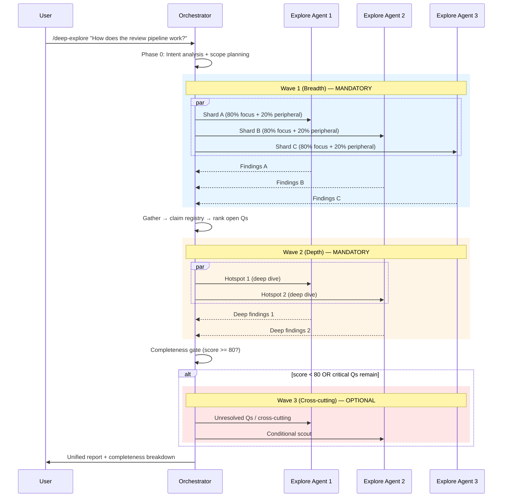

# Deep Explore — Multi-Wave Code Exploration Orchestrator

## 1. Requirement Summary

- **Problem**: `/code-explore` 是單 agent 單輪探索，無法覆蓋大型 codebase 的多個面向。使用者需要快速了解跨多個 domain 的複雜系統時，單 agent 不夠用。
- **Goals**:
  1. 新建 `/deep-explore` skill — multi-wave, multi-agent orchestrator
  2. 每波 2-3 個 Explore agents 並行，每波聚焦不同面向
  3. Adaptive wave strategy: 至少 2 waves（mandatory），最多 3 waves（optional Wave 3）
  4. Completeness score 決定何時停止（2-signal: novelty + critical open Qs）
  5. 80/20 contract: 每 agent 80% 主任務 + 20% peripheral discovery
  6. Claim-registry-based synthesis with conflict resolution
- **Scope**: v1 — SKILL.md + command + reference files + tests
- **Source**: 2 rounds `/best-practices` audit + `/codex-brainstorm` Nash Equilibrium (threadIds: `019d0095-6b65-7f31-90cf-d323f8a93ea4`, `019d009d-c64e-7542-b222-5d9ec3f80aaa`)

## 2. Existing Code Analysis

### Related Modules

| Module | 關聯 | Reuse |
|--------|------|-------|
| `skills/code-explore/SKILL.md` | 單 agent 探索（base pattern） | Phase 結構 reference |
| `skills/code-investigate/SKILL.md` | 雙視角 (Claude+Codex) | Anti-anchoring pattern |
| `skills/codex-code-review/SKILL.md` | Dual review parallel dispatch | Fan-out/Gather pattern |
| `skills/codex-code-review/references/review-common.md` | Dedup + severity merge | Claim registry synthesis |
| `skills/pre-pr-audit/SKILL.md` | Weighted scoring model | Checklist-mode completeness |
| `skills/feature-verify/SKILL.md` | L0-L5 confidence levels | Confidence cap pattern |

### Reusable Patterns

| Pattern | Source | How |
|---------|--------|-----|
| Fan-out/Gather | `codex-code-review/SKILL.md` Step 3 | Parallel Agent dispatch + background |
| Dedup by key | `review-common.md` § Deduplication | `canonical_claim + file_neighborhood` |
| Degradation matrix | `review-common.md` § Degradation Matrix | Agent failure handling |
| Anti-anchoring | `code-investigate/SKILL.md` Core Principle | Inter-wave context must not pass conclusions as truth |

## 3. Technical Solution

### 3.1 Architecture Overview



### 3.2 Wave Strategy

| Wave | Purpose | Agents | Trigger | Output |
|------|---------|--------|---------|--------|
| 1 (Breadth) | 全局掃描，識別 hotspots | 2-3 | Always (mandatory) | Hotspot candidates + open Qs |
| 2 (Depth) | 深入 top hotspots | 2-3 | Always (mandatory) | Resolved hypotheses + unknowns |
| 3 (Cross-cutting) | 跨域關聯 + proactive discovery | 2-3 | Only if `score < 80` OR critical Qs remain | Cross-cutting findings + final gaps |

### 3.3 Agent Contract (80/20)

每個 agent 遵循：

| Allocation | Scope | Output Limit |
|-----------|-------|-------------|
| 80% | Primary assigned shard/hotspot | Unlimited findings |
| 20% | Peripheral vision (security, edge cases, cross-cutting) | Max 2 peripheral findings per wave |

Peripheral findings 必須有 evidence (file:line) 且標記 tag: `cross-cutting | security | reliability | operability`。

### 3.4 Completeness Score

**Default mode (open-ended)**:

```
score = round(100 × (0.7 × (1 - novelty_rate) + 0.3 × is_zero(critical_open)))

Where:
  novelty_rate = unique_new_findings / max(1, total_valid_findings) (per wave)
  # Zero findings → novelty_rate = 0 → score = 70 (below threshold → continue)
  critical_open = count(questions where impact=high AND uncertainty=high)
  is_zero(x) = 1 if x == 0, else 0
```

**Stop conditions** (after Wave 2 or 3):

| Condition | Action |
|-----------|--------|
| `score >= 80` AND `critical_open == 0` | Stop, output report |
| `score >= 80` AND `critical_open > 0` | Wave 3 (if not yet run) |
| Wave 3 done AND `score < 80` | Stop with `Inconclusive` + next actions |

**Hard-fail overrides** (force continue regardless of score):
- Unanswered critical user question
- High-severity contradiction unresolved
- Evidence missing for high-impact claim

**Precedence** (when `--waves` conflicts with hard-fail):

| User `--waves` | Hard-fail active | Behavior |
|----------------|-----------------|----------|
| `--waves 2` | No | Stop after Wave 2 |
| `--waves 2` | Yes | Stop after Wave 2 with `Inconclusive` + "hard-fail conditions remain, consider `--waves 3`" |
| `--waves 3` | No | Adaptive (stop early if score met) |
| `--waves 3` | Yes | Force Wave 3 |

User `--waves` is the **hard ceiling** — never exceed it. Hard-fail conditions cannot override user's explicit wave limit, but emit `Inconclusive` with explanation.

### 3.5 Inter-Wave Context Packet

| Pass | Don't Pass |
|------|-----------|
| Evidence-backed facts (file:line) | Prior wave conclusions as truth |
| Open Qs ranked by impact × uncertainty | Narrative interpretations |
| Do-not-repeat ledger (explored files, executed queries) | Full raw findings dump |
| Contradiction list | Agent opinions |

### 3.6 Claim Registry (Synthesis)

| Step | Action |
|------|--------|
| 1. Normalize | Each finding → `{claim, evidence(file:line), shard, wave, confidence}` |
| 2. Dedup | Key = `canonical_file_path + canonical_claim_text` (aligned with review-common.md dedup algorithm, ±5 line tolerance) |
| 3. Consensus | Same claim from 2+ shards → mark `[consensus]` |
| 4. Conflict | Contradicting claims → evidence weight resolution |
| 5. Divergence | Unresolvable → explicit divergence section |

### 3.7 Routing Guard

| Condition | Action |
|-----------|--------|
| Estimated relevant files <= 25 | Redirect to `/code-explore` |
| User specifies `--quick` | Redirect to `/code-explore` |
| User specifies `--agents 1` | Single-agent mode (still multi-wave) |

### 3.8 Arguments

| Argument | Description | Default |
|----------|-------------|---------|
| `<query>` | Research topic/question | Required |
| `--agents N` | Agents per wave (1-3) | 3 |
| `--waves N` | Max waves (2-3) | 3 (adaptive) |
| `--areas "a, b, c"` | Manual shard specification | Auto-detect |
| `--quick` | Redirect to `/code-explore` | Off |

## 4. Risks and Dependencies

| Risk | Impact | Mitigation |
|------|--------|-----------|
| Agent output variance | Inconsistent finding format | Strict prompt template with required output sections |
| Scope overlap | Duplicate work across agents | Ownership matrix + do-not-repeat ledger |
| Token cost (max 9 agents) | ~$3-5 per invocation | Default 3 agents, routing guard for small tasks |
| Synthesis hallucination | Merged claims without evidence | Evidence-based merge (file:line refs required) |
| Agent failure/timeout | Incomplete wave | Degradation: exclude shard, mark coverage gap, cap confidence |
| False completion | Low novelty = poor search, not done | Hard-fail overrides for critical open Qs |

### Agent Dispatch Contract

```typescript
// Primary dispatch: Agent tool with subagent_type=Explore
Agent({
  description: "Wave 1 Shard A: hooks and state tracking",
  subagent_type: "Explore",
  run_in_background: true,  // non-blocking for parallel
  prompt: `<agent-prompt template with 80/20 contract>`
});
```

**Fallback** (if Explore dispatch fails):
1. Retry once with `subagent_type: "general-purpose"` (broader tool set)
2. If still fails → degrade to single-agent mode (orchestrator does inline exploration)
3. Mark coverage gap in report

**Evidence redaction**: Synthesis packets must follow `@rules/logging.md` — no secrets, tokens, passwords. Evidence refs use file:line only, no source code content in report.

| Dependency | Status |
|-----------|--------|
| Claude Code Agent tool (subagent_type=Explore) | ✅ Available (built-in) |
| Agent run_in_background | ✅ Available |

## 5. Work Breakdown

| # | Task | Size | Files |
|---|------|------|-------|
| 1 | Create `skills/deep-explore/SKILL.md` | L | New — orchestrator workflow + wave strategy + completeness model |
| 2 | Create `skills/deep-explore/references/agent-prompt.md` | M | New — per-agent prompt template (80/20 contract) |
| 3 | Create `skills/deep-explore/references/synthesis.md` | S | New — claim registry + report template |
| 4 | Create `commands/deep-explore.md` | M | New — command wrapper with arguments |
| 5 | Update `CLAUDE.md` + `.claude/CLAUDE.md` | S | Add `/deep-explore` to Command Quick Reference |
| 6 | Update `CLAUDE.template.md` | S | Add entry |
| 7 | Create tests `test/commands/deep-explore.test.js` | M | Content assertions |
| 8 | Verify | S | `/codex-review-doc` + `/precommit-fast` |

## 6. Testing Strategy

| Test | Assertion |
|------|-----------|
| SKILL.md has multi-wave workflow | `match(/Wave 1.*Wave 2/)` |
| SKILL.md has completeness score | `match(/completeness.*score/i)` |
| SKILL.md has 80/20 contract | `match(/80.*20.*peripheral/i)` |
| SKILL.md has routing guard | `match(/code-explore.*redirect/i)` |
| SKILL.md has claim registry | `match(/claim.*registry/i)` |
| command has --agents and --waves | `match(/--agents/)` + `match(/--waves/)` |
| CLAUDE.md has /deep-explore | `match(/deep-explore/)` |
| SKILL.md under 500 lines | `lineCount < 500` |
| agent-prompt.md exists | `existsSync(path)` |
| synthesis.md exists | `existsSync(path)` |

## 7. Open Questions

- **Checklist mode scoring**: When user provides explicit AC/goal checklist, switch to weighted multi-dimension scoring (deferred to v2)

### Resolved: Custom Agent Profile (Pilot Gate)

**Decision**: v1 uses built-in `Explore` subagent. Custom `agents/deep-explorer.md` deferred pending pilot evaluation.

**Pilot gate** (from `/best-practices` audit + `/codex-brainstorm` Nash Equilibrium, threadId: `019d00bf-2fd0-7912-be05-fb6c4fadc846`):

| Step | Criteria |
|------|---------|
| 1. Pilot | Run `/deep-explore` 5 times with built-in Explore |
| 2. Measure | Per-agent output schema compliance rate |
| 3. Decision | `>=90%` compliance → keep built-in; `80-89%` → tighten prompt, rerun 3; `<80%` or critical violation >5% → create custom agent |

**Critical violations** (any triggers promotion):
- Missing `file:line` evidence on primary findings
- Non-parseable output schema (missing required sections)
- Peripheral findings violating max-2/tag constraints

**If promoted**: `agents/deep-explorer.md` with `model: sonnet` (breadth-first exploration doesn't need opus). Prompts remain in `skills/deep-explore/references/` to avoid drift.
