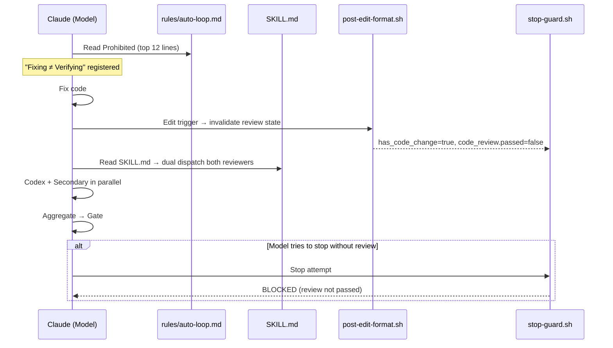

# Dual Reviewer Loop Enforcement — Technical Spec

## 1. Requirement Summary

- **Problem**: 兩個使用者反饋的行為問題：
  1. **Dual review 有時不觸發** — Dual Review Mode 規則在 `auto-loop.md` 中段（line 26-36），被 primacy/recency bias 忽略（212 行檔案，注意力集中在頭尾）
  2. **修完後跳過 re-review** — 模型修完 issue 後聲稱「已修復」就停下，不跑 re-review 驗證
  3. **Secondary 只跑首輪不合理** — 使用者明確要求：parallel dispatch 不多花時間，每次 loop iteration 都應雙 dispatch
- **Goals**:
  1. 新增「Fixing ≠ Verifying」anti-pattern 到 Prohibited Behaviors
  2. 新增「Skipping dual dispatch」anti-pattern
  3. 修改 loop policy：secondary 每輪都跑（v1 無 skip exception）
  4. 優化 auto-loop.md 結構：hot-path budget（關鍵語句在 top 12 lines）
  5. 同步更新 SKILL.md + review-common.md
- **Scope**:
  - v1: Rule text + skill doc 更新（behavior-layer enforcement）
  - v2 (future): Hook state 增強（cycle-aware `verification_required` field）
- **Non-goals**:
  - 不拆分 `auto-loop.md` 為多個 rule files（blast radius 太大，剛完成 customize v2）
  - 不修改 hook matcher 追蹤 `Task` dispatch（v2 scope）
  - 不修改 `stop-guard.sh` logic（現有 invalidation 機制已足夠 v1）
- **Evidence**: `/best-practices` audit（threadId: `019cfbb4-35de-7811-8afa-ec4cdc21aeb7`，Claude-Codex adversarial debate，Round 2 Nash Equilibrium）

## 2. Existing Code Analysis

### Related Modules

| File | Purpose | Impact |
|------|---------|--------|
| `rules/auto-loop.md:5-12` | Prohibited Behaviors | **Modify** — add 2 new anti-patterns |
| `rules/auto-loop.md:26-36` | Dual Review Mode table | **Modify** — change loop policy |
| `rules/auto-loop.md:80-88` | Correct Behavior example | **Modify** — add dual dispatch example |
| `skills/codex-code-review/SKILL.md:112-116` | Case B: Loop review | **Modify** — dual dispatch in loops |
| `skills/codex-code-review/references/review-common.md:172-179` | Review Loop (Dual Mode) | **Modify** — update loop table |
| `skills/codex-code-review/SKILL.md:180-187` | Dual Mode Loop Behavior section | **Modify** — update secondary loop text |
| `commands/codex-review-fast.md` | Command spec | Reference only |
| `hooks/post-edit-format.sh:204-208` | Edit invalidation | No change needed (already invalidates) |
| `hooks/stop-guard.sh:95-124` | Stop enforcement | No change needed (v1) |
| `docs/features/dual-reviewer/3-auto-loop-integration.md` | Old loop policy doc | Mark section as superseded |

### Current State

| Aspect | Current | Target |
|--------|---------|--------|
| Prohibited Behaviors | 6 items (no Fixing≠Verifying) | 8 items (+2) |
| Dual Review loop | Secondary first-pass only | Secondary every iteration |
| Correct Behavior example | Single-reviewer | Include dual dispatch |
| SKILL.md Case B | Codex-only `--continue` | Dual dispatch `--continue` |
| review-common.md loop table | Secondary first-only | Secondary every cycle |

## 3. Technical Solution

### 3.1 Architecture

No architectural change — this is a behavior-layer rule update. The enforcement chain remains:



### 3.2 Rule Text Changes

#### 3.2.1 Prohibited Behaviors — Add 2 items

**Location**: `rules/auto-loop.md:5-12`

Insert within top 12 lines by condensing existing items. Move the 2 least-violated existing prohibitions (`Declaring ≠ Executing`, `Summary ≠ Completion`) below the new items so the **most critical 6 items** are in lines 5-12:

```markdown
❌ **Fixing ≠ Verifying**: Claiming "issue fixed" or "already addressed" without running re-review is a violation. Every fix must be verified by invoking the review command — self-assessment does not count.
❌ **Skipping dual dispatch**: Code review commands must launch both Codex + secondary reviewer in parallel on every iteration (first pass AND loop re-reviews). Secondary is always dispatched in v1 (no skip exception — hook state cannot verify skip conditions yet).
```

#### 3.2.2 Dual Review Mode Table — Update loop policy

**Location**: `rules/auto-loop.md:26-36`

Change the "Loop re-review" row:

| Before | After |
|--------|-------|
| `--continue` loops use Codex stateful re-review only; do not restart secondary | `--continue` loops re-dispatch both reviewers (Codex `--continue` + secondary fresh). Secondary is always dispatched in v1 (no skip exception — hook state cannot verify skip conditions yet). |

Full updated table:

```markdown
| Rule | Description |
|------|-------------|
| First-pass dual | Code review command must dual-dispatch on first pass (Codex + secondary background) |
| Non-blocking secondary | Secondary reviewer runs in background and does not block initial gate emission |
| Late P0/P1 | Within same review session, late secondary P0/P1 re-opens fix→re-review loop |
| Loop re-review | `--continue` loops re-dispatch both reviewers (Codex `--continue` + secondary fresh). Secondary is always dispatched in v1 (no skip exception — hook state cannot verify skip conditions yet). |
| Pre-precommit checkpoint | Before `/precommit-fast`, reconcile any pending secondary result; if late P0/P1, re-enter review loop |
| Cycle reset | Any code edit resets the review cycle — both reviewers must re-run regardless of prior pass status |
```

#### 3.2.3 Correct Behavior — Add dual example

**Location**: `rules/auto-loop.md:80-88`

Add after existing example:

````markdown
## Correct Behavior (Dual Review)

```
"Fixed 3 issues. Running dual review..."
[Codex --continue + Secondary fresh — parallel dispatch]
"Codex: ✅ Ready. Secondary: ✅ Ready. Running /precommit-fast..."
[Execute]
"All passed ✅"
```
````

### 3.3 SKILL.md Changes

#### 3.3.1 Case B: Loop review

**Location**: `skills/codex-code-review/SKILL.md:112-116`

Replace:

```markdown
**Case B: Loop review (has `--continue`)**

- **Codex**: Use `mcp__codex__codex-reply` with re-review template from `references/review-common.md`
- **Secondary**: Not used in loop — Codex-only `--continue` review (secondary runs once per review session, not per loop iteration)
```

With:

```markdown
**Case B: Loop review (has `--continue`)**

- **Codex**: Use `mcp__codex__codex-reply` with re-review template
- **Secondary**: Re-dispatch in parallel (same mechanism as first pass, fresh context). Always dispatched in v1 — no skip exception.

**Cycle reset**: Any code edit (detected by `post-edit-format.sh`) invalidates both reviewer pass states. Both must re-run.
```

#### 3.3.2 Loop Behavior Table in review-common.md

**Location**: `skills/codex-code-review/references/review-common.md:172-179`

Replace:

```markdown
| Reviewer | Loop Behavior |
|----------|---------------|
| Codex MCP | Stateful → `mcp__codex__codex-reply(threadId)` continues context |
| Secondary | First review only — not restarted in `--continue` loop iterations |

In loop iterations, gate comes from Codex-only review. Aggregation gate only applies to first-pass dual review.
```

With:

```markdown
| Reviewer | Loop Behavior |
|----------|---------------|
| Codex MCP | Stateful → `mcp__codex__codex-reply(threadId)` continues context |
| Secondary | Re-dispatched every iteration (fresh context). Always dispatched in v1. |

Codex gate is authoritative for blocking/timing. Secondary is non-blocking (background). Aggregation gate reconciles both at pre-precommit checkpoint. If secondary finds P0/P1, re-enter fix→re-review loop.
```

## 4. Risks and Dependencies

| Risk | Probability | Impact | Mitigation |
|------|------------|--------|------------|
| Secondary adds latency to every loop iteration | Low | Low | Non-blocking (background); Codex gate is authoritative for timing |
| Secondary token cost increases (~2x per loop) | Medium | Low | Token cost < bug risk; user explicitly requested this tradeoff |
| Rule text growing longer (from 211 → ~220 lines) | Medium | Low | New items in Prohibited section (top of file) get highest attention weight |
| Behavioral compliance still probabilistic | Medium | Medium | Hook enforcement (post-edit invalidation + stop-guard) provides deterministic backup |

### Dependencies

| Dependency | Status | Risk |
|-----------|--------|------|
| `post-edit-format.sh` review invalidation | Already implemented | None |
| `stop-guard.sh` dual mode enforcement | Already implemented | None |
| `scripts/emit-review-gate.sh` aggregate gate | Already implemented | None |
| `Task` tool for secondary dispatch | Available | None |

## 5. Work Breakdown

| # | Task | Files | Effort | Depends On |
|---|------|-------|--------|-----------|
| 1 | Add 2 Prohibited items to `auto-loop.md` | `rules/auto-loop.md:12` | **S** | — |
| 2 | Update Dual Review Mode table + add Cycle reset row | `rules/auto-loop.md:26-36` | **S** | — |
| 3 | Add Correct Behavior dual example | `rules/auto-loop.md:80-88` | **S** | — |
| 4 | Update SKILL.md Case B | `skills/codex-code-review/SKILL.md:112-116` | **S** | — |
| 5 | Update review-common.md loop table | `skills/codex-code-review/references/review-common.md:172-179` | **S** | — |
| 5b | Update SKILL.md Dual Mode Loop Behavior section | `skills/codex-code-review/SKILL.md:180-187` | **S** | — |
| 6 | Sync `.claude/rules/auto-loop.md` installed copy | `.claude/rules/auto-loop.md` | **S** | 1-3 |
| 7 | Tests — verify new Prohibited items + loop policy text | Existing test patterns | **S** | 1-5 |

**Total**: 8S

## 6. Testing Strategy

| Type | Scope | Approach |
|------|-------|----------|
| Unit | `auto-loop.md` contains "Fixing ≠ Verifying" text | Grep in existing rule structure tests |
| Unit | `auto-loop.md` contains "Skipping dual dispatch" text | Same |
| Unit | Dual Review Mode table has "Cycle reset" row | Same |
| Unit | `SKILL.md` Case B mentions "Re-dispatch in parallel" | Same |
| Unit | `review-common.md` no longer says "First review only" | Same |
| Manual | Trigger fix-then-stop scenario → verify model runs re-review | Live session test |
| Manual | Verify secondary runs on `--continue` loop iteration | Live session test |

## 7. Open Questions

| # | Question | Decision Owner | Notes |
|---|---------|---------------|-------|
| 1 | v2 hook enforcement: cycle-aware `verification_required` state field? | Plugin maintainer | Deferred — current invalidation + strict stop-guard sufficient for v1 |
| 2 | Should hook matcher be extended to observe `Task` dispatch evidence? | Plugin maintainer | Deferred — would require hooks.json schema change |
| 3 | Performance impact of secondary on every loop — monitor token usage? | User | User explicitly accepted tradeoff |
