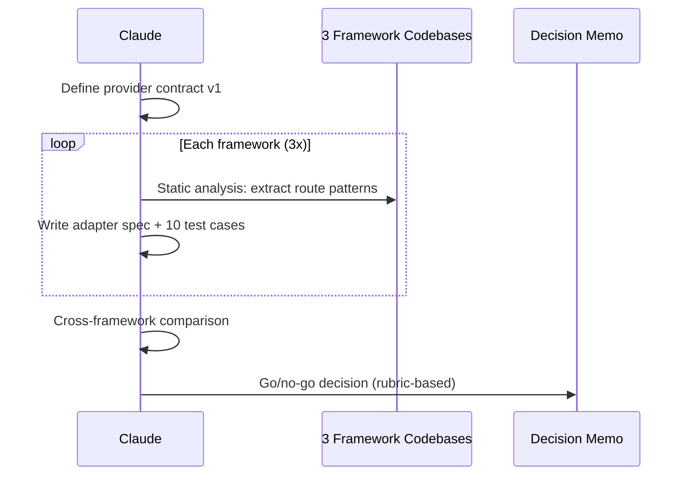

# Feature Verify: Endpoint Discovery Spike

> **Created**: 2026-03-08
> **Status**: Pending
> **Priority**: P2
> **Tech Spec**: Pending (spike output = go/no-go memo)
> **Source**: Best Practices Audit (`019cc761-0825-7b02-8f26-8550ce4f571c`, Round 2-3)

## Background

onekey/onchain 和 onekey/wallet 使用 `route-scan.sh`（Midway/Koa decorator parser）作為 endpoint discovery 的雙重閘門（`route-scan result intersection allowlist`），防止 AI hallucinated endpoints。Plugin 目前僅依賴手動 allowlist。但現有證據僅限 Midway/Koa 單一技術族群，直接做跨框架抽象缺乏足夠 evidence。本 spike 先收集多框架 adapter 規格，產出 go/no-go 決策 memo。

## Workflow

## Requirements

- 定義 endpoint discovery provider contract v1：
  - Input (required): `project_root` (string)
  - Input (optional): `include_globs` / `exclude_globs` (string[])
  - Output: normalized `METHOD PATH` list
  - Metadata: optional extension field，core 不解讀
  - **Security constraint**: static analysis only — 禁止 network call / app boot / code execution
- 收集至少 3 個框架的 adapter spec：
  - Midway/NestJS（decorator-based, TypeScript）
  - Express/Koa（middleware chain, JavaScript）
  - FastAPI（decorator-based, Python）
- 每個 adapter spec 包含至少 10 個 normalization 測例，覆蓋以下類型：
  - Path param（`:id`, `{id}`）
  - Trailing slash normalization
  - Nested router prefix
  - API versioning（`/v1/`, `/v2/`）
  - Regex / wildcard routes
  - Method override（`@All`, fallback routes）
- 產出 go/no-go 決策 memo（rubric-based）：
  - Decision rubric:

    | Dimension | Go threshold | No-go signal |
    |-----------|-------------|--------------|
    | Path normalization 覆蓋率 | 3/3 adapters 可 normalize 到相同格式 | 有框架無法 normalize |
    | False positive rate | < 5% 誤報（以測例驗證） | > 10% 誤報 |
    | Contract portability | Contract 不需 per-framework 特殊欄位 | 需要 framework-specific required fields |
    | Implementation cost | 每 adapter < 100 行 static analysis | 需要 AST parser 或 runtime introspection |

  - Go: 可設計通用抽象層，附 contract + 3 adapter 實作 spec
  - No-go: 框架差異過大，維持 project-level adapter（附原因）

## Scope

| Scope | Description |
| ----- | ----------- |
| In | Provider contract 設計、3 framework adapter spec、normalization 測例、go/no-go memo |
| Out | 實際 adapter 實作（go 後開新 request）、allowlist 機制變更、P3/P4 流程變更 |

## Related Files

| File | Action | Description |
| ---- | ------ | ----------- |
| `docs/features/feature-verify-v2/2-tech-spec.md` | New | Spike output: contract + adapter specs + memo |
| `skills/feature-verify/SKILL.md` | Read-only | 了解現有 allowlist 機制 |
| `skills/feature-verify/references/safety-rules.md` | Read-only | 了解現有 endpoint allowlist pattern |

## Acceptance Criteria

- [ ] Provider contract v1 定義完成（project_root + include/exclude globs + METHOD + normalized PATH + optional metadata）
- [ ] Contract 明定 static analysis only（禁止 network call / app boot / code execution）
- [ ] 3 個框架 adapter spec 完成（Midway/NestJS, Express/Koa, FastAPI）
- [ ] 每個 adapter 至少 10 個 normalization 測例，覆蓋 6 種路由類型
- [ ] Go/no-go memo 產出，含量化 decision rubric（覆蓋率、誤報率、可攜性、成本）
- [ ] Contract 覆蓋 2 種 routing archetype（decorator-based + middleware-chain）
- [ ] `/codex-review-doc` 通過

## Progress

| Phase | Status | Note |
| ----- | ------ | ---- |
| Analysis | - | |
| Development | - | |
| Testing | - | |
| Acceptance | - | |

## References

- Supersedes (partial): [2026-03-03-feature-verify-v2-upgrade.md](./2026-03-03-feature-verify-v2-upgrade.md) (endpoint discovery aspect)
- Evidence: onekey/onchain `route-scan.sh` (Midway decorator parser), onekey/wallet `route-scan.sh` (same pattern)
- Best Practices Audit: `019cc761-0825-7b02-8f26-8550ce4f571c` Round 3 (spike-first consensus)
