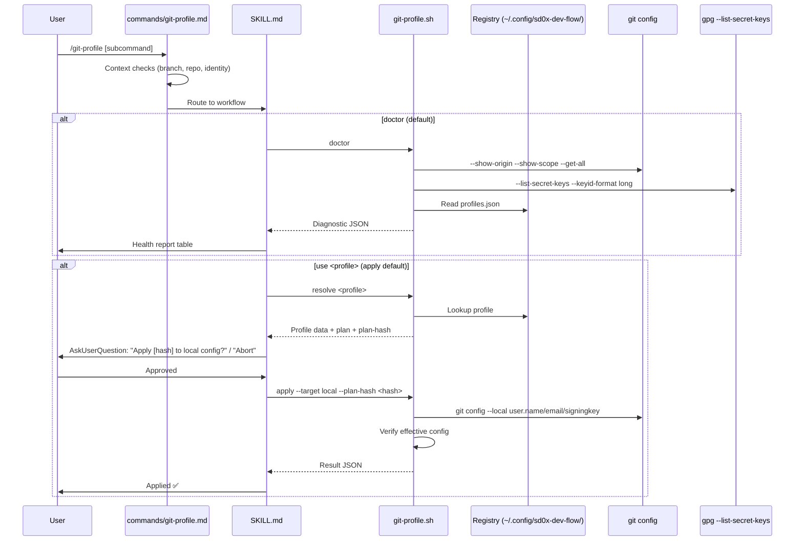
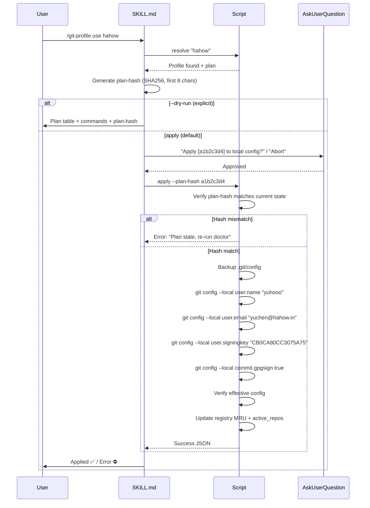

# Git Profile Manager — Technical Spec

## 1. Requirement Summary

### Problem

多專案、多組織開發者需要在不同 repo 使用不同 git identity（name, email）和 GPG signing key。目前：

- **無 `includeIf` 設置** — 所有 repo 用同一 identity
- **無 profile 切換機制** — 手動 `git config --local` 逐 repo 設定
- **GPG key 有效期未檢查** — 2 把已過期 key 無警告
- **Identity check 只在 `/smart-commit`** — 其他 skill 假設已驗證
- **無 profile 持久化** — 每次重新偵測

### Goals

| # | Goal | Metric |
|---|------|--------|
| G1 | Zero-config profile discovery | 首次執行自動從 GPG + git config 推導候選 profiles |
| G2 | One-command profile switching | `/git-profile use <name>` 完成 local config 設定 |
| G3 | GPG health visibility | 有效期、email match、signing 狀態一目瞭然 |
| G4 | Cross-skill integration | `/smart-commit` pre-flight 自動呼叫 shared diagnostics |
| G5 | Safe config writes | AskUserQuestion gate + plan-hash verification + backup before write |

### Scope

| In Scope (v1) | Out of Scope (v2) |
|----------------|-------------------|
| Profile auto-discovery (GPG + git config) | `includeIf` global install |
| Profile registry (`~/.config/sd0x-dev-flow/`) | Per-worktree identity writes |
| `doctor` / `list` / `use` / `remove` / `verify` | `migrate` / `export` / `import` |
| Local config writes (`--target local`) | Global config writes (`--target global`) |
| GPG local health check (expiry, email match) | GitHub key upload verification (`--deep`) |
| Worktree detection + warning | Worktree config writes (`extensions.worktreeConfig`) |
| Shared diagnostic script | CI/CD identity enforcement |

## 2. Existing Code Analysis

### Related Modules

| Module | Relevance | Reusable |
|--------|-----------|----------|
| `skills/smart-commit/SKILL.md` Step 1c | Identity diagnostics (name, email, env override) | Extract to shared script |
| `skills/smart-commit/SKILL.md` Step 1d | Signing diagnostics (gpgsign, signingkey, format) | Extract to shared script |
| `commands/smart-commit.md` context checks | Identity/signing context injection | Pattern reference |
| `skills/push-ci/SKILL.md` | AskUserQuestion approval flow | Pattern reference |
| `scripts/lib/utils.js` | `runCapture`, `writeJson`, `ensureDir` | Direct reuse |

### Files Requiring Changes

| File | Change | Type |
|------|--------|------|
| `skills/git-profile/SKILL.md` | New | Skill definition |
| `skills/git-profile/scripts/git-profile.sh` | New | Diagnostic + profile management script |
| `commands/git-profile.md` | New | Command entry point |
| `skills/smart-commit/SKILL.md` Step 1c | Modify | Delegate to shared diagnostic |
| `test/scripts/git-profile.test.js` | New | Tests |

### Current Config State

```
# .git/config (local)
[user]
  name = SD0
  email = 107539203+sd0xdev@users.noreply.github.com
  signingkey = D7B9FB02CAEB3E7819633AD4A0EEF23730D2BE5B
[commit]
  gpgsign = true

# ~/.gitconfig (global) — same values, no includeIf
```

### GPG Key Inventory

| # | Key ID (short) | UID | Status | Expires |
|---|----------------|-----|--------|---------|
| 1 | `4517A950` | yuhooo \<<yuchen@hahow.in>\> | expired | 2025-03-25 |
| 2 | `4337E823` | sd0 \<<software.develop.0x@gmail.com>\> | expired | 2025-03-25 |
| 3 | `F0987834` | sd0 \<<software.develop.0x@gmail.com>\> | active | 2027-04-16 |
| 4 | `C3075A75` | yuhooo \<<yuchen@hahow.in>\> | active | 2027-04-16 |
| 5 | `0883C968` | SD0xOneKey \<<yuhao.chen@onekey.so>\> | active | 2027-05-21 |
| 6 | `30D2BE5B` | SD0 \<<107539203+sd0xdev@users.noreply.github.com>\> | active | 2028-02-20 |

## 3. Technical Solution

### 3.1 Architecture Design



### 3.2 Data Model

#### Profile Registry

**Location**: `~/.config/sd0x-dev-flow/git-profiles.json`
**Permissions**: `0600`
**Atomicity**: temp file + atomic rename

```json
{
  "version": 1,
  "profiles": {
    "sd0-personal": {
      "name": "SD0",
      "email": "107539203+sd0xdev@users.noreply.github.com",
      "signingkey": "D7B9FB02CAEB3E7819633AD4A0EEF23730D2BE5B",
      "gpg_format": "openpgp",
      "mru": "2026-03-05T21:13:00Z",
      "source": "auto-derived"
    },
    "hahow": {
      "name": "yuhooo",
      "email": "yuchen@hahow.in",
      "signingkey": "CB0CA80CC3075A75",
      "gpg_format": "openpgp",
      "mru": null,
      "source": "auto-derived"
    }
  },
  "active_repos": {
    "/Users/yasuoyuhao/Project/sd0x-dev-flow": "sd0-personal"
  }
}
```

| Field | Type | Description |
|-------|------|-------------|
| `version` | `number` | Schema version for forward compat |
| `profiles.<id>.name` | `string` | `user.name` value |
| `profiles.<id>.email` | `string` | `user.email` value |
| `profiles.<id>.signingkey` | `string` | Full fingerprint |
| `profiles.<id>.gpg_format` | `string` | `openpgp` or `ssh` |
| `profiles.<id>.mru` | `string\|null` | ISO8601, updated only after successful apply + verify |
| `profiles.<id>.source` | `string` | `auto-derived` or `manual` |
| `active_repos.<realpath>` | `string` | Profile ID currently applied |

#### Diagnostic Output Schema (Shared Contract)

```json
{
  "version": 1,
  "status": "ok|warn|halt",
  "effective_identity": {
    "name": "SD0",
    "email": "107539203+sd0xdev@users.noreply.github.com",
    "name_source": "local (.git/config)",
    "email_source": "local (.git/config)"
  },
  "signing": {
    "enabled": true,
    "key": "D7B9...BE5B",
    "format": "openpgp",
    "key_status": "active|expired|missing",
    "expires": "2028-02-20"
  },
  "env_overrides": {
    "GIT_AUTHOR_NAME": null,
    "GIT_COMMITTER_EMAIL": null
  },
  "worktree": {
    "is_linked": false,
    "main_worktree": null
  },
  "issues": [
    {"severity": "warn", "code": "KEY_EXPIRING_SOON", "message": "GPG key expires in 60 days"}
  ],
  "matched_profile": "sd0-personal|null"
}
```

### 3.3 Subcommand Design

| Subcommand | Arguments | Write | Gate |
|------------|-----------|-------|------|
| `doctor` (default) | `[--json]` | No | — |
| `list` | — | No | — |
| `use <profile>` | `--target local` `[--dry-run]` | Yes | AskUserQuestion (plan-hash embedded in option label for verification) |
| `remove <profile>` | `[--force]` | Yes (registry) | AskUserQuestion (refuse if active, unless `--force`) |
| `verify` | `[--deep]` | No | — |

#### `doctor` Output

```
## Git Profile Health

| Item | Value | Source | Status |
|------|-------|--------|--------|
| Name | SD0 | local (.git/config) | ✅ |
| Email | 107539203+sd0xdev@users.noreply.github.com | local (.git/config) | ✅ |
| Signing | enabled (openpgp) | local (.git/config) | ✅ |
| GPG Key | D7B9...BE5B | local (.git/config) | ✅ active (expires 2028-02-20) |
| Env Override | none | — | ✅ |
| Worktree | main (not linked) | — | ✅ |
| Profile Match | sd0-personal | registry | ✅ |

Status: ✅ All checks passed
```

#### `use` Workflow



### 3.4 Core Logic

#### Auto-Discovery Algorithm

```
1. Collect GPG secret keys: gpg --list-secret-keys --keyid-format long --with-colons
2. Parse UID lines → extract name, email, key ID, expiry, trust
3. Filter: only active (not expired, not revoked) keys with local secret key available
4. Collect git config: --show-origin --show-scope --get-all user.name/email
5. Collect existing includeIf fragments (if any)
6. Merge: group by email → create candidate profiles
7. Conflict resolution:
   - Same email, different keys → pick newest non-expired key
   - Same key, multiple UIDs → pick UID matching git config email
   - Ambiguous → flag for user selection
8. Present candidates → AskUserQuestion confirm/edit
9. Persist to registry
```

#### Plan-Hash Specification

```
Input: Canonical JSON of planned git config commands
  {
    "target": "local",
    "commands": [
      {"key": "user.name", "value": "yuhooo"},
      {"key": "user.email", "value": "yuchen@hahow.in"},
      {"key": "user.signingkey", "value": "CB0CA80CC3075A75"},
      {"key": "commit.gpgsign", "value": "true"}
    ],
    "repo": "/Users/yasuoyuhao/Project/sd0x-dev-flow"
  }
Hash: SHA256 → first 8 hex chars
Stale check: re-read current config before apply, re-hash, compare
```

#### Shared Diagnostic Integration

```mermaid
graph LR
    A[git-profile.sh doctor] --> D[Diagnostic JSON]
    B[/smart-commit Step 1c] --> D
    D --> E{status}
    E -->|ok| F[Silent continue]
    E -->|warn| G[Display warning]
    E -->|halt| H[Stop + guidance]
```

**Degradation policy**: If diagnostic **infrastructure** fails (script not found, parse error) in `/smart-commit` context → degrade to current Step 1c/1d inline behavior. Critical identity/signing failures (missing `user.name`, missing `user.email`) always preserve **halt** semantics regardless of infrastructure state. Only infra-layer parsing failures degrade to warn-only.

## 4. Risks and Dependencies

| # | Risk | Impact | Mitigation |
|---|------|--------|------------|
| R1 | GPG unavailable in restricted environments | Auto-discovery fails | Fallback: manual profile entry via AskUserQuestion |
| R2 | Registry file corruption (concurrent access) | Profile data loss | Atomic write (temp + rename) + `mkdir`-based lockfile (POSIX-safe, no `flock` dependency) |
| R3 | `git config --local` in linked worktree affects all worktrees | Wrong identity in other worktrees | v1: detect + warn; v2: `--target worktree` |
| R4 | Plan-hash canonicalization differs across platforms | Stale plan false positive | Lock JSON field order + whitespace normalization |
| R5 | AskUserQuestion session caching auto-approves | Config written without real confirmation | Plan-hash embedded in AskUserQuestion option label for deterministic verification; residual risk accepted (local-only writes, reversible) |
| R6 | Diagnostic script breaks `/smart-commit` | Commits blocked | Degradation to warn-only (never halt on infra failure) |
| R7 | Registry path `~/.config/` not writable (rare) | Registry init fails | Fallback to `$HOME/.sd0x-dev-flow/` |

### Dependencies

| Dependency | Version | Required |
|------------|---------|----------|
| Git | 2.13+ | `includeIf` support (v2) |
| GPG | any | Auto-discovery (graceful degradation if missing) |
| `gh` CLI | any | v2 `--deep` GitHub key check |
| `jq` | any | JSON parsing in shell script |

## 5. Work Breakdown

| # | Task | Type | Est. | Priority |
|---|------|------|------|----------|
| W1 | `git-profile.sh` — `doctor` subcommand | Script | S | P0 |
| W2 | `git-profile.sh` — auto-discovery + registry init | Script | M | P0 |
| W3 | `git-profile.sh` — `list` subcommand | Script | S | P0 |
| W4 | `git-profile.sh` — `use` subcommand (local apply) | Script | M | P0 |
| W5 | `git-profile.sh` — `remove` subcommand | Script | S | P1 |
| W6 | `git-profile.sh` — `verify` subcommand | Script | S | P1 |
| W7 | `skills/git-profile/SKILL.md` | Doc | M | P0 |
| W8 | `commands/git-profile.md` | Doc | S | P0 |
| W9 | Shared diagnostic script extraction | Refactor | M | P1 |
| W10 | `/smart-commit` Step 1c integration | Refactor | S | P1 |
| W11 | `test/scripts/git-profile.test.js` | Test | L | P0 |
| W12 | Request document | Doc | S | P0 |

**Size**: S = < 1hr, M = 1-3hr, L = 3-5hr

### Implementation Order

```
W7 (SKILL.md) → W8 (command.md) → W1 (doctor) → W2 (discovery) → W3 (list) → W4 (use) → W11 (tests)
  → W5 (remove) → W6 (verify) → W9 (shared diag) → W10 (smart-commit integration) → W12 (request)
```

## 6. Testing Strategy

### Test File

`test/scripts/git-profile.test.js`

### Test Matrix

| Category | Test Case | Expected |
|----------|-----------|----------|
| **doctor** | Normal config (name + email + key) | `status: ok`, all fields populated |
| | Missing user.name | `status: halt`, issue `MISSING_NAME` |
| | Missing signingkey | `status: warn`, issue `NO_SIGNING_KEY` |
| | Expired GPG key | `status: warn`, issue `KEY_EXPIRED` |
| | Env override present | `status: warn`, issue `ENV_OVERRIDE` |
| | Linked worktree detected | `status: warn`, issue `LINKED_WORKTREE` |
| **list** | Registry has 3 profiles | List all with match indicator |
| | Empty registry | "No profiles. Run /git-profile to discover." |
| **use** | Valid profile + `--target local` | Config written + verified |
| | Unknown profile name | Exit 2 + error message |
| | Plan-hash mismatch (config changed) | Exit 2 + "Plan stale" |
| | Profile with expired key | Warn but allow (key may still sign) |
| **remove** | Remove inactive profile | Registry updated |
| | Remove active profile (no `--force`) | Exit 2 + refuse |
| | Remove active profile (`--force`) | Registry updated + warn |
| **verify** | All checks pass | `status: ok` |
| | Key expiring within 90 days | `status: warn`, issue `KEY_EXPIRING_SOON` |
| | Email mismatch (config vs key UID) | `status: warn`, issue `EMAIL_MISMATCH` |
| **registry** | Atomic write (concurrent access) | No corruption |
| | Registry file missing | Auto-create on first write |
| | Registry invalid JSON | Exit 2 + "Registry corrupt" |

### Stub Strategy

```javascript
function setupStubEnv(opts = {}) {
  // Stub git config responses
  // Stub gpg --list-secret-keys output
  // Stub registry file
  // Stub git config --local writes (verify-only, no real writes)
}
```

## 7. Open Questions

| # | Question | Impact | Owner |
|---|----------|--------|-------|
| Q1 | Registry 要不要 tracked in git（team shared）還是 untracked（personal）？ | Profile portability | User decision |
| Q2 | v2 `includeIf` install 要用 `gitdir:` 還是 `hasconfig:remote.*.url:`？ | Profile routing strategy | v2 design |
| Q3 | `/smart-commit` shared diagnostic 要用 script 呼叫還是 JSON file 交換？ | Integration architecture | W9 design |
| Q4 | GPG key expiry warning threshold 要設幾天？（建議 90 天） | Alert timing | User preference |

## 8. Known Constraints

### Design Principles (from Brainstorm Equilibrium)

| Principle | Description |
|-----------|-------------|
| **Diagnostic, not override** | Respect user's `includeIf` and manual config; detect, don't force |
| **Auto-derive, user-confirmed** | GPG + git config 自動推導；使用者確認後才持久化 |
| **Progressive disclosure** | `doctor` 零配置可跑；`use` 需要 registry；`includeIf` v2 |
| **Fail-closed on ambiguity** | Profile 衝突 → AskUserQuestion，不靜默解決 |
| **Infra-layer degradation only** | 診斷基礎設施失敗 → warn-only；identity/signing 缺失 → 仍然 halt |

### Policy Boundaries (Hard Rules)

| Rule | Description |
|------|-------------|
| v1 NEVER writes `~/.gitconfig` | Global scope deferred to v2 |
| v1 NEVER enables `extensions.worktreeConfig` | Worktree write deferred to v2 |
| NEVER auto-fix identity without confirmation | Always AskUserQuestion |
| NEVER store key material in registry | Only fingerprints, never private keys |
| NEVER run `git add/commit/push` | Only `git config` writes |
