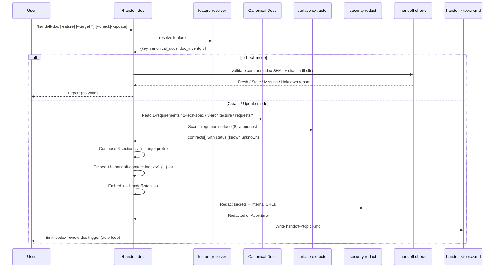

# Handoff Document Generator (`/handoff-doc`) Technical Spec

> **Doc class**: Lifecycle — Phase 2 technical specification（per `@rules/docs-numbering.md`）
> **Created**: 2026-04-22
> **Upstream inputs**: [`./1-requirements.md`](./1-requirements.md) · [`./0-feasibility-study/1-best-practices-research.md`](./0-feasibility-study/1-best-practices-research.md)
> **Architecture thesis**（來自 debate Nash equilibrium）：**New section contract + reused engine primitives**

## 1. Requirement Summary

### Problem

跨系統／跨團隊交接時，sender 的既有文件（tech-spec／runbook／README）均以內部讀者為預設，receiver 面對散落且未篩選的文件無法以最短路徑完成整合／維運／接手。需要一個技能**掃描整合表面（integration surface）、自動策展 receiver 所需的合約與起手式**，產出符合既有 taxonomy 的 `handoff-<topic>.md`。

### Goals

| G-ID | Goal |
|------|------|
| G1 | 產出 receiver-first、以契約為主體的單檔 handoff 文件 |
| G2 | 自動抽取整合表面（API / schema / event / auth / config / rate-limit / error-code） |
| G3 | 嵌入機器可讀 contract-index（`<!-- handoff-contract-index:v1 {...} -->`），支援 agent/LLM 消費與 `--check` 合約 drift |
| G4 | 明示 unknown／TBD 項，不虛構合約（no-fabrication） |
| G5 | Reuse 既有 engine primitives（feature resolver、security-redact、runbook 式 provenance）以最小化新碼 |

### Scope

**IN v1**（6 項必填 sections + 5 項核心能力）：
1. Header with freshness metadata（commit SHA / ISO 8601 / contract version / receiver-role）
2. Quickstart（TTFC block）
3. Integration Surface（含 8 類：API / event / schema / auth / config / env / rate-limit / error-code；每項 `file:line` back-ref）
4. Unknown / TBD Gaps（列缺失合約）
5. Ownership & Feedback（owner / channel / SLA）
6. Contract Index（HTML comment anchor）
+ `--check` mode（contract drift + citation integrity）
+ `--target` audience profile（integrator / maintainer / partner-external / team-transfer）
+ `<!-- handoff-stats -->` observability block
+ 400-line advisory overflow marker
+ Secret + internal-URL redaction

**OUT v1 → defer to v2**：Bundle mode（多檔輸出）、`llms.txt` / MCP 等外部 AI-agent 標準、certified/standard access tiering。

## 2. Existing Code Analysis

### Related Modules（重用目標）

| # | Module | File | Reuse |
|---|--------|------|-------|
| 1 | Feature resolver | [`scripts/lib/feature-resolver.js`](../../../scripts/lib/feature-resolver.js) + [`scripts/resolve-feature-cli.js`](../../../scripts/resolve-feature-cli.js) | behavior + code layer cascade，同 `/tech-brief` / `/runbook` |
| 2 | Security redaction | [`scripts/security-redact.js`](../../../scripts/security-redact.js) | 2-tier：high-conf abort / medium 遮罩；需擴 internal URL pattern |
| 3 | Runbook provenance pattern | [`skills/runbook/references/template.md`](../../../skills/runbook/references/template.md) §`<!-- runbook-provenance -->` | Adapt 為 `<!-- handoff-contract-index:v1 -->`（JSON，not YAML，因 agent 消費友善） |
| 3b | Document input scope | `1-requirements.md` + `2-tech-spec.md` + `3-architecture.md`（若存在）+ `requests/*.md` — 承 FR-2 lifecycle doc 輸入範圍 | Read for contract / ownership / AC 線索 |
| 4 | Runbook scoped discovery | [`skills/runbook/references/discovery-heuristics.md`](../../../skills/runbook/references/discovery-heuristics.md) | 4-tier P1-P4 scope cascade；adapt 為整合表面偵測 |
| 5 | Runbook `--check` | [`skills/runbook/SKILL.md`](../../../skills/runbook/SKILL.md) `L144-L152` | SHA 比對 + 檔案存在檢查（citation integrity） |
| 6 | Depth-level matrix | [`skills/tech-brief/SKILL.md`](../../../skills/tech-brief/SKILL.md) `L110-L118` | 可選；v1 以 `--target` 取代 |
| 7 | Blind-spot Must 模式 | [`skills/recap-doc/SKILL.md`](../../../skills/recap-doc/SKILL.md) `L90` FR-9 | 域化為「Unknown/TBD Gaps」合約缺失偵測 |
| 8 | Taxonomy | [`scripts/config/doc-taxonomy.json`](../../../scripts/config/doc-taxonomy.json) `"id": "handoff"` | 直接符合 `^handoff-\|交接` semantic_pattern |

### Files Requiring Changes / Creation

| Path | Kind | Purpose |
|------|------|---------|
| `skills/handoff-doc/SKILL.md` | NEW | 技能入口 + workflow |
| `skills/handoff-doc/references/output-template.md` | NEW | 6-section 模板 + contract-index schema |
| `skills/handoff-doc/references/surface-detectors.md` | NEW | 8 類合約偵測規則（regex + AST-lite） |
| `skills/handoff-doc/references/target-profiles.md` | NEW | `--target` 四種受眾對應 section 詳略矩陣 |
| `skills/handoff-doc/references/check-output.md` | NEW | `--check` 模式輸出規格（承 runbook 模式） |
| `scripts/lib/surface-extractor.js` | NEW | 合約抽取核心（pure function，可測試） |
| `scripts/lib/handoff-check.js` | NEW | `--check` mode 核心（SHA 比對 + citation integrity） |
| `scripts/security-redact.js` | MODIFY | 加入 internal URL / internal host pattern |
| `test/skills/handoff-doc.test.js` | NEW | Skill schema + behavior tests |
| `test/scripts/lib/surface-extractor.test.js` | NEW | Unit tests（happy path + edge cases） |
| `test/scripts/lib/handoff-check.test.js` | NEW | Unit tests |

## 3. Technical Solution

### 3.1 Architecture（Mermaid）



### 3.2 Data Model

#### 3.2.1 Contract-Index Schema (v1)

Embedded as HTML comment before closing `</body>` 位置（實務上放文件最末 `References` 段之後）：

```html
<!-- handoff-contract-index:v1
{
  "version": "v1",
  "generated_at": "2026-04-22T08:15:00Z",
  "contracts": [
    {
      "id": "auth-login-v1",
      "type": "api",
      "format": "openapi",
      "source_file": "src/routes/auth.ts",
      "source_sha": "abc123...",
      "source_ref": "src/routes/auth.ts:42",
      "status": "known"
    },
    {
      "id": "payment-completed-event",
      "type": "event",
      "format": "asyncapi",
      "source_file": "src/events/payment.ts",
      "source_sha": "def456...",
      "source_ref": "src/events/payment.ts:18",
      "status": "known"
    },
    {
      "id": "rate-limit-policy",
      "type": "rate-limit",
      "format": "n/a",
      "source_file": "",
      "source_sha": "",
      "source_ref": "",
      "status": "unknown"
    }
  ]
}
-->
```

**Enum values**：
+ `type`: `api | event | schema | auth | config | env | rate-limit | error-code`
+ `format`: `openapi | json-schema | asyncapi | text | n/a`
+ `status`: `known | unknown`

**Invariants**：
+ Missing contract **must not** be omitted — emit with `status: "unknown"`（FR-6/FR-8 no-fabrication guard）
+ `source_sha` 為 `git hash-object <source_file>` 輸出；`status: unknown` 時允許空字串
+ **Stable diff 保證**：serialize 前先依 `(type, id, source_file, source_ref)` 四鍵 tuple 排序 `contracts[]`；物件內 key 以 `["id","type","format","source_file","source_sha","source_ref","status"]` 固定順序寫出（不倚賴 V8 insertion order）；再以 `JSON.stringify(obj, null, 2)` 產出。

#### 3.2.2 Handoff Stats Block

尾部觀測欄位（NFR-9）：

```html
<!-- handoff-stats
{
  "docs_referenced": 3,
  "surface_items_covered": 7,
  "open_questions_unresolved": 2
}
-->
```

三項計數**必出現**（無則填 `0`）。

#### 3.2.3 Header Metadata

Receiver 可見、human-readable：

```markdown
# Handoff: <Feature> → <Receiver Role>

> **Generated**: 2026-04-22T08:15:00Z
> **Commit**: abc123d (main @ 2026-04-22)
> **Contract version**: v1.3.0 (from tech-spec §Versioning) | n/a
> **Receiver role**: integrator | maintainer | partner-external | team-transfer
> **Skill**: /handoff-doc v1
> **Source rationale**: docs included → [`1-requirements.md`, `2-tech-spec.md`, `requests/2026-04-01-*.md`]；docs excluded → [`3-architecture.md`（未存在）]；reason brief — per FR-14 產出決策可追溯
```

### 3.3 API Design

#### 3.3.1 CLI Surface

```
/handoff-doc [<feature-key>|<docs-path>] [flags]
```

| Flag | Default | Description |
|------|---------|-------------|
| `--target <role>` | `integrator` | Receiver profile：`integrator \| maintainer \| partner-external \| team-transfer` |
| `--topic <slug>` | feature-key | 決定檔名 `handoff-<topic>.md`；預設等同 feature-key |
| `--update` | false | Force update mode（即使檔案不存在亦視為更新，失敗則 gate） |
| `--check` | false | 讀取唯一：驗證 contract SHA + citation integrity，不改檔 |
| `--output <path>` | `docs/features/<key>/handoff-<topic>.md` | Custom path |
| `--no-save` | false | stdout 模式，不寫檔 |

#### 3.3.2 Exit Codes

| Code | Meaning |
|------|---------|
| 0 | Create/Update 成功 或 `--check` Fresh |
| 10 | `--check`: Stale（`source_sha` 不符） |
| 11 | `--check`: Unknown（`source_file` 不存在） |
| 12 | `--check`: Missing（contract-index entry 無 source — 預期僅 `status: "unknown"` 合法，其餘為異常） |
| 20 | Feature not resolved（Gate: Need Human） |
| 30 | Redaction AbortError（high-conf secret 發現） |
| 40 | Schema violation（contract-index invalid） |

> `--check` 狀態語彙對齊 [`skills/runbook/references/check-output.md`](../../../skills/runbook/references/check-output.md)：`Fresh / Stale / Missing / Unknown`。Section status = 最差狀態。

### 3.4 Core Logic

#### 3.4.1 Integration Surface Detectors（v1 scope：Node / TS / JS）

| Type | Detection（優先度 P1 > P4） |
|------|-----|
| `api` | P1 request `Related Files`；P2 tech-spec §3.3；P3 grep 多 framework：Express `(router\|app)\.(get\|post\|put\|delete\|patch)\s*\(` + Nest `@(Get\|Post\|Put\|Delete\|Patch)\s*\(` + Fastify `fastify\.(get\|post\|put\|delete\|patch)\s*\(` + Next.js file-based routing（`app/**/route.{ts,js}` / `pages/api/**`） in `src/**` 或 `app/**`；P4 repo-wide |
| `event` | P1 request；P2 architecture §Integration Points；P3 grep `\.emit\s*\(\s*['"]` / `\.publish\s*\(\s*['"]` / AsyncAPI files (`*asyncapi*.ya?ml`) / MQTT/Kafka topic 常數（`TOPIC_\w+\s*=\s*['"]`） |
| `schema` | P1 request；P2 `schema/` `types/` `models/` dirs；P3 grep `z\.object\s*\(` / `yup\.object\s*\(` / `Joi\.object\s*\(` / 顯式 `export\s+interface\s+\w+` 於 `*.d.ts` |
| `auth` | P2 tech-spec §Auth；P3 grep `passport\|jwt\.sign\|Bearer\s` / `oauth2?\.` / `x-api-key` / `apiKey` header / `@UseGuards` |
| `config` | P3 `*.config.*`、`.env.example`；P4 `config/` dir |
| `env` | P3 `.env.example`；P4 grep `process\.env\.` |
| `rate-limit` | P3 grep `rate-?limit\|RateLimiter\|express-rate-limit\|bottleneck` |
| `error-code` | P3 `errors?\.ts`、`exception.*\.ts`；P4 grep `throw new \w+Error` |

每項偵測返回 `{ id, type, format, source_file, source_sha, source_ref, status }`；找不到時仍產 entry（`status: "unknown"`、空欄填空字串）。

> **Why 先限 Node/TS/JS**：本專案 tech stack 為 Node；其他語言留 v2 經 `references/surface-detectors.md` 擴充（extension point：偵測器為 pure function 可插拔）。

#### 3.4.2 `--target` Profile Matrix

定義每類 receiver 對 6 section 的詳略：

| Section | integrator | maintainer | partner-external | team-transfer |
|---------|-----------|-----------|------------------|---------------|
| Header | always | always | always | always |
| Quickstart | **always** — detailed runnable sample | brief — 環境 + 啟動 | **always** — detailed + auth flow | brief |
| Integration Surface | **deep** — 全 8 類 | moderate — api/config/env/auth | **deep** — api/auth/error-code 為主 | all categories |
| Unknown/TBD | always | always | always | always |
| Ownership & Feedback | brief（async support） | **deep** — on-call / SLA / escalation | **deep** — support channel + response SLA | **deep** — ownership transfer sign-off |
| Contract Index | always | always | always | always |

> Profile 表存於 [`skills/handoff-doc/references/target-profiles.md`](../../../skills/handoff-doc/references/target-profiles.md)；調整無需改 SKILL.md。

#### 3.4.3 `--check` Mode

```
For each contract in contract-index where status == "known":
  if not fs.existsSync(contract.source_file):
    → Unknown
  else:
    current_sha = git hash-object <contract.source_file>
    if current_sha != contract.source_sha:
      → Stale（record old → new SHA）
    if contract.source_ref contains line number:
      verify line number in-range of current file → if not, downgrade to Unknown
  else:
    → Fresh

For each in-doc file:line citation outside contract-index:
  if file missing → Unknown (citation integrity)
  if line out-of-range → Stale (citation integrity, narrative drift)
```

Report 格式與 runbook `--check` 一致（見 [`skills/runbook/references/check-output.md`](../../../skills/runbook/references/check-output.md)）；輸出 **Fresh / Stale / Missing / Unknown** 四態；Missing 僅當 contract entry `status == "known"` 卻無 source_file 時出現（spec 違反），正常路徑不會看到。

#### 3.4.4 Redaction Extension

擴 `scripts/security-redact.js` 加 handoff-specific pattern（實際清單實作時用 test fixture 驗證）：

| Pattern（新增） | Replace with |
|---|---|
| 內網 IP（regex：`10\.` / `172\.(1[6-9]\|2\d\|3[01])\.` / `192\.168\.`） | `<internal-ip>` |
| `.internal` / `.corp` / `.local` 主機名 | `<internal-host>` |
| `localhost` 可保留（quickstart 需） | — |

## 4. Risks and Dependencies

| # | Risk | Likelihood | Impact | Mitigation |
|---|------|-----------|--------|-----------|
| R1 | Surface detector 誤判（漏抓或多抓 route） | Medium | High — 影響合約完整性 | (a) 以 P1 Related Files 為主信號；(b) `status: unknown` 不虛構；(c) 輸出 Unknown/TBD section 供 sender 人工 review |
| R2 | Contract-index JSON schema v1 後續需演進 | Medium | Medium | Version literal `"v1"`；未來 `v2` 透過 migrator 轉換（見 Open Question Q1） |
| R3 | Internal URL regex 誤殺（如 `foo.local` 是產品名） | Low | Medium | 2-tier redaction：high-conf（私網 IP）直接替換；medium（`.local` / `.internal` / `.corp` 結尾）警示 + 遮罩並於輸出尾端 list `<!-- handoff-redaction-notes -->` 供 sender 審閱；若有需求，`--no-internal-redact` 為未來擴充 flag（v2） |
| R4 | `--check` 對大型 repo 執行慢 | Low | Low | `git hash-object` 單檔 < 50ms；contract 數量上限軟限 50（超過建議 bundle v2） |
| R5 | 非 Node 專案 surface 抽取失敗 | High（但本 repo 自用為 Node） | Low | v1 範圍明示 Node/TS/JS；其他語言 gate 為 `status: unknown` |
| R6 | AI-agent 對 HTML comment 內 JSON 解析能力差異 | Low | Medium | 使用 stable `JSON.stringify` + 明確 schema version；提供 `scripts/lib/contract-index-parser.js` 供後續 tooling 直接引用（可選，v1 可延） |

**Dependencies**：
+ 必要：`scripts/lib/feature-resolver.js`、`scripts/security-redact.js`、Node 18+
+ 可選：`git`（用於 `hash-object` 與 current commit SHA）——無 git 時降級為 `null`

## 5. Work Breakdown

對應 `1-best-practices-research.md` 的 P1/P2 roadmap。拆成 trackable items：

| # | Task | Effort | Depends on | Acceptance（對 1-requirements AS） |
|---|------|--------|-----------|-------------------------------|
| T1 | `skills/handoff-doc/SKILL.md` 骨架（trigger、when-not-to-use、command signature、workflow mermaid、verification） | S（4h） | — | AS-1 / AS-6 skill 可被 `/codex-review-doc` 正確命中 |
| T2 | `references/output-template.md`（6 section + header + stats + contract-index） | S（4h） | T1 | AS-1 / AS-9（header freshness 欄位） |
| T3 | `references/surface-detectors.md`（8 類偵測規則詳表 + 偵測器 pure function 契約） | M（1d） | T1 | AS-1 integration surface 段出現 ≥ 3 類 |
| T4 | `scripts/lib/surface-extractor.js` 實作（Node/TS route + event + schema + auth + config + env + rate-limit + error-code） | L（2d） | T3 | AS-1 / AS-2（刻意殘缺輸入時 status unknown 且不虛構） |
| T5 | `references/target-profiles.md` 受眾矩陣 | S（3h） | T2 | AS-4（integrator vs maintainer 輸出明顯不同） |
| T6 | `scripts/lib/handoff-check.js` 實作 + `references/check-output.md` | M（1d） | T2 | AS-6 `--check` SHA + file:line 檢查 |
| T7 | `scripts/security-redact.js` 擴 internal URL/host/IP patterns | S（3h） | — | AS-3 redaction test 通過 |
| T8 | `test/skills/handoff-doc.test.js`（skill schema + SKILL.md headings + output shape） | S（4h） | T1-T2 | NFR-6 |
| T9 | `test/scripts/lib/surface-extractor.test.js`（happy + edge + fixture 混 secret） | M（1d） | T4 | AS-1 / AS-2 / AS-3 |
| T10 | `test/scripts/lib/handoff-check.test.js`（Fresh/Stale/Missing/Unknown 四路徑 + citation integrity） | S（4h） | T6 | AS-6 |
| T11 | 整合：SKILL.md 串聯 extractor + redactor + template；update mode 局部合併邏輯（保留手工段落，只重生 Stale 段） | M（1d） | T1-T7 | AS-5（update mode 手工段落保留）/ AS-7（400 行 advisory）/ AS-8（無 tech-spec gate） |
| T12 | 更新 `CLAUDE.md` / `.claude/CLAUDE.md` Command Quick Reference 加入 `/handoff-doc` | S（1h） | T11 | Discoverability |
| T13 | 手動 e2e：對 sd0x-dev-flow 自身跑 `/handoff-doc --target integrator` 驗證自舉可行 | S（2h） | T11 | AS-1 feasibility |

**估算總計**：73 小時（≈ 9.1 工作日 @ 8h/day，含 5-10% 自然緩衝為 9.5-10 天）；可平行化（T3/T5/T7 無相依可同做）。

## 6. Testing Strategy

### Unit（`test/scripts/lib/*.test.js`）

| 目標 | 覆蓋 |
|------|------|
| `surface-extractor.js` | 8 類偵測 × 3 情境（found / not-found / ambiguous）；fixture：小型合成 Node 專案（含刻意殘缺 fixture 驗 status: unknown） |
| `handoff-check.js` | Fresh（SHA 相同）、Stale（SHA 不同）、Unknown（file 不存在）、Stale（line 超出範圍，citation integrity）、Missing（spec 違反路徑） |
| `security-redact.js` 新 patterns | Private IP / `.internal` / `.corp` / `.local` / `localhost`（不應被遮） |
| Contract-index serializer | JSON 穩定序（相同輸入相同輸出）；`status: unknown` 保留 |

### Integration（`test/skills/handoff-doc.test.js`）

| 目標 | 覆蓋 |
|------|------|
| SKILL.md schema | frontmatter、headings、Verification list 存在 |
| 必填 section 完整性 | 6 sections 必出現 |
| Contract-index 區塊 | `<!-- handoff-contract-index:v1 ... -->` 存在且解析為合法 JSON |
| Stats 區塊 | `<!-- handoff-stats -->` 三計數欄位皆存在 |

### E2E（手動 T13）

對 `sd0x-dev-flow` 自身跑 `/handoff-doc --target integrator` → 人工檢閱輸出 TTFC 是否可執行、contract-index 是否合理、Unknown/TBD 是否誠實列出缺項。

### Coverage 要求

| 類型 | 目標 |
|------|------|
| Unit `surface-extractor` | > 80% branch |
| Unit `handoff-check` | 100% path（4 狀態明確） |
| Integration | SKILL.md + 產出文件 shape 必測 |

## 7. Open Questions

承 `1-requirements.md` 遺留 + tech-spec 新增：

+ [ ] **Q1（carryover OQ-3）** Bundle 模式 v2 時：taxonomy 是否擴出 `handoff-<topic>/` folder 子型？目前 `doc-taxonomy.json` `handoff` 僅註冊 `^handoff-|交接` 單檔 pattern。
+ [ ] **Q2（carryover OQ-4）** v1 Integration Surface 限 Node/TS/JS；跨 tech stack 使用者（Python、Go、Rust）何時擴？擴充策略：偵測器插件註冊表或獨立偵測器 skill。
+ [ ] **Q3（carryover OQ-5）** `--receiver-repo <url>` 是否 v1 加 flag？目前 `--target` 已覆蓋 80% 需求；若加，需要網路爬取 receiver repo 結構，風險大。建議 v2。
+ [ ] **Q4（carryover OQ-6）** maintainer vs `/runbook` 邊界：文件中已強調「When to use what」，但實際互斥規則是什麼？提案：`--target maintainer` 時文件尾加「運維細節請見 `runbook-release.md`」連結。
+ [ ] **Q5（new）** Contract-index parser 是否 v1 提供為 `scripts/lib/contract-index-parser.js`？目前 JSON-in-HTML-comment 任何 agent 均可自解，但若未來有多個 skill 消費（如 `/seek-verdict`、`/feature-verify`），集中 parser 較穩。v1 先寫 minimal parser（< 30 LOC），若被引用則 T13 之後補正式版。
+ [ ] **Q6（new）** Update mode 的差異合併策略：是否採 `--check` 找 Stale sections → 自動重生，或保守一點僅 prompt 使用者選擇段落？建議保守：`--update` 印出 stale list，讓使用者批次 confirm（避免覆寫手工修訂）。
+ [ ] **Q7（new）** `surface-extractor` 是否需要 confidence 分級？目前僅 known/unknown 兩態，但 P3/P4 grep 命中的合約（低可信）是否該標 `status: "uncertain"`？提案：v1 保持二態；low-confidence 於 Unknown/TBD section 提示「auto-detected from grep, please verify」，不入 contract-index 的 known。

## 8. Verification

### 8.1 Requirement Coverage Trace

| Requirement | Section（spec） | Task（work breakdown） | Acceptance Signal |
|-------------|----------------|-----------------------|-------------------|
| FR-1 feature detection | §3.1 workflow | T1, T11 | AS-1 / AS-8 |
| FR-2 read lifecycle docs | §2 #3b | T11 | AS-1 |
| FR-3 integration surface extraction | §3.4.1 | T3, T4 | AS-1 |
| FR-4 ancillary `handoff-<topic>.md` | §1 scope + §3.3 `--topic` | T2, T11 | AS-1 |
| FR-5 `--target` audience | §3.4.2 | T5 | AS-4 |
| FR-6 no-fabrication | §3.2.1 invariants | T4, T9 | AS-2 |
| FR-7 update mode | §3.3 `--update` + §3.4.3 | T11 | AS-5 |
| FR-8 Unknown/TBD list | §1 scope + §3.2.1 `status: unknown` | T2, T4, T9 | AS-2 |
| FR-9 auto-trigger `/codex-review-doc` | §3.1（workflow 尾端）| T1, T11 | AS-6 |
| FR-10 redact secrets + internal URL | §3.4.4 + R3 | T7, T9 | AS-3 |
| FR-11 quickstart | §1 scope §3.4.2 | T2 | AS-1 |
| FR-12 bundle | OUT v1 | v2 backlog | — |
| FR-13 ownership & feedback | §1 scope + §3.4.2 | T2 | AS-1 |
| FR-14 source rationale in header | §3.2.3 | T2 | AS-1 |
| FR-15 freshness metadata | §3.2.3 | T2 | AS-9 |
| NFR-6 testability | §6 Testing Strategy | T8-T10 | — |
| NFR-9 observability stats | §3.2.2 | T2 | AS-1 / AS-9 |

### 8.2 Gate Checklist

+ [ ] 所有 FR（FR-1 ~ FR-15）有 §/T-task 對應（見 §8.1）
+ [ ] 所有 AS（AS-1 ~ AS-9 in `1-requirements.md`）有 T-task 對應
+ [ ] Mermaid 架構圖準確反映 workflow
+ [ ] Contract-index schema v1 穩定（key sort + serialize 流程寫明）
+ [ ] Risks 有 mitigation（不可只列風險）
+ [ ] Work breakdown items 皆為 trackable（S/M/L estimate + 依賴 + AC）
+ [ ] Testing strategy 覆蓋 happy + error + edge（per `@rules/testing.md`）
+ [ ] 無虛構檔案（所有引用 `file:line` 真實存在；to-be-created 檔標 NEW）
+ [ ] 通過 `/review-spec` auto-triggered review
