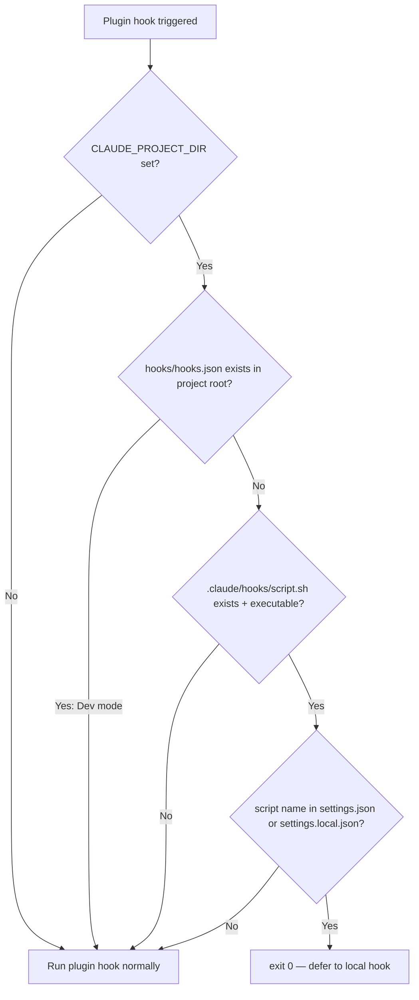

# Hook Dedup Arbitration — Plugin-Defers-to-Local

> **Created**: 2026-03-12
> **Status**: Completed
> **Priority**: P1
> **Tech Spec**: (pending)

## Background

當使用者以 user level 安裝 sd0x-dev-flow plugin，並在專案中執行 `/install-hooks` 或 `/project-setup` 後，plugin hooks（`hooks/hooks.json`，使用 `${CLAUDE_PLUGIN_ROOT}` 路徑）和 installed hooks（`settings.json`，使用 `$CLAUDE_PROJECT_DIR` 路徑）同時觸發。由於 command string 不同，Claude Code 的 dedup 機制無效，造成雙重執行和 `PostToolUse:Bash hook error` × 2。

經 `/codex-brainstorm` 3 輪對抗式辯論達成 Nash Equilibrium（threadId: `019ce206-a926-7062-9fdc-b3d009c51b00`），確定修復方案。

## Requirements

| 需求 | 說明 |
|------|------|
| Runtime arbitration | Plugin hook scripts 偵測 local hook 存在且已註冊時自動讓位（exit 0） |
| Dev mode bypass | 當專案根目錄有 `hooks/hooks.json`（= plugin 源碼）時，不觸發讓位 |
| Install-time detection | `/install-hooks` 和 `/project-setup` 偵測 plugin hooks 已 active 時發出警告（warn-and-continue，非 blocking） |
| Stop-guard mode normalization | Stop-guard mode 從 command string prefix 移至 script 內部解析（env > settings key > default） |
| Backward compatible | 現有使用者的 hooks 行為不受影響（graceful degradation） |

## Scope

| Scope | Description |
|-------|-------------|
| In | Plugin hook arbitration guard、install-time coexistence warning、stop-guard mode refactor（command prefix → settings key）、相關 test 更新 |
| Out | Claude Code upstream dedup 機制修改、hooks.json 格式變更、新增 provider/config 檔案 |

## Arbitration Flow

## Related Files

| File | Action | Description |
|------|--------|-------------|
| `hooks/pre-edit-guard.sh` | Modify | 加入 local-first arbitration guard |
| `hooks/post-edit-format.sh` | Modify | 加入 local-first arbitration guard |
| `hooks/post-tool-review-state.sh` | Modify | 加入 local-first arbitration guard |
| `hooks/stop-guard.sh` | Modify | 加入 arbitration guard + mode 從 command prefix 改為內部解析 |
| `commands/install-hooks.md` | Modify | 加入 plugin coexistence detection + 移除 stop-guard mode command prefix |
| `commands/project-setup.md` | Modify | Hook phase 加入 coexistence detection |
| `skills/project-setup/SKILL.md` | Modify | Hook phase 加入 coexistence detection + 移除 stop-guard mode command prefix |
| `test/hooks/pre-edit-guard.test.js` | Modify | 新增 arbitration guard test cases |
| `test/hooks/post-edit-format.test.js` | Modify | 新增 arbitration guard test cases |
| `test/hooks/post-tool-review-state.test.js` | Modify | 新增 arbitration guard test cases |
| `test/hooks/stop-guard.test.js` | Modify | 新增 mode resolution + arbitration guard test cases |

## Acceptance Criteria

### AC1: Runtime Arbitration Guard

- [x] 4 個 plugin hook scripts 開頭加入 local-first guard（~5 行/script）
- [x] Guard 前置條件：`CLAUDE_PROJECT_DIR` 必須非空才進入偵測邏輯（`[ -z "${CLAUDE_PROJECT_DIR:-}" ] && proceed normally`）
- [x] Guard 邏輯：`.claude/hooks/<script>` 存在且可執行 + settings 有對應 hook entry + 非 dev repo → exit 0
- [x] Settings entry 偵測：使用 `jq` 結構化查詢（scoped to `.hooks // {}`），在 settings.json / settings.local.json 中以 substring match 匹配 `.claude/hooks/<script>` command path。jq 不可用時 fallback to grep substring match（非 basename-only）
- [x] Dev mode bypass：`hooks/hooks.json` 存在於 `${CLAUDE_PROJECT_DIR}` 根目錄時不觸發讓位
- [x] Guard fail-open 原則：偵測 fallback chain 為 jq → grep → fail-open（plugin hook 正常執行）。`CLAUDE_PROJECT_DIR` 未設定、file 讀取失敗、或 jq+grep 皆無法匹配時，plugin hook 正常執行（不會 silent drop）

### AC2: Install-time Coexistence Detection

- [x] `/install-hooks` Phase 4b merge strategy 偵測 plugin hooks coexistence 時顯示警告（warn-and-continue，非 blocking）
- [x] `/project-setup` hook installation phase 同樣偵測並顯示警告
- [x] `commands/project-setup.md` context section 加入 plugin detection
- [x] 警告訊息說明：plugin hooks 可能與 installed hooks 衝突，runtime arbitration guard 會自動 dedup
- [x] 不需要額外 flag — 安裝正常進行，但 arbitration guard 會在 runtime 自動讓位

### AC3: Stop-guard Mode Normalization

Mode 解析順序（高優先 → 低優先）：

| Priority | Source | Key/Var | Example |
|----------|--------|---------|---------|
| 1 | 環境變數 | `STOP_GUARD_MODE` | `STOP_GUARD_MODE=strict` |
| 2 | `.claude/settings.local.json` | `.hooks_config.stop_guard_mode` | `"strict"` or `"warn"` |
| 3 | `.claude/settings.json` | `.hooks_config.stop_guard_mode` | `"strict"` or `"warn"` |
| 4 | Script default | hardcoded | `"warn"` |

Allowed values: `strict` | `warn`。Invalid value → fallback to `warn` + stderr warning。

- [x] `stop-guard.sh` 實作上述 4 級 mode 解析（取代現有 `${STOP_GUARD_MODE:-warn}`）
- [x] `/install-hooks` 不再把 `STOP_GUARD_MODE=strict` 寫入 command string prefix
- [x] `/install-hooks` 改為寫入 `.hooks_config.stop_guard_mode` 到 target settings（`--local` → `settings.local.json`，否則 `settings.json`；`--guard-mode` 參數仍保留）
- [x] `skills/project-setup/SKILL.md` hook mapping 移除 `STOP_GUARD_MODE=<MODE>` command prefix
- [x] Plugin 和 installed 版本的 stop-guard command string 保持 mode-agnostic
- [x] Backward compatible：既有 `STOP_GUARD_MODE=strict` env prefix 仍可運作（env var 優先序最高）

### AC4: Testing

- [x] `test/hooks/*.test.js` 覆蓋 arbitration guard 場景（local exists + registered、dev mode bypass、no local、CLAUDE_PROJECT_DIR unset、grep fallback）
- [x] Stop-guard mode resolution 優先序測試（env > settings.local > settings > default、invalid value fallback）
- [x] Install-time coexistence warning：doc 層定義於 `install-hooks.md` Phase 4b + `project-setup.md` context section（行為層由 Claude 執行，非自動化測試）
- [x] 現有 tests 全部通過（565 tests, 0 fail）
- [x] Pass `/codex-review-fast`

## Progress

| Phase | Status | Note |
|-------|--------|------|
| Analysis | Done | `/codex-brainstorm` Nash Equilibrium 達成 |
| Development | Done | 4 hook scripts + 3 doc files 修改完成 |
| Testing | Done | 565 tests pass (含 25+ 新增 arbitration/mode tests) |
| Acceptance | Done | AC1-AC4 全部達標（AC4 coexistence warning 為 doc-only 驗證），`/codex-review-fast` ✅ Ready |

## References

- Nash Equilibrium Report: `/codex-brainstorm` threadId `019ce206-a926-7062-9fdc-b3d009c51b00`
- Best Practices Audit: Phase 1-4 in current session
- Claude Code Hooks Guide: official docs (hooks merging, dedup, `$CLAUDE_PROJECT_DIR`)
- Rejected proposals: provider file, stdin-hash dedup, canonical strings, bash-c wrapper, lock-contention exit
