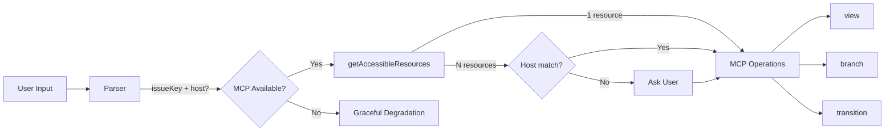
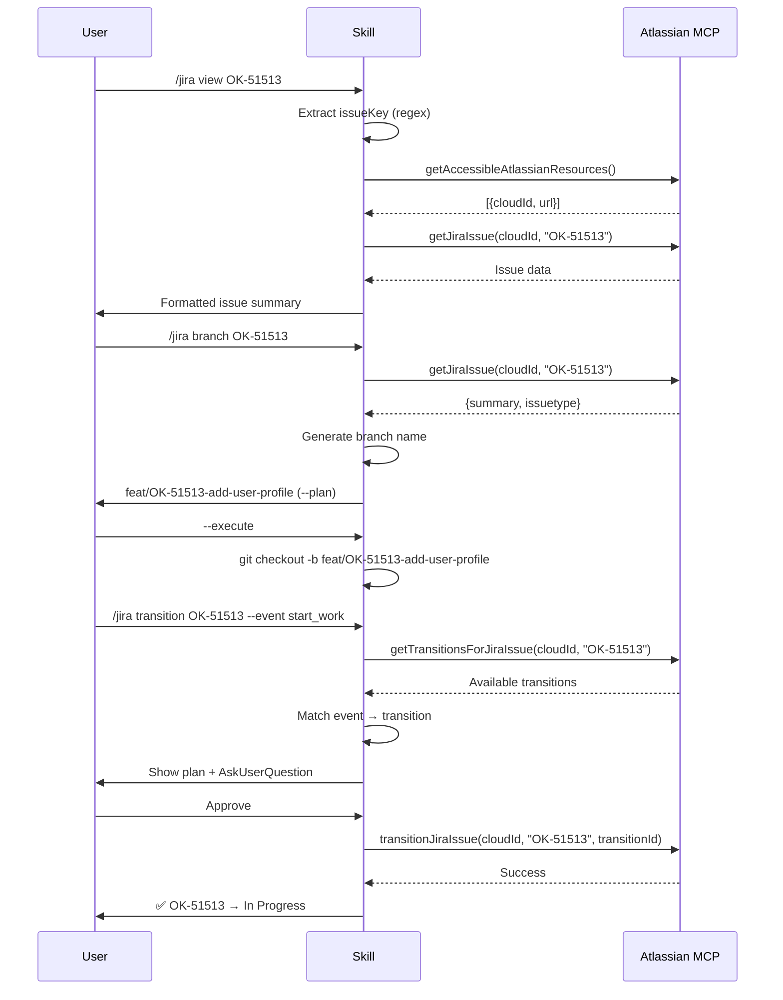

# Jira Skill Technical Spec

## 1. Requirement Summary

- **Problem**: 開發者在 Claude Code 中無法直接操作 Jira ticket。需要切換到瀏覽器查看 issue、手動建分支、手動更新狀態。
- **Goals**:
  1. 從 Jira ticket 自動產生符合專案慣例的 branch name
  2. 查看 Jira issue 詳情（不離開 CLI）
  3. 透過 event vocabulary 執行狀態流轉
  4. Zero-config：不需要在 CLAUDE.md 配置 Jira-specific placeholder
  5. Pluggable：有 Atlassian MCP 就用，沒有就 graceful skip
- **Scope**:
  - v1: `view` / `branch` / `transition` 三個 subcommand
  - v2 (deferred): GitHub Issue ↔ Jira 雙向同步、`create` subcommand

## 2. Existing Code Analysis

### Related Modules

| Module | 關聯 | 可重用 |
|--------|------|--------|
| `skills/issue-analyze/` | GitHub issue 分析，最近的類比 | Workflow 結構 |
| `skills/create-pr/` | Ticket extraction from branch name | `{TICKET_PATTERN}` regex |
| `skills/contract-decode/` | Knowledge skill + graceful degradation | Degradation 模式 |
| `skills/smart-commit/` | Plan/execute + AskUserQuestion | Write safety pattern |
| `rules/git-workflow.md` | `feat/*\|fix/*\|docs/*\|refactor/*` 慣例 | Branch prefix |
| `CLAUDE.template.md` | `{TICKET_PATTERN}`, `{ISSUE_TRACKER_URL}` | 沿用 |

### Reusable Components

- **Ticket extraction regex**: `[A-Z]+-\d+`（已在 `create-pr` 使用）
- **Branch prefix mapping**: `feat/*\|fix/*\|docs/*\|refactor/*`（`git-workflow.md`）
- **Plan/execute pattern**: `--plan` default + `--execute` + `AskUserQuestion`（`smart-commit`, `push-ci`）
- **Graceful degradation**: try → degrade pattern（`contract-decode`, `best-practices`）

### Files to Create

| File | Purpose |
|------|---------|
| `skills/jira/SKILL.md` | Skill 定義 |
| `skills/jira/references/branch-policy.md` | Branch naming 規則 |
| `skills/jira/references/transition-mapping.md` | Event → transition 對應 |
| `commands/jira.md` | Command entry point |
| `test/commands/jira.test.js` | Command schema 測試 |

## 3. Technical Solution

### 3.1 Architecture Design





### 3.2 Input Parser

**Accepts**:

| Input Format | Example | 擷取 |
|-------------|---------|------|
| Bare key | `OK-51513` | key=`OK-51513` |
| Full URL | `https://onekeyhq.atlassian.net/browse/OK-51513` | key=`OK-51513`, host=`onekeyhq.atlassian.net` |
| Software URL | `https://onekeyhq.atlassian.net/jira/software/.../OK-51513` | key=`OK-51513`, host=`onekeyhq.atlassian.net` |
| Branch name context | (auto from `git branch --show-current`) | key via `{TICKET_PATTERN}` |

**Regex**:

```
issueKey: ([A-Z][A-Z0-9]+-\d+)
host: https?://([^/]+\.atlassian\.net)
```

### 3.3 CloudId Resolution

```
getAccessibleAtlassianResources()
  → 0 results: ⚠️ "Atlassian MCP 未設定或未授權"
  → 1 result: 自動使用
  → N results:
      有 host match? → 使用匹配的 cloudId
      無 host?       → AskUserQuestion 選擇 instance
```

**不持久化 cloudId**：每次操作從 MCP 取，Claude context 自然快取。

### 3.4 Subcommand: `view`

| Step | Action |
|------|--------|
| 1 | Parse input → issueKey |
| 2 | Resolve cloudId |
| 3 | `getJiraIssue(cloudId, issueKey, responseContentFormat: "markdown")` |
| 4 | Format output: key, summary, status, assignee, priority, description excerpt |

**Output Format**:

```markdown
## OK-51513: Add user profile page

| Field | Value |
|-------|-------|
| Status | In Progress |
| Assignee | John Doe |
| Priority | Medium |
| Type | Story |
| Created | 2026-03-10 |

### Description
(truncated first 500 chars)
```

### 3.5 Subcommand: `branch`

| Step | Action |
|------|--------|
| 1 | Parse input → issueKey |
| 2 | Resolve cloudId |
| 3 | `getJiraIssue` → summary + issuetype |
| 4 | Map issue type → branch prefix |
| 5 | Generate branch name |
| 6 | Check collision (local + remote) |
| 7 | Output plan or execute |

**Issue Type → Branch Prefix Mapping**:

| Jira Issue Type | Branch Prefix | Override |
|----------------|---------------|---------|
| Bug | `fix/` | `--type fix` |
| Story | `feat/` | `--type feat` |
| Task | `feat/` | `--type feat` |
| Sub-task | `feat/` | `--type feat` |
| Documentation | `docs/` | `--type docs` |
| (other) | `feat/` (fallback) | `--type feat\|fix\|docs\|refactor` |

> **`--type` 限制**：僅接受 `feat`、`fix`、`docs`、`refactor`（與 `git-workflow.md` 一致）。傳入其他值時回傳錯誤：「Invalid type '<value>'. Allowed: feat, fix, docs, refactor」。

**Branch Name Generation**:

```
1. slug = summary.toLowerCase()
              .replace(/[^a-z0-9\s-]/g, '')
              .trim()
              .replace(/\s+/g, '-')
              .slice(0, 40)
2. branch = `${prefix}/${issueKey}-${slug}`
3. if exists locally or remotely → append `-2`, `-3`...
```

**Collision Detection**:

```bash
git branch --list "${branch}"
git ls-remote --heads origin "${branch}"
```

**Plan Mode** (default):

```
Branch: feat/OK-51513-add-user-profile-page
From: OK-51513 "Add user profile page" (Story)

To create: git checkout -b feat/OK-51513-add-user-profile-page
```

**Execute Mode** (`--execute`):

```bash
git checkout -b feat/OK-51513-add-user-profile-page
```

### 3.6 Subcommand: `transition`

| Step | Action |
|------|--------|
| 1 | Parse input → issueKey + `--event` |
| 2 | Resolve cloudId |
| 3 | `getJiraIssue` → current status |
| 4 | `getTransitionsForJiraIssue` → available transitions |
| 5 | Match event → target transition |
| 6 | Show plan + AskUserQuestion |
| 7 | Execute `transitionJiraIssue` |

**Event Vocabulary**:

| Event | Target Status Pattern | Regex Match |
|-------|----------------------|-------------|
| `start_work` | In Progress, In Development, Developing | `/in.*(progress\|dev)/i` |
| `pr_opened` | In Review, Code Review, Review | `/review/i` |
| `pr_merged` | Done, Closed, Resolved | `/(done\|closed\|resolved)/i` |

**Resolution Algorithm**:

```
1. Fetch available transitions for issue
2. For each transition, match target status name against event regex
3. If 1 match → use it
4. If 0 matches → ⚠️ "No matching transition for event '<event>'"
5. If >1 matches → AskUserQuestion to choose
6. If current status already matches target → skip with message
```

**Plan Mode** (default):

```markdown
## Transition Plan

- Issue: OK-51513 "Add user profile page"
- Current: To Do
- Event: start_work
- Target: In Progress (transition id: 21)
- Comment: (optional, from --comment)

Execute? /jira transition OK-51513 --event start_work --execute
```

### 3.7 Graceful Degradation

| Failure | Behavior |
|---------|----------|
| MCP tools not available | Skip MCP, output: "Atlassian MCP 未連接。請在 claude.ai 設定中啟用 Atlassian integration。" |
| OAuth expired | Output: "Atlassian 授權已過期。請重新授權。" |
| Issue not found | Output: "找不到 issue `<KEY>`。請確認 key 正確且有存取權限。" |
| Transition not available | Output: "目前狀態 `<status>` 無法執行 `<event>`。可用 transitions: ..." |
| Network error | Output: "Atlassian API 無法連線。請稍後重試。" |

### 3.8 MCP Tool Usage

| Operation | MCP Tool | Required Params |
|-----------|----------|-----------------|
| List instances | `getAccessibleAtlassianResources` | (none) |
| Read issue | `getJiraIssue` | `cloudId`, `issueIdOrKey` |
| Search issues | `searchJiraIssuesUsingJql` | `cloudId`, `jql` |
| Get transitions | `getTransitionsForJiraIssue` | `cloudId`, `issueIdOrKey` |
| Execute transition | `transitionJiraIssue` | `cloudId`, `issueIdOrKey`, `transition.id` |
| Add comment | `addCommentToJiraIssue` | `cloudId`, `issueIdOrKey`, `commentBody` |

**Tool Contract 驗證**：MCP tool 名稱可能隨 Atlassian integration 版本變更。Skill 啟動時透過 try-invoke `getAccessibleAtlassianResources` 進行 runtime 驗證。若呼叫失敗（tool not found 或 auth error），進入 graceful degradation 路徑（§3.7）。不在 build time 硬編碼 tool 名稱假設。

## 4. Risks and Dependencies

| Risk | Impact | Mitigation |
|------|--------|------------|
| Atlassian MCP 不可用 | Skill 完全無法操作 Jira | Graceful degradation + 手動指引 |
| OAuth token 過期 | 中途失敗 | 明確錯誤訊息 + 重試指引 |
| Jira workflow 差異大 | Event mapping 找不到 match | Regex-based match + fallback ask user |
| Branch name 衝突 | 無法建立分支 | Collision detection + `-N` suffix |
| Rate limiting | API 請求被拒 | 單次操作 ≤ 3 API calls，不太可能觸發 |
| 跨 instance project key 重疊 | 操作到錯誤 instance | Host match + AskUserQuestion |

**Dependencies**:

| Dependency | Type | Status |
|------------|------|--------|
| Atlassian MCP (claude.ai) | External | Available |
| Git CLI | Local | Available |
| `{TICKET_PATTERN}` config | Plugin | Already exists |

## 5. Work Breakdown

| # | Task | Effort | Output |
|---|------|--------|--------|
| 1 | Create `skills/jira/SKILL.md` | M | Skill definition |
| 2 | Create `skills/jira/references/branch-policy.md` | S | Branch naming rules |
| 3 | Create `skills/jira/references/transition-mapping.md` | S | Event → transition mapping |
| 4 | Create `commands/jira.md` | S | Command entry point |
| 5 | Create `test/commands/jira.test.js` | S | Schema validation test |
| 6 | Add `allowed-tools` to `commands/jira.md` frontmatter | S | MCP tool access declaration |
| 7 | Update README command tables (6 locales) | M | Documentation |
| 8 | End-to-end testing with real Jira | M | Verification |

**Estimated total**: 3-4 work items (Tasks 1-5 can be done in one session)

## 6. Testing Strategy

| Type | Test | File |
|------|------|------|
| Schema | Command file structure validation | `test/commands/jira.test.js` |
| Schema | SKILL.md frontmatter + references integrity | `test/commands/skills-schema.test.js` (existing) |
| Unit | Input parser（bare key, URL, software URL, invalid） | `test/commands/jira.test.js` |
| Unit | Branch name generator（slug, collision suffix, length） | `test/commands/jira.test.js` |
| Unit | Event → transition matching（1 match, 0 match, N match） | `test/commands/jira.test.js` |
| Unit | `--type` validation（valid enum, rejected values） | `test/commands/jira.test.js` |
| Manual | `view` with real Jira instance | E2E |
| Manual | `branch` generation + collision detection | E2E |
| Manual | `transition` with real Jira workflow | E2E |
| Manual | Graceful degradation (MCP disabled) | E2E |

**測試策略**：Parser、branch name generator、event-to-transition matcher 皆為純邏輯，可用 mocked MCP responses 進行 unit test（符合 `rules/testing.md` Unit 類型允許 mock）。E2E 測試需真實 Jira instance 手動驗證。

## 7. Open Questions

| # | Question | Impact | 建議 |
|---|----------|--------|------|
| 1 | 是否需要 `create` subcommand（從 CLI 建 Jira ticket）？ | Scope | Defer to v2 |
| 2 | Transition 後是否自動加 comment（如 "Branch created: feat/..."）？ | UX | 建議 optional `--comment` flag |
| 3 | 是否需要 `search` subcommand（JQL 查詢）？ | Scope | 可考慮 v1.1 |
| 4 | `commands/jira.md` 的 `allowed-tools` 是否需逐一列舉 MCP tool，或可用 prefix pattern？ | Implementation | 逐一列舉確保安全 |
| 5 | Atlassian MCP 工具可用性偵測的最佳方式？（try-invoke vs list-tools） | Reliability | 建議 try-invoke `getAccessibleAtlassianResources`（§3.8 已採用） |
