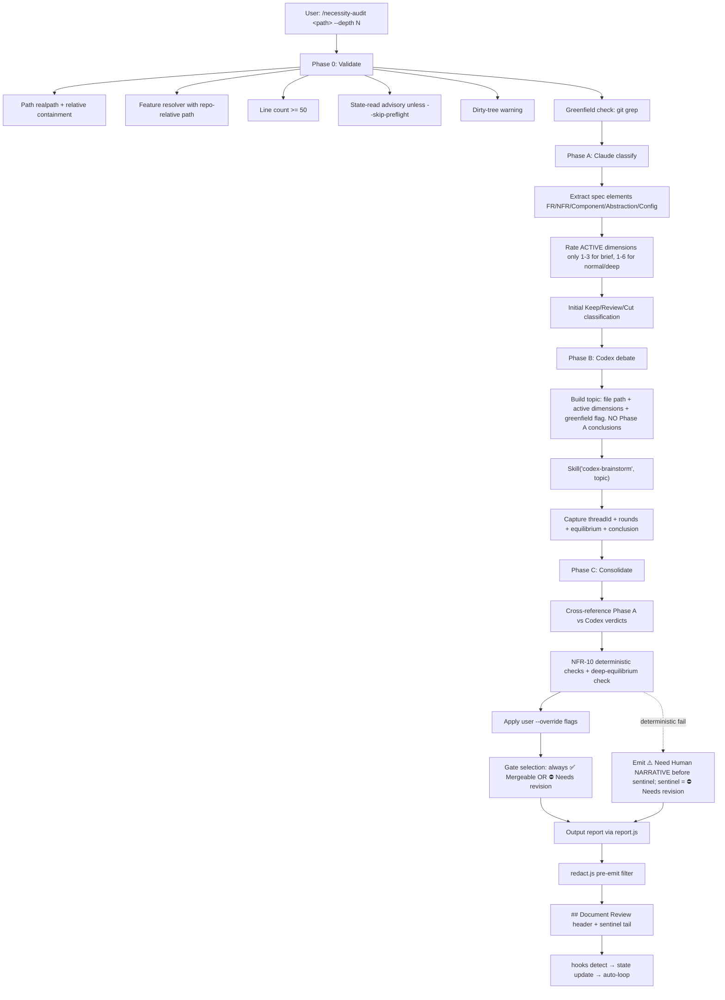

# Necessity Audit Technical Spec

> **Doc class**: Lifecycle — Phase 2 tech spec (per `@rules/docs-numbering.md`).
> **Created**: 2026-04-20
> **Updated**: 2026-04-20
> **Requirements**: [1-requirements.md](./1-requirements.md)
> **Skill name**: `necessity-audit`

## 1. Requirement Summary

- **Problem**: 紮實的 spec pipeline 會讓每個階段「加資訊」，現有審核全都「找缺漏」，缺乏對抗性**必要性審核**機制。
- **Goals**: 對 lifecycle spec 執行 6 維度 YAGNI/KISS 審核 + Codex 對抗辯論，輸出 Keep/Review/Cut 三層分類 + gate sentinel；整合 auto-loop；沿用既有 hook 契約。
- **Scope (in)**: `1-/2-/3-/4-*.md` spec 審核；Codex debate via `/codex-brainstorm`；code 作為 evidence（條件性）。
- **Scope (out)**: 自動刪減（只建議）；code 層抽象審核（交給 `/simplify`）；跨 feature portfolio；預設排除 `0-feasibility-study.md`（`--include-feasibility` override）。

## Implementation Status (2026-04-20)

| Phase / Artifact | Status |
|-----------------|--------|
| SKILL.md (thin entry) | ✅ Implemented (`skills/necessity-audit/SKILL.md`) |
| `references/*.md` (6 reference files) | ✅ Implemented |
| `preflight.js` (Phase 0) | ✅ Implemented |
| `debate-topic.js` (Phase B build/parse) | ✅ Implemented |
| `consolidate.js` (Phase C) | ✅ Implemented |
| `report.js` (Markdown/JSON assembler) | ✅ Implemented |
| `redact.js` (NFR-11 pre-emit filter) | ✅ Implemented |
| `elements.js` (Phase A extraction helper) | 🚧 Planned (currently Phase A runs inline in SKILL.md / LLM) |
| `classify.js` (Phase A rubric scoring) | 🚧 Planned |
| Unit tests (preflight / consolidate / debate-topic / redact / report) | ✅ Implemented |
| `elements.test.js` / `classify.test.js` | 🚧 Planned (extract with Phase B modules) |
| `integration.test.js` + fixture `test/fixtures/necessity-audit/` | 🚧 Planned |
| Performance timing evidence (NFR-8) | 🚧 Planned (deferred to T17) |

Unchecked wording like "implemented", "verified", "emitted" in later sections refers to the target state after the Planned items land. Cross-reference this table when auditing doc-code consistency.

## 2. Existing Code Analysis

| Asset | 用途 | 本 skill 互動方式 |
|-------|------|-----------------|
| `scripts/lib/feature-resolver.js` | Feature key 解析 + slug 驗證 | 直接 require；外加 realpath containment wrapper |
| `skills/codex-brainstorm/` | Nash-equilibrium 辯論 executor | **強制**經由 `Skill("codex-brainstorm", ...)` 呼叫 Phase B |
| `skills/best-practices/references/debate-guide.md` | Debate topic 格式 | 範本參考；建 necessity-audit 專用變體 |
| `skills/best-practices/references/output-templates.md` | Phase 4 schema（Debate threadId / Conclusion 欄位規則）| 報告 schema 參考 |
| `skills/doc-review/references/codex-prompt-doc.md` | Codex doc prompt 模板（`${FILE_PATH}` 變數、獨立研究區塊）| Phase C verdict `--continue` 直呼時的 prompt 起點 |
| `skills/doc-review/references/review-loop-doc.md` | `mcp__codex__codex-reply` 契約 | FR-8 實作範本 |
| `hooks/post-tool-review-state.sh` | MCP output 檢測 `## Document Review` + sentinel → 寫 `doc_review.passed` | FR-10 輸出格式貼合條件 |
| `hooks/stop-guard.sh` | state 主路徑 + transcript fallback 雙層 gate 檢測 | Sentinel 雙重相容 |
| `skills/codex-review-doc/SKILL.md` | Doc review thin-entry 入口 | FR-13 optional advisory source（**state-read only**，不 nested-invoke） |
| `scripts/security-redact.js` | 既有 executable redaction utility | NFR-11 `redact.js` 重用 high-confidence patterns |

**Target / Planned Artifact Layout** (✅ = exists, 🚧 = planned — see Implementation Status table at top):

```
skills/necessity-audit/
├── SKILL.md                          ✅ Thin entry, ≤200 lines
└── references/
    ├── phase-a-classify.md           ✅ Claude 分類 prompt
    ├── phase-b-debate-topic.md       ✅ codex-brainstorm topic builder
    ├── phase-c-consolidate.md        ✅ Verdict aggregation + gate logic
    ├── dimensions.md                 ✅ 6 維度精確定義 + rating rubric (含 depth→dim 對應表)
    ├── output-template.md            ✅ Markdown 報告模板
    ├── review-loop.md                ✅ --continue 流程
    └── redaction-rules.md            ✅ NFR-11 patterns

scripts/skills/necessity-audit/        # Executable orchestration layer (testable)
├── preflight.js                      ✅ Phase 0: path validation + realpath containment + doc-kind + line count + dirty-tree + greenfield detection
├── elements.js                       🚧 Phase A helper: extract FR/NFR/Component/Abstraction/Config from spec AST
├── classify.js                       🚧 Phase A scoring: dim rubric → Keep/Review/Cut (depth-filtered)
├── debate-topic.js                   ✅ Phase B: build debate topic (depth-filtered dimension list)
├── consolidate.js                    ✅ Phase C: merge Claude+Codex, apply overrides, deterministic checks, gate selection
├── redact.js                         ✅ NFR-11 redaction filter (reuses scripts/security-redact.js + adds audit-specific patterns)
└── report.js                         ✅ Markdown + JSON assembler

test/skills/necessity-audit/          # node:test unit + integration
├── preflight.test.js                  ✅
├── debate-topic.test.js               ✅
├── consolidate.test.js                ✅
├── redact.test.js                     ✅
├── report.test.js                     ✅
├── elements.test.js                   🚧
├── classify.test.js                   🚧
└── integration.test.js                🚧 Phase A→B→C with mocked Codex boundary

test/fixtures/necessity-audit/         🚧 (canonical fixture path; directory + content added in T18)
├── sample-over-designed-spec.md       🚧 hand-crafted spec with known Cut items
└── mock-debate-response.txt           🚧 Codex-style response with per-element verdicts
```

**Rationale for executable module split** (resolves Codex review P0 #7-#8):
- SKILL.md instructions are not deterministically testable — they describe Claude behavior
- `scripts/skills/necessity-audit/*.js` holds all verifiable logic (path validation, gate selection, redaction, depth mapping)
- SKILL.md delegates via `Bash` (`node scripts/skills/necessity-audit/<module>.js <args>`) following `scripts/lib/feature-resolver.js` + `scripts/security-redact.js` precedent
- Tests run via `node --test test/skills/necessity-audit/**/*.test.js`, mocking the MCP boundary via injected function (same as existing patterns)

## 3. Technical Solution

### 3.1 Architecture (Mermaid)



### 3.2 Module Layout & SKILL.md Contract

**SKILL.md responsibilities** (normative, thin entry ≤200 lines):
- Frontmatter: `name`, `description`, `allowed-tools: Read, Grep, Glob, Bash(git:*), Bash(node:*), Bash(wc:*), mcp__codex__codex, mcp__codex__codex-reply` (no `Skill` — built-in; `Bash(node:*)` required for §3.10 scripts bridge)
- Non-Negotiable Rules table（對齊 `/best-practices` 結構）
- Trigger / When NOT to Use / Commands
- Workflow 概覽（mermaid 或 phase table）
- Args table + `--depth` / `--continue` / `--skip-preflight` / `--include-feasibility` / `--override` / `--output`
- Output format contract（`## Document Review` header + sentinel）
- References 目錄索引
- Verification checklist

**Non-Negotiable Rules** (本 skill SKILL.md 的核心):

| # | Rule | Violation = |
|---|------|-------------|
| 1 | Phase A 分類結論**不得**出現在 Phase B debate topic 中 | Audit invalid |
| 2 | Phase B **必須**經 `Skill("codex-brainstorm", ...)`；裸 `mcp__codex__codex` 用於辯論視為 invalid | Audit invalid |
| 3 | Phase C 報告**必須**包含非空 `debate.threadId` | Report rejected |
| 4 | Phase C 報告**必須**包含引用具體 rounds 的 `Debate Conclusion`（不得空值 / placeholder）| Report rejected |
| 5 | 輸出必須以 `## Document Review` 開頭、以 `✅ Mergeable` 或 `⛔ Needs revision` 結尾（FR-10）| Auto-loop 無法識別 |

### 3.3 Data Model

#### 3.3.1 ClassifiedElement（Phase A / C 共用結構）

```typescript
// references/output-template.md 規範格式
type Dimension = 1 | 2 | 3 | 4 | 5 | 6;
type Classification = 'Keep' | 'Review' | 'Cut';
type ElementKind = 'FR' | 'NFR' | 'Component' | 'Abstraction' | 'Extensibility' | 'Config';

interface Evidence {
  type: 'file:line' | 'doc:section';
  location: string;         // e.g., "skills/foo/SKILL.md:42" or "2-tech-spec.md:§3.2"
  note?: string;
  reasoning_only?: true;    // present ⇒ greenfield fallback
}

interface ClassifiedElement {
  id: string;               // "FR-5", "NFR-3", "component:CacheLayer", "config:--verbose"
  kind: ElementKind;
  primary_dimension: Dimension;
  claude: {
    classification: Classification;
    rationale: string;      // ≤2 sentences
  };
  codex?: {                 // populated after Phase B
    classification: Classification;
    rationale: string;
    debate_rounds_ref: number[];  // e.g., [2, 4] — rounds in which this element was debated
  };
  evidence: Evidence[];
  user_override?: {         // present ⇒ user ran --override on this id
    kept_reason: string;
    timestamp: string;      // ISO 8601
  };
  final: Classification;    // Phase C: reconciled verdict
}
```

#### 3.3.2 AuditReport (full output)

```typescript
interface AuditReport {
  schema_version: 1;
  target_path: string;              // absolute, realpath-resolved
  feature_key: string;
  doc_kind: 'requirements' | 'tech-spec' | 'architecture' | 'implementation' | 'feasibility-override';
  greenfield: boolean;              // from git grep check
  depth: 'brief' | 'normal' | 'deep';
  preflight: 'advisory' | 'skipped';   // 'advisory' = state-read ran (with or without dirty-tree warning in `warnings[]`); 'skipped' = `--skip-preflight` banner emitted
  dimensions: Record<Dimension, {
    name: string;                   // e.g., "Necessity Now"
    severity: 'Clean' | 'Low' | 'Med' | 'High';  // aggregate over elements in this dim
    notes: string;
  }>;
  elements: ClassifiedElement[];
  debate: {
    threadId: string;
    rounds: number;
    equilibrium_reached: boolean;
    conclusion: string;             // refs specific rounds
    skill_invocation: 'codex-brainstorm';   // prove Rule #2 compliance
  };
  deterministic_checks: {           // NFR-10 (6 conditions; any fail → Need Human narrative + ⛔ gate)
    rounds_ok: boolean;              // debate.rounds >= 2
    has_evidence_citation: boolean;
    has_explicit_stance: boolean;
    has_threadId: boolean;
    equilibrium_required_met: boolean;  // deep-depth only: equilibrium_reached === true (else false)
    conclusion_references_rounds: boolean;  // SKILL.md Rule #4: conclusion references R<n> or "round N"
  };
  under_covered_dimensions: Dimension[];   // active dims not mentioned in debate.conclusion or rounds_text
  narrative: string[];              // advisory lines (e.g., "⚠️ Need Human: ...", "ℹ️ N elements kept via --override")
  gate: '✅ Mergeable' | '⛔ Needs revision';  // sentinel ONLY; Need Human is narrative above, not gate itself
  suggested_next: string[];         // e.g., ["/simplify skills/foo/", "Manual revision of FR-5"]
}
```

#### 3.3.3 State File Interaction

- **Read**: `.claude_review_state.json` 的 `doc_review.passed`（FR-13 pre-flight optional advisory，非強制）
- **Write**: None directly — hooks handle `doc_review` state when our MCP output is parsed

### 3.4 Public Interface (CLI Contract)

| Arg | Required | Default | Purpose |
|-----|----------|---------|---------|
| `<path>` | Yes | — | Target spec path (absolute or repo-relative) |
| `--depth brief\|normal\|deep` | No | `normal` | FR-11 depth mapping |
| `--continue <threadId>` | No | — | Resume Phase C verdict loop via `mcp__codex__codex-reply` |
| `--skip-preflight` | No | `false` | Skip FR-13 inline `/codex-review-doc` check |
| `--include-feasibility` | No | `false` | Allow `0-feasibility-study.md` as target (FR-1 override) |
| `--override <element-id>:<rationale>` | No (repeatable) | — | Mark Cut element as Kept with justification (Q8 resolved) |
| `--output markdown\|json` | No | `markdown` | FR-12 output format |

**Depth semantics** (single source of truth, FR-11 interpretation):

> **Design constraint**: `/codex-brainstorm` does not expose `min_rounds` / `max_rounds` input knobs — it internally uses min ~3, max 5 (see `skills/codex-brainstorm/SKILL.md` debate termination table). Therefore **rounds are observable, not controllable**. FR-11 depth is realized as **dimension coverage + equilibrium strictness**, not round count.

| Depth | Dimensions scored (Phase A) & challenged (Phase B topic) | Equilibrium requirement |
|-------|---------------------------------------------------------|-------------------------|
| `brief` | Dims 1-3 only (Necessity Now / Abstraction Justification / Extensibility Speculation) | Any termination accepted (Nash / convergence / max-rounds) |
| `normal` | All 6 dimensions | Any termination accepted (default) |
| `deep` | All 6 dimensions | **Nash equilibrium required** — if debate ends via convergence or max-rounds, emit `⚠️ Need Human` narrative and `⛔ Needs revision` gate |

Rounds observed are reported in `AuditReport.debate.rounds` for audit trail but not used as gate input.

### 3.5 Core Logic — Phase-by-Phase

#### Phase 0: Validate & Preflight (`scripts/skills/necessity-audit/preflight.js`)

1. **Path validation** (NFR-4; executable in preflight.js):

   ```javascript
   const raw = args.path;
   const absPath = fs.realpathSync(path.resolve(repoRoot, raw));
   const rel = path.relative(repoRoot, absPath);
   // Containment: relative path must not start with ".." and must not be absolute
   if (rel.startsWith('..') || path.isAbsolute(rel)) throw new Error('Path escapes repo');
   // Slug validation (after docs-path extraction)
   const m = rel.match(/^docs\/features\/([^/]+)\//);
   if (!m || !SLUG_RE.test(m[1])) throw new Error('Invalid feature slug');
   const featureKey = m[1];
   ```

2. **Feature resolver** (using repo-relative path per `feature-resolver.js:75` Level-3 contract):

   ```javascript
   const { resolveFeatureContext } = require('../../lib/feature-resolver');   // from scripts/skills/necessity-audit/preflight.js, resolves to scripts/lib/feature-resolver.js
   const relPath = path.relative(repoRoot, absPath);    // MUST be relative
   const ctx = resolveFeatureContext(repoRoot, currentBranch, [relPath], { featureKey });
   if (!ctx.key) throw new Error('⚠️ Need Human: feature unresolved');
   ```

   Absolute paths break Level-3 matching — always pass `path.relative()` result.
3. **Doc kind detection**:

   | Filename pattern | doc_kind | Accept? |
   |-----------------|---------|---------|
   | `0-feasibility-study*` | feasibility | Only with `--include-feasibility`; else reject |
   | `1-requirements.md` | requirements | Yes |
   | `2-tech-spec.md` | tech-spec | Yes |
   | `3-architecture.md` | architecture | Yes |
   | `4-*.md` | implementation | Yes |
   | else | — | Reject: not a lifecycle spec |

4. **Line-count check** (FR-13): `wc -l <abs_path>` ≥ 50 else hard block with message
5. **Doc-review advisory** (FR-13, revised — **no nested Skill invocation**):

   > **Pivot rationale**: Nested `Skill("codex-review-doc", path)` would trigger `post-tool-review-state.sh` state writes during an outer audit run, and `check_passed()` does not recognize `✅ Mergeable` (only `## Gate: ✅` / `✅ All Pass`). Nesting creates state-write races. Instead: **session-level advisory only** (cannot confirm target-binding because state schema lacks `last_file`).

   - Read `.claude_review_state.json` `doc_review` field (best-effort; non-existent file is OK)
   - If `doc_review.passed === true` AND `doc_review.last_run` is after target file's `git log -1 --format=%ct` → **silent continue** (session-level hint that **a** recent doc review passed; **not** a guarantee it was this file)
   - Else → **advisory warning** (non-blocking): `ℹ️ No recent /codex-review-doc pass detected in this session. Recommend running /codex-review-doc first.` Continue execution.
   - `--skip-preflight` → suppress the advisory AND emit banner `[PREFLIGHT SKIPPED]` at top of report (per FR-13 clause c)
6. **Dirty-tree warning** (FR-13): if `git status --porcelain -- <abs_path>` non-empty → emit `⚠️ Dirty working tree on target; necessity audit reflects uncommitted state` and proceed
7. **Greenfield detection** (FR-5, single operational rule):

   ```bash
   # primary
   if git grep -l -E "${FEATURE_KEY}" -- . ':(exclude)docs/**' ':(exclude)**/*.md' 2>/dev/null | head -1; then
     greenfield=false
   else
     # fallback (older Git)
     if git grep -l -E "${FEATURE_KEY}" -- . 2>/dev/null | grep -vE '^docs/|\.md$' | head -1; then
       greenfield=false
     else
       greenfield=true
     fi
   fi
   ```

#### Phase A: Claude Classification

- **Prompt**: `references/phase-a-classify.md` — deterministic template with `${TARGET_PATH}`, `${DOC_KIND}`, `${DIMENSIONS_REF}`, `${GREENFIELD}`, `${ACTIVE_DIMENSIONS}` variables
- **Depth-based dimension filtering** (enforces FR-11 observable semantics):

  ```
  ACTIVE_DIMENSIONS = depth === 'brief' ? [1, 2, 3] : [1, 2, 3, 4, 5, 6]
  ```

  Only `ACTIVE_DIMENSIONS` are scored and included in Phase B topic. Inactive dimensions are reported as `skipped` in the final report.
- **Logic** (planned — see Implementation Status table at top; `elements.js` + `classify.js` to land in T2-T3; today Phase A runs inline via SKILL.md LLM instructions):
  1. `elements.js` — read target file and parse into typed elements per `doc_kind`:
     - requirements.md: FRs from `## 5. Functional Requirements` table rows; NFRs from `## 6. ...` table rows; assumptions from `## 7. ...`
     - tech-spec.md: components from `## 3. Technical Solution` headings; abstractions from `## 3.x Architecture` Mermaid nodes; configs from CLI tables
     - architecture.md: components + integration points
  2. `classify.js` — for each element, score only `ACTIVE_DIMENSIONS` (High/Med/Low/Clean)
  3. Initial classification: `Cut` if ≥1 active dim High; `Review` if ≥2 active dims Med; else `Keep`
  4. Attach evidence: `file:line` (code exists) or `doc:section` + `[REASONING-ONLY]` (greenfield)
- **Output**: `ClassifiedElement[]` with `claude.*` populated; `codex.*` empty; inactive dims omitted from `primary_dimension` pool

#### Phase B: Codex Debate (via Skill("codex-brainstorm"))

**Design Decision — Single structured debate over per-dimension fan-out**:

| Approach | Pros | Cons | Decision |
|----------|------|------|----------|
| Single structured debate | 1 threadId; matches `/best-practices`; lower cost; topic explicitly requests coverage of all active dimensions (coverage verified post-hoc in Phase C, not contract-level) | Dimensions may blur; under-coverage possible → mitigated by narrative warning | ✅ Chosen |
| Per-dimension (6 debates) | Focused per axis | 6× cost; 6 threadIds harder to report | ❌ Deferred to v2 |
| Per-element | Maximum focus | N× cost, often N=20+; untenable | ❌ Rejected |

**Debate topic builder** (`scripts/skills/necessity-audit/debate-topic.js` produces string; `references/phase-b-debate-topic.md` documents template):

```
## Topic (necessity audit of ${TARGET_PATH})

Determine which elements in the spec are over-designed. Challenge necessity across the active dimensions only:
${ACTIVE_DIM_BULLETS}    // e.g., for --depth brief: only dims 1-3 listed

## Constraints
- Target file: ${TARGET_PATH}
- Feature key: ${FEATURE_KEY}
- Greenfield: ${GREENFIELD}  (if true: challenge via doc:section only)
- Depth: ${DEPTH}
- Termination preference: ${TERMINATION_PREF}   // "Nash equilibrium required" iff deep, else "any termination"
- Forbidden: reading Claude's pre-classification (not provided)
- Required evidence format: file:line (if code exists) or doc:section + [REASONING-ONLY] (if greenfield)

## ⚠️ Research independently ⚠️
- cat ${TARGET_PATH}
- ls docs/features/${FEATURE_KEY}/
- if not greenfield: grep -rE "${FEATURE_KEY}" -- . ':(exclude)docs/**' ':(exclude)**/*.md'

## Note on rounds
This skill does not control round count (upstream /codex-brainstorm uses its own ~3-5 round window). Run until equilibrium or convergence per that skill's own termination logic. Report actual rounds observed.
```

**Single-debate-over-N-dimensions trade-off** (resolves Codex review P0 #2/P2):
- Design choice: ONE `Skill("codex-brainstorm")` invocation carries N active dimensions in its topic (N ∈ {3, 6})
- Risk: Codex may under-explore low-priority dimensions in a single thread
- Mitigation: topic constraints **explicitly require each active dimension receive at least one challenge + response cycle**; Phase C verifies coverage via regex over `debate.conclusion + debate.rounds_text` per dimension name; under-covered dims populate `AuditReport.under_covered_dimensions[]` and emit `⚠️ Need Human` narrative line (not fatal to gate)
- Escape hatch: if under-coverage is systematic across users, v2 moves to per-dimension fan-out (see Open Q7)
- **Verifiable claim**: Codex is asked to cover all active dims; we **observe** rounds + conclusion content post-hoc. We do **not** claim round-allocation-by-dimension as a contract — that would require round control which `/codex-brainstorm` does not expose.

Invocation:

```
Skill("codex-brainstorm",
  `Topic: ... (built from phase-b-debate-topic.md)
   Constraints: ...`)
```

Capture from Skill response: `threadId`, `rounds`, `equilibrium_reached`, debate conclusion text. Parser lives in `scripts/skills/necessity-audit/debate-topic.js::parseDebateResponse()`.

#### Phase C: Consolidate Verdict (`scripts/skills/necessity-audit/consolidate.js`)

1. **Merge Phase A + Codex verdicts**:
   - If Codex and Claude agree → `final = both`
   - If disagree → `final = stricter` (Keep→Review→Cut is strict direction); record both rationales
2. **Apply `--override`**: for each overridden element, set `final = Keep`, record `user_override`
3. **NFR-10 deterministic checks — 6 conditions** (all must pass for debate validity; any failure → emit `⚠️ Need Human` narrative + `⛔ Needs revision` gate):

   ```javascript
   rounds_ok                    = debate.rounds ≥ 2            // minimum for meaningful debate (3 is codex-brainstorm min; <2 indicates error)
   has_evidence_citation        = elements.some(e => e.codex?.evidence?.length > 0)
   has_explicit_stance          = /\b(Challenge|Defend|Accept|Reject|Concede)\b/i.test(debate.conclusion)
   has_threadId                 = debate.threadId.length > 0
   equilibrium_required_met     = (depth !== 'deep') || (debate.equilibrium_reached === true)   // FR-11 deep-depth gate
   conclusion_references_rounds = /\b(?:round\s+\d+|R\d+)\b/i.test(debate.conclusion)            // SKILL.md Rule #4 enforcement
   ```

   Empty findings with **all 6 checks** pass = legitimate `✅ Mergeable`. Note: `equilibrium_required_met` is trivially true for `brief` / `normal` (no equilibrium required); only `deep` depth forces it false when debate ended via convergence or max-rounds. `conclusion_references_rounds` enforces SKILL.md Rule #4 (Debate Conclusion must reference specific rounds, not blank/placeholder).
4. **Active-dimension coverage check** (single-debate mitigation; **separate from NFR-10 deterministic block** — failure is advisory, not gate-fatal): for each active dimension, verify ≥1 challenge exchange mentions it (regex on `debate.conclusion + debate.rounds_text`). Under-covered dims populate `AuditReport.under_covered_dimensions[]` and emit `⚠️ Need Human` narrative line; gate is still decided by Cut-count rule below (coverage issues do NOT force `⛔`).
5. **Gate selection** (sentinel always ✅ or ⛔ for hook compatibility per `hooks/post-tool-review-state.sh:641`; `⚠️ Need Human` is narrative only):

   | Condition | Narrative line | Final sentinel |
   |-----------|----------------|---------------|
   | Any of 6 deterministic checks fails (includes `equilibrium_required_met` for deep, `conclusion_references_rounds` always) | `⚠️ Need Human: <reason>` | `⛔ Needs revision` |
   | Cut count == 0 AND no dimension under-covered AND checks pass | — | `✅ Mergeable` |
   | All Cut elements have `user_override` AND checks pass | `ℹ️ N elements kept via --override with rationale` | `✅ Mergeable` |
   | ≥1 Cut without override | `⛔ N elements flagged for removal` | `⛔ Needs revision` |
   | Dim under-covered but Cut count == 0 | `⚠️ Need Human: dim X under-covered in debate` | `✅ Mergeable` (advisory) |

   **Rationale**: `stop-guard.sh` state-read path + transcript-parsing fallback both expect `✅ Mergeable` / `⛔ Needs revision`. A final gate of `⚠️ Need Human` would leave auto-loop indeterminate. Therefore `⚠️ Need Human` is always a **narrative annotation** above the sentinel, never the sentinel itself.
6. **Dimension aggregate severity**: `High` if ≥2 Cut in dim; `Med` if 1 Cut or ≥2 Review; `Low` if ≥1 Review; `Clean` otherwise; `Skipped` if inactive per depth

### 3.6 Prompt Templates (references/ contents)

#### `references/dimensions.md` (authoritative rubric)

6 dimensions × 4-tier rubric (Clean/Low/Med/High). Each dim has:
- Definition
- Challenge questions
- Example of each severity level
- Typical evidence pattern

Used by Phase A (scoring) + Phase B (topic challenge questions).

#### `references/phase-a-classify.md`

Template with substitution vars + step-by-step instructions + output schema.

#### `references/phase-b-debate-topic.md`

Debate topic builder (see §3.5 Phase B). Contains verbatim constraints block.

#### `references/phase-c-consolidate.md`

Aggregation algorithm + gate selection logic + `--override` handling.

#### `references/output-template.md`

Full Markdown report format (see §3.7).

#### `references/review-loop.md`

`--continue <threadId>` flow via `mcp__codex__codex-reply`.

#### Redaction (NFR-11) — executable module

Redaction is **deterministic code in `scripts/skills/necessity-audit/redact.js`**, not behavior-layer instructions (pivoted per Codex review P0 #7). Follows `scripts/security-redact.js` precedent:

- **Reuse**: delegates AWS/token/PEM-key detection to `scripts/security-redact.js` exports
- **Add**: audit-specific rules (long hex strings, secrets inside debate conclusion text, email pattern, full Ethereum addresses → mask middle)
- **Invocation**: SKILL.md instructs `Bash: node scripts/skills/necessity-audit/redact.js --in <report.md> --out <redacted.md>` as the final step before emission
- **Test**: `test/skills/necessity-audit/redact.test.js` — feeds mock-secret-laden report, asserts output contains no raw secret

References file `references/redaction-rules.md` documents the pattern list for reviewer awareness; enforcement lives in `redact.js`.

### 3.7 Output Report Format (Markdown)

```markdown
## Document Review

**Target**: `docs/features/<key>/2-tech-spec.md`
**Feature**: `<key>` (greenfield: false)
**Depth**: normal · Preflight: passed
**Schema**: v1

### Dimension Overview

| # | Dimension | Severity | Notes |
|---|-----------|----------|-------|
| 1 | Necessity Now | Med | 2 Review items |
| ... | ... | ... | ... |

### Classification

#### Keep (8 items)
| ID | Kind | Rationale (consolidated) |
|----|------|--------------------------|
| FR-1 | FR | Core scope, no challenge raised |

#### Review (3 items)
| ID | Kind | Dim | Claude | Codex | Evidence |
|----|------|-----|--------|-------|----------|
| NFR-8 | NFR | 5 | Review | Review | `skills/foo/bench.js:42` |

#### Cut (2 items — unless overridden)
| ID | Kind | Dim | Codex rationale | Evidence | Override? |
|----|------|-----|-----------------|----------|-----------|
| FR-12 | FR | 4 | Configurability with no consumer | `doc:§3.4 [REASONING-ONLY]` | ❌ |

### Debate

- **Thread**: `019daac6-xxxx` (provider: codex-brainstorm)
- **Rounds**: 3 · **Equilibrium**: ✅
- **Conclusion**: Round 2 established that FR-12's configurability has no named consumer; round 3 confirmed after Claude's defensive argument failed. See threadId for full trace.

### Deterministic Checks (NFR-10)

| Check | Result |
|-------|--------|
| rounds ≥ 2 (minimum meaningful debate) | ✅ |
| deep-depth equilibrium (only checked if `--depth deep`) | ✅ / N/A |
| Codex evidence citations ≥ 1 | ✅ |
| Codex stance keywords present | ✅ |
| threadId non-empty | ✅ |

### Suggested Next

- Revise `FR-12` in `2-tech-spec.md` (remove configurability) — or re-run with `--override FR-12:"needed for rollout plan Q3"`
- Consider `/simplify docs/features/<key>/2-tech-spec.md` to batch cleanup

### Gate

⛔ Needs revision
```

### 3.8 Integration Points

| Integration | Mechanism | Failure mode |
|-------------|-----------|--------------|
| ~~`Skill("codex-review-doc")` pre-flight~~ | ~~removed — state side-effect risk~~ | Replaced by state advisory + line check + dirty-tree warn (§3.5 Phase 0.5) |
| `Skill("codex-brainstorm")` Phase B | Skill tool invocation (built-in); capture threadId/rounds/equilibrium via response parser in `debate-topic.js::parseDebateResponse()` | Missing threadId or rounds < 2 → `⚠️ Need Human` narrative + `⛔` gate |
| `mcp__codex__codex-reply` for Phase C loop | Direct MCP call with `--continue <threadId>`; `sandbox: 'read-only'`, `approval-policy: 'never'` (per NFR-3) | Invalid threadId → user-visible error, no state write |
| `scripts/lib/feature-resolver.js` | `require()` from `scripts/skills/necessity-audit/preflight.js`; input MUST be repo-relative (see §3.5 Phase 0.2) | Unresolved key → `⚠️ Need Human` narrative |
| `scripts/security-redact.js` | `require()` from `scripts/skills/necessity-audit/redact.js`; reuse high-confidence patterns | Non-fatal: medium-confidence pattern mask; high-confidence AbortError throws |
| `hooks/post-tool-review-state.sh` | Emit `## Document Review` + `✅`/`⛔` sentinel → hook parses MCP output (line 641) | Malformed output → hook no-op (safe) |
| `hooks/stop-guard.sh` | State-read primary path; transcript sentinel as fallback safety-net | Two-layer defense consistent with existing doc review pattern |

### 3.9a FR-9 `When NOT to Use` Matrix (SKILL.md embedded content)

SKILL.md `When NOT to Use` section MUST include a condensed Reasoning-vs-Necessity 2×2 matrix (from `1-requirements.md §11`) so reviewers can self-triage before invoking the skill:

```markdown
## When NOT to Use

### Alternatives by intent

| Intent | Use | Not this skill |
|--------|-----|----------------|
| 「這段推理站得住嗎？」 | `/codex-review-spec` (planned) / `/review-spec` | — |
| 「這個 spec 完成了嗎？」 | `/feature-completeness` (planned) | — |
| 「這個 code 是否過度抽象？」 | `/simplify` / `/refactor` | — |
| 「這個實作符合產業標準嗎？」 | `/best-practices` | — |
| **「這個 spec 是否過度設計？需要砍嗎？」** | **`/necessity-audit` ← 本 skill** | — |

### Chain recommendation

`/codex-review-doc` (細節) → `/codex-review-spec` (推理，規劃中) → **`/necessity-audit` (必要性，本 skill)** → `/feature-completeness` (完整性，規劃中) → `/review-spec` (綜合)
```

Trace row added to Appendix A for FR-9 compliance verification.

### 3.9 Security Design

| Control | Implementation | Test |
|---------|---------------|------|
| Path validation | `preflight.js`: `fs.realpathSync` + `path.relative(repoRoot, abs)` boundary check (rejects `..`, absolute, repo-external symlink) + slug regex from `feature-resolver.js:9` | 5 unit tests (NFR-4 signals): legal slug / `..` traversal / absolute / repo-external symlink / repo-internal dir-external symlink |
| Codex prompt no-feeding | `debate-topic.js` template strings contain no Claude classification; assertion-time unit test verifies output does NOT contain `claude_classification` / Phase A rationale | `debate-topic.test.js` |
| Output redaction | `redact.js` executable pre-emit filter; reuses `scripts/security-redact.js` + adds audit-specific patterns | `redact.test.js` with mock-secret report |
| Codex sandbox | Direct `mcp__codex__codex-reply` calls in Phase C loop: `sandbox: 'read-only'`, `approval-policy: 'never'`. Phase B via `Skill("codex-brainstorm")` inherits that skill's own settings (`approval-policy: 'on-failure'` per its SKILL.md:62) — **documented inheritance, not our override** (see requirements NFR-3) | 🚧 Planned integration test asserts MCP call args (T17) |
| Nested debate recursion guard | Phase B invokes `codex-brainstorm`, which does NOT invoke `necessity-audit` — no recursion possible. Old nested `codex-review-doc` pre-flight was removed; recursion guard no longer needed | N/A |

### 3.10 SKILL.md ↔ scripts/ Bridge

SKILL.md delegates deterministic logic to `scripts/skills/necessity-audit/` modules via `Bash`. This pattern:
- Keeps SKILL.md thin (≤200 lines; NFR-7)
- Makes all gate/classification/redaction logic unit-testable
- Matches existing precedent (`scripts/lib/feature-resolver.js`, `scripts/security-redact.js`)

**Invocation flow** (SKILL.md pseudocode; all intermediate artifacts pass via **temp files** under `${TMPDIR}/necessity-audit-<pid>/` to avoid shell-escape issues with multi-line content):

```
SETUP: Create temp workspace:
  Bash: mktemp -d  →  TMPDIR

1. PREFLIGHT:
   Bash: node scripts/skills/necessity-audit/preflight.js --path <path> --depth <d> [--skip-preflight] [--include-feasibility] --output $TMPDIR/preflight.json
   Exit: 0 = OK, non-zero = hard block (line count, invalid path, invalid doc kind, feature unresolved)
   Output JSON: { absPath, relPath, featureKey, docKind, greenfield, activeDimensions, skipPreflight, banners[], warnings[] }
   Claude reads $TMPDIR/preflight.json; aborts if exit != 0.

2. PHASE A (LLM, no subprocess):
   Claude reads <absPath> using Read tool.
   Claude fills ${TARGET_PATH}, ${DOC_KIND}, ${ACTIVE_DIMENSIONS}, ${GREENFIELD} into references/phase-a-classify.md template.
   Claude classifies elements and writes result as JSON to $TMPDIR/phase-a.json (via Write tool).
   Schema: { elements: ClassifiedElement[] } — only `claude.*` fields populated.

3. BUILD DEBATE TOPIC:
   Bash: node scripts/skills/necessity-audit/debate-topic.js build --preflight $TMPDIR/preflight.json --output $TMPDIR/topic.txt
   Topic string written to $TMPDIR/topic.txt (no stdin/stdout string passing).

4. INVOKE DEBATE:
   Claude reads $TMPDIR/topic.txt.
   Claude routes by mode:
   - **Initial run** (no `--continue`): `Skill("codex-brainstorm", <topic contents>)` — drives Phase B debate
   - **Loop run** (`--continue <threadId>`): `mcp__codex__codex-reply` with the cached thread id — drives Phase C verdict recheck only (see `references/review-loop.md`)
   Claude writes the raw debate response to $TMPDIR/debate.txt (via Write tool).

5. PARSE DEBATE:
   Bash: node scripts/skills/necessity-audit/debate-topic.js parse --input $TMPDIR/debate.txt --output $TMPDIR/debate.json
   Output JSON: { threadId, rounds, equilibriumReached, conclusion, evidenceCitations[], roundsText }

6. CONSOLIDATE:
   Bash: node scripts/skills/necessity-audit/consolidate.js --phase-a $TMPDIR/phase-a.json --debate $TMPDIR/debate.json --preflight $TMPDIR/preflight.json --overrides "<id>:<rationale>[;...]" --depth <d> --output $TMPDIR/report.json
   Output JSON: full AuditReport schema (§3.3.2).

7. ASSEMBLE REPORT:
   Bash: node scripts/skills/necessity-audit/report.js --input $TMPDIR/report.json --format markdown --output $TMPDIR/report.md
   Markdown assembled per references/output-template.md.

8. REDACT:
   Bash: node scripts/skills/necessity-audit/redact.js --input $TMPDIR/report.md --output $TMPDIR/report.final.md
   Pre-emit secret/PII filter.

9. EMIT:
   Claude reads $TMPDIR/report.final.md and emits its contents as final user-visible message.
   Final message contains `## Document Review` header + ✅/⛔ sentinel for hook parsing.

CLEANUP: Claude deletes $TMPDIR via Bash: rm -rf $TMPDIR.
```

**CLI contract summary**:

| Module | Inputs | Outputs | Exit codes |
|--------|--------|---------|-----------|
| preflight.js | `--path`, `--depth`, `--skip-preflight?`, `--include-feasibility?`, `--output <file>` | JSON written to `--output` path | 0 = OK, 1 = invalid path, 2 = short file, 3 = invalid doc kind, 4 = feature unresolved |
| debate-topic.js `build` | `--preflight <file>`, `--output <file>` | Topic string written to `--output` | 0/1 |
| debate-topic.js `parse` | `--input <file>`, `--output <file>` | Parsed JSON written to `--output` | 0/1 |
| consolidate.js | `--phase-a <file>`, `--debate <file>`, `--preflight <file>`, `--overrides <str>?`, `--depth <d>`, `--output <file>` | Full AuditReport JSON written to `--output` | 0/1 |
| report.js | `--input <file>`, `--format markdown\|json`, `--output <file>` | Formatted report written to `--output` | 0/1 |
| redact.js | `--input <file>`, `--output <file>` | Redacted file written to `--output` | 0 = OK, 2 = high-confidence secret AbortError (blocks emission) |

**Rationale for file-based IPC**: (a) avoids shell escaping issues with multi-line Markdown, (b) enables fixture-based module tests (feed `phase-a.json` fixture → verify `consolidate.js` output), (c) aligns with `scripts/resolve-feature-cli.js` pattern (one-shot process per module), (d) temp dir cleanup isolates concurrent audits.

## 4. Risks and Dependencies

| Risk | Severity | Mitigation |
|------|----------|-----------|
| Nested `Skill()` invocation may conflict with outer auto-loop state | Med | Pre-flight only reads sentinel; does not trigger our own state writes (hooks handle both) |
| Codex debate drifts from necessity to reasoning (overlap with `/codex-review-spec`) | Med | Topic template explicitly says "necessity only; do not challenge reasoning"; dimension rubric enforces scope |
| 6 dimensions produce N^6 element combos → report bloat | Low | Element-level classification with `primary_dimension` only (not cross-product) |
| Greenfield detection false positive (feature key matches unrelated code) | Med | `git grep` restricted to non-docs/non-md; fallback manual via `--skip-preflight` awareness; document in release notes |
| User abuses `--override` to bypass all Cut items | Low | Override rationale is logged in report; downstream reviewer sees pattern |
| `/codex-brainstorm` max rounds = 5 (not controllable); `--depth deep` requires Nash equilibrium | Med | Per-FR-11 revision: if debate ends via convergence or max-rounds instead of equilibrium, Phase C emits `⚠️ Need Human` narrative + `⛔ Needs revision`; user can retry or lower depth |
| Codex MCP unavailable (offline) | Med | NFR-9 hard fail with guidance; Claude-only fallback deferred (see Open Q3) |
| Secret redaction regex miss (novel secret format) | Med | v1 best-effort; review quarterly; pair with `@rules/security.md` audit |

**Dependencies**:

| Type | Name | Version / State |
|------|------|----------------|
| Skill | `codex-brainstorm` | Implemented, Phase B executor (mandatory per NFR-2) |
| Skill | `codex-review-doc` | Implemented, **optional advisory source** via state read (FR-13 pivoted; not pre-flight) |
| Rule | `@rules/codex-invocation.md` | Normative |
| Rule | `@rules/auto-loop.md` | Normative (sentinel contract) |
| Hook | `hooks/post-tool-review-state.sh` | No modification needed |
| Hook | `hooks/stop-guard.sh` | No modification needed |
| Library | `scripts/lib/feature-resolver.js` | Reused (input MUST be repo-relative; see §3.5 Phase 0.2) |
| Library | `scripts/security-redact.js` | Reused for high-confidence secret patterns |
| Planned | `/codex-review-spec` | Not required for v1; v2 chain integration possible |
| Planned | `/feature-completeness` | Not required for v1 |

## 5. Work Breakdown

Trackable tickets (each ≤1 day; one ticket = one `requests/YYYY-MM-DD-*.md`):

| # | Ticket | Depends on | Size |
|---|--------|-----------|------|
| T0 | Scaffold `scripts/skills/necessity-audit/` executable module skeleton (module stubs + exports + main entry point) | — | S |
| T1 | Scaffold `skills/necessity-audit/SKILL.md` (thin entry + frontmatter + non-negotiable rules + command table + FR-9 2×2 matrix section) | T0 | S |
| T2 | Create `references/dimensions.md` (6 dim × 4-tier rubric with examples) | T1 | M |
| T3 | Create `references/phase-a-classify.md` (prompt template) + element extraction logic | T2 | M |
| T4 | Create `references/phase-b-debate-topic.md` (topic builder) + `Skill("codex-brainstorm")` wiring | T2 | M |
| T5 | Create `references/phase-c-consolidate.md` + gate logic + NFR-10 deterministic checks | T3, T4 | M |
| T6 | Create `references/output-template.md` (Markdown) + report assembler | T5 | S |
| T7 | Create `references/review-loop.md` (`--continue` via codex-reply) + Phase C update logic | T5 | S |
| T8 | `preflight.js`: path validation (realpath + relative containment) + feature resolver wrapper (repo-relative input) + doc-kind gate + line count | — | M |
| T9 | `preflight.js` doc-review advisory (state-read, non-blocking) + `--skip-preflight` flag with `[PREFLIGHT SKIPPED]` banner + dirty-tree warning | T8 | S |
| T10 | Greenfield detection in `preflight.js` (primary + fallback git grep) + `--greenfield` flag passthrough to Phase A prompt | T3 | S |
| T11 | `redact.js` executable pre-emit filter (reuse `scripts/security-redact.js` + add audit-specific patterns) + `references/redaction-rules.md` documentation | T6 | S |
| T12 | `consolidate.js` `--override <id>:<rationale>` parsing + user-override merging + `user_override` field | T5 | S |
| T13 | `--depth` flag parsing + `preflight.js` `activeDimensions[]` output + Phase A dim filtering + deep-depth equilibrium check in `consolidate.js` | T5 | S |
| T14 | `--include-feasibility` flag + doc-kind gate override + `[OVERRIDE: feasibility included]` banner | T8 | XS |
| T15 | `report.js` `--format json` serializer (FR-12 Could) | T6 | S |
| T16 | Unit tests: path validation (5 cases), greenfield detection, depth→activeDimensions mapping, redaction filter, `--override` merging, gate selection (5 cases — matches §6 unit table), deterministic checks (all 6 conditions) | T6-T14 | L |
| T17 | Integration tests via **dependency-injected mock MCP/Skill boundary**: full Phase A→B→C mock, advisory state-read, `--continue` routing, hook state update via fixture subprocess | T16 | L |
| T18 | E2E test against `test/fixtures/necessity-audit/sample-over-designed-spec.md` (hand-crafted fixture with known Cut items) — **NOT** this skill's own tech-spec, to avoid meta-loop | T17 | M |
| T19 | Register skill in `docs/skill-catalog.yml` + `/update-readme` + `/readme-i18n-sync` | T18 | S |
| T20 | `CLAUDE.md` command reference row insertion | T19 | XS |

Total estimate: ~3-4 days for v1 (excluding T15 if deferred). Critical path: T1→T2→T3→T4→T5→T6→T17.

## 6. Testing Strategy

Per `@rules/testing.md` three-layer pyramid.

### Unit (`test/skills/necessity-audit/*.unit.test.js`)

| Module | Test | Asserts |
|--------|------|---------|
| preflight.js | Path validation — 5 cases | Legal slug / `..` traversal / absolute path / repo-external symlink / repo-internal dir-external symlink |
| preflight.js | Greenfield detection primary | `git grep` stub returns 0 results → greenfield=true |
| preflight.js | Greenfield detection fallback | Primary path unavailable → fallback git grep invoked |
| preflight.js | Depth → activeDimensions | `brief→[1,2,3]`, `normal→[1..6]`, `deep→[1..6]` |
| preflight.js | Doc-kind gate | `0-feasibility-study.md` rejected without flag; accepted with `--include-feasibility` |
| preflight.js | State-read advisory | Present+fresh → silent; missing/stale → advisory line; `--skip-preflight` → `[PREFLIGHT SKIPPED]` banner |
| consolidate.js | Gate selection — 5 cases | No Cut → ✅ Mergeable; all Cut overridden → ✅ Mergeable + narrative; Cut without override → ⛔; deterministic fail → ⛔ + ⚠️ narrative; under-covered dim + no Cut → ✅ + ⚠️ narrative |
| consolidate.js | NFR-10 checks | rounds<2 / no evidence / no stance / empty threadId / deep-no-equilibrium — each triggers `⚠️ Need Human` narrative + `⛔` sentinel |
| consolidate.js | `--override` merging | Overridden elements get `user_override` field; counted in narrative |
| consolidate.js | Under-covered dim | Active dim not mentioned in conclusion → enters `under_covered_dimensions[]`; warning emitted |
| redact.js | Redaction filter | AWS key, token, PEM key, 0x-64-hex, email masked; high-confidence secret → exit 2 AbortError |
| report.js | Output MCP format | Response contains `## Document Review` header + one of `✅ Mergeable` / `⛔ Needs revision` at tail |
| debate-topic.js | No-feed check | Output topic does NOT contain `claude.classification` / Phase A rationale fields |
| debate-topic.js | Parse response | Valid response → full JSON; missing threadId → explicit null + error code |

### Integration (`test/skills/necessity-audit/integration.test.js`) — 🚧 Planned

> **Status**: Not yet implemented. File does not exist as of 2026-04-20 (see Implementation Status table at top). The matrix below is the **target design**, to be built in T17; current test coverage is unit-only.

Boundary mocking: scripts modules receive `mcpInvoker` / `skillInvoker` function parameters; tests inject mocks (Open Q8 resolution). MCP boundaries stubbed via Node.js `t.mock` API.

| Test | Scope |
|------|-------|
| Full Phase A→B→C with injected mock `codex-brainstorm` invoker | Happy path; final report schema valid; sentinel = ✅ |
| State-read advisory — stale state | Warning line in output; skill continues (non-blocking) |
| `--skip-preflight` + dirty tree | Both banners emitted in order (`[PREFLIGHT SKIPPED]` + `⚠️ Dirty working tree`) |
| `--continue <threadId>` | Routes to `mcp__codex__codex-reply` (fresh `mcp__codex__codex` not called); threadId preserved in report |
| `--include-feasibility` on `0-feasibility-study.md` | Accepted; `[OVERRIDE: feasibility included]` banner present |
| Greenfield spec (fixture with no implementation) | All evidence tagged `[REASONING-ONLY]` |
| Codex returns empty findings + all 6 checks pass | Sentinel = `✅ Mergeable`; no `⚠️ Need Human` narrative (legit empty pass) |
| Codex returns rounds < 2 | `⚠️ Need Human` narrative + `⛔ Needs revision` sentinel |
| `--depth deep` with convergence-but-no-equilibrium | `⚠️ Need Human: deep depth requires Nash equilibrium` narrative + `⛔` sentinel |
| Hook state update fixture | Feed emit output to `post-tool-review-state.sh` fixture harness → verify `doc_review.passed` correctly toggled |

### E2E (`test/skills/necessity-audit/*.e2e.test.js`) — 🚧 Planned

> **Status**: Not yet implemented. Files + fixture will be added in T18 (see Implementation Status table).

| Test | Scope |
|------|-------|
| Fixture-based E2E: run against `test/fixtures/necessity-audit/sample-over-designed-spec.md` (hand-crafted fixture with known Cut items; **NOT** this skill's own tech-spec, to avoid meta-loop per T18 / §7 Q4 resolution) | Produces valid report with expected Cut elements; `--skip-preflight`; assertion covers gate sentinel + narrative + schema |

**Test command**: `node --test test/skills/necessity-audit/**/*.test.js`

### Coverage targets

Per `@rules/testing.md`: happy path + error handling + edge cases (null, empty, extreme). AC trace via `/codex-test-review --ac-trace docs/features/necessity-audit/1-requirements.md` (adequacy gate advisory mode).

## 7. Open Questions

Design decisions **resolved in this tech-spec**:

- [x] **Q4 (requirements)**: 6 維度評分 — Per-element `Keep/Review/Cut` + dimension aggregate severity `Clean/Low/Med/High`（§3.3.1 / §3.5 Phase C step 6）
- [x] **Q5 (requirements)**: Phase A Claude 分類 — 採 template 化於 `references/phase-a-classify.md`
- [x] **Q6 (requirements)**: JSON 輸出 — `--output json` 採 `AuditReport` schema v1（§3.3.2）；v1 optional（T15）
- [x] **Q8 (requirements)**: Override 機制 — `--override <id>:<rationale>` 可重複；記錄於 `user_override`；只影響 gate 不影響 Codex rationale 原始紀錄
- [x] **Q9 (requirements)**: Secret redaction — `scripts/skills/necessity-audit/redact.js` executable pre-emit filter（重用 `scripts/security-redact.js` + 補 audit-specific 規則；於 §3.10 IPC step 8 執行；由 T11 實作）
- [x] **Phase B 範圍**：Single structured debate over fan-out（§3.5 Phase B Design Decision 框）

Resolved in this revision (post Codex review round 1):

- [x] **Q4 (dogfood recursion)**: E2E test uses **fixture spec** `test/fixtures/necessity-audit/sample-over-designed-spec.md` (hand-crafted with known Cut items), **not** the skill's own tech-spec — avoids meta-loop
- [x] **Q5 (deep round escalation)**: Moot — `codex-brainstorm` rounds are not controllable; `deep` depth instead enforces **equilibrium requirement** as 5th deterministic check at gate layer (§3.5 Phase C step 3 `equilibrium_required_met`)
- [x] **Phase B single-debate trade-off**: accepted with under-coverage check mitigation (§3.5 Phase B and Phase C step 4 — non-fatal advisory); fan-out is v2 consideration

Remaining for `/feature-dev`:

- [ ] **Open Q1**: `references/dimensions.md` 的 rubric 細節 — 每維度 4 個 tier 的 "evidence 典型形式" 是否需要按 `doc_kind` 差異化？（例：requirements 階段的 Extensibility vs architecture 階段的 Extensibility 評分邏輯不同）
- [ ] **Open Q2**: `--override` 是否提供批次模式 `--override-file <path.yml>` 避免 CLI 行過長？v1 單條 `--override`，v2 評估批次
- [ ] **Open Q3 (Solution concern)**: Codex MCP 不可用時的 Claude-only fallback — NFR-9 目前 hard fail；是否提供 `--degraded` 模式只跑 Phase A + 給使用者手動辯論模板？**建議**交由 `/feasibility-study` 獨立評估（跨 skill 通用議題，不屬本 skill scope）
- [ ] **Open Q6**: 跨文件鏈式審核（例：對整個 `docs/features/<key>/` 目錄一次跑）— v2 考慮，v1 保持單檔
- [ ] **Open Q7**: Phase B fan-out evolution trigger — 收集生產資料後，若「單一 debate 下某維度系統性 under-covered」比例 > X%，升級為 per-dimension fan-out；觸發門檻與收集機制待 v2 定義
- [ ] **Open Q8**: `scripts/skills/necessity-audit/` 的 Node.js module 測試如何 mock `Skill()` 與 `mcp__codex__codex-reply` 邊界？候選：(a) 依 `test/hooks/` 既有 subprocess stubbing pattern、(b) 導入依賴注入（工廠函式接收 `mcpInvoker` 與 `skillInvoker` 作為參數）— 建議 (b)，於 T17 implement

---

## Appendix A: Phase-to-Requirement Trace

| Phase | Implements FR / NFR |
|-------|---------------------|
| Phase 0 path validation (preflight.js) | NFR-4 (5-case unit tests) |
| Phase 0 doc-kind gate | FR-1, FR-1-override |
| Phase 0 line check | FR-13 |
| Phase 0 doc-review advisory (state-read, pivoted from nested Skill) | FR-13 |
| Phase 0 dirty-tree warning | FR-13 |
| Phase 0 greenfield detection (git grep primary + fallback) | FR-5 (operational rule) |
| §3.9a SKILL.md 2×2 matrix embed | FR-9 (Reasoning-vs-Necessity matrix) |
| Phase A prompt + classify | FR-2, FR-4, Signal-5 (conditional) |
| Phase B Skill("codex-brainstorm") | FR-3, NFR-2 |
| Phase B topic builder (depth-filtered, no-feed) | FR-4, NFR-1, FR-11 (dim coverage) |
| Phase B evidence requirement | FR-5 |
| Phase B single-debate under-coverage mitigation | Codex review P0 #2 resolution |
| Phase C consolidate | FR-6 |
| Phase C deterministic checks | NFR-10 (all 6 conditions: rounds_ok / has_evidence_citation / has_explicit_stance / has_threadId / equilibrium_required_met / conclusion_references_rounds) |
| Phase C deep-depth equilibrium gate | FR-11 (deep depth semantics) |
| Phase C gate selection (sentinel always ✅/⛔, narrative ⚠️ Need Human) | FR-7, FR-10 |
| Phase C user-override | Q8 resolution |
| --continue via codex-reply | FR-8 |
| `--depth` rounds mapping | FR-11 |
| `--output json` | FR-12 |
| Output header+sentinel via report.js + redact.js emit | FR-10, NFR-5 (sentinel consistency) |
| Output redaction (redact.js executable) | NFR-11 |
| Report schema (threadId + conclusion + skill_invocation + under_covered_dimensions + narrative) | NFR-6, FR-6 |
| SKILL.md thin entry + `scripts/skills/necessity-audit/` bridge + allowed-tools `Bash(node:*)` | NFR-7, §3.10 |
| Performance p50 ≤ 2× | NFR-8 (timing evidence pending — planned T17 integration measurement) |
| Codex MCP offline handling | NFR-9 |
| NFR-3 sandbox contract (direct `mcp__codex__codex-reply` calls vs `/codex-brainstorm` inheritance) | §3.8 Integration Points |
| Sentinel consistency — always ✅/⛔, Need Human narrative only | NFR-5, FR-10 |
