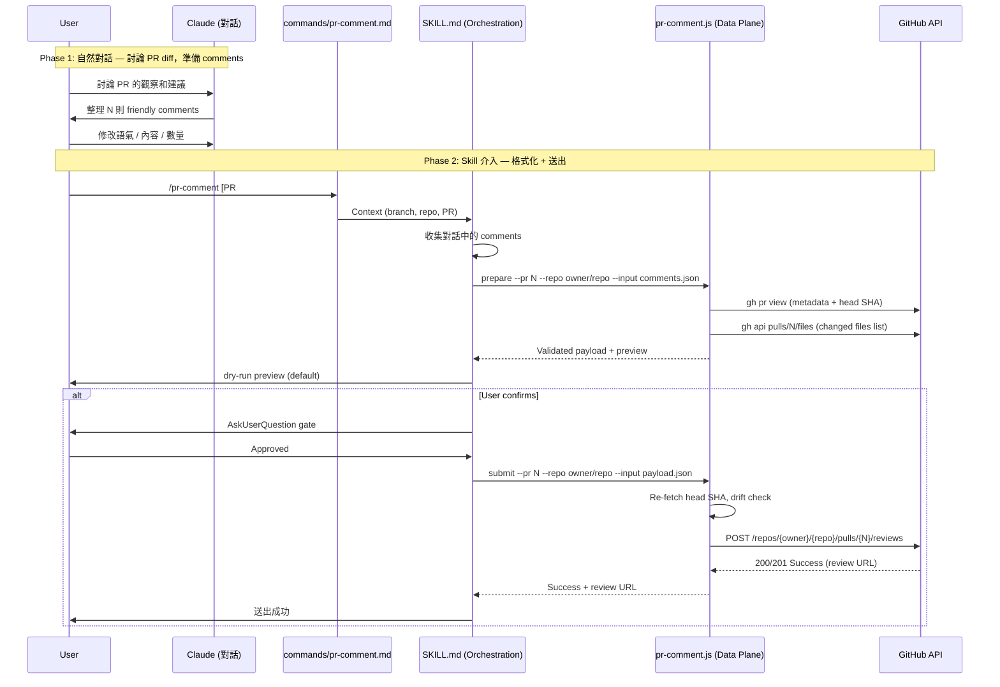
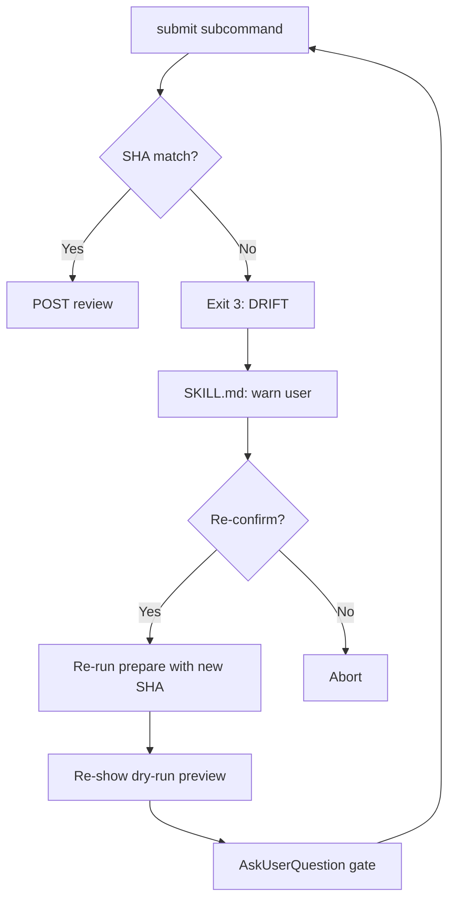

# PR Comment — Technical Spec

## 1. Requirement Summary

- **Problem**: sd0x-dev-flow 目前有「讀取別人的 review + 回覆」能力（`load-pr-review`），但沒有「主動在 PR 上留下 code review comments」的能力。開發者需要在 GitHub 網頁和 Claude Code 之間切換來留言，且手寫 review 容易語氣失控引發筆戰。
- **Goals**: 建立 `/pr-comment` skill，在本地與 Claude 討論後，一次送出多則友善的 inline review comments 到 GitHub PR。
- **Scope**: 新 skill（SKILL.md + 1 JS script + 1 reference + command）
- **Out of Scope (v1)**: 正式 review 決策（APPROVE / REQUEST_CHANGES）、diff position 自動計算、reply to existing threads

## 2. Existing Code Analysis

### Related Modules

| Module | 可復用部分 |
| ------ | ---------- |
| `skills/load-pr-review/` | PR target resolution、writeback guardrails pattern（jq + temp file + `--input`）、AskUserQuestion gate |
| `skills/create-pr/` | `gh repo view` 自動偵測 + `gh pr list` 檢查既有 PR |
| `skills/smart-commit/` | manual default + `--execute` 雙模式（無 `--dry-run` flag） |
| `skills/push-ci/` | AskUserQuestion gate + 外部寫入確認 |
| `scripts/lib/utils.js` | `runCapture`、`sha1`、`writeJson`、`ensureDir` |

### Reusable Components

| Component | Source | Reuse |
| --------- | ------ | ----- |
| PR auto-detect | `gh pr view --json number` (current branch) | 直接複用 pattern |
| repo auto-detect | `gh repo view --json nameWithOwner` | 直接複用 pattern |
| AskUserQuestion gate | `load-pr-review`, `push-ci`, `smart-commit` | 複用確認 pattern |
| Body transmission | `load-pr-review` writeback (jq + temp file + `gh api --input`) | 複用安全傳輸 |
| Script runner | `scripts/run-skill.sh` | JS script 執行 |
| `sha1()` | `scripts/lib/utils.js` | Payload hash |

### Files Requiring Changes

| File | Action | Description |
| ---- | ------ | ----------- |
| `skills/pr-comment/SKILL.md` | New | 主 skill 定義（workflow + 語氣規範） |
| `skills/pr-comment/scripts/pr-comment.js` | New | Data plane（prepare + submit） |
| `skills/pr-comment/references/api-and-guardrails.md` | New | API contract + 安全規則 |
| `commands/pr-comment.md` | New | Command 定義 + context block |
| `CLAUDE.md` | Modify | 新增 `/pr-comment` 到 Command Quick Reference |
| `skills/load-pr-review/SKILL.md` | Modify | 新增 "When NOT to use" cross-link |

## 3. Technical Solution

### 3.1 Architecture Design



### 3.2 Data Model

#### Comment Input Schema (from Claude conversation)

```json
{
  "comments": [
    {
      "path": "devcloud/router/middleware/log/middleware.go",
      "line": 136,
      "side": "RIGHT",
      "body": "這裡的 parseTrustedProxyWhitelist() 和 parseRemoteIP() 似乎跟 webhook/middleware.go 裡的實作完全一樣？是否考慮提取到一個共用的 package 來避免重複維護？"
    }
  ]
}
```

| Field | Type | Required | Default | Description |
| ----- | ---- | -------- | ------- | ----------- |
| `path` | string | Yes | — | 檔案路徑（repo-relative） |
| `line` | number | Yes | — | 行號（正整數） |
| `side` | string | No | `"RIGHT"` | `RIGHT`（新版）或 `LEFT`（舊版/刪除行） |
| `body` | string | Yes | — | Comment 內容 |

#### Submit Payload (to GitHub API)

```json
{
  "commit_id": "<PR head SHA>",
  "event": "COMMENT",
  "body": "",
  "comments": [
    {
      "path": "devcloud/router/middleware/log/middleware.go",
      "line": 136,
      "side": "RIGHT",
      "body": "..."
    }
  ]
}
```

### 3.3 API Design

#### GitHub REST API: Create a review

```
POST /repos/{owner}/{repo}/pulls/{pull_number}/reviews
```

| Parameter | Type | Description |
| --------- | ---- | ----------- |
| `commit_id` | string | PR head SHA（submit 時即時取得） |
| `event` | string | v1 hard-lock `"COMMENT"`（不支援 APPROVE / REQUEST_CHANGES） |
| `body` | string | Review 整體說明（v1 留空） |
| `comments` | array | Inline comments 陣列 |
| `comments[].path` | string | 檔案路徑 |
| `comments[].line` | number | 行號 |
| `comments[].side` | string | `RIGHT` 或 `LEFT` |
| `comments[].body` | string | Comment 內容 |

#### Script Subcommands

| Subcommand | Input | Output | Side Effect |
| ---------- | ----- | ------ | ----------- |
| `prepare` | `--pr N --repo owner/repo --input comments.json` | Validated payload JSON + preview markdown | None (read-only) |
| `submit` | `--pr N --repo owner/repo --input payload.json` | Success/failure JSON | POST to GitHub |

### 3.4 Core Logic

#### `prepare` Subcommand

```
1. Parse --input JSON (comments array)
2. Resolve PR target (--pr + --repo, or auto-detect)
3. Fetch PR metadata: gh pr view --json number,title,url,headRefName,baseRefName,state
4. Fetch changed files: gh api repos/{owner}/{repo}/pulls/{N}/files --paginate
5. Validate each comment:
   a. path exists in changed files → if not, mark as INVALID
   b. line is positive integer → if not, mark as INVALID
   c. body is non-empty → if not, mark as INVALID
   d. line within file's diff hunk range → if not, mark as WARNING (may fail at GitHub)
   e. diff patch unavailable (binary/large file truncated) → mark as UNKNOWN (warning only, not invalid)
6. If any INVALID comments exist → exclude from payload, report to user
7. If 0 valid comments remain → exit 2
8. Fetch head SHA: gh api repos/{owner}/{repo}/pulls/{N} --jq '.head.sha'
9. Build payload: { commit_id, event: "COMMENT", body: "", comments: [valid only] }
10. Compute payload hash: sha1(JSON.stringify(payload))
11. Output:
   - payload.json (for submit, valid comments only)
   - preview markdown (for dry-run display, with INVALID/WARNING annotations)
   - validation summary (N valid, M excluded, K warnings)
```

#### `submit` Subcommand

```
1. Read --input payload.json
2. Re-fetch current head SHA
3. Compare with payload.commit_id:
   - Same → proceed
   - Different → output DRIFT warning, exit 3 (SKILL.md handles re-confirm)
4. Build JSON body via jq (no shell interpolation)
5. Write to temp file
6. POST via: gh api --method POST repos/{owner}/{repo}/pulls/{N}/reviews --input <tmpFile>
7. Clean up temp file
8. Parse response:
   - 200/201 → output success + review URL
   - 422 → output error to stderr with raw error body, exit 2 (GitHub atomic review API does not provide per-comment error details)
   - Other → output error to stderr, exit 2
```

#### SHA Drift Handling (SKILL.md orchestration)



### 3.5 Tone Guidelines (embedded in SKILL.md)

Claude 在對話中準備 comments 時遵循以下規則：

| Rule | Description | Example |
| ---- | ----------- | ------- |
| 問句 > 命令 | 用「是否考慮」取代「改成」 | "是否考慮提取到共用 package？" |
| 對事不對人 | 主詞是 code 不是 "你" | "這段邏輯似乎..." 非 "你這段..." |
| 說明理由 | 解釋 why，不只 what | "未來如果修了 bug 但忘記同步..." |
| 假設善意 | 確認而非指責 | "想確認這個 trade-off 是有意為之的" |
| 正面先行 | 先肯定再建議 | "這個設計很棒，不過是否..." |
| 無表情符號 | 除非用戶明確要求 | — |
| 語言跟隨 | 使用與 PR 同語言 | — |

**Internal classification** (Conventional Comments, 不顯示在輸出中)：

| Label | 用途 | Blocking |
| ----- | ---- | -------- |
| `suggestion` | 改善提案 | Configurable |
| `question` | 釐清疑問 | No |
| `issue` | 指出問題 | Yes |
| `nitpick` | 偏好性建議 | No |
| `praise` | 正面回饋 | No |

## 4. Risks and Dependencies

| Risk | Impact | Probability | Mitigation |
| ---- | ------ | ----------- | ---------- |
| Invalid line anchor fails entire atomic batch | High | Medium | `prepare` preflight 排除 INVALID comments；diff hunk range 檢查減少 WARNING；422 時輸出 raw error body 至 stderr，exit 2 |
| Head SHA drift between prepare and submit | Medium | Low | Script exit 3 + SKILL.md re-confirm flow |
| User sends comments to wrong PR | High | Low | dry-run preview 顯示 PR title + URL + comment count 供確認 |
| GitHub API rate limiting | Low | Low | 單次 API call（atomic），不會觸發 rate limit |
| Shell injection via comment body | Critical | Low | jq + temp file pattern（複用 `load-pr-review` 安全模式） |

### Dependencies

| Dependency | Version | Required |
| ---------- | ------- | -------- |
| `gh` CLI | >= 2.0 | Yes |
| `jq` | >= 1.6 | Yes |
| `node` | >= 18 | Yes |
| GitHub token | Classic PAT: `repo` scope; Fine-grained PAT: `Pull requests: Read and write` | Yes |

## 5. Work Breakdown

| # | Task | Output | Effort | Depends On |
| - | ---- | ------ | ------ | ---------- |
| 1 | Create `skills/pr-comment/scripts/pr-comment.js` | `prepare` + `submit` subcommands | M | — |
| 2 | Create `skills/pr-comment/SKILL.md` | Workflow + tone rules + dry-run/execute flow | M | 1 |
| 3 | Create `skills/pr-comment/references/api-and-guardrails.md` | API contract + safety rules | S | — |
| 4 | Create `commands/pr-comment.md` | Command definition + context block | S | 2 |
| 5 | Update `CLAUDE.md` command table | Add `/pr-comment` | XS | — |
| 6 | Update `load-pr-review` SKILL.md | Add cross-link in "When NOT to use" | XS | — |
| 7 | Write tests `test/scripts/pr-comment.test.js` | Unit tests for prepare/submit | M | 1 |

**Total Effort**: ~M (comparable to `load-pr-review` but simpler — no GraphQL, no mode branching)

## 6. Testing Strategy

### Unit Tests (`test/scripts/pr-comment.test.js`)

| Test Case | Category | Description |
| --------- | -------- | ----------- |
| `prepare: valid comments` | Happy path | N comments with valid path/line → payload JSON output |
| `prepare: invalid path` | Error | path not in changed files → INVALID warning |
| `prepare: invalid line` | Error | line <= 0 or non-integer → INVALID warning |
| `prepare: empty body` | Error | body is empty → INVALID warning |
| `prepare: empty comments array` | Edge | 0 comments → exit 2 |
| `prepare: side=LEFT` | Edge | Deleted line comment → side=LEFT in payload |
| `prepare: mixed valid/invalid` | Edge | Some valid, some invalid → payload has valid only + warnings |
| `prepare: line outside diff hunk` | Warning | Line exists but outside hunk range → WARNING annotation |
| `submit: success` | Happy path | Mock 200/201 → success output with review URL |
| `submit: SHA drift` | Error | head SHA mismatch → exit 3 |
| `submit: 422 error` | Error | Invalid anchor → stderr error + exit 2 |
| `submit: network error` | Error | gh api fails → exit 2 |
| `submit: jq failure` | Error | jq not available → exit 2 |
| `submit: temp file cleanup` | Edge | Temp file removed after success and failure |

### Mock Strategy

Align with existing `load-pr-review.test.js` pattern: stub `gh`/`jq` binaries in temp `$PATH` + spawn real script.

| External | Mock Approach |
| -------- | ------------- |
| `gh api` / `gh pr view` | Stub executable in temp `$PATH` returning canned JSON |
| `jq` | Symlink real `jq` (deterministic) or stub for failure tests |
| File system (temp files) | Real fs (in `mkdtempSync` dir, cleaned up in `after`) |

## 7. Open Questions

| # | Question | Impact | Proposed Resolution |
| - | -------- | ------ | ------------------- |
| 1 | v2 是否支援 `APPROVE` / `REQUEST_CHANGES` event? | 功能擴展 | v1 hard-lock `COMMENT`；v2 用 `--event` flag |
| 2 | v2 是否需要自動 diff position 計算? | 複雜度增加 | v1 用 `line`/`side`；v2 視需求加 `position` 計算 |
| 3 | Comment 數量上限? | GitHub API 可能有限制 | v1 建議 <= 50；超過時警告 |
| 4 | 是否支援 multi-line comments (`start_line` + `line`)? | 功能豐富度 | v1 不支援；v2 加入 |
| 5 | 是否需要本地存檔已送出的 review? | 可追溯性 | v1 不存；v2 可加 audit log |
