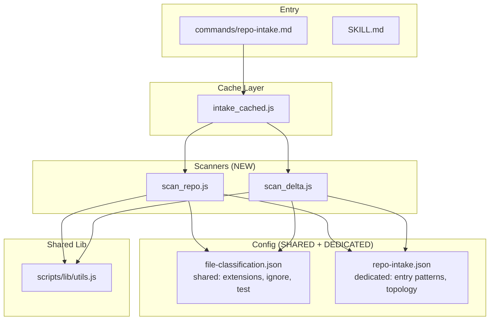
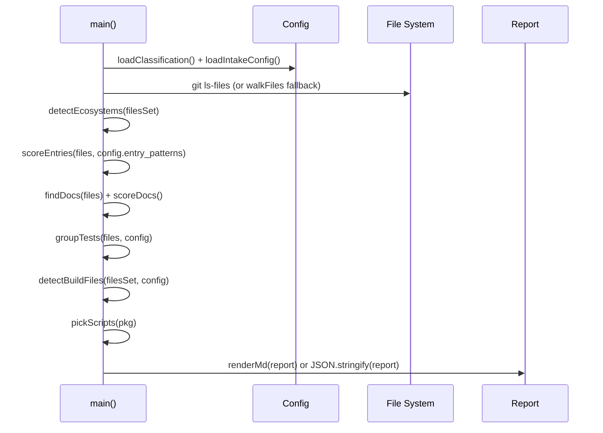
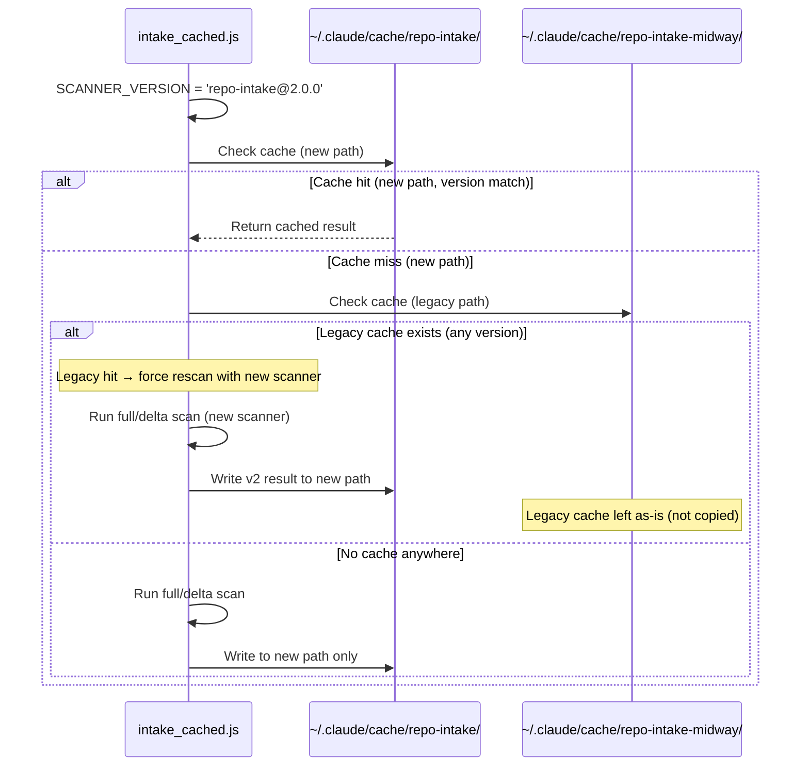

# repo-intake Generalization — Technical Spec

> MidwayJS 耦合移除，通用化重構為 framework-agnostic repo scanner。

## 1. Requirement Summary

### Problem

`repo-intake` skill 的掃描腳本（`scan_midway_repo.js`、`scan_midway_delta.js`）全部硬編碼 MidwayJS 框架邏輯，包括：

- 框架偵測（`isMidwayProject()`）
- Entry point scoring（MidwayJS 檔案 180-300 分固定權重）
- Test classification（偵測 `@midwayjs/mock`）
- 報告標題（「MidwayJS 最佳化」）
- Cache 路徑（`repo-intake-midway`）
- 腳本命名（`scan_midway_*.js`）

sd0x-dev-flow 是通用 Claude Code plugin，不綁定特定框架。同 plugin 的其他 skill（`project-audit`、`risk-assess`、`next-step`）已採用 config-driven 通用模式。

### Goals

| # | Goal | 驗收條件 |
|---|------|---------|
| G1 | Framework-agnostic | 掃描任意語言/框架專案都能產出有意義的報告 |
| G2 | Config-driven | Entry patterns、topology rules 外部化為 JSON config |
| G3 | Pattern alignment | 與 `project-audit` 等 skill 共用 `file-classification.json` 分類 |
| G4 | Backward compatible | 已安裝專案的 cache 不會無提示失效 |
| G5 | Test coverage | 補齊 repo-intake 的 contract tests |

### Scope

| In Scope | Out of Scope |
|----------|-------------|
| 重寫 full/delta scanner | Framework adapter plugin system |
| Config-driven entry scoring | 新增語言/框架的偵測邏輯（用現有 ecosystem detection） |
| Cache 路徑遷移 | 改變 cache 架構（per-repo + per-commit 維持不變） |
| 測試覆蓋 | 效能最佳化 |
| 文件同步更新 | UI/報告視覺重設計 |

### Decision Record

| 決策 | 結論 | 來源 |
|------|------|------|
| 架構方案 | B+（簡化重寫 + 最小擴充縫 + 漸進遷移） | `/best-practices` adversarial debate（threadId: `019cd1b3-7fbb-7af0-991d-c70c887a39bf`） |
| 排除方案 A | 通用化重構 — MidwayJS 邏輯佔比 >40%，重構不如重寫 | — |
| 排除方案 C | Adapter pattern — YAGNI，目前無多框架 adapter 需求 | — |

## 2. Existing Code Analysis

### Files Requiring Changes

| File | Action | 說明 |
|------|--------|------|
| `skills/repo-intake/scripts/scan_midway_repo.js` | **刪除** | 757 行，MidwayJS 深度耦合 |
| `skills/repo-intake/scripts/scan_midway_delta.js` | **刪除** | 217 行，topology 判定含 MidwayJS 路徑 |
| `skills/repo-intake/scripts/intake_cached.js` | **修改** | 改呼叫新腳本、更新 version/cache path |
| `skills/repo-intake/SKILL.md` | **修改** | 移除 Midway 引用、更新腳本名稱 |
| `skills/repo-intake/references/MIDWAY_HEURISTICS.md` | **歸檔** | 移至 `references/archived/` |
| `commands/repo-intake.md` | **修改** | Cache path 已與程式不一致，需統一 |

### New Files

| File | Purpose |
|------|---------|
| `skills/repo-intake/scripts/scan_repo.js` | 通用 full repo scanner |
| `skills/repo-intake/scripts/scan_delta.js` | 通用 delta scanner |
| `scripts/config/repo-intake.json` | Intake 專屬 config（entry patterns + topology rules） |
| `test/scripts/repo-intake.test.js` | Contract tests |

### Reusable Components

| Component | Source | 複用方式 |
|-----------|--------|---------|
| `file-classification.json` | `scripts/config/` | 直接引用（extensions、ignore、test indicators） |
| `detectEcosystem()` pattern | `project-audit/scripts/audit.js:39` | 移植邏輯（不直接 import，避免跨 skill 依賴） |
| `loadClassification()` | `project-audit/scripts/audit.js:11` | 移植模式 |
| Shared utils | `scripts/lib/utils.js` | `require()` 引用 `sha1`, `safeSlug`, `ensureDir`, `writeText`, `writeJson` |

### Known Bug

| Bug | 位置 | 影響 |
|-----|------|------|
| Cache path 文件/程式不一致 | `commands/repo-intake.md:30`（寫 `repo-intake`）vs `intake_cached.js:152`（寫 `repo-intake-midway`） | 文件指向錯誤路徑 |

## 3. Technical Solution

### 3.1 Architecture Design



### 3.2 Config Schema

#### `scripts/config/repo-intake.json`

```json
{
  "version": 1,
  "entry_patterns": [
    { "pattern": "src/main.{ts,js}", "score": 100, "label": "main entry" },
    { "pattern": "src/index.{ts,js}", "score": 90, "label": "index entry" },
    { "pattern": "src/app.{ts,js}", "score": 80, "label": "app entry" },
    { "pattern": "src/server.{ts,js}", "score": 80, "label": "server entry" },
    { "pattern": "main.{ts,js,go,py}", "score": 70, "label": "root main" },
    { "pattern": "index.{ts,js}", "score": 60, "label": "root index" },
    { "pattern": "app.{ts,js,py}", "score": 60, "label": "root app" },
    { "pattern": "cmd/*/main.go", "score": 90, "label": "Go cmd entry" },
    { "pattern": "manage.py", "score": 80, "label": "Django manage" },
    { "pattern": "wsgi.py", "score": 70, "label": "WSGI entry" }
  ],
  "topology_files": [
    "package.json", "pnpm-lock.yaml", "yarn.lock", "package-lock.json",
    "tsconfig.json", "tsconfig.build.json",
    "go.mod", "go.sum",
    "Cargo.toml", "Cargo.lock",
    "pyproject.toml", "setup.py", "requirements.txt",
    "pom.xml", "build.gradle", "build.gradle.kts",
    "Gemfile", "Gemfile.lock",
    "composer.json", "composer.lock",
    "Dockerfile", "docker-compose.yml", "docker-compose.yaml",
    "Makefile", "justfile"
  ],
  "build_files": [
    "package.json", "tsconfig.json", "tsconfig.build.json",
    "go.mod", "Cargo.toml", "pyproject.toml", "pom.xml",
    "build.gradle", "Gemfile", "composer.json",
    "Dockerfile", "docker-compose.yml", "Makefile", "justfile"
  ],
  "ecosystem_manifests": {
    "node": ["package.json"],
    "go": ["go.mod"],
    "rust": ["Cargo.toml"],
    "python": ["pyproject.toml", "setup.py", "requirements.txt"],
    "java": ["pom.xml", "build.gradle", "build.gradle.kts"],
    "ruby": ["Gemfile"],
    "php": ["composer.json"],
    "dotnet": ["*.csproj", "*.sln"]
  },
  "delta_thresholds": {
    "large_diff_count": 80
  }
}
```

### 3.3 Core Logic — `scan_repo.js`



**Key function changes from `scan_midway_repo.js`:**

| 原函式 | 新函式 | 變更 |
|--------|--------|------|
| `isMidwayProject()` | `detectEcosystems()` | 回傳 `string[]`（`['node', 'go']`），不判定特定框架 |
| `scoreEntry()` 硬編碼分數 | `scoreEntry(file, patterns)` | 從 `repo-intake.json` 讀取 patterns + scores |
| `classifyTestByContent()` | 移除 | 改用路徑分類（`test/unit/`、`test/integration/`、`test/e2e/`） |
| `midwayHints` 硬編碼 | 移除 | Entry scoring 結果即為 hints |
| `renderMd()` 含 "MidwayJS" | `renderMd()` 通用 | 標題改為「Repo Intake Report（Full）」 |
| `BUILD_FILES` 硬編碼 | `config.build_files` | 從 config 讀取 |
| `IGNORE_DIRS` 硬編碼 | `classification.ignore_prefixes` | 從共享 config 讀取 |

### 3.4 Core Logic — `scan_delta.js`

| 原邏輯 | 新邏輯 |
|--------|--------|
| `isTopologyFile()` 硬編碼 MidwayJS 路徑 | 從 `config.topology_files` + test path patterns 判定 |
| Large diff threshold 硬編碼 80 | 從 `config.delta_thresholds.large_diff_count` 讀取 |
| 報告標題 "Repo Intake Delta" | 保留（已是通用） |

### 3.5 Cache Migration — `intake_cached.js`



**Version bump 策略**：`SCANNER_VERSION` 從 `repo-intake-midway@1.0.0` 改為 `repo-intake@2.0.0`。

**Legacy path handling**：
- **新路徑**：strict equality check（`meta.scannerVersion === SCANNER_VERSION`），與現行邏輯一致
- **舊路徑偵測**：檢查 legacy cache 目錄是否存在（`~/.claude/cache/repo-intake-midway/<repoKey>/`）
- **舊路徑命中時**：**不複製 v1 payload** — 而是觸發新 scanner 重新掃描，產生 v2-compliant 結果寫入新路徑。Legacy cache 的意義僅為「此 repo 曾被掃描過」的信號，避免 auto mode 判定為首次掃描
- **Legacy 最小驗證**：legacy cache 需通過基本驗證（目錄存在 + `meta.json` 可解析 + 含 `repoRoot` key），否則視為無效
- **Sunset**：`repo-intake@3.0.0` 移除 legacy path 偵測邏輯

### 3.6 Shared Utils 引用

`scan_repo.js` 和 `scan_delta.js` 改用 `scripts/lib/utils.js`：

| 函式 | 用途 |
|------|------|
| `sha1()`, `safeSlug()` | `intake_cached.js` 已用，scanner 也可共用 |
| `ensureDir()`, `writeText()`, `writeJson()` | 取代 scanner 內重複定義 |
| `detectPackageManager()` | 取代 scanner 內重複實作 |
| `readPackageJson()` | 取代 `readJsonSafe()` |

**不引用的**：`runCapture()`（scanner 用 sync `spawnSync`，utils 用 async `spawn`，保持 sync 以避免改動 `intake_cached.js` 的 sync 調用鏈）。

## 4. Risks and Dependencies

| # | Risk | Impact | Mitigation |
|---|------|--------|-----------|
| R1 | Entry scoring 不夠精準 | 中 — 部分框架的 entry point 可能排名低 | Config-driven 可隨時補充 patterns；第一版覆蓋主流框架 |
| R2 | 舊 cache 路徑 orphan | 低 — 佔用磁碟空間 | Dual-read 期間發現舊 cache 時可選擇清理 |
| R3 | `classifyTestByContent()` 移除後精度下降 | 低 — 路徑分類對遵循慣例的專案已夠用 | 路徑分類是業界標準做法 |
| R4 | `scripts/lib/utils.js` 的 sync/async 不一致 | 中 — scanner 需 sync，utils 部分為 async | 只引用 sync 函式；`spawnSync` 保留在 scanner 內 |
| R5 | 報告格式變更影響下游消費者 | 低 — 報告主要供 Claude 讀取，無 external API | 定義 v2 schema（見下方） |

### JSON Report Schema Migration (v1 → v2)

| v1 欄位 | v2 處理 | 理由 |
|---------|---------|------|
| `isMidway` (boolean) | **移除** → 新增 `ecosystems` (string[]) | 通用化，不判定特定框架 |
| `midwayHints` (string[]) | **移除** → entry scoring 結果已涵蓋 | 冗餘資訊 |
| `packageManager` | **保留** | 通用欄位 |
| `testRunner` | **保留** + 擴充偵測範圍 | 通用欄位 |
| `entrypoints` | **保留** | 通用欄位 |
| `docs`, `tests`, `dirs` | **保留** | 通用欄位 |
| — | **新增** `schemaVersion: 2` | 版本標記 |
| — | **新增** `ecosystems: string[]` | 取代 `isMidway` |

**相容性策略**：v2 不提供 `isMidway` deprecated alias。因為：(1) 報告消費者是 Claude（非外部 API），(2) legacy cache 命中時觸發 rescan 產生 v2 結果，不複製 v1 payload。

### Security Considerations

| Constraint | 措施 |
|-----------|------|
| `--base` 參數 | 只接受 git ref 格式（`HEAD~N`、commit SHA、branch name），不允許 shell metacharacters |
| Command execution | 僅使用 `spawnSync` 呼叫 `git`，不使用 `shell: true`，不拼接使用者輸入 |
| Error output | Scanner 的 stderr 寫入 cache log，不含敏感路徑或 credentials |
| Cache 寫入 | 寫入 `~/.claude/cache/`（使用者家目錄），不寫入專案目錄，避免 `.gitignore` 遺漏風險 |

## 5. Work Breakdown

| # | Task | 依賴 | 估計 |
|---|------|------|------|
| T1 | 建立 `scripts/config/repo-intake.json` | — | S |
| T2 | 新建 `scan_repo.js`（通用 full scanner） | T1 | L |
| T3 | 新建 `scan_delta.js`（通用 delta scanner） | T1 | M |
| T4 | 修改 `intake_cached.js`（新腳本引用 + cache 遷移 + version bump） | T2, T3 | M |
| T5 | 新增 `test/scripts/repo-intake.test.js` | T2, T3, T4 | L |
| T6 | 更新 `skills/repo-intake/SKILL.md` | T2, T3 | S |
| T7 | 更新 `commands/repo-intake.md` | T4 | S |
| T8 | 歸檔 `references/MIDWAY_HEURISTICS.md` → `references/archived/` | — | S |
| T9 | 刪除 `scan_midway_repo.js` + `scan_midway_delta.js` | T4, T5 | S |

**建議執行順序**：T1 → T8 → T2 → T3 → T4 → T5 → T6 → T7 → T9

## 6. Testing Strategy

### Test File

`test/scripts/repo-intake.test.js`

### Test Matrix

| Category | Test Case | Priority |
|----------|-----------|----------|
| **scan_repo.js** | | |
| Config loading | 正確讀取 `repo-intake.json` | P0 |
| Config loading | `repo-intake.json` 缺失時使用 fallback defaults | P0 |
| Ecosystem detection | Node 專案偵測（`package.json` 存在） | P0 |
| Ecosystem detection | Go 專案偵測（`go.mod` 存在） | P0 |
| Ecosystem detection | 多生態系偵測（Node + Go monorepo） | P1 |
| Entry scoring | Config patterns 正確匹配 + 排序 | P0 |
| Entry scoring | 無匹配時回傳空列表 | P1 |
| Doc discovery | README 優先排序 | P0 |
| Test grouping | 路徑分類（unit/integration/e2e） | P0 |
| Output format | Markdown 格式正確 | P0 |
| Output format | JSON 格式正確 + schema 相容 | P0 |
| Shared config | `file-classification.json` ignore patterns 生效 | P1 |
| **scan_delta.js** | | |
| Topology change | Config 中的 topology file 變更觸發 full scan | P0 |
| Large diff | 超過 threshold 觸發 full scan | P0 |
| Docs-only | 純 docs 變更不觸發 full scan | P1 |
| Git diff 失敗 | Fallback to shouldRunFull=true | P1 |
| **intake_cached.js** | | |
| Cache hit | 新路徑 cache hit 直接回傳 | P0 |
| Cache miss + legacy hit | 新路徑 miss → legacy 偵測 → 觸發 rescan → v2 結果寫新路徑 | P1 |
| Version mismatch | Scanner version 不符時重新掃描 | P0 |
| **Edge cases** | | |
| Empty repo | 無檔案的 git repo | P1 |
| Non-git directory | `scan_repo.js` 單元層級的 fallback walk（`intake_cached.js` 在非 git 環境直接 exit，此 case 不走 end-to-end） | P2 |
| Unborn HEAD | 新 repo 無 commit | P2 |

### Test Approach

- **方法**：建立 temp git repo + 塞入測試檔案結構 → 執行 scanner → 驗證輸出
- **模式**：參照 [`test/scripts/project-audit.test.js`](../../../test/scripts/project-audit.test.js) 的 temp repo 模式
- **Runner**：`node --test`（與專案一致）

## 7. Open Questions

### Resolved Questions

| # | Question | 決策 |
|---|----------|------|
| Q1 | Entry pattern 的 glob matching 用什麼實作？ | **手寫 simple matcher**（零依賴）— 只需支援 `{a,b}` 和 `*` 兩種語法，不需要 `**`、negation 等進階功能。見下方規範。 |

#### Q1 Entry Pattern Matcher 規範

**支援語法**（僅此兩項）：

| 語法 | 意義 | 範例 |
|------|------|------|
| `{a,b,c}` | 任一匹配 | `src/main.{ts,js}` → matches `src/main.ts`, `src/main.js` |
| `*` | 單層路徑段萬用字元（不跨 `/`） | `cmd/*/main.go` → matches `cmd/api/main.go`，不 match `cmd/api/v2/main.go` |

**不支援**（若需要未來擴充，再引入 `minimatch`）：`**`（recursive glob）、`?`、`!`（negation）、`[...]`（character class）

**實作方式**：將 pattern 轉為 RegExp — `{a,b}` → `(a|b)`，`*` → `[^/]+`，其餘字元 escape。

**規範範例**：

```
Pattern: "src/main.{ts,js}"     Input: "src/main.ts"       → ✅ match
Pattern: "src/main.{ts,js}"     Input: "src/main.go"       → ❌ no match
Pattern: "cmd/*/main.go"        Input: "cmd/api/main.go"   → ✅ match
Pattern: "cmd/*/main.go"        Input: "cmd/api/v2/main.go"→ ❌ no match (*/single segment)
Pattern: "manage.py"            Input: "manage.py"         → ✅ match (exact)
Pattern: "manage.py"            Input: "src/manage.py"     → ❌ no match (no implicit **)
```

### Open Questions

| # | Question | 決策影響 | 建議 |
|---|----------|---------|------|
| Q2 | 多生態系 monorepo 的 ecosystem 優先順序？ | 報告排列 | 按 manifest 數量降序，或按 source file 佔比 |
| Q3 | `detectTestRunner()` 是否也要通用化？ | T2 實作 | 是 — 補充 Go test、pytest、cargo test 偵測 |
