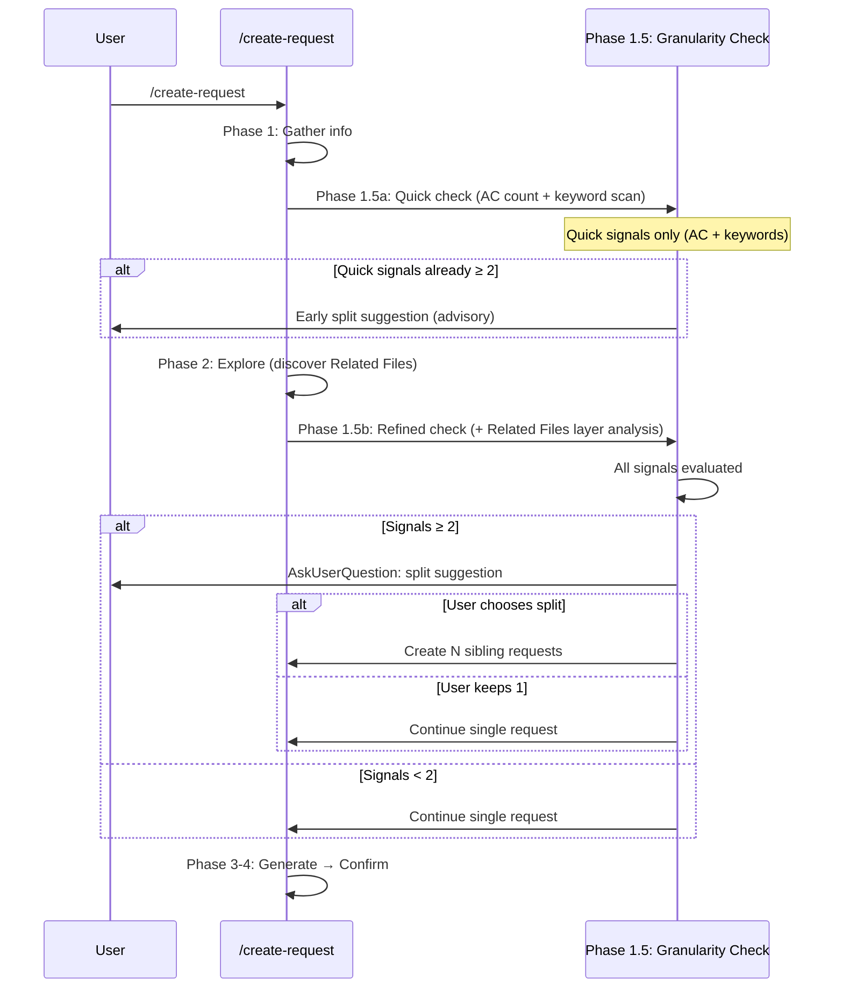

# Request Granularity Assessment — Technical Spec

## 1. Requirement Summary

- **Problem**: `/create-request` 是「被動填表」工具——1 invocation = 1 ticket，無顆粒度判斷。81.4% 的現有 request 超過 8 AC（avg 13.81），經常混合 behavior-layer（rule text）和 code-layer（hooks/scripts）變更在同一張 ticket，導致追蹤困難和 scope creep。
- **Goals**:
  1. 新增 Phase 1.5 Granularity Check — 在 Generate 前評估顆粒度
  2. 定義 3 個 primary split signals（AC count, layer mixing, scope breadth）
  3. Advisory split suggestion（AskUserQuestion 讓使用者決定）
  4. 支援 flat sibling requests + conditional `Depends On` linkage
  5. 更新 template 加入 granularity guidance
- **Scope**:
  - 修改 `skills/create-request/SKILL.md`（新增 Phase 1.5）
  - 修改 `skills/create-request/references/template.md`（新增 granularity guide + `Depends On` field）
  - 修改 `commands/create-request.md`（更新 workflow description）
- **Non-goals**:
  - 不做 auto-split（advisory only — 使用者決定）
  - 不做 parent/child hierarchy（flat siblings）
  - 不做 WBS 自動解析（secondary signal, future enhancement）
  - 不回溯修改現有 43 個 request documents
- **Evidence**: `/best-practices` audit（threadId: `019cfbde-68be-71b1-889a-135b19b4b69f`，SPIDR/INVEST 研究 + Claude-Codex adversarial debate，Round 2 Nash Equilibrium）

## 2. Existing Code Analysis

### Related Modules

| File | Purpose | Impact |
|------|---------|--------|
| `skills/create-request/SKILL.md` | Skill definition | **Modify** — insert Phase 1.5 between Gather and Explore |
| `skills/create-request/references/template.md` | Request template | **Modify** — add granularity guide + `Depends On` field |
| `commands/create-request.md` | Command spec | **Modify** — update workflow description |

### Current State

| Aspect | Current | Target |
|--------|---------|--------|
| Create Mode workflow | Phase 1 → 2 → 3 → 4 | Phase 1 → **1.5** → 2 → 3 → 4 |
| Granularity check | None | 3 primary + 2 secondary signals |
| Split suggestion | None | AskUserQuestion advisory |
| Template AC guidance | None | ≤8 target + splitting guide |
| Linkage field | `Related Request` (undirected) | + `Depends On` (directed, conditional) |

### Reusable Components

- `AskUserQuestion` — NOT currently in `allowed-tools` for create-request. Must be added to both `skills/create-request/SKILL.md:4` and `commands/create-request.md:4` as part of implementation.
- Template `## Scope` table（In/Out）— 已有，可作為 layer mixing 檢查的輸入

## 3. Technical Solution

### 3.1 Architecture



### 3.2 Phase 1.5: Granularity Check

Two-pass design: Phase 1.5a runs after Gather (quick AC count + keyword scan), Phase 1.5b runs after Explore (refined layer analysis using discovered Related Files). Split suggestion fires when `signal_count >= 2` (integer, not fractional). Secondary signals contribute 0.5 each, so 2 primary = suggest, 1 primary + 2 secondary = suggest.

#### 3.2.1 Signal Detection

| Signal | Detection Method | Weight |
|--------|-----------------|--------|
| **AC count > 8** | Count `- [ ]` items. Exclude quality-gate ACs matching canonical pattern: `/codex-review-fast`, `/codex-review-doc`, `/codex-review`, `/precommit`, `/precommit-fast`, `/pr-review` (regex: `Pass /(?:codex-review(?:-fast|-doc)?|precommit(?:-fast)?|pr-review)`). | Primary |
| **Layer mixing** | Pre-Explore fallback: detect layer keywords in Requirements text (`rules/`, `hooks/`, `scripts/`). Post-Explore refinement: check if Related Files span behavior-layer (`rules/`, `CLAUDE.md`, `commands/*.md`, `skills/**/*.md`) vs code-layer (`hooks/`, `scripts/`, `*.sh`, `*.js`). Phase 1.5 runs twice: quick check pre-Explore, refined check post-Explore. | Primary |
| **Scope breadth** | Requirements list has 3+ functionally independent areas (heuristic: 3+ unrelated `## ` sections or requirement groups that don't share files) | Primary |
| **WBS groups ≥ 2** | If tech spec exists and has `Work Breakdown` or `工作分解` heading with 2+ independent task groups | Secondary |
| **Effort > 3 days** | Tech spec WBS has multiple M/L effort items | Secondary |

#### 3.2.2 Decision Logic

```
signal_count = count(triggered primary signals) + 0.5 * count(triggered secondary signals)

if signal_count < 2:
  proceed_single()  // no suggestion
elif signal_count < 3:
  suggest_split()   // advisory
else:
  strongly_recommend_split()  // advisory with emphasis
```

#### 3.2.3 Split Suggestion UX

When `signal_count >= 2`, use AskUserQuestion:

```markdown
## Granularity Assessment

This request has **{N}** acceptance criteria (target: ≤8) and {layer_info}.

{signal_summary}

Suggested split:
1. **{Title A}** — {scope A} ({AC_count_A} AC)
2. **{Title B}** — {scope B} ({AC_count_B} AC)

Options:
- "Split into {N} requests" (Recommended)
- "Keep as 1 request"
```

Split proposals are generated by grouping requirements by:
1. **Layer** (behavior vs code) — if layer mixing detected
2. **Functional area** — if scope breadth detected
3. **AC clusters** — if only AC count exceeded, split into balanced groups

#### 3.2.4 Sibling Request Generation

When user accepts split:

1. Generate N sibling request files with naming: `YYYY-MM-DD-{title-slug}-r{N}.md` (e.g., `2026-03-17-dual-reviewer-rule-text-r1.md`, `2026-03-17-dual-reviewer-hook-enforcement-r2.md`). If collision detected, append `-{N+1}`. Title slug comes from each child's specific scope, not a generic feature name.
2. Each sibling gets:
   - Its own subset of AC (target ≤8 each)
   - Its own Related Files (scoped to its concern)
   - `Depends On` field (if dependency exists between siblings)
3. First sibling is the "primary" (no dependencies); subsequent may depend on primary
4. All siblings share same `## Background` and `## References`

### 3.3 Template Changes

#### 3.3.1 Add Granularity Guide

Append to `references/template.md`:

```markdown
## Granularity Guide

| Metric | Target | Action if exceeded |
|--------|--------|--------------------|
| Acceptance Criteria | ≤ 8 per request | Consider splitting by layer or functional area |
| Related Files layers | 1 concern layer | Split behavior-layer (.md rules/skills) from code-layer (.sh/.js hooks/scripts) |
| Functional areas | 1-2 per request | Split independent areas into separate requests |

Quality-gate ACs matching `Pass /<review-or-precommit-command>` don't count toward the ≤8 target. Canonical list: `/codex-review-fast`, `/codex-review-doc`, `/codex-review`, `/precommit`, `/precommit-fast`, `/pr-review`.
```

#### 3.3.2 Add `Depends On` Field

Add `Depends On` to header metadata block (consistent with existing `dual-reviewer` request convention):

```markdown
> **Depends On**: [Request Title](./YYYY-MM-DD-xxx.md) ← only when this request requires another to complete first
```

Place after `> **Tech Spec**:` line in header. Not a separate `## Dependencies` section.

### 3.4 Command Spec Update

Update `commands/create-request.md` workflow description to mention Phase 1.5:

```
Phase 1: Gather → Phase 1.5a: Quick Granularity Check (AC + keywords) → Phase 2: Explore → Phase 1.5b: Refined Granularity Check (+ Related Files) → Phase 3: Generate → Phase 4: Confirm
```

## 4. Risks and Dependencies

| Risk | Probability | Impact | Mitigation |
|------|------------|--------|------------|
| Over-splitting (micro-tickets) | Low | Medium | Advisory mode — user has final say; minimum 3 AC per child |
| Signal false positive (layer mixing on test files) | Medium | Low | Test files follow source layer; `test/hooks/*.test.js` = code-layer |
| Split proposals are poor quality | Medium | Medium | Fallback: user can always choose "Keep as 1" |
| WBS parsing false positive | Low (secondary) | Low | Only trigger on `Work Breakdown/工作分解` heading, not section number |

### Dependencies

| Dependency | Status | Risk |
|-----------|--------|------|
| `AskUserQuestion` in allowed-tools | Not yet available — WBS Task 6 adds it | Low (simple addition) |
| Template `## Scope` table | Already exists | None |
| Tech spec link in request metadata | Already in template | None |

## 5. Work Breakdown

| # | Task | Files | Effort | Depends On |
|---|------|-------|--------|-----------|
| 1 | Add Phase 1.5 to SKILL.md (signal detection + decision logic + split UX) | `skills/create-request/SKILL.md` | **M** | — |
| 2 | Add granularity guide to template | `skills/create-request/references/template.md` | **S** | — |
| 3 | Add `Depends On` field to template | `skills/create-request/references/template.md` | **S** | — |
| 4 | Update command spec workflow | `commands/create-request.md` | **S** | 1 |
| 5 | Tests (signal detection + split naming) | `test/commands/create-request-granularity.test.js` | **S** | 1 |
| 6 | Add `AskUserQuestion` to allowed-tools | `skills/create-request/SKILL.md:4`, `commands/create-request.md:4` | **S** | — |

**Total**: 1M + 5S

## 6. Testing Strategy

| Type | Scope | Approach |
|------|-------|----------|
| Unit | AC count extraction — count `- [ ]`, exclude quality gates | Test helper function |
| Unit | Layer detection — classify file paths into behavior/code | Test helper function |
| Unit | Signal decision logic — verify threshold mapping | Test logic |
| Unit | Split naming — `YYYY-MM-DD-{title-slug}-r{N}.md` format + collision handling | String test |
| Unit | Template contains granularity guide section | Grep test |
| Manual | Full flow: create request with 12 AC → split suggestion | Live session |

## 7. Open Questions

| # | Question | Decision Owner | Notes |
|---|---------|---------------|-------|
| 1 | ~~Should quality-gate ACs be identified by pattern or by explicit list?~~ | ~~UX decision~~ | **Resolved**: canonical 6-command regex (§3.2.1): `/codex-review-fast`, `/codex-review-doc`, `/codex-review`, `/precommit`, `/precommit-fast`, `/pr-review` |
| 2 | Minimum AC per child after split? | UX decision | Suggested: 3 minimum to avoid micro-tickets |
| 3 | Should existing 43 requests be retroactively assessed? | User | Probably not — forward-looking only |
