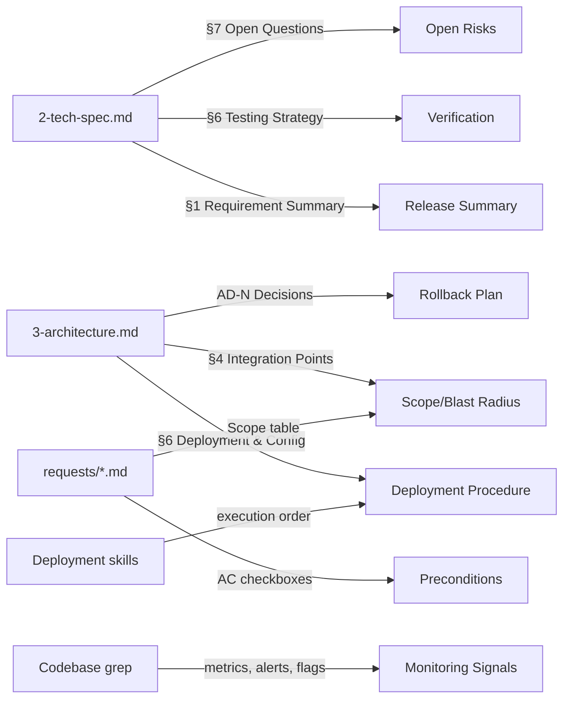
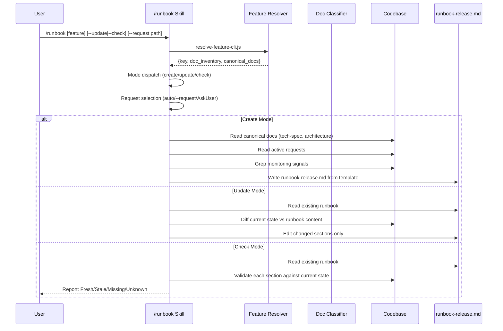

# Runbook Generation Skill Technical Spec

## 1. Requirement Summary

- **Problem**: sd0x-dev-flow 有完整的 feature documentation 體系（60+ features, tech-specs, architecture docs, requests），但缺乏 operational documentation。開發者和 SRE 在上線 feature 時無標準化流程文件，導致上線步驟散落在多個 skill 中（push-ci, watch-ci, bump-version, merge-prep, create-pr），沒有統一的 pre-deployment checklist、rollback 程序或監控指引。
- **Goals**:
  1. 建立 `/runbook` skill，從現有 feature docs + codebase 自動生成 release runbook
  2. 標準化 runbook 模板（9 區段），涵蓋 Dev 和 SRE 雙方需求
  3. 支援 create / update / check 三種模式
  4. 與現有 feature resolver、doc classifier、auto-loop 整合
- **Scope**:
  - **In**: Feature release runbook（單一 feature 上線流程）
  - **Out**: Incident response runbook（v2）、跨 feature release orchestration、auto-sync handler

## 2. Existing Code Analysis

### 2.1 Reusable Infrastructure

| Module | Path | Reuse |
|--------|------|-------|
| Feature resolver | `scripts/lib/feature-resolver.js` | 5-level cascade 定位 feature，回傳 `doc_inventory` + `canonical_docs` |
| Feature resolver CLI | `scripts/resolve-feature-cli.js` | Shell 層介面，回傳 JSON |
| Doc classifier | `scripts/lib/doc-classifier.js` | 7-step precedence 分類 ancillary docs |
| Doc taxonomy | `scripts/config/doc-taxonomy.json` | `runbook` type 已定義（ancillary, `semantic_pattern: "^runbook-"`, `sync_handler: null`） |
| Doc numbering rule | `rules/docs-numbering.md` | **需更新**: 目前禁止 unnumbered feature docs，需正式化 ancillary semantic naming |

### 2.2 Reference Patterns

| Skill | Pattern | Applicable to `/runbook` |
|-------|---------|--------------------------|
| `/architecture` | Create/update upsert + feature resolver + Codex debate | Upsert mode + feature context |
| `/update-docs` | Incremental section comparison + safety valve | Update mode section-level diff |
| `/create-request` | Multi-mode (create/update/scan) + AC verification | Mode dispatch pattern |
| `/feature-verify` | Read-only validation + confidence degradation matrix | `--check` mode |

### 2.3 Deployment Skills (Runbook 會引用)

| Skill | 在 Runbook 中的角色 |
|-------|---------------------|
| `/bump-version` | Preconditions: version sync |
| `/merge-prep` | Deployment Procedure: pre-merge analysis |
| `/create-pr` | Deployment Procedure: PR creation |
| `/push-ci` | Deployment Procedure: push branch (CI triggers on PR, not branch push) |
| `/watch-ci` | Deployment Procedure: monitor PR CI checks and post-merge CI |
| `/precommit` | Preconditions: code quality gate |
| `/codex-review-fast` | Preconditions: code review gate |

### 2.4 Data Sources for Runbook Content



## 3. Technical Solution

### 3.1 Architecture Design



### 3.2 File Location

**Output**: `docs/features/{feature}/runbook-release.md`

| 決策 | 理由 |
|------|------|
| Semantic naming (`runbook-release.md`) | `doc-taxonomy.json` 定義 runbook 為 ancillary namespace，`semantic_pattern: "^runbook-"` |
| 不用 `5-runbook.md` | `doc-classifier.js` lifecycle fallback 只認 `0-4`，`5-` 會被歸類為 `appendix` |
| Feature-local 而非 repo-level | 每個 feature 有獨立上線流程，feature context resolution 可自動定位 |

### 3.3 Interface Contract

**Command Signature**:

```
/runbook [<feature-key>] [--update] [--check] [--request <path|title>]
```

| Argument | Purpose | Default |
|----------|---------|---------|
| `<feature-key>` | Target feature | Auto-detect via feature resolver |
| `--update` | Force update mode (even if runbook is fresh) | Auto-detect from filesystem |
| `--check` | Read-only staleness validation | — |
| `--request <path\|title>` | Specify target request for multi-request features | Auto-select single active; AskUserQuestion if multiple |

**Mode Dispatch**:

| Mode | Trigger | Action | Post-action |
|------|---------|--------|-------------|
| **create** | `runbook-release.md` 不存在 | 從模板生成，AI 填充 feature-specific 內容 | `/codex-review-doc` (auto-loop) |
| **update** | `runbook-release.md` 存在 + 無 `--check` flag | 比較 current state vs runbook，incremental section update | `/codex-review-doc` (auto-loop) |
| **check** | `--check` flag | Read-only 驗證，不修改檔案 | 輸出報告（無 review 需求） |

**Multi-Request Selection**:

| Condition | Behavior |
|-----------|----------|
| `--request` specified | Use specified request |
| Single active request | Auto-select |
| Multiple active requests | AskUserQuestion: list requests, let user choose |
| No active requests | Use most recent request (warn) |

### 3.4 Template Structure (9 Sections)

```markdown
# {Feature Name} Release Runbook

> Generated from: {tech-spec path}, {architecture path}, {request paths}
> Last updated: {date}

## 1. Release Summary

| Field | Value |
|-------|-------|
| Feature | {feature key} |
| Version | {target version or TBD} |
| Request | {request doc link} |
| Owner | {from git log author or "TBD" — request template has no Owner field} |
| Status | {Draft / Ready / Executed} |

{1-2 sentence description from tech-spec §1}

## 2. SRE Quick Reference

| Signal | Threshold | Rollback Action | Escalation |
|--------|-----------|-----------------|------------|
| {metric/alert} | {condition} | {action} | {contact} |

> 高壓下快速定位：如需完整 rollback 程序，見 §8。

## 3. Scope / Blast Radius

| Component | Impact | Confidence |
|-----------|--------|------------|
| {component from architecture §4} | {description} | {High/Medium/Low} |

**In scope**: {from request scope table}
**Out of scope**: {from request scope table}

## 4. Preconditions Checklist

- [ ] Code review passed (`/codex-review-fast` ✅)
- [ ] Precommit passed (`/precommit` ✅)
- [ ] Tests adequate (`/codex-test-review` ✅)
- [ ] Version bumped (`/bump-version`)
- [ ] {Feature flag configured — if applicable}
- [ ] {Database migration prepared — if applicable}
- [ ] {Dependent service notified — if applicable}

## 5. Deployment Procedure

> CI trigger context: `ci.yml` runs on `pull_request` to `main` and `push` to `main`.
> Feature branch push alone does **not** trigger CI. CI runs when PR targeting main is created/updated.

| Step | Owner | Action | Evidence | Abort Trigger |
|------|-------|--------|----------|---------------|
| 1 | Dev | `/merge-prep` — pre-merge analysis | No conflicts | Unresolvable conflict |
| 2 | Dev | Push feature branch (`git push -u origin <branch>`) | Branch visible on remote | Push rejected |
| 3 | Dev | `/create-pr` — create PR targeting main | PR URL | — |
| 4 | Dev | `/watch-ci` — monitor PR CI checks (triggered by `pull_request` event) | CI ✅ | CI failure |
| 5 | Dev | PR review approval + merge to main | Merge commit | Review rejection |
| 6* | Dev | `/watch-ci` — monitor post-merge CI (triggered by `push` to `main`) | CI ✅ | CI failure → rollback |
| 7* | Dev | Verify release workflow (conditional: only when `/bump-version` was included) | GitHub Release created | Workflow failure |
| {N} | {role} | {feature-specific step} | {evidence} | {abort condition} |

> *Steps 6-7 are conditional: Step 6 monitors post-merge CI on main. Step 7 only applies when `release.yml` triggers (requires `package.json` changes on `main`).

## 6. Verification / Smoke Tests

| Test | Command / Steps | Expected Result |
|------|----------------|-----------------|
| {from tech-spec §6} | {concrete command} | {expected output} |

## 7. Monitoring Signals

| Signal Type | Name | Location | Alert Threshold |
|-------------|------|----------|-----------------|
| {metric/log/flag} | {name} | {file:line or dashboard URL} | {threshold} |

> Items marked "Not defined in repo" require monitoring setup before release.

## 8. Rollback Plan

**Trigger conditions**: {from SRE Quick Reference §2}

| Step | Action | Verification |
|------|--------|-------------|
| 1 | {revert/rollback action} | {how to verify success} |

**Data considerations**: {any migration/state concerns from architecture AD-N}

## 9. Open Risks / Human Checks

| Risk | Source | Mitigation | Owner |
|------|--------|-----------|-------|
| {from tech-spec §7 open questions} | {doc reference} | {mitigation or "Needs decision"} | {owner} |
```

### 3.5 Content Discovery Heuristics

AI enrichment 使用 **scoped discovery order** 策略，避免 repo-wide 噪音和 hallucination：

**Discovery Scope Cascade** (由窄到寬，每層增加 confidence penalty):

| Priority | Scope | Confidence | When |
|----------|-------|------------|------|
| 1 | Request `Related Files` paths | High | 永遠先查 |
| 2 | Canonical docs (tech-spec, architecture) | High | Feature resolver 提供 |
| 3 | Feature-local paths (`docs/features/{feature}/`) | Medium | Canonical 不足時 |
| 4 | Repo-wide grep | Low | **Last resort only** |

> Repo-wide grep 結果必須標註 `(low confidence — repo-wide search)` 讓 reviewer 判斷。

**Per-Section Discovery**:

| Section | Scope 1: Related Files | Scope 2: Canonical Docs | Scope 3: Feature-local | Scope 4: Repo-wide | Fallback |
|---------|----------------------|------------------------|----------------------|-------------------|----------|
| Release Summary | — | tech-spec §1 | — | — | "TBD — no tech-spec found" |
| SRE Quick Ref | Grep in Related Files for alert/metric patterns | architecture §6 | — | — | "Not defined in repo" |
| Scope/Blast Radius | Request scope table | architecture §4 | — | — | Architecture §2 component table |
| Preconditions | Request ACs | — | — | — | Standard checklist only |
| Deployment Procedure | — | — | `.github/workflows/` | — | Standard skill sequence |
| Verification | — | tech-spec §6 | — | — | "TBD — no test strategy found" |
| Monitoring | Grep in Related Files for metrics/alerts/flags | architecture §6 | Feature-local `*.config.*` | `grep -r "metrics\|prometheus\|feature.flag" {related_dirs}` | "Not defined in repo — add monitoring before release" |
| Rollback | — | architecture AD-N decisions | — | — | "TBD — rollback strategy not documented" |
| Open Risks | Unresolved request items | tech-spec §7 | — | — | "No open risks identified" |

**Security — Redaction Rules**:

Mining configs、workflows、logs 到 committed markdown 時，必須遵守：

| 禁止複製 | 替代方式 |
|----------|---------|
| API keys, tokens, secrets | `${ENV_VAR_NAME}` placeholder |
| Webhook URLs with credentials | `<webhook-url>` symbolic reference |
| Internal-only endpoints (IP, port) | `<internal-endpoint>` placeholder |
| Database connection strings | `${DATABASE_URL}` placeholder |

> 此規則與 `rules/security.md` 一致：Never log private keys, passwords, tokens.

### 3.6 Provenance Model

每份 runbook 在 header 中嵌入 machine-readable source manifest，用於 `--check` mode 的 staleness 判斷。每個 section 支援**多來源** (array)，因為多數 section 從多個文件聚合內容：

```markdown
<!-- runbook-provenance
sections:
  - name: "Release Summary"
    sources:
      - file: "docs/features/runbook-generation/2-tech-spec.md"
        sha: "abc1234"
      - file: "docs/features/runbook-generation/requests/2026-04-07-runbook-skill.md"
        sha: "xyz5678"
  - name: "Scope / Blast Radius"
    sources:
      - file: "docs/features/runbook-generation/3-architecture.md"
        sha: "def5678"
      - file: "docs/features/runbook-generation/requests/2026-04-07-runbook-skill.md"
        sha: "xyz5678"
  - name: "Monitoring Signals"
    sources: []
    note: "Not defined in repo"
last_generated: "2026-04-07T10:00:00Z"
-->
```

**Staleness 判斷演算法**:

| Section 狀態 | 條件 | Detail |
|-------------|------|--------|
| **Fresh** | 所有 `sources[].sha` 都與 `git hash-object <file>` 匹配 | 全部來源未變更 |
| **Stale** | 任一 `sources[].sha` 與當前 hash 不匹配 | 至少一個來源已變更，需 update |
| **Missing** | `sources` 為空 array | 產生時無可用來源 |
| **Unknown** | 任一 `sources[].file` 已刪除 | 來源檔案不存在，需人工確認 |

> Section status = worst of all its sources (Fresh > Stale > Unknown > Missing).

### 3.7 `--check` Mode Output

```markdown
## Runbook Health Check: {feature}

| Section | Status | Sources | Stale Source(s) |
|---------|--------|---------|-----------------|
| Release Summary | Fresh | 2-tech-spec.md, request.md | — |
| Scope / Blast Radius | Stale | 3-architecture.md, request.md | 3-architecture.md (def5678 → xyz9999) |
| Monitoring Signals | Missing | (none) | — |

### Stale Sections (any source changed since last generation)
- §3 Scope: `3-architecture.md` SHA changed def5678 → xyz9999 (request.md unchanged)

### Missing Evidence (no sources at generation time)
- §7 Monitoring: "Not defined in repo" — still no monitoring setup

### Verdict: {Ready / Stale / Incomplete}
```

## 4. Risks and Dependencies

| Risk | Impact | Probability | Mitigation |
|------|--------|-------------|------------|
| **doc-numbering rule 不一致** | `/runbook` 輸出的 `runbook-release.md` 違反現行 `docs-numbering.md` 禁止 unnumbered docs 的規定 | 確定發生 | **前置條件**: 同時更新 `docs-numbering.md` 正式化 ancillary semantic naming |
| **AI hallucination** | 虛構不存在的 dashboards、metrics、rollback commands | 中 | Bounded grep search + "Not defined in repo" fallback + human review gate |
| **Feature 無 tech-spec** | 部分 feature 可能只有 request docs 而無 tech-spec/architecture | 中 | Degradation matrix: 有什麼用什麼，missing sections 標記 TBD |
| **Multi-request ambiguity** | Feature 有多個 active requests，不確定 runbook 對應哪個 | 低 | `--request` flag 指定，或 AskUserQuestion 讓使用者選擇 |
| **Auto-loop overhead** | 每次 runbook 寫入都觸發 `/codex-review-doc` | 低 | 遵循 auto-loop 規則，這是必要的品質門檻 |

### Dependencies

| Dependency | Type | Status |
|-----------|------|--------|
| `scripts/lib/feature-resolver.js` | Runtime | ✅ 已存在 |
| `scripts/config/doc-taxonomy.json` runbook type | Config | ✅ 已定義 |
| `rules/docs-numbering.md` ancillary update | Rule | ❌ **需建立** |
| Feature tech-spec / architecture docs | Content | ⚠️ 依 feature 而異 |

## 5. Work Breakdown

| # | Task | Files | Effort | Dependencies |
|---|------|-------|--------|-------------|
| 1 | 更新 `rules/docs-numbering.md` — 正式化 ancillary semantic naming | `rules/docs-numbering.md`, `.claude/rules/docs-numbering.md` | S | 無 |
| 2 | 建立 `skills/runbook/SKILL.md` — skill 定義 (frontmatter + workflow + modes) | `skills/runbook/SKILL.md` | M | #1 |
| 3 | 建立 `skills/runbook/references/template.md` — runbook 模板 (9 sections) | `skills/runbook/references/template.md` | S | #2 |
| 4 | 建立 `skills/runbook/references/discovery-heuristics.md` — content discovery patterns | `skills/runbook/references/discovery-heuristics.md` | S | #2 |
| 5 | 建立 `skills/runbook/references/check-output.md` — `--check` mode 輸出模板 | `skills/runbook/references/check-output.md` | S | #2 |
| 6 | 更新 `CLAUDE.md` + `.claude/CLAUDE.md` — 加入 `/runbook` 到 Command Quick Reference | `CLAUDE.md`, `.claude/CLAUDE.md` | S | #2 |
| 7 | 撰寫測試 `test/skills/runbook.test.js` — happy path + edge cases | `test/skills/runbook.test.js` | M | #2, #3, #4, #5 |

## 6. Testing Strategy

### Static Contract Tests (`test/skills/runbook.test.js`)

遵循 repo 現有 skill test 慣例（結構/frontmatter/template 驗證）：

| Test Case | Assertion |
|-----------|-----------|
| SKILL.md exists | `skills/runbook/SKILL.md` file exists |
| SKILL.md frontmatter valid | Has `name`, `description`, `allowed-tools` fields |
| SKILL.md has required sections | Trigger, When NOT to Use, Workflow, Verification |
| Template exists | `skills/runbook/references/template.md` exists |
| Template has 9 sections | Section headers 1-9 present |
| Discovery heuristics exists | `skills/runbook/references/discovery-heuristics.md` exists |
| Check output template exists | `skills/runbook/references/check-output.md` exists |
| Provenance comment format | Template includes `<!-- runbook-provenance` block |

### Functional Tests (manual/integration)

| Test Case | Input | Expected |
|-----------|-------|----------|
| **Create mode — full docs** | Feature with tech-spec + architecture + requests | Complete runbook with all 9 sections + provenance manifest |
| **Create mode — minimal docs** | Feature with only request doc | Runbook with TBD sections + "Not defined" markers |
| **Update mode — section diff** | Existing runbook + tech-spec §6 changed | Only §6 Verification updated + provenance SHA refreshed |
| **Check mode — fresh** | Runbook with matching provenance SHAs | All sections "Fresh", Verdict: Ready |
| **Check mode — stale** | Runbook with outdated provenance SHAs | Stale sections identified with SHA diff |
| **Feature not found** | Invalid feature key | Gate: Need Human |
| **Multi-request selection** | Feature with 2+ active requests, no `--request` | AskUserQuestion triggered |

### Doc Classifier Integration (existing test suite)

| Test Case | Assertion |
|-----------|-----------|
| `runbook-release.md` classified correctly | `doc-classifier.js` returns `{ type: "runbook", namespace: "ancillary" }` |
| Feature resolver detects runbook in `doc_inventory` | `runbook-release.md` appears in inventory with correct type |

## 7. Open Questions

| # | Question | Impact | Suggested Resolution |
|---|---------|--------|---------------------|
| 1 | `runbook` type 的 `sync_handler` 是否應從 `null` 改為 `"generic"` 以支援 v2 auto-sync？ | v2 功能 | v1 保持 `null`，v2 再評估是否需要 runbook-specific handler |
| 2 | `--check` mode 是否應整合 `/feature-verify` 的 confidence degradation matrix？ | 品質指標 | 建議 v1 用簡單的 Fresh/Stale/Missing，v2 再加入 confidence scoring |
| 3 | 多 request feature 的 runbook 粒度？一個 runbook per feature 還是 per request？ | 結構決策 | 建議 per feature（`runbook-release.md`），request-specific 內容用 sections 區分 |
| 4 | 是否需要 `--dry-run` mode 預覽 runbook 內容但不寫入？ | UX | v1 先不做，create mode 本身就是產出 draft 供 review |
