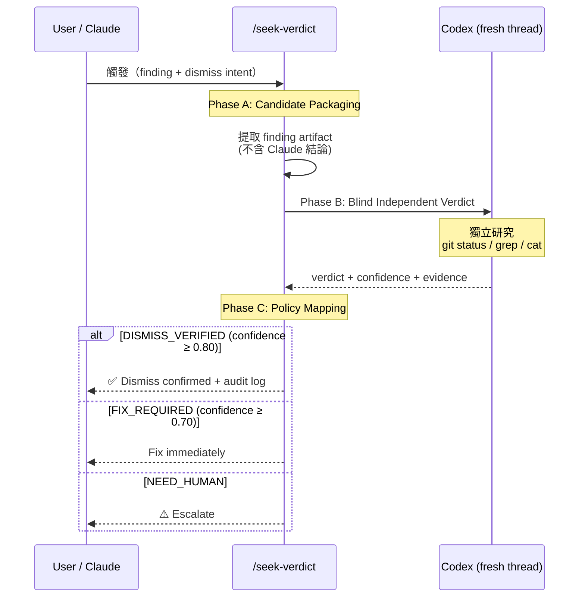

# seek-verdict: Dismiss-with-Evidence Verification Skill — Technical Spec

## 1. Requirement Summary

- **Problem**: Claude Code 在 review loop 中有時會判斷某個 finding 為 false positive 或無需處理，但目前沒有輕量的獨立驗證機制。唯一選項是手動呼叫 `/codex-brainstorm`（5-phase 重量級流程），或直接跳到 `⚠️ Need Human`
- **Goals**:
  1. 提供輕量的 `/seek-verdict` skill，讓 Claude 或使用者可選地取得 Codex 獨立驗證
  2. 採用 blind verification protocol — 將 finding artifact（而非結論）送給 Codex
  3. 產出結構化 audit trail，支援事後追蹤
- **Scope**:
  - P2 findings 的 dismiss 驗證（Nit 保留現有 `[NIT_DEFERRED]` 機制，P0/P1 不可 dismiss）
  - **Optional invocation** — 不強制整合進 auto-loop，由模型判斷或使用者手動觸發
  - **Auto-loop insertion point**: 在 `auto-loop.md` Resolution Evaluation 的 "Unresolved P2 → ⚠️ Need Human" 路徑之前，使用者或模型 **可選地** 呼叫 `/seek-verdict` 一次。若未呼叫，原有行為不變
- **Non-goals**:
  - 不取代 `/codex-brainstorm`（多輪對抗辯論仍用 brainstorm）
  - 不修改現有 hook sentinel parser
  - 不建立 dismiss accuracy feedback loop（P3 未來迭代）

## 2. Existing Code Analysis

### Related Modules

| File | Relevance |
|------|-----------|
| `skills/codex-brainstorm/SKILL.md` | 現有對抗辯論 skill；seek-verdict 是其輕量替代 |
| `skills/codex-code-review/SKILL.md` | Review loop 產出 P2/Nit findings |
| `skills/codex-code-review/references/review-common.md` | P2/Nit judgment、`[NIT_DEFERRED]` 格式、false-positive detection |
| `rules/auto-loop.md` | P2/Nit Quality Sweep、Resolution Evaluation |
| `rules/fix-all-issues.md` | Zero tolerance exceptions |
| `rules/codex-invocation.md` | Independent research enforcement |

### Reusable Components

| Component | Reuse Point |
|-----------|-------------|
| `skills/codex-code-review/references/codex-research-instructions.md` | Standard Research Block — 引用或複製至 `skills/seek-verdict/references/` |
| `review-common.md` P2/Nit Judgment | Finding key canonicalization (`file + canonical_issue_text`) |
| `[NIT_DEFERRED]` format | Audit trail 格式可參考延伸 |

### Design Constraints

| Constraint | Source | Implication |
|------------|--------|-------------|
| Codex 必須獨立研究 | `codex-invocation.md` | Prompt 不可包含 Claude 的結論 |
| Zero tolerance | `fix-all-issues.md` | Dismiss 必須有 verified exception path |
| Hook sentinel 不可變更 | `auto-loop.md` | 新 sentinel 為 behavior-layer only |
| Optional invocation | 使用者需求 | 不修改 auto-loop 強制路徑 |

## 3. Technical Solution

### 3.1 Architecture Design



### 3.2 Skill File Structure

```
skills/seek-verdict/
├── SKILL.md                           # 主要指引
└── references/
    ├── verdict-prompt.md              # Codex blind verification prompt template
    └── policy-mapping.md             # Confidence threshold → verdict mapping + output format
```

```
commands/seek-verdict.md               # Command 入口
```

### 3.3 3-Phase Protocol

#### Phase A: Candidate Packaging (local, no Codex call)

從 review output 提取 finding artifact：

```
finding_packet:
  finding_key: <file + canonical_issue_text>
  severity: P2
  original_finding_text: <Codex review 原文（已 redact secrets/tokens）>
  origin_thread_id: <review session threadId>
  current_head_sha: <git rev-parse HEAD>
  relevant_diff: <git diff HEAD -- <file>（送 Codex 用，不記入 audit log）>
```

**Critical**: Claude 的 dismiss hypothesis 記錄在本地但 **不傳給 Codex**。

#### Phase B: Blind Independent Verdict (fresh Codex thread)

使用 `mcp__codex__codex`（新 thread），prompt 結構：

```
You are a senior code reviewer performing an independent assessment.

## Finding Under Review
[finding_packet — 原文 + diff + file context]

⚠️ Do not assume this finding is true or false.
Your job is to independently determine whether this finding is actionable.

## ⚠️ You must independently research the project ⚠️
[Standard Research Block from codex-research-instructions.md]

## Output (required fields)
- codex_verdict: ACTIONABLE | NON_ACTIONABLE | UNCERTAIN
- confidence: [0.0 - 1.0]
- evidence_refs: [files/lines/commands used]
- reasoning: [why this verdict, not the others]
```

Config: `sandbox: 'read-only'`, `approval-policy: 'never'`

#### Phase C: Policy Mapping

| Codex Verdict | Confidence | Result | Action |
|---------------|------------|--------|--------|
| NON_ACTIONABLE | ≥ 0.80 + ≥ 2 evidence refs | `DISMISS_VERIFIED` | 記錄 audit log，continue |
| ACTIONABLE | ≥ 0.70 | `FIX_REQUIRED` | 回到 fix loop |
| UNCERTAIN / low confidence | any | `NEED_HUMAN` | 停止，escalate |

**Asymmetric threshold 理由**: dismiss 門檻 (0.80) 高於 fix 門檻 (0.70)，因為 false negative（漏掉真問題）的代價 > false positive（多修一個不需要的問題）。

### 3.4 Rebuttal Mechanism（Optional）

如果 Codex 判定 `FIX_REQUIRED` 但 Claude 仍有異議：

1. 允許 **1 輪** counter-evidence（使用 `mcp__codex__codex-reply`，同一 verdict thread）
2. 只可提供客觀 artifact（測試、spec、語言語義），不可 "please confirm me"
3. Rebuttal 後：
   - 仍 `FIX_REQUIRED` → fix
   - 仍 ambiguous → `NEED_HUMAN`
4. **無無限辯論** — 1 輪上限

### 3.5 Audit Trail Format

```
[DISMISS_VERDICT] key=<file|canonical_issue> | severity=P2 | verdict=<DISMISS_VERIFIED|FIX_REQUIRED|NEED_HUMAN> | confidence=<0..1> | codex_thread=<id> | evidence=<brief> | timestamp=<ISO8601>
```

#### Redaction Rules

| Field | Redaction Policy |
|-------|-----------------|
| `key` | 保留 file path + issue 摘要（≤ 120 chars），移除程式碼片段 |
| `evidence` | 僅保留 file:line references，不含原始程式碼內容 |
| `finding_packet.relevant_diff` | 送給 Codex 前不 redact（Codex 需要完整 context）；audit log 中 **不記錄 diff 內容** |
| 所有欄位 | 禁止記錄 secrets/tokens/passwords/API keys（遵循 `rules/logging.md`） |

**Retention**: `[DISMISS_VERDICT]` 為 session output 日誌，不持久化至檔案系統。如需持久化，遵循專案 `.gitignore` 政策。

### 3.6 Anti-Abuse Guard（Behavior-layer）

**Session scope definition**: "session" = 單一 Claude Code conversation session（從使用者啟動到結束）。Branch 切換或新 conversation 重置 streak counter。

| Condition | Action |
|-----------|--------|
| 同一 session 3 次連續 `DISMISS_VERIFIED` | 發出 `[DISMISS_PATTERN_WARN]` |
| Warning 狀態下後續 dismiss | 提高門檻：confidence ≥ 0.85 + ≥ 3 evidence refs |
| Session 結束或 branch 切換 | 重置 streak counter |

```
[DISMISS_PATTERN_WARN] streak=<N> | scope=P2 | reason=systematic-over-dismiss-risk | action=heightened-scrutiny | timestamp=<ISO8601>
```

## 4. Risks and Dependencies

| # | Risk | Severity | Mitigation |
|---|------|----------|------------|
| R1 | Anchoring bias — Codex 在同一 review thread 中已有偏見 | High | **強制使用新 thread**（`mcp__codex__codex`），不可使用 review session 的 `codex-reply` |
| R2 | Rubber stamp — Claude 餵結論給 Codex | High | Prompt template 硬編碼 "Do not assume true or false"；遵循 `codex-invocation.md` |
| R3 | Over-dismiss — skill 變成「免死金牌」 | Medium | Anti-abuse guard：3 連續 dismiss 觸發 warning + 提高門檻 |
| R4 | Hook sentinel 衝突 | Low | `[DISMISS_VERDICT]` 為 behavior-layer only，不修改 hook parser |
| R5 | Confidence 校準漂移 | Low | 初始 threshold 為 conservative；可根據 audit trail 資料未來調整 |
| R6 | Finding key 碰撞 | Low | 使用 `file + canonical_issue_text`（沿用 review-common.md 現有邏輯） |

## 5. Work Breakdown

| # | Task | Effort | Dependencies |
|---|------|--------|--------------|
| W1 | 建立 `skills/seek-verdict/SKILL.md` | S | — |
| W2 | 建立 `skills/seek-verdict/references/verdict-prompt.md` | S | W1 |
| W3 | 建立 `skills/seek-verdict/references/policy-mapping.md` | S | W1 |
| W4 | 建立 `commands/seek-verdict.md` | S | W1 |
| W5 | 更新 `rules/fix-all-issues.md` — 新增 verified dismiss exception | S | W1 |
| W6 | 更新 `skills/codex-code-review/references/review-common.md` — 新增 `[DISMISS_VERDICT]` 格式 | S | W3 |
| W7 | 撰寫 test：`test/commands/seek-verdict.test.js` | M | W4 |

**Total estimated effort**: M (Medium)

## 6. Testing Strategy

| Type | Scope | File |
|------|-------|------|
| Unit | Prompt template 格式驗證、policy mapping logic | `test/commands/seek-verdict.test.js` |
| Integration | 模擬 P2 finding → seek-verdict → verdict output | 同上 |

### Test Cases

| # | Scenario | Expected |
|---|----------|----------|
| T1 | P2 finding + Codex NON_ACTIONABLE + confidence 0.90 | `DISMISS_VERIFIED` |
| T2 | P2 finding + Codex ACTIONABLE + confidence 0.85 | `FIX_REQUIRED` |
| T3 | P2 finding + Codex UNCERTAIN + confidence 0.50 | `NEED_HUMAN` |
| T4 | P2 finding + Codex NON_ACTIONABLE + confidence 0.70 (below threshold) | `NEED_HUMAN` |
| T5 | P0 finding passed to skill | Rejected (P2 only) |
| T6 | 3 consecutive DISMISS_VERIFIED | `[DISMISS_PATTERN_WARN]` emitted |
| T7 | Prompt contains Claude's conclusion | Validation error (anti-anchoring) |
| T8 | P2 finding + Codex NON_ACTIONABLE + confidence exactly 0.80 | `DISMISS_VERIFIED` (boundary inclusive) |
| T9 | P2 finding + Codex ACTIONABLE + confidence exactly 0.70 | `FIX_REQUIRED` (boundary inclusive) |
| T10 | P2 finding + Codex NON_ACTIONABLE + confidence 0.79 | `NEED_HUMAN` (below threshold) |
| T11 | Rebuttal round: Codex still FIX_REQUIRED after 1 rebuttal | `FIX_REQUIRED` (no more rounds) |
| T12 | Anti-abuse: 4th DISMISS_VERIFIED after warning | Requires confidence ≥ 0.85 + ≥ 3 evidence refs |
| T13 | Anti-abuse: branch switch resets streak | Counter = 0 after switch |

## 7. Open Questions

| # | Question | Impact | Proposed Resolution |
|---|----------|--------|---------------------|
| Q1 | 是否需要未來將 seek-verdict 整合進 auto-loop 作為強制步驟？ | auto-loop 規則變更 | **暫不整合** — 先作為 optional skill 累積使用資料，再決定是否強制 |
| Q2 | Confidence threshold 是否需要 per-project 可配置？ | 彈性 vs 複雜度 | 初期使用固定 threshold，未來如有需求再加 config |
| Q3 | `[DISMISS_VERDICT]` 是否需要寫入 `.claude_review_state.json`？ | Hook 整合 | 暫不寫入（behavior-layer only），避免 hook 複雜度增加 |
| Q4 | Rebuttal 機制是否應在 v1 實作？ | 功能完整度 | **建議 v1 包含** — 用戶案例（Circuit Breaker）顯示需要 counter-evidence 能力 |

## Appendix: Design Decision Record

### Decision: Optional vs Mandatory

| Option | Pros | Cons |
|--------|------|------|
| **Optional (chosen)** | 無 auto-loop 變更風險；使用者/模型自行判斷時機；可先累積資料 | 可能被遺忘不用 |
| Mandatory in auto-loop | 保證所有 P2 dismiss 都有驗證 | 增加 review loop latency；auto-loop 規則變更影響面大 |

**Decision**: v1 為 Optional，基於：
1. 使用者明確要求不強制
2. 先累積使用資料驗證 skill 價值
3. 未來可升級為 auto-loop 整合（只需修改 `auto-loop.md` Resolution Evaluation）

### Decision: Fresh Thread vs Review Thread

| Option | Pros | Cons |
|--------|------|------|
| **Fresh thread (chosen)** | 零 anchoring bias；完全獨立 | 額外 MCP call 成本 |
| Review thread continuation | 有完整 context | Codex 已對該 finding 有既有判斷，無法獨立 |

**Decision**: Fresh thread，因為 blind verification 是此 skill 的核心價值。

### Source: Best Practices Audit

- **Debate threadId**: `019cd149-6fce-7e12-8cb6-2db73637a106`
- **Debate rounds**: 3 rounds → Nash Equilibrium
- **Industry sources**: Qodo multi-agent review, arXiv adversarial debate, Graphite false positive management
