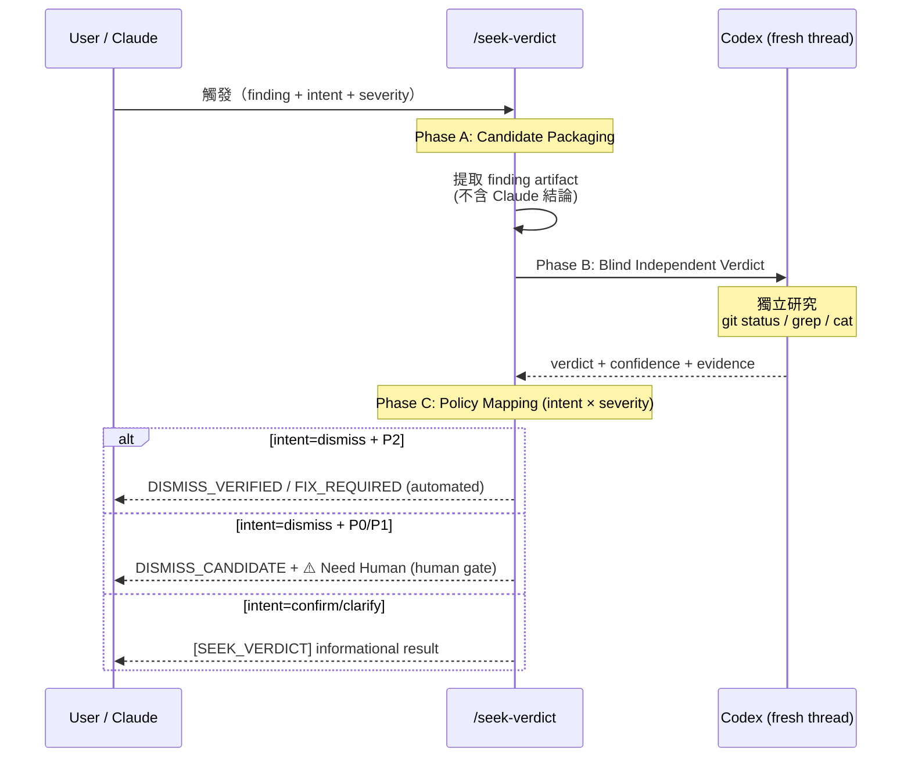

# seek-verdict: Independent Second-Opinion Verification Skill — Technical Spec (v2)

## 1. Requirement Summary

- **Problem**: v1 限制 `/seek-verdict` 僅用於 P2 dismiss，但實際使用場景已超出此範圍：`load-pr-review` 被迫將所有 thread 硬編碼為 P2 以繞過 severity gate，`issue-analyze` 也隱含了更廣泛的用法。P1 false positive（如 lint damage 被報為 P1 shell injection）無法透過 seek-verdict 解決
- **Goals**:
  1. 泛化為通用獨立第二視角工具，支援任何 severity
  2. 引入 `intent` 參數區分用途（dismiss / confirm / clarify）
  3. 維持 anti-anchoring 和 blind verification 核心設計
  4. P0/P1 dismiss 需人類確認作為最終 gate
- **Scope**:
  - 所有 severity（P0/P1/P2/Nit）的 independent verification
  - 三種 intent：`dismiss`（是 false positive 嗎？）、`confirm`（issue 真的存在嗎？）、`clarify`（影響範圍？）
  - **Auto-loop integration**: P0/P1 dismiss candidate 以 `⚠️ Need Human` 形式整合（不違反 auto-loop 禁止暫停規則）
- **Non-goals**:
  - 不取代 `/codex-brainstorm`（多輪對抗辯論仍用 brainstorm）
  - 不修改現有 hook sentinel parser
  - 不建立 dismiss accuracy feedback loop（P3 未來迭代）
- **v1 → v2 changes**: 移除 severity gate、新增 intent 參數、graduated thresholds、human confirmation gate for P0/P1 dismiss

## 2. Existing Code Analysis

### Related Modules

| File | Relevance |
|------|-----------|
| `skills/codex-brainstorm/SKILL.md` | 現有對抗辯論 skill；seek-verdict 是其輕量替代 |
| `skills/codex-code-review/SKILL.md` | Review loop 產出 P0-Nit findings |
| `skills/codex-code-review/references/review-common.md` | Judgment、`[NIT_DEFERRED]` 格式、false-positive detection |
| `skills/load-pr-review/SKILL.md` | 已用 seek-verdict 做 PR thread triage（P2 hack 需移除） |
| `rules/auto-loop.md` | P2/Nit Quality Sweep、Resolution Evaluation、`⚠️ Need Human` exit |
| `rules/fix-all-issues.md` | Zero tolerance exceptions — 需擴展至 P0/P1 human-confirm |
| `rules/codex-invocation.md` | Independent research enforcement |

### Reusable Components

| Component | Reuse Point |
|-----------|-------------|
| `skills/codex-code-review/references/codex-research-instructions.md` | Standard Research Block — 引用或複製至 `skills/seek-verdict/references/` |
| `review-common.md` P2/Nit Judgment | Finding key canonicalization (`file + canonical_issue_text`) |
| `[NIT_DEFERRED]` format | Audit trail 格式可參考延伸 |

### Design Constraints

| Constraint | Source | Implication |
|------------|--------|-------------|
| Codex 必須獨立研究 | `codex-invocation.md` | Prompt 不可包含 Claude 的結論 |
| Zero tolerance | `fix-all-issues.md` | Dismiss 必須有 verified exception path |
| Hook sentinel 不可變更 | `auto-loop.md` | 新 sentinel 為 behavior-layer only |
| Optional invocation | 使用者需求 | 不修改 auto-loop 強制路徑 |

## 3. Technical Solution

### 3.1 Architecture Design



### 3.2 Skill File Structure

```
skills/seek-verdict/
├── SKILL.md                           # 主要指引
└── references/
    ├── verdict-prompt.md              # Codex blind verification prompt template
    └── policy-mapping.md             # Confidence threshold → verdict mapping + output format
```

```
commands/seek-verdict.md               # Command 入口
```

### 3.3 3-Phase Protocol

#### Phase A: Candidate Packaging (local, no Codex call)

從 review output 提取 finding artifact：

```
finding_packet:
  finding_key: <file + canonical_issue_text>
  severity: <P0 | P1 | P2 | Nit>
  intent: <dismiss | confirm | clarify>
  original_finding_text: <Codex review 原文（已 redact secrets/tokens）>
  origin_thread_id: <review session threadId>
  current_head_sha: <git rev-parse HEAD>
  relevant_diff: <git diff HEAD -- <file>（送 Codex 用，不記入 audit log）>
```

**Critical**: Claude 的 dismiss hypothesis 記錄在本地但 **不傳給 Codex**。

#### Phase B: Blind Independent Verdict (fresh Codex thread)

使用 `mcp__codex__codex`（新 thread），prompt 結構：

```
You are a senior code reviewer performing an independent assessment.

## Finding Under Review
[finding_packet — 原文 + diff + file context]

⚠️ Do not assume this finding is true or false.
Your job is to independently determine whether this finding is actionable.

## ⚠️ You must independently research the project ⚠️
[Standard Research Block from codex-research-instructions.md]

## Output (required fields)
- codex_verdict: ACTIONABLE | NON_ACTIONABLE | UNCERTAIN
- confidence: [0.0 - 1.0]
- evidence_refs: [files/lines/commands used]
- reasoning: [why this verdict, not the others]
```

Config: `sandbox: 'read-only'`, `approval-policy: 'never'`

#### Phase C: Policy Mapping

#### Dismiss Intent — Graduated Thresholds (severity × confidence)

| Severity | Confidence | Evidence | Result | Authorization |
|----------|-----------|----------|--------|---------------|
| P0 | ≥ 0.95 | ≥ 4 refs | `DISMISS_CANDIDATE` | **⚠️ Need Human** (人類最終確認) |
| P1 | ≥ 0.90 | ≥ 3 refs | `DISMISS_CANDIDATE` | **⚠️ Need Human** (人類最終確認) |
| P2 | ≥ 0.80 | ≥ 2 refs | `DISMISS_VERIFIED` | Automated (v1 行為不變) |
| Nit | ≥ 0.70 | ≥ 1 ref | `DISMISS_VERIFIED` | Automated |
| Any | ACTIONABLE ≥ 0.70 | — | `FIX_REQUIRED` | 回到 fix loop |
| Any | UNCERTAIN / low | — | `NEED_HUMAN` | 停止，escalate |

**P0/P1 Human Gate Protocol**:

`DISMISS_CANDIDATE` 不是最終授權。轉換流程：

```
1. seek-verdict 產出 DISMISS_CANDIDATE + 結構化 evidence
2. 模型輸出 ⚠️ Need Human（auto-loop exit condition，停止自動流程）
3. 使用者在下一個 prompt 中明確回覆 "confirm dismiss" 或 "fix it"
4. 若 confirm → 模型記錄 `[DISMISS_VERDICT]` with `verdict=DISMISS_VERIFIED` + `authorization=human-confirmed`
5. 若 reject → 回到 fix loop
```

**操作約束**：
- `DISMISS_CANDIDATE` **永遠無法自動轉為** `DISMISS_VERIFIED`（即使 confidence=1.0）
- 人類確認必須在**同一 session 的後續 prompt** 中完成（不可跨 session）
- 確認記錄必須包含 `confirmed_by=human` + `confirmation_prompt_hash=<SHA256 of user message>`

#### Confirm/Clarify Intent — Informational Only

| Intent | Verdict Enum | Authorization Effect |
|--------|-------------|---------------------|
| `confirm` | `CONFIRMED` / `DISPUTED` / `UNCERTAIN` | None (informational) |
| `clarify` | `HIGH_IMPACT` / `LOW_IMPACT` / `UNCERTAIN` | None (informational) |

All intents use deterministic enums. Codex 的自由文字推理放在 `reasoning` 欄位（不在 `verdict`）。

**Confirm intent mapping** (`codex_verdict` → result):

| Codex Verdict | Confidence | Result |
|---------------|-----------|--------|
| ACTIONABLE | ≥ 0.70 | `CONFIRMED` |
| NON_ACTIONABLE | ≥ 0.70 | `DISPUTED` |
| UNCERTAIN / low confidence | any | `UNCERTAIN` |

**Clarify intent mapping** (`codex_verdict` + reasoning → impact):

| Codex Assessment | Confidence | Result |
|-----------------|-----------|--------|
| Describes broad or critical impact | ≥ 0.70 | `HIGH_IMPACT` |
| Describes narrow or negligible impact | ≥ 0.70 | `LOW_IMPACT` |
| Cannot determine impact / low confidence | any | `UNCERTAIN` |

Confirm/clarify 不產生 dismiss authorization，也不影響 `fix-all-issues.md` 的例外路徑。

**Asymmetric threshold 理由**: dismiss 門檻隨 severity 遞增，因為 false negative（漏掉真問題）的代價與 severity 成正比。

### 3.4 Rebuttal Mechanism（Optional）

如果 Codex 判定 `FIX_REQUIRED` 但 Claude 仍有異議：

1. 允許 **1 輪** counter-evidence（使用 `mcp__codex__codex-reply`，同一 verdict thread）
2. 只可提供客觀 artifact（測試、spec、語言語義），不可 "please confirm me"
3. Rebuttal 後：
   - 仍 `FIX_REQUIRED` → fix
   - 仍 ambiguous → `NEED_HUMAN`
4. **無無限辯論** — 1 輪上限

### 3.5 Audit Trail Format

**Dismiss intent** (backward compatible — new fields are additive):

```
[DISMISS_VERDICT] key=<file|canonical_issue> | severity=<P0-Nit> | verdict=<DISMISS_VERIFIED|DISMISS_CANDIDATE|FIX_REQUIRED|NEED_HUMAN> | confidence=<0..1> | codex_thread=<id> | evidence=<brief> | timestamp=<ISO8601> | intent=dismiss | authorization=<automated|human-required|human-confirmed>
```

**Backward compat strategy**: `intent=` 和 `authorization=` 放在行尾，作為 optional additive fields。v1 parser 使用 `|` split + key lookup，遇到未知 key 忽略。v2 parser 可讀取新 fields。不需要 version header。

**Confirm/Clarify intent** (new token):

```
[SEEK_VERDICT] key=<file|canonical_issue> | severity=<P0-Nit> | intent=<confirm|clarify> | verdict=<CONFIRMED|DISPUTED|HIGH_IMPACT|LOW_IMPACT|UNCERTAIN> | confidence=<0..1> | codex_thread=<id> | evidence=<brief> | timestamp=<ISO8601>
```

#### Redaction Rules

| Field | Redaction Policy |
|-------|-----------------|
| `key` | 保留 file path + issue 摘要（≤ 120 chars），移除程式碼片段 |
| `evidence` | 僅保留 file:line references，不含原始程式碼內容 |
| `finding_packet.relevant_diff` | 送給 Codex 前不 redact（Codex 需要完整 context）；audit log 中 **不記錄 diff 內容** |
| 所有欄位 | 禁止記錄 secrets/tokens/passwords/API keys（遵循 `rules/logging.md`） |

**Retention**: `[DISMISS_VERDICT]` 為 session output 日誌，不持久化至檔案系統。如需持久化，遵循專案 `.gitignore` 政策。

### 3.6 Anti-Abuse Guard（Behavior-layer）

**Session scope definition**: "session" = 單一 Claude Code conversation session（從使用者啟動到結束）。Branch 切換或新 conversation 重置 streak counter。

**Dismiss intent only**:

| Condition | Action |
|-----------|--------|
| 同一 session 3 次連續 `DISMISS_VERIFIED` | 發出 `[DISMISS_PATTERN_WARN]` |
| Warning 狀態下後續 dismiss | 提高門檻：+0.05 confidence, +1 evidence |
| Session 結束或 branch 切換 | 重置 streak counter |

**Confirm/Clarify intent**: 不計入 anti-abuse streak，但有 per-finding cap：

| Condition | Action |
|-----------|--------|
| 同一 finding 已執行 1 次 confirm + 1 次 clarify | 拒絕後續 confirm/clarify（防止 stall） |

**Counter key**: `finding_key + current_head_sha + intent` — 同一 finding 在同一 commit 上的同一 intent 只能執行一次。

**Reset rules**:

| Event | Effect |
|-------|--------|
| New commit (`head_sha` change) | Reset all per-finding counters |
| Branch switch | Reset all counters |
| Session end | Reset all counters |

```
[DISMISS_PATTERN_WARN] streak=<N> | scope=all-severity | reason=systematic-over-dismiss-risk | action=heightened-scrutiny | timestamp=<ISO8601>
```

## 4. Risks and Dependencies

| # | Risk | Severity | Mitigation |
|---|------|----------|------------|
| R1 | Anchoring bias — Codex 在同一 review thread 中已有偏見 | High | **強制使用新 thread**（`mcp__codex__codex`），不可使用 review session 的 `codex-reply` |
| R2 | Rubber stamp — Claude 餵結論給 Codex | High | Prompt template 硬編碼 "Do not assume true or false"；遵循 `codex-invocation.md` |
| R3 | P0/P1 dismiss abuse — 泛化後嘗試 dismiss 嚴重問題 | High | Human confirmation gate：P0/P1 dismiss 產出 `DISMISS_CANDIDATE` + `⚠️ Need Human`，不可自動 dismiss |
| R4 | Over-dismiss — skill 變成「免死金牌」 | Medium | Anti-abuse guard：3 連續 dismiss + graduated thresholds |
| R5 | Confirm/Clarify stall — 用 informational 意圖拖延修復 | Medium | Per-finding per-commit cap（1 confirm + 1 clarify） |
| R6 | Hook sentinel 衝突 | Low | `[DISMISS_VERDICT]` / `[SEEK_VERDICT]` 為 behavior-layer only |
| R7 | Policy exception surface 擴大 | Medium | `fix-all-issues.md` exception 明確列出 human-confirm 條件 |
| R8 | Confidence 校準漂移 | Low | 初始 threshold 為 conservative；可根據 audit trail 資料未來調整 |

## 5. Work Breakdown

| # | Task | Effort | Dependencies | v2 Status |
|---|------|--------|--------------|-----------|
| W1 | 更新 `skills/seek-verdict/SKILL.md` — 加入 intent 參數、移除 severity gate | M | — | **v2 new** |
| W2 | 更新 `references/verdict-prompt.md` — severity/intent 參數化 | S | W1 | **v2 update** |
| W3 | 更新 `references/policy-mapping.md` — intent × severity matrix | M | W1 | **v2 update** |
| W4 | 更新 `commands/seek-verdict.md` — 移除 P2 gate、加入 intent 參數 | S | W1 | **v2 update** |
| W5 | 更新 `rules/fix-all-issues.md` — 擴展 exception 至 P0/P1 human-confirm | S | W1 | **v2 update** |
| W6 | 更新 `review-common.md` — 加入 `[SEEK_VERDICT]` 格式 | S | W3 | **v2 new** |
| W7 | 更新 `skills/load-pr-review/` — 移除 P2 hack，使用實際 severity | M | W1 | **v2 new** |
| W8 | 更新 test：新 intent + severity threshold assertions | M | W4 | **v2 update** |
| W9 | 更新 `rules/auto-loop.md` — 新增 P0/P1 dismiss `⚠️ Need Human` 原因定義 | S | W1 | **v2 new** |
| W10 | 更新 `skills/issue-analyze/SKILL.md` — 對齊 v2 format/threshold | S | W3 | **v2 new** |
| W11 | 更新 `skills/load-pr-review/references/verdict-triage-prompt.md` — 移除 P2 hardcode | S | W7 | **v2 new** |

**Total estimated effort**: L (Large) — 主要因為跨多個 skill 的 integration 更新

## 6. Testing Strategy

| Type | Scope | File |
|------|-------|------|
| Unit | Prompt template 格式驗證、policy mapping logic | `test/commands/seek-verdict.test.js` |
| Integration | 模擬 P2 finding → seek-verdict → verdict output | 同上 |

### Test Cases

### v1 Tests (preserved)

| # | Scenario | Expected |
|---|----------|----------|
| T1 | P2 + dismiss + NON_ACTIONABLE + confidence 0.90 | `DISMISS_VERIFIED` |
| T2 | P2 + dismiss + ACTIONABLE + confidence 0.85 | `FIX_REQUIRED` |
| T3 | P2 + dismiss + UNCERTAIN + confidence 0.50 | `NEED_HUMAN` |
| T4 | P2 + dismiss + NON_ACTIONABLE + confidence 0.70 | `NEED_HUMAN` (below 0.80) |
| T6 | 3 consecutive DISMISS_VERIFIED | `[DISMISS_PATTERN_WARN]` |
| T7 | Prompt contains Claude's conclusion | Validation error (anti-anchoring) |
| T8 | P2 + dismiss + NON_ACTIONABLE + confidence exactly 0.80 | `DISMISS_VERIFIED` (boundary) |
| T9 | P2 + dismiss + ACTIONABLE + confidence exactly 0.70 | `FIX_REQUIRED` (boundary inclusive) |
| T10 | P2 + dismiss + NON_ACTIONABLE + confidence 0.79 | `NEED_HUMAN` (below threshold) |
| T11 | Rebuttal: still FIX_REQUIRED after 1 round | `FIX_REQUIRED` |
| T12 | 4th DISMISS after warning | heightened threshold |
| T13 | Branch switch resets streak | Counter = 0 |

### v2 New Tests

| # | Scenario | Expected |
|---|----------|----------|
| T5v2 | P0 + dismiss + NON_ACTIONABLE + confidence 0.95 + 4 evidence | `DISMISS_CANDIDATE` + `⚠️ Need Human` |
| T14 | P1 + dismiss + NON_ACTIONABLE + confidence 0.90 + 3 evidence | `DISMISS_CANDIDATE` + `⚠️ Need Human` |
| T15 | P1 + dismiss + NON_ACTIONABLE + confidence 0.85 (below 0.90) | `NEED_HUMAN` |
| T16 | P0 + dismiss + confidence 0.94 (below 0.95) | `NEED_HUMAN` |
| T17 | P2 + confirm + ACTIONABLE + confidence 0.85 | `CONFIRMED` (informational) |
| T18 | P1 + confirm + NON_ACTIONABLE + confidence 0.80 | `DISPUTED` (informational) |
| T19 | P0 + clarify + Codex assesses high impact | `HIGH_IMPACT` (informational, deterministic enum) |
| T20 | Same finding: 2nd confirm after 1 confirm + 1 clarify | Rejected (per-finding cap) |
| T21 | Nit + dismiss + NON_ACTIONABLE + confidence 0.70 | `DISMISS_VERIFIED` (Nit threshold) |
| T22 | `[SEEK_VERDICT]` output format for confirm intent | Correct format with intent field |
| T23 | `[DISMISS_VERDICT]` backward compat for P2 dismiss | Same format as v1 + new `intent=` and `authorization=` fields |

## 7. Open Questions

| # | Question | Impact | Proposed Resolution |
|---|----------|--------|---------------------|
| Q1 | ~~是否整合進 auto-loop？~~ | ~~auto-loop 變更~~ | v1 optional; v2 P0/P1 dismiss 以 `⚠️ Need Human` 整合 |
| Q2 | Confidence threshold 是否需要 per-project 可配置？ | 彈性 vs 複雜度 | 初期固定，未來如有需求加 config |
| Q3 | `[DISMISS_VERDICT]` 是否寫入 `.claude_review_state.json`？ | Hook 整合 | 暫不寫入 |
| Q4 | ~~Rebuttal 機制？~~ | ~~功能完整度~~ | v1 已包含 |
| Q5 | ~~Human confirmation UX~~ | ~~P0/P1 dismiss flow~~ | **Resolved**: `⚠️ Need Human` stop → user confirms in next prompt → `[DISMISS_VERDICT] authorization=human-confirmed` |
| Q6 | `load-pr-review` severity derivation — 移除 P2 hack 後如何決定 severity？ | integration | 建議用 reviewer 的 severity classification（如有）；fallback P2 |

## Appendix: Design Decision Record

### Decision: Optional vs Mandatory

| Option | Pros | Cons |
|--------|------|------|
| **Optional (chosen)** | 無 auto-loop 變更風險；使用者/模型自行判斷時機；可先累積資料 | 可能被遺忘不用 |
| Mandatory in auto-loop | 保證所有 P2 dismiss 都有驗證 | 增加 review loop latency；auto-loop 規則變更影響面大 |

**Decision**: v1 為 Optional，基於：
1. 使用者明確要求不強制
2. 先累積使用資料驗證 skill 價值
3. 未來可升級為 auto-loop 整合（只需修改 `auto-loop.md` Resolution Evaluation）

### Decision: Fresh Thread vs Review Thread

| Option | Pros | Cons |
|--------|------|------|
| **Fresh thread (chosen)** | 零 anchoring bias；完全獨立 | 額外 MCP call 成本 |
| Review thread continuation | 有完整 context | Codex 已對該 finding 有既有判斷，無法獨立 |

**Decision**: Fresh thread，因為 blind verification 是此 skill 的核心價值。

### Decision: v2 Intent-Based Generalization

| Option | Pros | Cons |
|--------|------|------|
| **Keep P2-only** | Simple, proven | load-pr-review hack, P1 false positives unresolvable |
| **Full auto-dismiss all severities** | Maximum utility | P0/P1 safety risk, confidence not calibrated enough |
| **Intent-based + graduated thresholds (chosen)** | Covers all use cases; P0/P1 human gate preserves safety | More complex policy mapping |

**Decision**: v2 intent-based model with graduated thresholds, P0/P1 human gate.

**Basis**: Adversarial brainstorm debate (threadId: `019d1b01-d16e-7180-a4a9-2fb25c596e59`, 3 rounds, pure strategy convergence). Industry evidence: IV&V IEEE-STD-1012 independence principle, Adversarial Code Review pattern.

### Source: Best Practices Audit (v1)

- **Debate threadId**: `019cd149-6fce-7e12-8cb6-2db73637a106`
- **Debate rounds**: 3 rounds → Nash Equilibrium
- **Industry sources**: Qodo multi-agent review, arXiv adversarial debate, Graphite false positive management

### v2 Review Findings (threadId: `019d1db6-1946-7950-a0ca-ed2f307abdd1`)

Implementation 前需解決的設計缺口：

| # | 🔴 Finding | Resolution | Status |
|---|-----------|-----------|--------|
| 1 | P0/P1 `DISMISS_CANDIDATE → DISMISS_VERIFIED` 轉換無操作定義 | 定義 5-step human-confirm protocol + confirmation_prompt_hash | ✅ Resolved |
| 2 | `clarify` intent 的 `verdict=free-text` 不可解析 | 改為 `HIGH_IMPACT` / `LOW_IMPACT` / `UNCERTAIN` enum | ✅ Resolved |
| 3 | Per-finding cap 的 counter key 和 reset 規則未定義 | key = `finding_key + head_sha + intent`，reset on commit/branch/session | ✅ Resolved |
| 4 | 新增 `intent`/`authorization` 欄位的 backward compat 策略 | Additive fields at line end；v1 parser 忽略未知 key | ✅ Resolved |
| 5 | WBS 缺少 auto-loop rule update + issue-analyze alignment | 新增 W9, W10, W11 task items | ✅ Resolved |

### Source: Best Practices Audit (v2)

- **Debate threadId**: `019d1b01-d16e-7180-a4a9-2fb25c596e59`
- **Debate rounds**: 3 rounds → Nash Equilibrium (pure strategy convergence)
- **Industry sources**: ASDLC.io Adversarial Code Review, NIST IV&V, NASA IV&V, Latent.Space, arXiv 2602.16741
