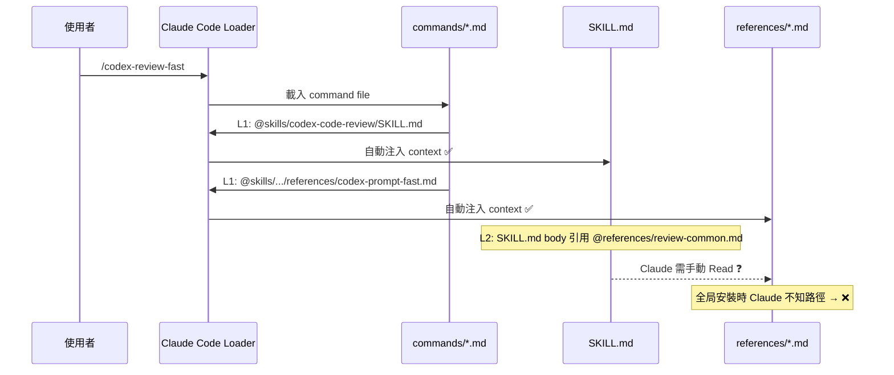
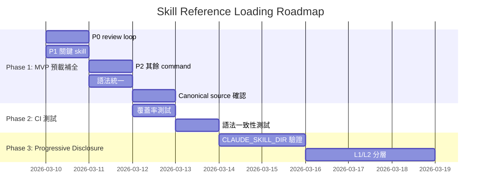

# Skill Reference Loading — Technical Spec

## 1. Requirement Summary

- **Problem**: 87% (53/61) 的 skill reference files 未被 command 預載。全局安裝時 Claude 無法解析 reference 路徑，導致 loop review template、severity definitions、research instructions 等關鍵內容遺失，降低 review loop 品質。
- **Goals**:
  1. 消除 53 個 reference file 的載入 gap
  2. 確保 review loop (`--continue`) 總是能讀取 re-review template
  3. 不違反 progressive disclosure 原則（token 效率）
  4. 新增 CI 測試防止未來 gap 回歸
- **Scope**:
  - IN: command 預載補全、reference 引用語法統一、CI 覆蓋率測試
  - OUT: `${CLAUDE_SKILL_DIR}` 整合（Phase 2, 需先驗證 body text substitution）、跨 skill reference 機制

## 2. Existing Code Analysis

### 2.1 Reference 載入的兩層機制



### 2.2 現狀數據

| 指標 | 數值 |
|------|------|
| Reference files 總數 | 61 |
| L1 預載（command `@skills/.../references/`） | 8 (13%) |
| 未被 command 預載 | 53 (87%) |
| `${CLAUDE_SKILL_DIR}` 使用次數 | 0 |

### 2.3 引用語法不一致

| 語法 | 範例 | 出現次數 | 語意 |
|------|------|----------|------|
| `@references/` | `@references/codex-prompt-fast.md` | 17 | 指令式（可能被 loader 解析） |
| `[](references/)` | `[file](references/file.md)` | 16 | Markdown 連結 |
| `` `references/` `` | `` `references/file.md` `` | 57 | Backtick 代碼引用 |
| bare filename | `templates.md` | 3 | 模糊引用 |

### 2.4 受影響的關鍵流程

| 流程 | 缺少的 Reference | 影響 |
|------|-------------------|------|
| Code review loop (`--continue`) | `review-common.md` (re-review template, severity defs) | Loop review 沒有標準化模板 |
| Doc review loop | `review-loop-doc.md` (re-review template) | Doc loop review 沒有模板 |
| Codex setup init | `agents-kernel.md` (kernel template) | AGENTS.md 產生可能不完整 |
| Feasibility study | `analysis-phases.md`, `codex-discussion-guide.md` | 評估框架和 Codex 討論規則遺失 |

### 2.5 現有測試覆蓋

| 測試 | 路徑 | 驗證項 | Gap |
|------|------|--------|-----|
| `skills-schema.test.js` | `test/commands/` | SKILL.md reference 指向的檔案存在 | 不驗證 command 是否預載 |
| `skills-schema.test.js` | `test/commands/` | command `@skills/` 指向的檔案存在 | 不驗證覆蓋率 |

## 3. Technical Solution

### 3.1 Architecture: MVP (Phase 1) — Command 預載補全

**原則**: 每個 command 預載其 skill 的所有 `references/*.md`，確保 Claude 無論安裝方式都能存取。

```mermaid
graph LR
    CMD[command.md] -->|@skills/.../SKILL.md| SKILL[SKILL.md]
    CMD -->|@skills/.../references/A.md| RA[ref A ✅]
    CMD -->|@skills/.../references/B.md| RB[ref B ✅]
    CMD -->|@skills/.../references/C.md| RC[ref C ✅]

    style RA fill:#90EE90
    style RB fill:#90EE90
    style RC fill:#90EE90
```

### 3.2 變更範圍

#### 3.2.1 P0 — Review Loop 命令（立即修復）

| Command | 現有預載 | 新增預載 |
|---------|----------|----------|
| `codex-review-fast.md` | `codex-prompt-fast.md` | + `review-common.md` |
| `codex-review.md` | `codex-prompt-full.md` | + `review-common.md` |
| `codex-review-branch.md` | `codex-prompt-branch.md` | + `review-common.md` |
| `codex-review-doc.md` | `codex-prompt-doc.md` | + `review-loop-doc.md` |

#### 3.2.2 P1 — 關鍵 Skill 命令

| Command | 新增預載 |
|---------|----------|
| `codex-setup.md` | + `agents-kernel.md` |
| `feasibility-study.md` | + `analysis-phases.md`, `codex-discussion-guide.md`, `output-template.md` |
| `codex-security.md` | + `examples.md` |
| `codex-test-review.md` | (已有 `codex-prompt-test-review.md`；test-gen 另計) |

#### 3.2.3 P2 — 其餘 Command 補全

剩餘 command 根據其 skill binding，補全所有 `skills/<skill>/references/*.md` 預載。

預估總變更：~+65 行 `@skills/.../references/` directive。

### 3.3 Reference 語法統一

**Before (不一致)**:

```markdown
See @references/review-common.md for:
Use `mcp__codex__codex` with explanation prompt. See @references/codex-prompt-explain.md.
See [FORMS.md](references/FORMS.md)
`references/template.md`
```

**After (統一為 `references/<file>.md`)**:

```markdown
See `references/review-common.md` for:
Use `mcp__codex__codex` with explanation prompt template from `references/codex-prompt-explain.md`.
See `references/template.md`
```

**規則**:
- SKILL.md 內文使用 `` `references/<file>.md` `` 格式（backtick + 明確路徑）
- 移除 `@references/` 前綴（避免與 command-level `@skills/` directive 混淆）
- 禁止 bare filename（如 `templates.md`）— 必須包含 `references/` 路徑

### 3.4 Phase 2（未來）— `${CLAUDE_SKILL_DIR}` Progressive Disclosure

> 此 Phase 在 `${CLAUDE_SKILL_DIR}` body text substitution 經過實證驗證後啟動。

```markdown
# SKILL.md (Phase 2 寫法)
Read `${CLAUDE_SKILL_DIR}/references/review-common.md` for severity definitions.
```

Claude Code 會將 `${CLAUDE_SKILL_DIR}` 替換為絕對路徑，Claude 可用 Read tool 存取。

| 分類 | 標準 | 處理方式 |
|------|------|----------|
| L1 (Critical) | 執行必需模板（prompt、re-review、output schema） | Command 預載 |
| L2 (On-demand) | 參考指南、範例、進階說明 | `${CLAUDE_SKILL_DIR}` 按需載入 |

### 3.5 Canonical Source 維護

`codex-code-review/references/codex-research-instructions.md` 作為 Codex 獨立研究指令的 canonical source，被 8 個 prompt 檔案透過 HTML comment 引用（`<!-- Research block source of truth: ... -->`）。

**處理**: 保留此檔案作為 canonical source of truth。確保 command 預載此檔案，使 loop review 時 Claude 可參考原始定義。

## 4. Risks and Dependencies

| # | Risk | 影響 | 緩解 |
|---|------|------|------|
| 1 | 全量預載增加 context token 消耗 | ~3-5K tokens/command（佔 context <3%） | 可接受；Phase 2 用 `${CLAUDE_SKILL_DIR}` 最佳化 |
| 2 | `${CLAUDE_SKILL_DIR}` body substitution 未驗證 | Phase 2 可能無法如期推進 | 先用 Phase 1 (全量預載) 作為穩定 fallback |
| 3 | Command 預載行數增加維護負擔 | 新增 reference 時需同步更新 command | CI 測試自動偵測 gap |
| 4 | Reference 語法統一可能影響現有 skill 行為 | 如果 `@references/` 確實被 loader 解析，移除後會失去自動載入 | 在 Phase 1 中全量預載，已覆蓋此風險 |

## 5. Work Breakdown

| Phase | 任務 | 交付物 | 預估 |
|-------|------|--------|------|
| **1a** | P0 review loop command 預載補全 | 4 個 command files 修改 | 15 min |
| **1b** | P1 關鍵 skill command 預載補全 | 3-5 個 command files 修改 | 20 min |
| **1c** | P2 其餘 command 全量預載 | ~38 個 command files，新增 ~65 行 directive | 60 min |
| **1d** | Reference 語法統一 | ~20 個 SKILL.md 修改 | 30 min |
| **1e** | Canonical source 確認與預載 | `codex-research-instructions.md` 納入相關 command 預載 | 10 min |
| **2a** | CI 測試：command reference 覆蓋率 | `test/commands/skills-schema.test.js` 新增 test case | 30 min |
| **2b** | CI 測試：reference 語法一致性 | `test/commands/skills-schema.test.js` 新增 test case | 20 min |
| **3a** | `${CLAUDE_SKILL_DIR}` substitution 驗證 | 手動測試 + 文件記錄 | Phase 2 |
| **3b** | L1/L2 分層 + progressive disclosure | SKILL.md 改寫 | Phase 2 |



## 6. Testing Strategy

### 6.1 新增測試

#### Test 1: Command reference 覆蓋率

```javascript
// test/commands/skills-schema.test.js — 新增

test('commands preload all reference files for their bound skills', () => {
  const commandsDir = resolve(__dirname, '../../commands');
  const commandFiles = readdirSync(commandsDir).filter(f => f.endsWith('.md'));

  for (const file of commandFiles) {
    const content = readFileSync(join(commandsDir, file), 'utf8');

    // 找出此 command 綁定的 skill
    const skillMatch = content.match(/@skills\/([^/]+)\/SKILL\.md/);
    if (!skillMatch) continue; // 跳過無 skill 綁定的 command

    const skillName = skillMatch[1];
    const refsDir = join(skillsDir, skillName, 'references');
    if (!existsSync(refsDir)) continue;

    // 列出此 skill 的所有 reference files
    const refFiles = readdirSync(refsDir).filter(f => f.endsWith('.md'));

    // 每個 reference file 必須被 command 預載
    for (const ref of refFiles) {
      const directive = `@skills/${skillName}/references/${ref}`;
      assert.ok(
        content.includes(directive),
        `${file} binds skill "${skillName}" but does not preload "${ref}". ` +
        `Add: ${directive}`
      );
    }
  }
});
```

#### Test 2: Reference 語法一致性

```javascript
test('SKILL.md uses consistent reference syntax (no @references/ prefix)', () => {
  const dirs = getSkillDirs();

  for (const dir of dirs) {
    const skillPath = join(skillsDir, dir, 'SKILL.md');
    if (!existsSync(skillPath)) continue;

    const content = readFileSync(skillPath, 'utf8');

    // 禁止 @references/ 前綴（避免與 command @skills/ directive 混淆）
    const atRefPattern = /@references\//g;
    const matches = content.match(atRefPattern);
    assert.ok(
      !matches,
      `skills/${dir}/SKILL.md uses @references/ syntax (${matches?.length} occurrences). ` +
      `Use \`references/<file>.md\` instead.`
    );
  }
});
```

#### Test 3: 無 bare filename 引用

```javascript
test('SKILL.md reference mentions include references/ path prefix', () => {
  const dirs = getSkillDirs();

  for (const dir of dirs) {
    const skillPath = join(skillsDir, dir, 'SKILL.md');
    if (!existsSync(skillPath)) continue;

    const content = readFileSync(skillPath, 'utf8');
    const refsDir = join(skillsDir, dir, 'references');
    if (!existsSync(refsDir)) continue;

    const refFiles = readdirSync(refsDir).filter(f => f.endsWith('.md'));

    // 移除 References 表格區段（允許 bare filename 作為人類可讀清單）
    const bodyContent = content.replace(/## References[\s\S]*?(?=\n## |\n$)/g, '');

    // 移除已正確引用的 references/<file>.md 段落，剩餘的 bare filename 即為違規
    for (const ref of refFiles) {
      const escaped = ref.replace(/[.*+?^${}()|[\]\\]/g, '\\$&');
      const cleaned = bodyContent.replace(
        new RegExp(`references/${escaped}`, 'g'), ''
      );
      const barePattern = new RegExp(`\\b${escaped}\\b`, 'g');
      const bareMatches = cleaned.match(barePattern) || [];

      assert.ok(
        bareMatches.length === 0,
        `skills/${dir}/SKILL.md has bare reference to "${ref}" without "references/" prefix`
      );
    }
  }
});
```

### 6.2 現有測試（維持）

| 測試 | 驗證項 | 修改 |
|------|--------|------|
| SKILL.md references → files exist | Reference 檔案存在性 | 無需修改 |
| Command @skills/ → files exist | Command 引用存在性 | 無需修改 |
| hooks.json → scripts exist | Hook 腳本存在性 | 無需修改 |

## 7. Open Questions

| # | Question | Owner | Status |
|---|----------|-------|--------|
| 1 | `${CLAUDE_SKILL_DIR}` 在 SKILL.md body text 是否如 `$ARGUMENTS` 一樣被 string substitution？ | Dev | Open — 需手動實測 |
| 2 | 全量預載 53 個 reference 後，是否有 command 的 context 佔用超過 5%？ | Dev | Open — 實測後更新 |
| 3 | `@references/` 語法是否已被 Claude Code loader 特殊處理（auto-load）？ | Dev | Open — 與 Anthropic 確認或實測 |
| 4 | 是否需要禁止跨 skill reference 依賴的 CI guard？ | Architect | Open — 目前無此情況 |

## Appendix: Brainstorm Evidence

### A.1 Best Practices Adversarial Debate

- **Debate Thread ID**: `019cd1a8-8c1b-7412-9be8-1e7f1c1300c4`
- **Rounds**: 3（R1: `${CLAUDE_SKILL_DIR}` 行為驗證 → R2: L1 分類標準精確化 → R3: Option A vs D 成本效益分析）
- **Result**: Nash Equilibrium — MVP 用 Option A（全量預載），長期用 Option D（hybrid `${CLAUDE_SKILL_DIR}`）
- **Key Finding**: 全量預載 token 成本約 3-5K tokens/command（<3% context），遠低於 progressive disclosure 工程複雜度的門檻

### A.2 Industry Research Sources

- [Claude Code Skills Docs](https://code.claude.com/docs/en/skills) — `${CLAUDE_SKILL_DIR}` string substitution
- [Anthropic Skill Authoring Best Practices](https://platform.claude.com/docs/en/agents-and-tools/agent-skills/best-practices) — progressive disclosure, reference depth
- [Claude Code Plugins](https://claude.com/blog/claude-code-plugins) — plugin file packaging

### A.3 Relationship to Cross-Tool Portability

本 spec 與 [Cross-Tool Portability Tech Spec](../cross-tool-portability/2-tech-spec.md) 相關但獨立：

| 面向 | Cross-Tool Portability | Skill Reference Loading |
|------|------------------------|------------------------|
| 關注 | 跨 AI tool 的 skill 分發和 runtime 適配 | Claude Code 內部的 reference 載入可靠性 |
| 影響 | Codex CLI, Cursor, Windsurf 使用者 | Claude Code 全局安裝使用者 |
| 優先 | Phase 1-4 分期 | MVP 可立即實施 |
