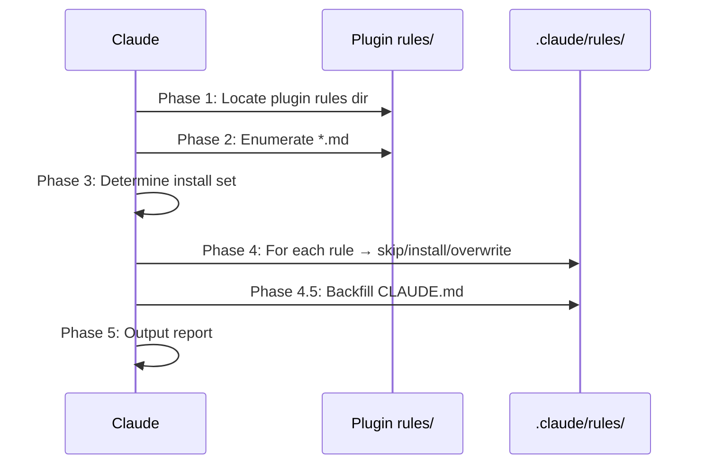
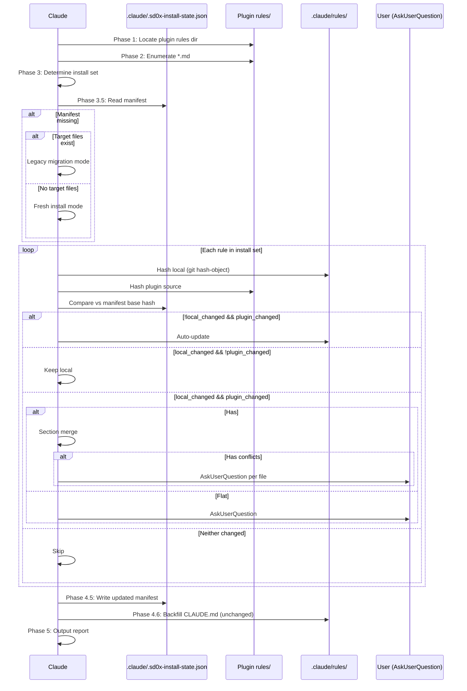

# Smart Merge Technical Spec

## 1. Requirement Summary

- **Problem**: `/install-rules` 使用 binary skip/overwrite 衝突策略，無法區分「使用者自訂修改」vs「plugin 版本更新」。Plugin 迭代時使用者只能二選一：skip（錯過更新）或 force（覆蓋自訂）。
- **Goals**: Plugin 更新時自動升級未修改的規則、保留使用者自訂修改、雙方都修改時智慧合併或互動詢問。
- **Scope**: `/install-rules` 為主（full smart merge）；`/install-hooks`、`/install-scripts` 僅加入 manifest tracking（merge 邏輯不變）。

## 2. Existing Code Analysis

### 2.1 Current Install Architecture



**Current conflict handling** (`commands/install-rules.md:106-110`):

| Scenario | Default | `--force` |
|----------|---------|-----------|
| Not exist | Install | Install |
| Exists, identical | Skip | Skip |
| Exists, differs | Skip + warn | Overwrite |

### 2.2 Rule Files Structure

| File | ## Count | Lines | Type | Merge Strategy |
|------|----------|-------|------|----------------|
| `auto-loop.md` | 7 | 193 | structured | Section merge |
| `codex-invocation.md` | 10 | 100 | structured | Section merge |
| `docs-numbering.md` | 5 | 60 | structured | Section merge |
| `docs-writing.md` | 1 | 32 | structured | Section merge |
| `fix-all-issues.md` | 8 | 75 | structured | Section merge |
| `framework.md` | 2 | 15 | structured | Section merge |
| `self-improvement.md` | 10 | 133 | structured | Section merge |
| `git-workflow.md` | 0 | 14 | flat | File-level |
| `logging.md` | 0 | 9 | flat | File-level |
| `security.md` | 0 | 22 | flat | File-level |
| `testing.md` | 0 | 12 | flat | File-level |

**7 structured / 4 flat** — section merge 覆蓋 ~64% 規則檔（佔總行數 ~87%）。

### 2.3 Related Files

| File | Role |
|------|------|
| `commands/install-rules.md` | 主要修改目標 |
| `commands/install-hooks.md` | Manifest tracking（merge 不變） |
| `commands/install-scripts.md` | Manifest tracking（merge 不變） |
| `skills/project-setup/SKILL.md` | 內嵌規則安裝流程（非直接呼叫 `/install-rules`），需對齊行為 |
| `.claude-plugin/plugin.json` | `plugin_version` source |
| `package.json` | `plugin_version` fallback source |

### 2.4 Tool Permission Constraints

`commands/install-rules.md` 的 `allowed-tools`:

```
Read, Grep, Glob, Write, Bash(mkdir:*), Bash(diff:*), Bash(git:*), Bash(ls:*)
```

| Operation | Tool | Available |
|-----------|------|-----------|
| Hash computation | `git hash-object --no-filters` | ✅ `Bash(git:*)` |
| Read manifest JSON | `Read` | ✅ |
| Write manifest JSON | `Write` | ✅ |
| Read rule files | `Read` | ✅ |
| Write rule files | `Write` | ✅ |
| Compare content | `Bash(diff:*)` | ✅ |
| Version from plugin.json | `Read` | ✅ |
| AskUserQuestion | — | ❌ 需新增至 allowed-tools |

**Action required**: 新增 `AskUserQuestion` 到 `commands/install-rules.md` 的 `allowed-tools`。

## 3. Technical Solution

### 3.1 Architecture Design



### 3.2 Data Model: Manifest

**File**: `.claude/.sd0x-install-state.json`

```json
{
  "schema_version": 1,
  "installed_at": "2026-03-07T10:00:00Z",
  "plugin_version": "1.8.12",
  "rules": {
    "auto-loop.md": { "hash": "e3b0c44298..." },
    "security.md": { "hash": "a1b2c3d4e5..." }
  },
  "hook_scripts": {
    "pre-edit-guard.sh": { "hash": "f6g7h8i9j0..." }
  },
  "scripts": {
    "precommit-runner.js": { "hash": "k1l2m3n4o5..." }
  }
}
```

| Field | Type | Description |
|-------|------|-------------|
| `schema_version` | `number` | 目前為 `1`；未來變更 manifest 格式時遞增 |
| `installed_at` | `ISO-8601` | 最後一次 install 操作的時間戳 |
| `plugin_version` | `string` | 從 `.claude-plugin/plugin.json` 或 `package.json` 讀取；若無法讀取則 `"unknown"` |
| `rules` | `Record<filename, {hash, deleted?}>` | Per-file hash（`git hash-object` output）；`deleted: true` 表示使用者主動刪除 |
| `hook_scripts` | `Record<filename, {hash, deleted?}>` | Hook script files（不含 settings.json） |
| `scripts` | `Record<filename, {hash, deleted?}>` | Runner scripts |

**Version source priority**:

```
.claude-plugin/plugin.json → package.json → "unknown"
```

### 3.3 Core Logic: Hash Computation

```bash
# Compute hash for a file (allowed via Bash(git:*))
git hash-object --no-filters <file-path>
```

Output: 40-char hex string（git blob hash）。

**Important**: `git hash-object` 計算的是 git blob hash（SHA-1），非 SHA-256。在此 use case 中 collision risk 可忽略（用於 equality check，非安全用途）。

### 3.4 Core Logic: Multi-State Classification

Per-file classification（pseudocode，Claude 以 Read + Bash 實作）:

```
manifest_hash = manifest.rules[filename].hash  // may be null if new
local_hash    = git_hash_object(local_file)     // null if file missing
plugin_hash   = git_hash_object(plugin_file)

## Priority branch order (single if/elif chain, first match wins):
## Note: manifest.rules[filename] may not exist; treat missing entry as { deleted: false }

if manifest.rules[filename].deleted == true && local_hash is null:
  → SKIP_DELETED (tombstone: respect user's prior deletion, no prompt)
elif manifest.rules[filename].deleted == true && local_hash is not null:
  → clear deleted flag, fall through to normal classification below
elif manifest_hash is null:
  → FRESH_INSTALL (or LEGACY if local_file exists)
elif local_hash is null:
  → DELETED_LOCAL (first-time detection, see handling below)
elif local_hash == manifest_hash && plugin_hash == manifest_hash:
  → SKIP (no change)
elif local_hash == manifest_hash && plugin_hash != manifest_hash:
  → AUTO_UPDATE (user didn't edit, plugin updated)
elif local_hash != manifest_hash && plugin_hash == manifest_hash:
  → KEEP_LOCAL (user edited, plugin didn't update)
elif local_hash != manifest_hash && plugin_hash != manifest_hash:
  → CONFLICT (both changed)

DELETED_LOCAL handling (first-time detection, no tombstone yet):
  if plugin_hash != manifest_hash:  # plugin updated since last install
    → AskUserQuestion: "Rule <file> was deleted locally but plugin has updates."
      Options: "Reinstall (Recommended)" / "Keep deleted"
  else:  # plugin unchanged
    → Keep deleted silently (no prompt)

  Reinstall: 安裝檔案 + manifest hash = plugin hash（無 deleted flag）
  Keep deleted: manifest.rules[filename] = { "hash": plugin_hash, "deleted": true }
    → 後續執行命中 SKIP_DELETED（不重複詢問，即使 plugin 更新）
    → 使用者手動恢復檔案 → 清除 deleted flag，重新分類
    → `--force` 無視 deleted flag，強制安裝
```

### 3.5 Core Logic: Section Merge Algorithm

**Applicable when**: classification == CONFLICT && file has `##` headings.

```
Sections = split file by "^## " pattern (heading text = key)

local_sections  = parse(local_file)   // ordered map: heading → content
plugin_sections = parse(plugin_file)  // ordered map: heading → content

result = []
conflicts = []

# 1. Preserve preamble (content before first ##)
if local has preamble:
  result.push(local_preamble)
elif plugin has preamble:
  result.push(plugin_preamble)

# 2. Merge sections (plugin order as base, local additions appended)
for section in plugin_sections:
  if section.key in local_sections:
    if local_sections[section.key] == section.content:
      result.push(section)           // identical → keep
    else:
      conflicts.push(section.key)    // both differ → conflict
      result.push(local_sections[section.key])  // keep local as default
  else:
    result.push(section)             // plugin-only → add

# 3. Append local-only sections (not in plugin)
for section in local_sections:
  if section.key not in plugin_sections:
    result.push(section)             // local-only → preserve

# 4. Handle conflicts
if conflicts:
  AskUserQuestion per file:
    "Rule <filename> has <N> conflicting sections: <section names>"
    Options:
      "Keep local version (Recommended)"
      "Use plugin version"
      "Apply non-conflicting merge + keep local for conflicts"
```

**Section parsing rule**:
- Split on `^##` (line starts with `##`)
- Section key = heading text after `##` (trimmed, case-sensitive)
- Section content = all lines until next `^##` or EOF
- Preamble = content before first `^##`（包含 `# Title` 和 metadata）

**Design rationale: Conservative 2-way（非 true 3-way）**

此演算法刻意不儲存 section-level base snapshot，採用 conservative 2-way section comparison（local vs plugin）。只自動處理明確無歧義的情況（local-only、plugin-only、identical sections），對 both-exist-and-differ sections 一律視為 conflict 並詢問使用者。這不是 true 3-way section auto-merge，而是結構化的衝突定位。優點：manifest 不需儲存 base content/section hash，降低複雜度；缺點：「local 改 A section、plugin 改 B section」時兩者都會被標為 conflict，需使用者確認。

**Known limitation**: Section 重新命名（`## Merge Gate` → `## Gate Definitions`）會被視為 delete + add，而非 rename。這是 conservative 設計的已知行為。

### 3.6 Core Logic: Flat File Conflict

**Applicable when**: classification == CONFLICT && file has no `##` headings.

```
AskUserQuestion:
  "Rule <filename> was modified both locally and in the plugin update."
  Options:
    "Keep local version (Recommended)"
    "Use plugin version"
```

No auto-merge attempt for flat files.

### 3.7 Core Logic: Legacy Migration

**Applicable when**: Manifest does not exist AND `.claude/rules/` has files.

```
for each plugin rule:
  if local file missing:
    → install + write manifest
  elif hash(local) == hash(plugin):
    → auto-adopt: write manifest hash (no file change)
  elif hash(local) != hash(plugin):
    → AskUserQuestion:
        "keep-local" → manifest hash = plugin hash (enroll for future tracking)
        "use-plugin" → overwrite + manifest hash = plugin hash
        "unmanaged" → no manifest entry (opt out)
```

`--legacy-strategy prompt|keep-local|use-plugin|unmanaged` 跳過 AskUserQuestion。

### 3.8 `--force` Precedence

`--force` 跳過所有分類與詢問，直接覆蓋：

| Classification | Default Behavior | `--force` Behavior |
|---------------|-----------------|-------------------|
| SKIP | Skip | Overwrite + update manifest |
| AUTO_UPDATE | Auto-update | Overwrite + update manifest |
| KEEP_LOCAL | Keep local | Overwrite + update manifest |
| CONFLICT | Section merge / AskUserQuestion | Overwrite + update manifest |
| DELETED_LOCAL | plugin updated → AskUserQuestion; plugin same → keep deleted silently | Reinstall + update manifest（clear deleted flag） |
| SKIP_DELETED | Skip（respect tombstone） | Reinstall + update manifest（clear deleted flag） |
| FRESH_INSTALL | Install | Install（same） |
| LEGACY | AskUserQuestion | Overwrite all + create manifest |

`--force` 執行時 manifest hash 一律設為當前 plugin source hash。Report 中以 `⚡ Forced` 標記。

### 3.9 Manifest Write Strategy

```
1. Read existing manifest via Read tool
   - If file doesn't exist → start with {}
   - If JSON parse fails → treat as missing (warn user)
2. Update in-memory object
3. Write entire file via Write tool

Error handling:
- Write failure → warn user, continue without manifest
  (next run will enter legacy migration)
- Partial state → acceptable (idempotent re-run recovers)
```

### 3.10 Enhanced `--dry-run` Output

```markdown
## Smart Merge Dry Run

**Plugin**: v1.8.12 → v1.9.0
**Manifest**: .claude/.sd0x-install-state.json (found)

| Rule | Local | Plugin | Classification | Action |
|------|-------|--------|---------------|--------|
| auto-loop.md | modified | updated | CONFLICT | Section merge (2 conflicts) |
| security.md | original | updated | AUTO_UPDATE | Auto-update |
| git-workflow.md | modified | original | KEEP_LOCAL | Keep local |
| testing.md | original | original | SKIP | Skip |
| docs-writing.md | — | new | FRESH_INSTALL | Install |
| framework.md | deleted | — | SKIP_DELETED | Skip (tombstone) |

**Summary**: 1 auto-update, 1 install, 1 section merge (needs interaction), 1 keep, 1 skip, 1 skip-deleted
```

Diff 截斷規則：`--dry-run` 不顯示 diff 內容，僅顯示 classification 表。使用者可用 `Bash(diff:*)` 手動查看。

### 3.11 Report Output Enhancement

```markdown
## Install Rules Report (Smart Merge)

**Source**: <plugin-rules-path>
**Target**: <repo-root>/.claude/rules/
**Plugin**: v1.8.12 → v1.9.0
**Manifest**: .claude/.sd0x-install-state.json

| Rule | Status | Detail |
|------|--------|--------|
| auto-loop.md | ✅ Merged | 2 sections auto-merged, 0 conflicts |
| security.md | ✅ Auto-updated | Plugin updated, no local edits |
| git-workflow.md | ⏭️ Kept local | User edited, plugin unchanged |
| testing.md | ⏭️ Skipped | No changes |
| docs-writing.md | ✅ Installed | New file |
| framework.md | 🗑️ Skip (deleted) | User previously deleted; tombstone active |

**Auto-updated**: 1 / **Merged**: 1 / **Kept local**: 1 / **Installed**: 1 / **Skipped**: 1 / **Skip-deleted**: 1
```

## 4. Risks and Dependencies

| Risk | Impact | Mitigation |
|------|--------|------------|
| Manifest 被意外刪除 | 下次執行進入 legacy migration | Legacy migration 已有 deterministic handling |
| Manifest JSON 損壞 | 無法讀取 | Treat as missing → legacy flow（warn user） |
| `git hash-object` 不可用 | Hash 計算失敗 | 極少見（git 是 prerequisite）；fallback: skip smart merge, use current behavior |
| Section heading 重新命名 | 視為 delete + add | Known limitation; tech spec 明確記錄 |
| 大量 conflicts 導致 AskUserQuestion 疲勞 | UX 不佳 | Per-file（非 per-section）詢問 + `--force` escape hatch |
| 跨 install 命令同時寫 manifest | 多 session 可能覆寫 | Write 前 re-read manifest 取得最新狀態；單 session 內 sequential 執行；多 session 並行為罕見情境，可接受 last-write-wins |
| `AskUserQuestion` 不在 allowed-tools | 執行失敗 | 需新增到 `commands/install-rules.md` allowed-tools |

## 5. Work Breakdown

| # | Task | File | Effort |
|---|------|------|--------|
| 1 | `install-rules.md` — 新增 Phase 3.5: Read manifest + 3-state classification | `commands/install-rules.md` | M |
| 2 | `install-rules.md` — 重寫 Phase 4: Smart merge (section merge + flat conflict + legacy) | `commands/install-rules.md` | L |
| 3 | `install-rules.md` — 新增 Phase 4.5: Write manifest | `commands/install-rules.md` | S |
| 4 | `install-rules.md` — 更新 Phase 5: Enhanced report + dry-run | `commands/install-rules.md` | S |
| 5 | `install-rules.md` — 新增 `--legacy-strategy` 參數 + `AskUserQuestion` allowed-tool | `commands/install-rules.md` | S |
| 6 | `install-hooks.md` — 新增 manifest tracking for hook scripts | `commands/install-hooks.md` | S |
| 7 | `install-scripts.md` — 新增 manifest tracking | `commands/install-scripts.md` | S |
| 8 | `project-setup/SKILL.md` — 同步 install-rules 新行為描述 | `skills/project-setup/SKILL.md` | S |

**Effort**: S = 小（< 20 行修改）, M = 中（20-80 行）, L = 大（> 80 行）

## 6. Testing Strategy

| Test Case | Input | Expected | Type |
|-----------|-------|----------|------|
| Fresh install（no manifest, no local files） | `/install-rules --all` | All installed + manifest created | Happy path |
| No change（manifest matches both） | `/install-rules --all` | All skipped | Happy path |
| Auto-update（user didn't edit, plugin updated） | Change plugin hash | Auto-update + manifest updated | Happy path |
| Keep local（user edited, plugin same） | Edit local file | Keep local, no prompt | Happy path |
| Both changed — structured | Edit local + change plugin | Section merge attempt + AskUserQuestion if conflict | Conflict |
| Both changed — flat | Edit flat file + change plugin | AskUserQuestion | Conflict |
| Legacy migration — identical | Pre-existing files, no manifest | Auto-adopt all | Migration |
| Legacy migration — differs | Pre-existing edited files, no manifest | AskUserQuestion per file | Migration |
| Legacy migration — `--legacy-strategy keep-local` | Same, with flag | Keep all local, no prompt | Migration |
| Deleted local + plugin updated | Delete local file, plugin changed | DELETED_LOCAL → AskUserQuestion: reinstall/keep-deleted | Conflict |
| Deleted local + plugin same | Delete local file, plugin unchanged | DELETED_LOCAL → keep deleted silently + write tombstone | Edge case |
| SKIP_DELETED — consecutive run | `deleted:true` in manifest, file still missing | SKIP_DELETED（不重複詢問，即使 plugin 更新） | Edge case |
| SKIP_DELETED — user restores file | `deleted:true` in manifest, file manually restored | Clear deleted flag → normal classification | Edge case |
| `--force` with manifest | Force flag | Overwrite all + update manifest | Override |
| `--dry-run` | Any state | Classification table only, no writes | Read-only |
| Manifest JSON corrupt | Invalid JSON | Warn + fallback to legacy | Error |
| Missing git | `git hash-object` fails | Warn + fallback to current behavior | Error |

**Testing approach**: 由於 `/install-rules` 是 AI behavior command（非 shell script），testing 透過 `/codex-review-doc` 驗證 command spec 的正確性和一致性，而非 unit test。

## 7. Open Questions

| # | Question | Status | Note |
|---|----------|--------|------|
| Q1 | `.sd0x-install-state.json` 是否加入 `.gitignore` 建議？ | Resolved | 使用者自行決定（同 lesson log 模式） |
| Q2 | Section merge 是否需要處理 `###` sub-heading？ | Open | v1 只處理 `##` level；sub-heading 包含在 parent section content 內 |
| Q3 | 未來是否需要 `--merge-strategy conservative\|aggressive` flag？ | Deferred | v1 固定 conservative；v2 再評估 |
| Q4 | Manifest schema_version 升級時的 migration 策略？ | Deferred | v1 只有 schema 1；升級時加入 migration 邏輯 |
