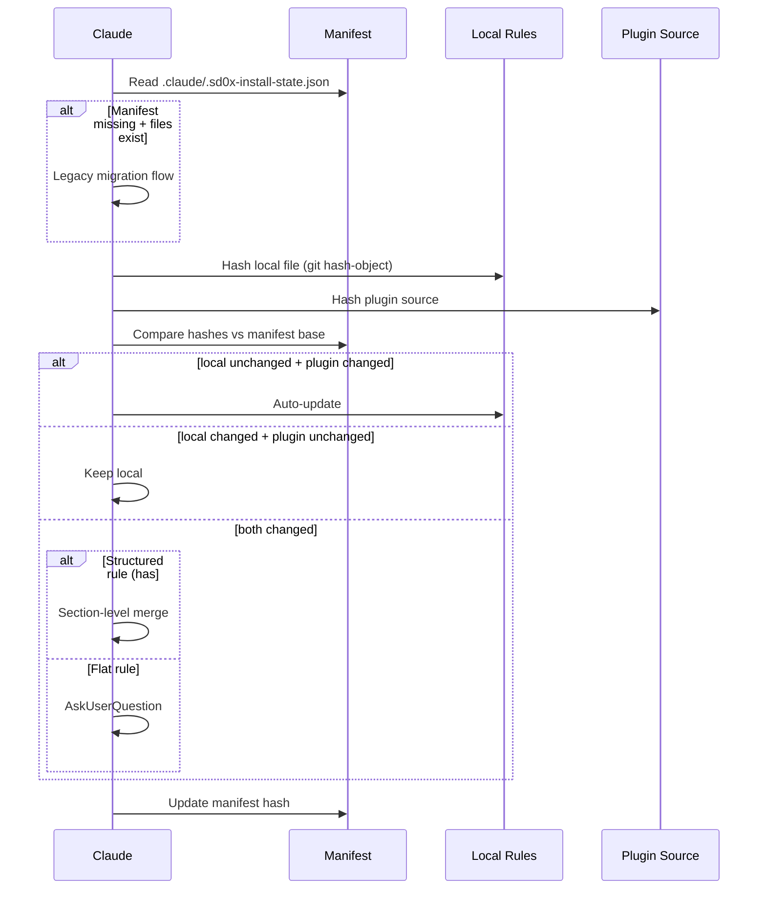

# Smart Merge for /install-rules

> **Created**: 2026-03-06
> **Status**: Completed
> **Priority**: P1
> **Tech Spec**: [2-tech-spec.md](../2-tech-spec.md)

## Background

`/install-rules` 使用簡單的 skip/overwrite 衝突策略，無法區分「使用者自訂修改」與「plugin 版本更新」。當 plugin 迭代更新規則時，使用者面臨二選一：skip（錯過更新）或 force（覆蓋自訂）。業界慣用 3-way merge（Chezmoi）、semantic merge（Kustomize）等模式解決此問題。

## Workflow



## Requirements

| Condition | Action | Output |
|-----------|--------|--------|
| 首次安裝（無 manifest） | 正常安裝 + 建立 manifest | `.claude/.sd0x-install-state.json` |
| 使用者未修改 + plugin 更新 | Auto-update | 自動升級 |
| 使用者已修改 + plugin 未更新 | Keep local | 保留使用者自訂 |
| 雙方都修改 + structured rule | Section-level merge | 合併非衝突 sections + AskUserQuestion 衝突 sections |
| 雙方都修改 + flat rule | AskUserQuestion | keep-local / use-plugin |
| Legacy 使用者（有規則無 manifest） | Staged adoption | 見 Legacy Migration 判定條件 |

### Manifest 設計

- 檔案：`.claude/.sd0x-install-state.json`
- Hash：`git hash-object --no-filters`（已在 allowed-tools 內）
- `plugin_version`：優先從 `.claude-plugin/plugin.json` 讀取，fallback `package.json`，皆無則記錄 `"unknown"`
- Schema：`schema_version` + `installed_at` + `plugin_version` + per-file `{ hash, deleted? }`
- `installed_at`：ISO-8601 timestamp，每次寫入 manifest 時更新
- `deleted` (tombstone)：當使用者刪除本地規則且 plugin 未更新時，設 `deleted: true`；後續執行 skip 該檔。若使用者重新建立檔案，清除 tombstone 並重新分類
- 不存 section hash、不存 merge_mode、不存 base snapshot
- 單一共用檔案：三個 install 命令共用同一 manifest，以 top-level key 區隔（`rules`、`hook_scripts`、`scripts`）
- 寫入策略：Read → modify in-memory → Write（Claude AI behavior，非 atomic shell）；若 JSON 解析失敗則視為 manifest missing（fallback to legacy migration or fresh install）
- `.gitignore` 建議：使用者決定是否 track（同 `self-improvement.md` 的 lesson log 模式）

```json
{
  "schema_version": 1,
  "installed_at": "2026-03-06T10:00:00Z",
  "plugin_version": "1.8.12",
  "rules": {
    "auto-loop.md": { "hash": "abc123..." },
    "security.md": { "hash": "def456..." }
  }
}
```

### 3-Way Merge 語意

Manifest hash = **base**（安裝時的 plugin source hash）。Runtime merge 時：

| Role | Source | Description |
|------|--------|-------------|
| Base | manifest `hash` | 上次安裝時 plugin source 的 hash |
| Local (target) | `.claude/rules/<file>` | 使用者目前的檔案 |
| Remote (source) | plugin `rules/<file>` | Plugin 最新版本 |

Section-level merge 不依賴 stored base snapshot。在 both-changed 情境下，採用 **conservative 2-way section comparison**（local vs remote）：只自動處理明確無歧義的情況（local-only、plugin-only、identical sections），對 both-exist-and-differ sections 一律視為 conflict 並詢問使用者。這不是 true 3-way section auto-merge，而是結構化的衝突定位。

### Multi-State Classification

基礎 3-state matrix 加上刪除與 legacy 狀態，完整分類如下：

| Priority | Condition | Classification | Action |
|----------|-----------|----------------|--------|
| 0 | `deleted:true` + 本地不存在 | SKIP_DELETED | Skip（tombstone 保留） |
| 0b | `deleted:true` + 本地存在 | — | 清除 tombstone，重新分類 |
| 1 | 無 manifest + 本地不存在 | FRESH_INSTALL | 安裝 + 寫入 manifest |
| 2 | 無 manifest + 本地存在 | LEGACY | Legacy migration flow |
| 3 | 本地已刪除（manifest 有紀錄） | DELETED_LOCAL | plugin 有更新 → 詢問；無更新 → tombstone |
| 4 | local==manifest, plugin==manifest | SKIP | 無變更 |
| 5 | local==manifest, plugin!=manifest | AUTO_UPDATE | 自動升級 |
| 6 | local!=manifest, plugin==manifest | KEEP_LOCAL | 保留本地 |
| 7 | local!=manifest, plugin!=manifest | CONFLICT | Section merge 或 AskUserQuestion |

### Section-Level Merge Algorithm（structured rules only）

1. Parse local file into sections（by `##` heading）
2. Parse plugin file into sections
3. Local-only section → preserve
4. Plugin-only section → add
5. Both exist, identical → keep
6. Both exist, different → conflict → AskUserQuestion

### Flat Rule Conflict（no `##` headings）

Both changed → AskUserQuestion（keep-local / use-plugin）

### Legacy Migration（無 manifest 首次執行）

當 manifest 不存在但 `.claude/rules/` 已有檔案時：

| Local File | vs Current Plugin Source | Action |
|------------|------------------------|--------|
| 不存在 | — | 正常安裝 + 寫入 manifest |
| Hash 相同 | identical | Auto-adopt：寫入 manifest hash，不詢問 |
| Hash 不同 | differs | AskUserQuestion：「keep-local」/「use-plugin」/「unmanaged」 |

- `keep-local`：保留本地檔，manifest hash 設為**當前 plugin source hash**（納入未來 smart merge 追蹤）
- `use-plugin`：覆蓋本地，manifest hash 設為 plugin source hash
- `unmanaged`：保留本地，不寫入 manifest 條目（該檔案不參與 smart merge）
- `--legacy-strategy prompt|keep-local|use-plugin|unmanaged` 支援非互動式批次執行

## Scope

| Scope | Description |
|-------|-------------|
| In | `/install-rules` manifest + multi-state classification + section merge + legacy migration + `--dry-run` enhancement |
| Out | `/install-hooks` merge 改造（保持現有 settings.json merge）、`/install-scripts` merge（file-level 不變）、CLAUDE.md backfill merge |

## Related Files

| File | Action | Description |
|------|--------|-------------|
| `commands/install-rules.md` | Modify | 新增 manifest tracking + 3-state detection + section merge |
| `commands/install-hooks.md` | Modify (minor) | 新增 manifest tracking for hook scripts（merge 邏輯不變） |
| `commands/install-scripts.md` | Modify (minor) | 新增 manifest tracking（merge 邏輯不變） |
| `skills/project-setup/SKILL.md` | Modify | 新增 manifest tracking（fresh-install semantics，不含 smart merge） |

## Acceptance Criteria

- [x] `/install-rules` 安裝後產生 `.claude/.sd0x-install-state.json` manifest
- [x] Manifest 使用 `git hash-object` 計算 hash（在現有 allowed-tools 內）
- [x] 使用者未修改 + plugin 更新 → 自動升級（不詢問）
- [x] 使用者已修改 + plugin 未更新 → 保留本地（不詢問）
- [x] 雙方都修改 + structured rule → section-level merge attempt
- [x] 雙方都修改 + flat rule → AskUserQuestion
- [x] Legacy 使用者（無 manifest）首次執行 → staged adoption flow
- [x] `--dry-run` 顯示 multi-state classification table
- [x] `--force` 行為不變（覆蓋 + 更新 manifest）
- [x] Pass `/codex-review-doc`

## Progress

| Phase | Status | Note |
|-------|--------|------|
| Best Practices | Done | `/best-practices` audit + Codex brainstorm `019cc3ab` |
| Tech Spec | Done | `2-tech-spec.md` |
| Development | Done | 4 files modified (251+/50-): install-rules, install-hooks, install-scripts, project-setup |
| Review | Done | `/codex-review-doc` ✅ Mergeable; `/precommit-fast` ✅ All Pass |
| Acceptance | Done | 10/10 AC checked |

## References

- Best Practices Audit: Codex Brainstorm `019cc3ab-09f3-7381-b1a8-b2a19c6a412a`
- [Chezmoi: Manage Different Types of File](https://www.chezmoi.io/user-guide/manage-different-types-of-file/)
- [Kustomize Strategic Merge Patch](https://kubernetes.io/docs/tasks/manage-kubernetes-objects/kustomization/)
- [Terraform Provider Schema Versioning](https://developer.hashicorp.com/terraform/plugin/framework/handling-data/schemas)
- Related: `commands/install-rules.md`, `commands/install-hooks.md`, `commands/install-scripts.md`
