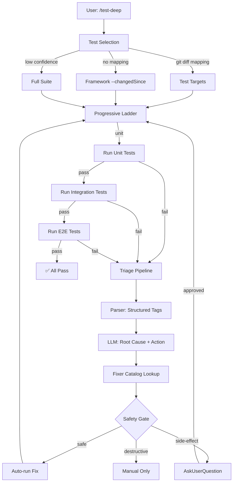
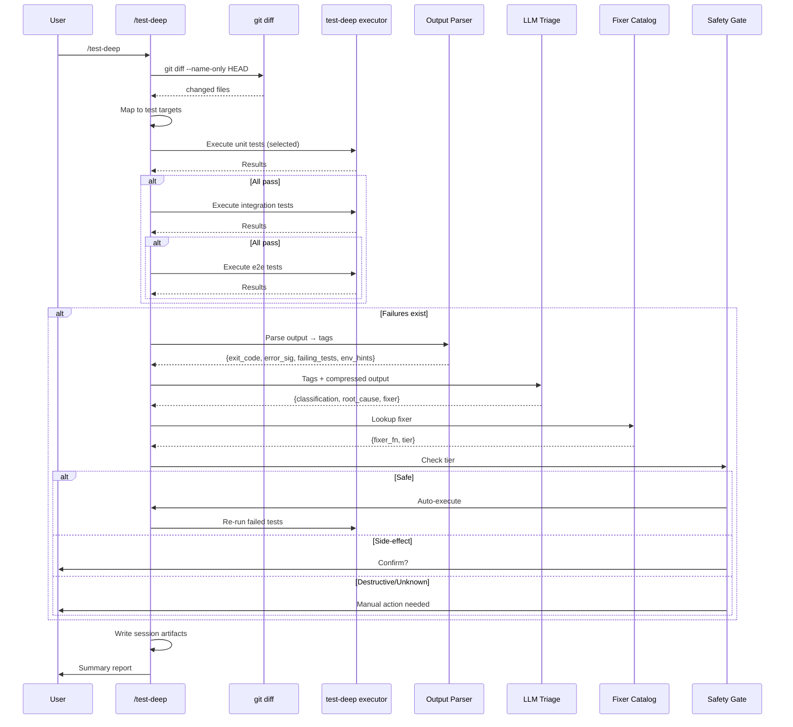

# `/test-deep` Technical Spec — Context-Aware Test Orchestration

## 1. Requirement Summary

- **Problem**: 現有測試 skills 各自獨立，缺少根據 code changes 智慧選擇測試、深度分析失敗、並導引修復的能力。開發者在跨環境測試（unit/integration/e2e/testnet/mainnet）時需手動判斷該跑哪些測試、手動分析失敗原因、手動處理環境前置條件。
- **Goals**:
  1. Context-aware test selection（git diff → 相關測試）
  2. Progressive confidence ladder（unit → integration → e2e，fail-fast）
  3. Failure triage pipeline（parser → LLM → safety-gated action）
  4. Fixer catalog（generic core + host project extensions）
  5. Session artifacts（per-run cache，optional 上次比較）
- **Scope**:
  - v1: test selection + progressive ladder + triage pipeline + fixer catalog framework + session artifacts
  - v2 (deferred): cross-session trend analysis, framework-specific plugins

## 2. Existing Code Analysis

### Related Modules

| Module | 關聯 | 可重用 |
|--------|------|--------|
| `scripts/verify-runner.js` | Test execution runner, cache output | Execution engine, cache pattern |
| `scripts/precommit-runner.js` | lint → typecheck → test pipeline | Progressive pipeline pattern |
| `scripts/lib/utils.js` | Output filtering (`testStdoutFilter`, `tailLinesFromFile`) | Context budget control |
| `skills/post-dev-test/SKILL.md` | Post-dev test completion | Workflow structure |
| `skills/codex-code-review/SKILL.md` | Dual reviewer + triage | Parallel dispatch pattern |
| `skills/git-profile/scripts/git-profile.sh` | Registry with lock/atomic write | File-backed state pattern |
| `skills/repo-intake/scripts/intake_cached.js` | Cross-run cache-first | Cache architecture |
| `hooks/post-tool-review-state.sh` | Lock + atomic state update | Concurrency safety |

### Reusable Components

- **Test execution**: `verify-runner.js` — 已有 run artifact persistence（per commit SHA）, summary output, exit code handling（注意：runner 目前只支援 `--integration <file>` / `--e2e <file>` 單檔模式，不支援 multi-target 或 fail-fast flag。`/test-deep` 需自建 dedicated test executor 或擴展 runner API）
- **Output filtering**: `utils.js:testStdoutFilter()` — 過濾 PASS lines 只保留 FAIL + summary；`tailLinesFromFile()` — 讀取 log 檔案最後 N 行
- **Atomic file operations**: `git-profile.sh` lockdir + temp+mv pattern
- **Cache keying**: `verify-runner.js` uses `git rev-parse --short HEAD` — `/test-deep` 需用 per-run ID
- **Staged pipeline**: `precommit-runner.js` lint → typecheck → test，目前為 continue-all（不 early break）。`/test-deep` 的 progressive ladder 需自行實作 fail-fast 邏輯

### Files to Create

| File | Purpose |
|------|---------|
| `skills/test-deep/SKILL.md` | Skill 定義 |
| `skills/test-deep/references/fixer-catalog.md` | Fixer catalog 規格 + safety tiers |
| `skills/test-deep/references/triage-pipeline.md` | Parser tags + LLM triage 規格 |
| `skills/test-deep/references/test-selection.md` | Git diff → test file mapping 策略 |
| `commands/test-deep.md` | Command entry point |
| `test/commands/test-deep.test.js` | Command schema 測試 |

### Files to Modify

| File | Change |
|------|--------|
| `CLAUDE.template.md` | Command Quick Reference 加入 `/test-deep` |
| `CLAUDE.md` | Command Quick Reference 加入 `/test-deep` |
| `.claude/CLAUDE.md` | Command Quick Reference 加入 `/test-deep` |

## 3. Technical Solution

### 3.1 Architecture Design





### 3.2 Test Selection Strategy

**Primary: Git Diff Filename Mapping**

| Context | Git Command | Use Case |
|---------|-------------|----------|
| Unstaged changes | `git diff --name-only` | Default: working tree vs index |
| Staged changes | `git diff --cached --name-only` | Staged for commit |
| Untracked files | `git ls-files --others --exclude-standard` | New files not yet tracked |
| Branch diff | `git diff --name-only $(git merge-base HEAD main)..HEAD` | Compare against base branch |

**Default strategy**: Union of unstaged + staged + untracked（capture all work in progress）。Branch mode 用 `--branch` flag 啟用。

Mapping rules（priority order）:

| Source File Pattern | Candidate Test Patterns |
|--------------------|-----------------------|
| `src/<path>/<name>.ts` | `test/<path>/<name>.test.ts`, `test/unit/<path>/<name>.test.ts` |
| `src/<path>/<name>.ts` | `test/integration/<path>/<name>.test.ts` |
| `src/<path>/<name>.ts` | `test/e2e/<path>/<name>.e2e.test.ts` |
| `lib/<name>.js` | `test/<name>.test.js`, `test/scripts/lib/<name>.test.js` |
| `scripts/<name>.sh` | `test/scripts/<name>.test.js` |

**Glob expansion**: 對每個 candidate pattern 用 `Glob` 確認檔案存在。

**Secondary: Framework Native**

| Framework | Flag | Detection |
|-----------|------|-----------|
| Jest | `--changedSince=HEAD~1` | `package.json` has `jest` dependency |
| Vitest | `--changed HEAD~1` | `package.json` has `vitest` dependency |
| node:test | N/A（無 native changedSince） | `package.json` scripts use `node --test` |

**Full Suite Fallback**: 當以下條件觸發時，escalate 到 full suite：

| Condition | Reason |
|-----------|--------|
| Config file changed（`*.config.*`, `tsconfig.*`, `.env*`） | 影響全局 |
| CI/CD file changed（`.github/`, `Dockerfile`） | 環境變更 |
| Package dependency changed（`package.json`, `yarn.lock`） | 依賴變更 |
| No test files mapped | 低 confidence |
| `--all` flag passed | 使用者強制 |

### 3.3 Progressive Confidence Ladder

```
unit → integration → e2e
```

| Layer | Directory Pattern | Fail Behavior | Timeout |
|-------|------------------|---------------|---------|
| Unit | `test/unit/**`, `test/scripts/lib/**` | Fail-fast, enter triage | 60s |
| Integration | `test/integration/**` | Fail-fast, enter triage | 300s |
| E2E | `test/e2e/**` | Enter triage | 600s |

**Layer detection**: Scan test file paths, classify by directory prefix. Files not matching any pattern → treat as unit.

**Fail-fast rule**: If unit tests fail, skip integration and e2e. Rationale: unit failures indicate code-level bugs that integration/e2e will also hit.

**Exception**: `--no-fail-fast` flag disables this behavior（跑完所有層級）。

### 3.4 Failure Triage Pipeline

#### Step 1: Output Parser

從 test runner output 提取 structured tags:

| Tag | Source | Example |
|-----|--------|---------|
| `exit_code` | Process exit code | `1` |
| `error_signatures[]` | Regex match on stderr/stdout | `INSUFFICIENT_FUNDS`, `ECONNREFUSED`, `TypeError` |
| `failing_tests[]` | Test name extraction | `estimateFee returns gasLimit >= MIN` |
| `failing_files[]` | File path extraction | `test/e2e/aptos/aptos-gas-fee-testnet.e2e.test.ts` |
| `env_hints[]` | Environment clues | `testnet`, `mainnet`, `localhost:8545` |
| `stack_depth` | Stack trace line count | `15` |

**Parser 不做分類決策**——只結構化。Error signature extraction 用簡單 regex:

```
/error|Error|FAIL|fail|TypeError|ReferenceError|ECONNREFUSED|ETIMEDOUT|insufficient|balance|timeout/i
```

**Output compression**: 使用 `testStdoutFilter()` pattern（參考 `utils.js:150`）過濾 PASS lines，並用 `tailLinesFromFile()` pattern（參考 `utils.js:112`）保留最後 N 行。壓縮策略：stderr 前 100 行 + 最後 50 行。

**Secret redaction（mandatory）**: 在 output 傳給 LLM 或寫入 artifacts 前，必須進行 secret scrubbing：

| Pattern | Regex | Replacement |
|---------|-------|-------------|
| API keys | `/[A-Za-z0-9_-]{32,}/` (high entropy) | `[REDACTED_KEY]` |
| Private keys | `/-----BEGIN.*PRIVATE KEY-----/` | `[REDACTED_PRIVATE_KEY]` |
| Tokens | `/((?:Bearer\s+|token[=:]\s*))[A-Za-z0-9._-]+/i` | `[REDACTED_TOKEN]` |
| Known env vars | `/(API_KEY|SECRET|PASSWORD|PRIVATE_KEY|MNEMONIC)[=:]\s*\S+/i` | `$1=[REDACTED]` |
| URLs with credentials | `/https?:\/\/[^:]+:[^@]+@/` | `[REDACTED_URL]` |

Redaction 遵循 `rules/logging.md` 的 "Never log" policy：private keys, mnemonics, API keys, passwords, full addresses。

#### Step 2: LLM Root Cause Analysis

LLM 接收 parser tags + compressed output，輸出：

```json
{
  "classification": "code_bug | infra | environment | flaky",
  "confidence": 0.85,
  "root_cause": "Testnet 帳戶餘額 0 APT，simulation 回報 MAX_GAS_UNITS_BELOW_MIN",
  "suggested_fixer": "faucet_fund",
  "reasoning": "Error signature matches insufficient funds pattern, env_hints indicate testnet, not a code logic error"
}
```

| Classification | 定義 | 典型 Action |
|---------------|------|------------|
| `code_bug` | 程式邏輯錯誤 | 修正程式碼 |
| `infra` | 基礎設施問題（port conflict, missing dependency） | Restart / reinstall |
| `environment` | 外部環境前置條件不滿足 | Fixer catalog action |
| `flaky` | 非確定性失敗（timing, race condition） | Retry + quarantine tag |

#### Step 3: Safety-Gated Action

LLM 的 `suggested_fixer` 交由 safety gate 決定 auto-run 或 confirm。

### 3.5 Fixer Catalog

**Architecture**: Plugin 提供 fixer capabilities，LLM 從 catalog 中選擇，safety gate 決定執行方式。

#### Core Fixers（plugin ships）

| Fixer | Tier | Description | Auto-run? |
|-------|------|-------------|-----------|
| `retry` | Safe | 重新執行失敗的 test | Yes |
| `clear_cache` | Safe | 清除 build/test cache（`.cache/`, `dist/`） | Yes |
| `reinstall_deps` | Side-effect | `rm -rf node_modules && npm install`（修改檔案系統） | No, confirm |
| `restart_server` | Side-effect | Kill + restart dev server（影響 running processes） | No, confirm |
| `port_cleanup` | Side-effect | Kill process on conflicting port（影響其他 processes） | No, confirm |

#### Host Project Extension Fixers

Host project 可在 `.claude/test-deep/fixers.md` 定義 domain-specific fixers。每個 fixer 必須遵循以下 structured schema（缺少必填欄位的 fixer 在 runtime 被拒絕）：

**Required fields**:

| Field | Type | Description | Required |
|-------|------|-------------|----------|
| `id` | string | Fixer 唯一 ID（kebab-case） | Yes |
| `tier` | enum | `safe` / `side-effect` / `destructive` | Yes |
| `description` | string | 人類可讀說明 | Yes |
| `applies_when` | string | Trigger 條件（classification + error pattern） | Yes |
| `action` | string | 執行的操作說明（LLM 指引） | Yes |
| `constraints` | string | 限制條件（例：only testnet） | No |

**Example**:

```markdown
## faucet_fund
- **id**: faucet-fund
- **tier**: side-effect
- **description**: Fund testnet account via faucet API
- **applies_when**: classification=environment, error contains "insufficient" or "balance"
- **action**: Call faucet API to fund account with 1 APT
- **constraints**: testnet only (never mainnet)
```

**Validation rules**:
- `tier` 必須是 `safe` / `side-effect` / `destructive` 之一，否則 rejected
- 缺少 `id`, `tier`, `description`, `applies_when`, `action` 任一欄位 → rejected with warning
- Unknown fixer（未在 core 或 extension 中定義）→ default to `side-effect` tier

#### Safety Tiers

| Tier | Auto-run? | Confirmation | Examples |
|------|-----------|-------------|---------|
| `safe` | Yes | None | retry, clear_cache |
| `side-effect` | No | AskUserQuestion | reinstall_deps, restart_server, port_cleanup, faucet_fund, DB migration, API token refresh |
| `destructive` | Blocked | Manual only | Clear test data, reset state, drop tables |

**Default-deny**: Unknown or unclassified fixers → `side-effect` tier（require confirmation）。

### 3.6 Session Artifacts

**Location**: `.claude/cache/test-deep/<runId>/`

**Run ID format**: `<timestamp>-<shortSHA>-<pid>` (e.g. `20260313-a1b2c3d-12345`)

**Artifacts**:

| File | Content |
|------|---------|
| `metadata.json` | Run config: selected tests, ladder config, changed files |
| `results.json` | Per-layer results: pass/fail, duration, exit codes |
| `triage.json` | Parser tags, LLM classification, fixer chosen, outcome |
| `output.log` | Compressed test output (truncated) |

**Previous-run comparison** (optional): Read `latest` symlink → compare results.

```
.claude/cache/test-deep/
├── latest -> 20260313-a1b2c3d-12345/
├── 20260313-a1b2c3d-12345/
│   ├── metadata.json
│   ├── results.json
│   ├── triage.json
│   └── output.log
└── 20260312-f4e5d6c-67890/
    └── ...
```

**TTL pruning**: Keep last 5 runs. Prune older on new run start.

**Concurrency safety**: Use lockdir pattern（`git-profile.sh` precedent）for `latest` symlink update.

### 3.7 Orchestrator Integration

`/test-deep` 組合調用現有 skills，不取代：

```mermaid
flowchart LR
    TD[/test-deep] --> |execution| V[test-deep executor]
    TD --> |coverage gap found| CTR[/codex-test-review]
    TD --> |missing tests| PDT[/post-dev-test]
    TD --> |test generation| CTG[/codex-test-gen]
```

| 現有 Skill | `/test-deep` 如何互動 | 關係 |
|------------|---------------------|------|
| `/verify` | 參考 verify-runner 的 cache/log pattern；實際執行由 `/test-deep` 自建 dedicated executor（因 verify-runner 不支援 multi-target + fail-fast） | Architecture reference + partial reuse |
| `/post-dev-test` | Triage 發現 missing test coverage → 建議使用者跑 `/post-dev-test` | Advisory |
| `/codex-test-review` | 全部通過後 optional coverage review | Optional follow-up |
| `/codex-test-gen` | Triage 建議補 unit test → 建議使用者跑 `/codex-test-gen` | Advisory |
| `/precommit-fast` | `/test-deep` 可作為 precommit 的 test 階段替代 | Optional replacement |

### 3.8 Command Interface

**Command**: `/test-deep`

**Flags**:

| Flag | Default | Description |
|------|---------|-------------|
| `--all` | false | 強制跑 full suite |
| `--layer <unit\|integration\|e2e>` | all layers | 只跑指定 layer |
| `--no-fail-fast` | false | 不因低層失敗而跳過高層 |
| `--no-fix` | false | 只 triage，不執行 fixer |
| `--focus <path>` | — | 限定 test selection 範圍 |

**Output Format**:

```markdown
## Test Deep Report

### Test Selection
- Changed files: 5
- Mapped test files: 8 (3 unit, 3 integration, 2 e2e)
- Selection method: git diff mapping

### Results

| Layer | Tests | Passed | Failed | Skipped | Duration |
|-------|-------|--------|--------|---------|----------|
| Unit | 15 | 15 | 0 | 0 | 2.3s |
| Integration | 8 | 7 | 1 | 0 | 45s |
| E2E | — | — | — | — | skipped (integration failed) |

### Failure Triage

| # | Test | Classification | Root Cause | Fixer | Tier |
|---|------|---------------|------------|-------|------|
| 1 | aptos.test.ts:estimateFee | environment | Testnet balance 0 APT | faucet_fund | side-effect |

### Actions Taken
- [1] faucet_fund: ⏳ Awaiting confirmation

### Gate
⛔ 1 failure pending resolution
```

## 4. Risks and Dependencies

| Risk | Impact | Mitigation |
|------|--------|------------|
| Test file mapping 不精確 | 選到無關 test 或遺漏相關 test | Full suite fallback + `--all` escape hatch |
| LLM triage 誤判 | 錯誤分類導致 wrong fixer | Safety gate 防止 destructive auto-action，reasoning 可檢視 |
| Fixer catalog 與 host project 不一致 | Extension fixer 定義過時 | Default-deny policy，unknown = confirm |
| Session artifact 空間累積 | 磁碟空間 | TTL pruning（keep 5 runs） |
| Context budget 爆炸 | Test output 太長 | Output compression（`testStdoutFilter` + `tailLinesFromFile` pattern）+ secret redaction |
| 與 `/verify` 功能邊界模糊 | 使用者困惑 | 明確文檔：`/verify` = 全量執行，`/test-deep` = 智慧選擇+分析 |

**Dependencies**:

| Dependency | Type | Status |
|------------|------|--------|
| `scripts/verify-runner.js` | Internal | Available |
| `scripts/lib/utils.js` | Internal | Available |
| Git CLI | Local | Available |
| Host project test framework | External | Variable |

## 5. Work Breakdown

| # | Task | Effort | Output |
|---|------|--------|--------|
| 1 | Create `skills/test-deep/SKILL.md` | M | Skill definition with workflow |
| 2 | Create `skills/test-deep/references/test-selection.md` | S | Mapping rules + fallback logic |
| 3 | Create `skills/test-deep/references/triage-pipeline.md` | M | Parser spec + LLM prompt template |
| 4 | Create `skills/test-deep/references/fixer-catalog.md` | M | Core fixers + extension format + safety tiers |
| 5 | Create `commands/test-deep.md` | S | Command entry + allowed-tools |
| 6 | Create `test/commands/test-deep.test.js` | S | Schema validation test |
| 7 | Update CLAUDE.md command tables (3 files) | S | Documentation |
| 8 | End-to-end testing with real project | L | Verification |

## 6. Testing Strategy

| Type | Test | File |
|------|------|------|
| Schema | Command file structure validation | `test/commands/test-deep.test.js` |
| Schema | SKILL.md frontmatter + references integrity | `test/commands/skills-schema.test.js` (existing) |
| Unit | Test selection mapping logic（filename patterns） | `test/commands/test-deep.test.js` |
| Unit | Fixer tier classification（safe/side-effect/destructive） | `test/commands/test-deep.test.js` |
| Unit | Output parser tag extraction | `test/commands/test-deep.test.js` |
| Manual | Progressive ladder fail-fast behavior | Integration |
| Manual | LLM triage on real test failures | Integration |
| Manual | Fixer catalog extension loading | Integration |
| Manual | Session artifact write + pruning | Integration |

## 7. Open Questions

| # | Question | Impact | 建議 |
|---|----------|--------|------|
| 1 | `/test-deep` 是否應取代 `/precommit-fast` 中的 test 階段？ | Scope | v1 獨立，v2 考慮 optional replacement |
| 2 | Host project fixer extension 格式用 `.md`（prompt-driven）還是 `.json`（structured）？ | Implementation | 建議 `.md`（與現有 skill reference 模式一致） |
| 3 | 跨 monorepo workspace 的 test selection 如何處理？ | Scalability | v2 考慮 workspace-aware mapping |
| 4 | Flaky test quarantine 是否需要 persistent tag（跨 session）？ | State scope | v1 session-only，v2 考慮 persistent quarantine list |
| 5 | 是否需要 `--watch` mode（持續監視 file changes + auto re-run）？ | UX | Defer — Claude Code 不適合長期 daemon |
