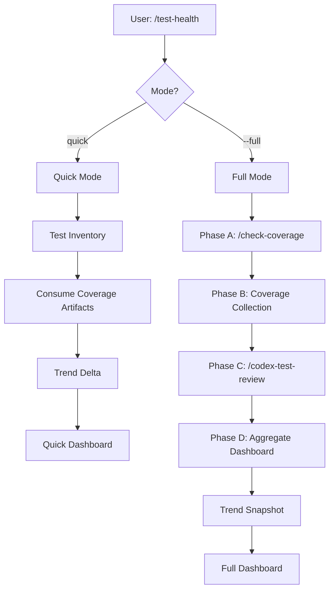
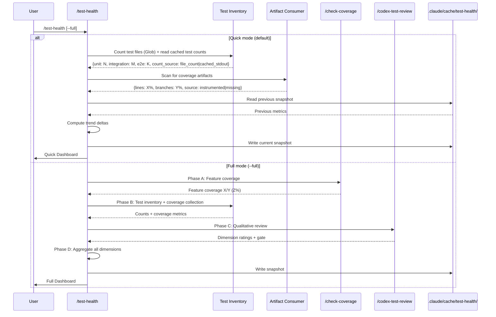

# `/test-health` Technical Spec — Holistic Test Coverage Measurement

## 1. Requirement Summary

- **Problem**: sd0x-dev-flow 有 6 個測試相關 skill（`codex-test-review`, `check-coverage`, `test-deep`, `post-dev-test`, `verify`, `codex-test-gen`），全部是質性審查或執行工具，完全缺乏量化覆蓋率測量能力。無法回答「line coverage 多少 %」、「各層有幾個 test」、「覆蓋率比上次是否提升」等基本問題。使用者只能靠感覺判斷測試品質。
- **Goals**:
  1. 量化覆蓋率收集（consume-first：消費現有 artifact；optional collect：執行 project coverage command）
  2. 各層測試數量計數（unit / integration / e2e breakdown）
  3. 跨 run 趨勢追蹤（delta + rolling window）
  4. 質性審查整合（orchestrate `/codex-test-review` + `/check-coverage` 作為子步驟）
  5. 多維度 dashboard 輸出（非單一 composite score）
  6. Anti-coverage-theater guardrails（diff focus + source transparency + qualitative coupling）
- **Scope**:
  - v1: `/test-health` orchestrator（quick + full mode）、consume-first 策略、trend storage、multi-dimensional dashboard
  - v2 (deferred): weighted composite score、strict gate mode、trend visualization、cross-session comparison CLI

## 2. Existing Code Analysis

### Related Modules

| Module | 關聯 | 可重用 |
|--------|------|--------|
| `skills/test-review/SKILL.md` | `/codex-test-review`（5 維度質性審查）+ `/check-coverage`（feature-doc coverage）+ `/codex-test-gen`（test 生成） | Phase C 質性審查 orchestration |
| `agents/coverage-analyst.md` | Feature coverage 分析 agent（doc → source → test mapping） | Phase A 的 feature coverage 執行器 |
| `skills/test-deep/SKILL.md` | Context-aware test orchestration（test selection + progressive ladder + triage） | Test selection mapping pattern |
| `commands/verify.md` | 驗證 pipeline（lint → typecheck → unit → integration → e2e） | Phase B test execution 引擎 |
| `scripts/verify-runner.js` | 驗證 runner（per-commit cache + summary output） | Cache architecture pattern + output format |
| `scripts/lib/utils.js` | `testStdoutFilter()`、`tailLinesFromFile()` | Test output parsing utilities |
| `skills/pre-pr-audit/SKILL.md` | Pre-PR audit（5-dimension scoring，已整合 `/check-coverage`） | Quick mode 整合目標 |
| `skills/project-audit/scripts/audit.js` | Project health audit（含 test/source file ratio） | Heuristic proxy precedent（line ~361） |
| `hooks/post-tool-review-state.sh` | Lock + atomic state update | Cache concurrency safety |

### Reusable Components

- **Cache pattern**: `verify-runner.js` 的 `.claude/cache/verify/<repoKey>/<shortSha>/` — `/test-health` 延用此模式存 trend data
- **Output filtering**: `utils.js:testStdoutFilter()` — 壓縮 test output 提取 summary
- **Test/source ratio**: `audit.js` 已有 heuristic proxy — 可作為無 coverage artifact 時的 fallback
- **Agent dispatch**: `coverage-analyst` agent — Phase A 可直接 dispatch
- **Skill orchestration**: `/pre-pr-audit` 已整合 `/check-coverage` — Quick mode 參考此整合模式

### Files to Create

| File | Purpose |
|------|---------|
| `skills/test-health/SKILL.md` | Skill 定義（phases + modes + output schema） |
| `skills/test-health/references/artifact-formats.md` | 支援的 coverage artifact 格式規格 |
| `skills/test-health/references/trend-schema.md` | Trend storage schema + rolling window 策略 |
| `skills/test-health/references/test-count-parsers.md` | 各生態系 test runner output 解析規格 |
| `skills/test-health/scripts/artifact-parser.js` | Coverage artifact 偵測 + 解析模組 |
| `skills/test-health/scripts/count-parser.js` | Test count stdout 解析模組 |
| `skills/test-health/scripts/trend.js` | Trend snapshot read/write + delta computation |
| `commands/test-health.md` | Command entry point |
| `test/commands/test-health.test.js` | Command schema 測試 |
| `test/scripts/test-health-artifact-parser.test.js` | `artifact-parser.js` 單元測試 |
| `test/scripts/test-health-count-parser.test.js` | `count-parser.js` 單元測試 |
| `test/scripts/test-health-trend.test.js` | `trend.js` 單元測試 |

### Files to Modify

| File | Change |
|------|--------|
| `CLAUDE.template.md` | Command Quick Reference 加入 `/test-health` |
| `CLAUDE.md` | Command Quick Reference 加入 `/test-health` |
| `.claude/CLAUDE.md` | Command Quick Reference 加入 `/test-health` |

## 3. Technical Solution

### 3.1 Architecture Design





### 3.2 Modes

| Mode | Trigger | 執行內容 | 預估耗時 |
|------|---------|---------|---------|
| `quick`（default） | `/test-health` | Test inventory + consume artifacts + trend delta | <15s |
| `full` | `/test-health --full` | Phase A→B→C→D（feature coverage + instrumentation + qualitative + aggregation） | 2-5min |

**Quick mode** 設計為可內嵌於 `/pre-pr-audit` 的 non-blocking background signal。
**Full mode** 用於深度分析，on-demand 執行。

### 3.3 Coverage Collection Strategy（Consume-First）

**Priority cascade**:

| Priority | Method | Detection | Trigger | Output |
|----------|--------|-----------|---------|--------|
| 1 | Consume existing artifact | Scan known paths（見 §3.4） | Default（quick + full） | `source_type: instrumented_artifact` |
| 2 | Run project coverage command | `package.json` 有 `test:coverage` 或 `coverage` script | **僅 `--collect` flag 時**（opt-in） | `source_type: collected_now` |
| 3 | Heuristic proxy | Test file count / source file count ratio（`project-audit` precedent） | 無 artifact 且非 `--collect` 時 | `source_type: heuristic` |

**Quick mode 永不執行 project commands** — 只做 artifact scan + heuristic fallback，確保 <15s 耗時目標。
**`--collect` flag**: 明確 opt-in 執行 Priority 2（可搭配 `--full` 使用）。
**禁止行為**: 永不自動安裝覆蓋率工具（c8, nyc, istanbul, pytest-cov, tarpaulin, cargo-llvm-cov, jacoco）。

### 3.4 Coverage Artifact Formats

| Ecosystem | Artifact Path Pattern | Format | Parser |
|-----------|----------------------|--------|--------|
| Node.js (c8/nyc/istanbul) | `coverage/lcov.info`, `coverage/coverage-final.json`, `.nyc_output/` | LCOV / Istanbul JSON | Extract `LF:`, `LH:` (lines), `BRF:`, `BRH:` (branches) |
| Node.js (jest) | `coverage/coverage-summary.json` | Jest summary JSON | Extract `.total.lines.pct`, `.total.branches.pct` |
| Python (coverage.py) | `coverage.xml`, `htmlcov/` | Cobertura XML | Extract `line-rate`, `branch-rate` attributes from `<coverage>` root element |
| Python (coverage.py) | `.coverage` | SQLite DB（binary） | 不直接解析；偵測到時提示使用者執行 `coverage xml` 產生 XML artifact |
| Go | `cover.out`, `coverage.out` | Go cover profile | Parse `mode:` header line，逐行解析 `file:startLine.startCol,endLine.endCol count` 格式，計算 covered statements（count > 0）/ total statements |
| Rust (tarpaulin) | `tarpaulin-report.json`, `cobertura.xml` | Tarpaulin JSON / Cobertura | Extract `covered`/`coverable` |
| Java (JaCoCo) | `build/reports/jacoco/`, `target/site/jacoco/` | JaCoCo XML / CSV | Extract `INSTRUCTION` + `BRANCH` counters |
| Generic | `lcov.info`, `cobertura.xml` | LCOV / Cobertura | Unified parser |

**Scan strategy**: 從 project root 遞迴掃描已知路徑 pattern（depth limit: 3 層）。收集所有候選 artifact，依以下優先級選擇最佳者：

| 優先級 | 條件 | 原因 |
|--------|------|------|
| 1 | Freshness: mtime >= HEAD commit timestamp | 最新 data |
| 2 | Proximity: 離 project root 越近越好 | 避免 monorepo sub-package artifact |
| 3 | Completeness: 同時有 line + branch data | 資訊量 |

若僅找到一個 artifact，直接使用（不執行 scoring）。

**Freshness check**: 讀取 artifact 的 filesystem mtime，與 `git log -1 --format=%ct HEAD` 比較。若 artifact 比 HEAD 舊，標記 `freshness: stale`。若 repo 有 uncommitted changes（`git status --porcelain` 非空），額外標記 `dirty_tree: true`（advisory warning，不降級 confidence）。

### 3.5 Test Count Parsing

從 test runner stdout 解析測試數量。各生態系 output format 不同：

| Framework | Output Pattern | Regex |
|-----------|---------------|-------|
| Node.js (`node:test`) | `# tests 47`, `# pass 45`, `# fail 2` | `/^# tests (\d+)/m`, `/^# pass (\d+)/m`, `/^# fail (\d+)/m` |
| Jest | `Tests: 2 failed, 45 passed, 47 total` | `/Tests:\s+(?:(\d+) failed,\s+)?(?:(\d+) passed,\s+)?(\d+) total/` |
| Vitest | `Tests  47 passed \| 2 failed (49)` | `/Tests\s+(\d+)\s+passed\s+\|\s+(\d+)\s+failed\s+\((\d+)\)/` |
| Pytest | `47 passed, 2 failed` | `/(\d+) passed(?:,\s+(\d+) failed)?/` |
| Go | `ok  ./... 12.345s` / `FAIL` | `go test -v -json` 的 `{"Action":"pass","Test":"TestName"}` events；fallback 到 `ok`/`FAIL` line count 時標記 `count_level: package`（非 test case 級別），不與其他框架的 test-case count 混合 trend 比較 |
| Cargo | `test result: ok. 47 passed; 2 failed; 0 ignored` | `/(\d+) passed;\s*(\d+) failed;\s*(\d+) ignored/` |

**Mode-aware count source**:

| Mode | Primary Source | Fallback | `count_source` |
|------|---------------|----------|----------------|
| Quick | Glob file count（不執行任何 command） | 若存在 verify-runner cache（`.claude/cache/verify/<repoKey>/*/summary.json`），從 `summary.json` 的 `steps[].logFile` 定位歷史 log 檔案，解析 test count | `file_count` / `cached_stdout` |
| Full | 執行 test command 後解析 stdout | Glob file count | `stdout_parse` / `file_count` |

**Layer classification**: 依目錄路徑分類，與 `/test-deep` SKILL.md 的 layer detection 規則完全一致（canonical source: `skills/test-deep/SKILL.md` §Phase 1）：

| Directory Pattern | Layer |
|-------------------|-------|
| `test/unit/**`, `test/scripts/lib/**` | Unit |
| `test/integration/**` | Integration |
| `test/e2e/**` | E2E |
| 無法分類（含 `test/commands/**`, `test/hooks/**`, `test/scripts/**`） | Unit（default） |

**注意**: 與 `/test-deep` 一致，未匹配 integration/e2e pattern 的測試檔案歸類為 Unit（非 "Other"），避免分類不一致。

### 3.6 Trend Storage

**Location**: `.claude/cache/test-health/<repoKey>/`

**repoKey**: `${safeSlug(repoBase)}--${sha1(remote).slice(0, 8)}`（與 `verify-runner.js:85` 一致）。其中 `safeSlug` 和 `sha1` 來自 `scripts/lib/utils.js`，`repoBase = path.basename(repoRoot)`，`remote = git remote get-url origin || repoRoot`。

**Snapshot schema** (`snapshot.json`):

```json
{
  "version": 1,
  "sha": "a1b2c3d",
  "timestamp": "2026-04-01T10:00:00Z",
  "code_coverage": {
    "lines": { "covered": 1234, "total": 1500, "pct": 82.3 },
    "branches": { "covered": 456, "total": 600, "pct": 76.0 },
    "source_type": "instrumented_artifact",
    "tool_id": "c8",
    "freshness": "current"
  },
  "test_inventory": {
    "unit": { "files": 25, "tests": 47, "count_source": "stdout_parse", "count_level": "test_case" },
    "integration": { "files": 1, "tests": 12, "count_source": "stdout_parse", "count_level": "test_case" },
    "e2e": { "files": 0, "tests": 0, "count_source": "file_count", "count_level": "test_file" }
  },
  "feature_coverage": {
    "covered": 12,
    "total": 15,
    "pct": 80.0
  },
  "quality": {
    "p0": 0, "p1": 0, "p2": 1, "nit": 2,
    "dimensions": {
      "happy_path": 4,
      "error_handling": 3,
      "edge_cases": 3,
      "mock_quality": 4
    }
  }
}
```

**Rolling window**: 保留最近 30 筆 snapshot。超過時刪除最舊的。

**Concurrency safety**: 使用 lockdir + temp-file-rename pattern（與 `hooks/post-tool-review-state.sh:44` 一致）：
1. 取得 lock：`mkdir <cacheDir>/.lock`（不加 `-p`，atomic — 已存在時回傳 non-zero）。若失敗則檢查 lock age：用 `stat` 讀取 `.lock` 目錄的 mtime（macOS: `stat -f %m`，Linux: `stat -c %Y`），與 `date +%s` 比較。差值 > 60s 視為 stale lock → `rmdir` + retry。最多 3 次 retry，間隔 1s。
2. 寫入 temp file：`<cacheDir>/history/<timestamp>-<sha>.json.tmp`
3. Atomic rename：`mv .tmp → .json`
4. 更新 `latest.json`：copy 最新 snapshot（非 symlink — 避免跨平台相容問題）
5. 釋放 lock：`rmdir <cacheDir>/.lock`

**Trend comparison rules**:
- Coverage trend：只比較相同 `tool_id + source_type` 的 data points
- Test count trend：只比較相同 `count_level` 的 data points（`test_case` / `test_file` / `package` 三者不可混合比較）
- `tool_id` 或 `count_level` 改變時，對應 trend 重置並輸出 `"⚠️ {dimension} changed from {old} to {new} — trend reset"`
- `freshness: stale` 的 data point 參與 trend 計算但標記 confidence downgrade

**Directory structure**:

```
.claude/cache/test-health/<repoKey>/
├── latest.json          # 最新 snapshot（copy，非 symlink）
├── history/
│   ├── 20260401-a1b2c3d.json
│   ├── 20260331-f4e5d6c.json
│   └── ...
└── trend.json           # Pre-computed trend summary（last 5 deltas）
```

### 3.7 Output Schema

#### Quick Mode Output

```markdown
## Test Health (Quick)

### Test Inventory
| Layer | Files | Tests | Source |
|-------|-------|-------|--------|
| Unit  | 25    | 47    | cached_stdout |
| Integration | 1 | 12  | cached_stdout |
| E2E   | 0     | —     | file_count |

### Code Coverage
| Metric | Value | Tool | Freshness |
|--------|-------|------|-----------|
| Lines  | 82.3% | c8   | current   |
| Branches | 76.0% | c8 | current   |

### Trend (vs previous)
| Metric | Previous | Current | Delta |
|--------|----------|---------|-------|
| Line coverage | 80.2% | 82.3% | ↑ +2.1% |
| Test count | 57 | 59 | ↑ +2 |

### Quick Verdicts
| Dimension | Status |
|-----------|--------|
| Has tests for changed files | ✅ |
| Coverage artifact exists | ✅ |
| Trend direction | ✅ Improving |
```

#### Full Mode Output

```markdown
## Test Health Report (Full)

### Phase A: Feature Coverage
→ (from /check-coverage): 12/15 documented features have tests (80%)

### Phase B: Code Coverage + Inventory
| Layer | Files | Tests | Passed | Failed | Duration |
|-------|-------|-------|--------|--------|----------|
| Unit  | 3     | 47    | 45     | 2      | 12s      |
| Integration | 1 | 12  | 12     | 0      | 45s      |
| E2E   | 0     | 0     | —      | —      | —        |

| Metric | Value | Source | Tool | Freshness |
|--------|-------|--------|------|-----------|
| Lines  | 82.3% | instrumented_artifact | c8 | current HEAD |
| Branches | 76.0% | instrumented_artifact | c8 | current HEAD |

### Phase C: Quality Findings
→ (from /codex-test-review):
| Dimension | Rating |
|-----------|--------|
| Happy path | ⭐⭐⭐⭐ |
| Error handling | ⭐⭐⭐ |
| Edge cases | ⭐⭐⭐ |
| Mock quality | ⭐⭐⭐⭐ |

Findings: 0 P0, 0 P1, 1 P2, 2 Nit

### Phase D: Aggregate Dashboard

#### Trend (vs last 5 runs)
| Run | Date | Line Cov | Tests | Delta |
|-----|------|----------|-------|-------|
| a1b2c3d | 04-01 | 82.3% | 59 | ↑ +2.1% / +2 |
| f4e5d6c | 03-31 | 80.2% | 57 | ↓ -0.5% / +0 |
| ...     | ...   | ...    | ... | ... |

#### Verdicts
| Dimension | Status | Detail |
|-----------|--------|--------|
| Test inventory | ⚠️ | No E2E tests |
| Code coverage | ✅ | 82.3% lines (instrumented) |
| Feature coverage | ✅ | 80% features covered |
| Quality | ⚠️ | 1 P2 finding |
| Trend | ✅ | Improving over last 3 runs |
| Changed-file coverage | ✅ | All changed files have tests |
```

### 3.8 Anti-Coverage-Theater Guardrails

| Rule | Description | Enforcement |
|------|-------------|-------------|
| No composite score in v1 | 多維度分開呈現，不混合成單一數字 | Output template 無 composite field |
| Changed-file focus | 優先檢查 `git diff` 涉及的檔案是否有測試 | Quick mode 第一項 verdict |
| Source transparency | 每個量化指標標註 `instrumented` / `heuristic` / `missing` | Schema 強制 `source_type` field |
| Qualitative coupling | 即使量化指標全綠，Full mode 仍必須跑 Phase C | Workflow 不可跳過 |
| Tool change detection | `tool_id` 改變時 trend line 重置 | Trend comparison logic |
| Stale detection | Coverage artifact 比 HEAD 舊時標記 `stale` | Freshness check |

### 3.9 Gate Policy

| Policy | 行為 | 設定位置 |
|--------|------|---------|
| Advisory（default） | 輸出 dashboard + verdicts，不阻擋 workflow | Default |
| Strict（opt-in） | Changed files with zero tests → `⛔ Blocked` | `rules/testing-project.md` |

**v1 只實作 advisory mode**。Strict mode 留待 v2（需 auto-loop integration）。

**Strict mode 設定格式**（v2 實作時加入 `rules/testing-project.md`）：

```markdown
## Test Health Gate

Mode: strict

<!-- Options: advisory (default) | strict -->
<!-- strict: changed files with zero tests → ⛔ Blocked -->
```

此格式與現有 `## Adequacy Mode` section 一致（已在 `testing-project.md` 中預留）。

### 3.10 Orchestrator Integration

```mermaid
flowchart LR
    TH[/test-health] --> |Phase A| CC[/check-coverage]
    TH --> |Phase B| V[/verify or direct execution]
    TH --> |Phase C| CTR[/codex-test-review]
    TH --> |Quick mode| PPA[/pre-pr-audit integration]
```

| 現有 Skill | `/test-health` 如何互動 | 關係 |
|------------|---------------------|------|
| `/check-coverage` | Phase A: 呼叫取得 feature coverage | Sub-step |
| `/codex-test-review` | Phase C: 呼叫取得質性審查 | Sub-step |
| `/verify` | Phase B: 參考 verify-runner output 或直接 trigger `test:coverage` | Optional sub-step |
| `/test-deep` | 獨立工具（orchestrate test execution + triage）；`/test-health` 聚焦 measurement | Peer（不互相呼叫） |
| `/pre-pr-audit` | Quick mode 可內嵌作為 non-blocking dimension | Consumer |
| `/post-dev-test` | Full mode 結果可觸發 `/post-dev-test` 填補 gap | Advisory follow-up |

### 3.11 Cross-Ecosystem Support

| Ecosystem | Coverage Tool | Artifact | Test Count Parser | Detection |
|-----------|--------------|----------|-------------------|-----------|
| Node.js | c8 / nyc / istanbul / jest | `coverage/` dir | `node:test` / jest / vitest pattern | `package.json` |
| Python | coverage.py / pytest-cov | `coverage.xml`（直接解析）；`.coverage` 偵測但不直接解析（提示使用者轉換） | pytest output | `setup.py` / `pyproject.toml` |
| Go | `go test -cover` | `cover.out` | go test output | `go.mod` |
| Rust | tarpaulin / llvm-cov | `tarpaulin-report.json` / `cobertura.xml` | cargo test output | `Cargo.toml` |
| Java | JaCoCo | `build/reports/jacoco/` | gradle/maven output | `build.gradle` / `pom.xml` |
| Unknown | — | Scan for `lcov.info` / `cobertura.xml` | File count fallback | — |

**Graceful degradation**: 無 artifact + 無 coverage command → heuristic proxy（test/source ratio）+ `source_type: heuristic` + confidence downgrade。

### 3.12 Command Interface

**Command**: `/test-health`

**Flags**:

| Flag | Default | Description |
|------|---------|-------------|
| `--full` | false | 執行 Phase A→B→C→D 完整分析 |
| `--collect` | false | 強制執行 project coverage command（Priority 2） |
| `--scope <path>` | project root | 限定分析範圍 |
| `--no-trend` | false | 跳過 trend comparison |

## 4. Risks and Dependencies

| Risk | Impact | Probability | Mitigation |
|------|--------|------------|------------|
| Coverage artifact 格式不符 | 解析失敗，無量化數據 | Medium | Graceful fallback to heuristic + `missing` tag |
| Stale artifact 誤導 | 覆蓋率數據不反映當前 HEAD | Medium | Freshness check + `stale` tag + confidence downgrade |
| Test count parser 跨框架不完整 | 部分框架無法解析 test count | Medium | File count fallback + `count_source: file_count` |
| Coverage theater | 追求數字而非品質 | Medium | No composite score + diff focus + qualitative coupling |
| Trend data 跨 session 遺失 | `.claude/cache/` 被清除 | Low | 文件化 cache 位置 + optional export |
| 與 `/check-coverage` 語意重疊 | 使用者困惑 | Medium | 明確文檔：`/check-coverage` = feature coverage，`/test-health` = holistic measurement |
| Full mode 耗時 | 2-5 min 可能中斷開發流 | Low | Quick mode 為 default，Full mode on-demand |

**Dependencies**:

| Dependency | Type | Status |
|------------|------|--------|
| `skills/test-review/SKILL.md` | Internal（Phase A + C） | Available |
| `agents/coverage-analyst.md` | Internal（Phase A） | Available |
| `scripts/verify-runner.js` | Internal（cache pattern） | Available |
| `scripts/lib/utils.js` | Internal（output parsing） | Available |
| Git CLI | Local | Available |
| Coverage artifacts | External（project-specific） | Variable |

## 5. Work Breakdown

| # | Task | Effort | Output |
|---|------|--------|--------|
| 1 | Create `skills/test-health/SKILL.md` | L | Skill 定義（phases + modes + output） |
| 2 | Create `skills/test-health/references/artifact-formats.md` | M | Coverage artifact 格式 + 解析規格 |
| 3 | Create `skills/test-health/references/trend-schema.md` | M | Trend storage schema + rolling window |
| 4 | Create `skills/test-health/references/test-count-parsers.md` | M | 各生態系 test count 解析 regex |
| 5 | Create `commands/test-health.md` | S | Command entry point |
| 6 | Create `test/commands/test-health.test.js` | S | Command schema 測試 |
| 7 | Update CLAUDE.md command tables（3 files） | S | Documentation |
| 8 | Implement quick mode artifact consumer（script or inline） | M | Coverage artifact 解析邏輯 |
| 9 | Implement trend storage + delta computation | M | Cache read/write + comparison |
| 10 | Integration testing with real project | L | End-to-end verification |

## 6. Testing Strategy

| Type | Test | Target Module | File |
|------|------|---------------|------|
| Schema | Command file structure validation | `commands/test-health.md` | `test/commands/test-health.test.js` |
| Schema | SKILL.md frontmatter + references integrity | `skills/test-health/SKILL.md` | 既有 `test/commands/skills-schema.test.js` |
| Unit | Coverage artifact format detection + parsing（LCOV, Istanbul JSON, Cobertura, Go cover profile） | `skills/test-health/scripts/artifact-parser.js` | `test/scripts/test-health-artifact-parser.test.js` |
| Unit | Test count regex parsing（node:test, jest, vitest, pytest, go, cargo）+ file count fallback | `skills/test-health/scripts/count-parser.js` | `test/scripts/test-health-count-parser.test.js` |
| Unit | Trend snapshot read/write + delta computation（same tool, tool change, stale data）+ rolling window pruning + lock/atomic-write | `skills/test-health/scripts/trend.js` | `test/scripts/test-health-trend.test.js` |
| Manual | Quick mode end-to-end（real project with c8 artifact） | — | Integration |
| Manual | Full mode orchestration（Phase A→B→C→D） | — | Integration |
| Manual | Graceful degradation（no artifact, no coverage command） | — | Integration |
| Manual | `/pre-pr-audit` integration（quick mode as background signal） | — | Integration |

## 7. Open Questions

| # | Question | Impact | 建議 |
|---|----------|--------|------|
| 1 | `/test-health` quick mode 是否應內嵌於 `/pre-pr-audit` 的 default flow？ | Integration | v1 optional（使用者手動呼叫），v2 自動整合 |
| 2 | Trend rolling window 大小 30 筆是否適當？ | Storage | 30 筆約足夠一個月的活躍開發，可透過 `testing-project.md` override |
| 3 | Full mode Phase C 是否需要 fresh Codex thread 或可 reuse 現有 `/codex-test-review` thread？ | Token cost | 建議 fresh thread（避免 context pollution） |
| 4 | 是否需要 `--export` flag 將 trend data 輸出為 JSON/CSV 供外部工具消費？ | Extensibility | v2 考慮（v1 focus on dashboard output） |
| 5 | Heuristic proxy（test/source ratio）的基線值如何設定？ | Accuracy | 不設硬性基線，僅呈現 ratio + 與前次比較 |
| 6 | 是否需要 changed-file 的 per-file coverage（而非全域 line %）？ | Granularity | v1 全域 + "changed files have tests" boolean；v2 per-file diff coverage |
