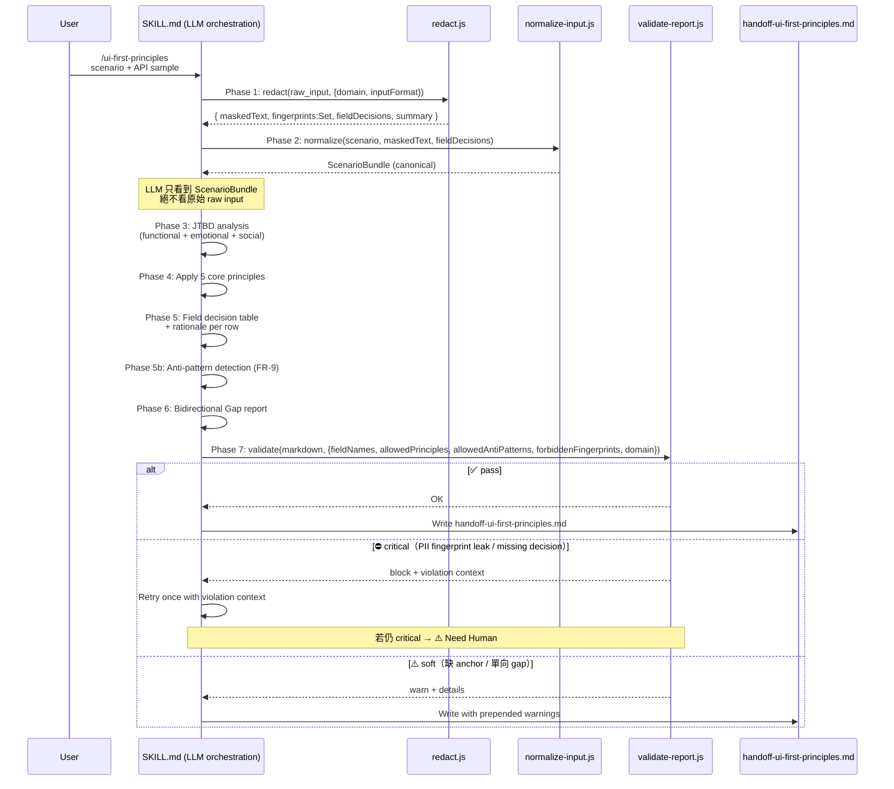

# Technical Spec: UI First-Principles Skill

> **Doc class**: Lifecycle — Phase 2 tech spec (per `@rules/docs-numbering.md`).
> **Created**: 2026-04-24
> **Updated**: 2026-04-24
> **Status**: Ready for `/architecture` or `/feature-dev`
> **Upstream**: [0-feasibility-study.md](./0-feasibility-study.md)（推薦 Option D）、[1-requirements.md](./1-requirements.md)（rev-4）

## 1. Requirement Summary

### Problem

專案缺少一個能把「場景 → JTBD → 心理學/IA 原則 → API 欄位 → UI 資訊優先級」串成推理鏈的 skill。現有 `frontend-design`（視覺層）、`critique`（事後評估）、`distill`（簡化既有）都不在此上游位置。詳見 `1-requirements.md` §1。

### Goals

- 實作 `1-requirements.md` rev-4 的 11 個 FR 與 8 個 NFR
- 採用 `0-feasibility-study.md` 推薦的 **Option D Contract-first Hybrid**
- v1 5–7 person-days 可完成並通過 NFR-7 / NFR-8 驗證 fixture（含 FR-9 反模式偵測）

### Scope（v1）

| In scope | Out of scope |
|----------|--------------|
| 單場景分析（FR-8 v1） | 多場景矩陣（v2） |
| JSON sample + 手寫欄位清單輸入（FR-2 縮減） | OpenAPI spec 解析（v2） |
| 5 固定核心原則（FR-4） | Gestalt / F-Pattern / Fitts' Law（視覺層） |
| 雙向 Gap report（FR-6）+ 反模式偵測（FR-9） | 版面 mermaid wireframe（v2） |
| `handoff-ui-first-principles.md` 輸出 | React/HTML 程式碼（邊界契約） |

## 2. Existing Code Analysis

### Related Modules

| Path | Role | 本 skill 使用方式 |
|------|------|-------------------|
| `scripts/security-redact.js` | 2-tier secret redaction（base） | 新 extension layer 會先呼叫此 base（`redact()` 回傳 plain string） |
| `scripts/skills/necessity-audit/redact.js` | Extension pattern 前例 | 模仿其「先呼叫 base 再加 domain pattern」結構 |
| `skills/necessity-audit/` | 多階段 skill + script 整合前例 | 整體架構借鑑（phase + gate + script 組合） |
| `test/skills/necessity-audit/` | Test location convention | 新 skill 測試放 `test/skills/ui-first-principles/` |

### Reusable Components

- `security-redact.js` 的 `AbortError`（high-confidence secrets 遇到即中止）機制可直接繼承
- 12 個既有 `bash scripts` hybrid skills 的 SKILL.md 結構可作模板
- `scripts/config/` 放設定檔（若 crypto allowlist 需設定檔）

### Files to Create

| File | Purpose | LoC（估） |
|------|---------|-----------|
| `skills/ui-first-principles/SKILL.md` | 7-phase orchestration | ~260 |
| `skills/ui-first-principles/references/principles.md` | 5 核心原則定義 + 適用時機 | ~180 |
| `skills/ui-first-principles/references/jtbd-framework.md` | Functional/emotional/social 三維度指引 | ~120 |
| `skills/ui-first-principles/references/output-template.md` | 輸出 markdown schema（含 Anti-pattern 段） | ~120 |
| `skills/ui-first-principles/references/anti-patterns.md` | 常見反模式清單 + 觸發條件 | ~100 |
| `scripts/skills/ui-first-principles/redact.js` | Structure-aware extension redactor | ~240 |
| `scripts/skills/ui-first-principles/normalize-input.js` | JSON/manual → ScenarioBundle | ~150 |
| `scripts/skills/ui-first-principles/validate-report.js` | Output schema checks + fingerprint leak check | ~200 |
| `test/skills/ui-first-principles/redact.test.js` | PII class + crypto + fingerprint 測試 | ~320 |
| `test/skills/ui-first-principles/normalize-input.test.js` | Parser 測試 | ~150 |
| `test/skills/ui-first-principles/validate-report.test.js` | 驗證規則測試（含 fingerprint scan） | ~220 |
| `test/fixtures/ui-first-principles/scenarios/*.json` | NFR-7/8 + FR-9 fixtures | 25+ files |

## 3. Technical Solution

### 3.1 Architecture (Mermaid)



### 3.2 Data Model

```typescript
// Phase 1 output — 結構感知 redaction 的完整產出
interface PhaseOneRedactResult {
  maskedText: string;                   // 已遮罩的序列化輸入（供 downstream normalize）
  fingerprints: Set<string>;            // 原始敏感值的 SHA-256 前綴（Phase 7 洩漏偵測用）
  fieldDecisions: FieldRedactionTrace[];// 每欄位保留/遮罩/allowlist 決策軌跡
  summary: {
    totalMasks: number;
    maskedClasses: PIIClass[];
    cryptoAllowlistHits: number;
    baseRedactHits: number;             // 來自 security-redact.js base 的命中數
  };
}

// 每欄位遮罩決策軌跡（結構感知階段產生）
interface FieldRedactionTrace {
  path: string;                         // e.g., "transactions[0].counterparty"
  fieldName: string;                    // e.g., "counterparty"
  action: 'keep' | 'mask' | 'crypto_allow';
  piiClass?: PIIClass;                  // action=mask 時必填
  fingerprint?: string;                 // 原始值 SHA-256 前綴（critical leak scan 用）
}

// Phase 2 output — LLM 實際看到的介面
interface ScenarioBundle {
  scenario: string;                     // e.g., "交易歷史列表"
  scenarioType?: ScenarioType;          // 選填，LLM 可推斷
  fields: RedactedField[];
  inputFormat: 'json_sample' | 'manual_list';
  redactionSummary: {
    totalMasks: number;
    maskedClasses: PIIClass[];
    cryptoAllowlistHits: number;
  };
}

interface RedactedField {
  name: string;                         // e.g., "counterparty"
  type?: string;                        // "string" | "number" | "boolean" | "object"
  sampleValue: string;                  // 已遮罩: "<redacted:address>" or raw 非敏感值
  description?: string;                 // 來自 manual_list `field: type (description)`
  source: 'json_sample' | 'manual';
}

type PIIClass = 'email' | 'phone' | 'address' | 'account_id' | 'national_id' | 'credential';

type ScenarioType =
  | 'transaction_history' | 'dashboard' | 'asset_detail'
  | 'error_state' | 'empty_state' | 'form_input' | 'other';

// Phase 5 output
interface FieldDecision {
  fieldName: string;
  priority: 'primary' | 'secondary' | 'on_demand' | 'hidden';
  principleAnchor: PrincipleId;         // 白名單
  rationale: string;                    // 1–2 句
}

type PrincipleId =
  | 'JTBD' | 'CognitiveLoadTheory' | 'HicksLaw'
  | 'MillersLaw' | 'ProgressiveDisclosure';

// Phase 5b output — FR-9 反模式偵測
interface AntiPatternFinding {
  pattern: AntiPatternId;               // 白名單 ID
  affectedFields: string[];
  rationale: string;                    // 為何構成反模式 + 改善方向
  severity: 'warning' | 'info';         // LLM 判斷
}

type AntiPatternId =
  | 'too_many_primary'                  // primary 欄位 > Miller 7±2
  | 'scenario_field_mismatch'           // 欄位與場景核心 job 不符
  | 'pure_aesthetic_over_utility'       // 欄位僅美觀無決策價值
  | 'hidden_critical_info'              // 關鍵資訊被折疊到 on_demand
  | 'redundant_fields';                 // 多個欄位承載同一資訊

// Phase 6 output
interface GapReport {
  ui_needs_but_api_missing: string[];   // 可為 ['none']
  api_provides_but_ui_ignores: string[];// 可為 ['none']
}
```

### 3.3 API / Invocation Design

**Skill 呼叫方式**：

```
/ui-first-principles <scenario> [--api <path-to-sample>] [--domain crypto] [--output <path>]
```

| Arg | Type | Required | Notes |
|-----|------|----------|-------|
| `<scenario>` | natural language | Yes | 場景描述，如「交易歷史列表」 |
| `--api <path>` | file path | No | JSON sample 或手寫欄位 `.txt`；不給則 LLM 用 fallback 推測 |
| `--domain crypto` | flag | No | 啟用 crypto allowlist（tx hash/address 不遮；預設關閉，fail-safe） |
| `--output <path>` | file path | No | 預設 `docs/features/<auto-detect>/handoff-ui-first-principles.md` |

**Script 介面**：

```javascript
// redact.js — 結構感知：先解析 JSON，再對每個 value 做欄位上下文判斷
const { redact } = require('scripts/skills/ui-first-principles/redact');
const result = redact(rawText, { domain: 'crypto' | null, inputFormat: 'json_sample' | 'manual_list' });
// result: PhaseOneRedactResult
//   { maskedText, fingerprints: Set<string>, fieldDecisions, summary }

// normalize-input.js — 把 maskedText 與 fieldDecisions 組成 bundle
const { normalize } = require('scripts/skills/ui-first-principles/normalize-input');
const bundle = normalize({ scenario, maskedText, fieldDecisions, inputFormat });
// bundle: ScenarioBundle

// validate-report.js — 接收 fingerprints 與 domain 以精準偵測洩漏
const { validate } = require('scripts/skills/ui-first-principles/validate-report');
const v = validate(markdownReport, {
  fieldNames: string[],
  allowedPrinciples: PrincipleId[],
  allowedAntiPatterns: AntiPatternId[],
  forbiddenFingerprints: Set<string>,   // Phase 1 產出的敏感值指紋
  domain: 'crypto' | null,              // 影響 generic regex 強度與 allowlist 判定
});
// v: { ok: boolean, violations: [{ severity: 'critical'|'soft', rule, detail }] }
```

### 3.4 Core Logic

#### Phase 1: `redact.js` — Structure-aware redaction

**設計要點**：
1. **解析優先**：`inputFormat='json_sample'` 時先 `JSON.parse`，失敗才降回字串模式
2. **欄位上下文感知**：遞迴走訪物件；每到 leaf value 依 `{ path, fieldName, value }` 判斷 mask/keep/crypto_allow（fail-safe：`--domain crypto` 未啟用時 allowlist 一律跳過）
3. **雙重回傳**：除 `maskedText` 外回傳 `fingerprints: Set<string>`（原始敏感值的 SHA-256 前綴），供 Phase 7 無假陽性偵測洩漏
4. **Base-layer fingerprint 預收集**：`security-redact.js#redact()` 回傳 plain string 但不回傳 match metadata。為確保 base 遮罩的 medium-confidence secret / long hex 也能被 Phase 7 fingerprint 偵測，**在呼叫 base 之前**先用 base 匯出的 `HIGH_CONFIDENCE_PATTERNS` / `MEDIUM_CONFIDENCE_PATTERNS` 對原文掃一遍（以 `String.prototype.matchAll` 取全部命中），把命中值指紋加入 `fingerprints`
5. **單一回傳形狀**：無論 JSON / fallback / manual 路徑都透過 `finalizeResult` 回傳完整 `PhaseOneRedactResult`

**處理流程**：

```javascript
const baseRedact = require('../../../security-redact.js');
const crypto = require('node:crypto');

function redact(rawText, options = {}) {
  const { domain = null, inputFormat = 'json_sample' } = options;
  const ctx = {
    domain,
    fingerprints: new Set(),
    fieldDecisions: [],
    summary: { totalMasks: 0, maskedClasses: new Set(), cryptoAllowlistHits: 0, baseRedactHits: 0 },
  };

  // Step 1: base-layer fingerprint 預收集（在遮罩前，保留原始值的指紋）
  collectBaseLayerFingerprints(rawText, ctx);

  // Step 2: base secret scan（AbortError 會向上拋，不吞）
  const baseMasked = baseRedact.redact(rawText);            // plain string

  // Step 3: structure-aware mask — 所有路徑都透過 finalizeResult 回傳 PhaseOneRedactResult
  if (inputFormat === 'json_sample') {
    let root;
    try {
      root = JSON.parse(baseMasked);
    } catch {
      return fallbackStringMode(baseMasked, ctx);  // JSON 失敗降級；fingerprints/fieldDecisions 同一 ctx 累加
    }
    const masked = walkAndMask(root, '', ctx);
    return finalizeResult(JSON.stringify(masked, null, 2), ctx);
  }

  return fallbackStringMode(baseMasked, ctx);      // manual list 或非 JSON 路徑
}

// 一律回傳 PhaseOneRedactResult，統一 shape
function finalizeResult(maskedText, ctx) {
  return {
    maskedText,
    fingerprints: ctx.fingerprints,
    fieldDecisions: ctx.fieldDecisions,
    summary: {
      totalMasks: ctx.summary.totalMasks,
      maskedClasses: Array.from(ctx.summary.maskedClasses),
      cryptoAllowlistHits: ctx.summary.cryptoAllowlistHits,
      baseRedactHits: ctx.summary.baseRedactHits,
    },
  };
}

// 預收集 base 遮罩前的敏感值指紋（Phase 7 才能 fingerprint-match 這類洩漏）
// 注意：
//   1. high + medium patterns 可能同時命中同一值，以 fingerprint 去重後才 ++baseRedactHits
//   2. **無條件 clone regex** — 防禦 shared global regex 的 stale lastIndex 污染
//      （舊版 `re.global ? re : ...` 會直接重用匯出物件，被外部意外改到 lastIndex 時會跳字）
function collectBaseLayerFingerprints(rawText, ctx) {
  const { HIGH_CONFIDENCE_PATTERNS, MEDIUM_CONFIDENCE_PATTERNS } = baseRedact;
  for (const { re, group } of [...HIGH_CONFIDENCE_PATTERNS, ...MEDIUM_CONFIDENCE_PATTERNS]) {
    const flags = re.flags.includes('g') ? re.flags : re.flags + 'g';
    const freshRe = new RegExp(re.source, flags);            // 每次 clone，lastIndex=0
    for (const m of rawText.matchAll(freshRe)) {
      const captured = typeof group === 'number' ? m[group] : m[0];
      if (!captured) continue;
      const fp = sha256Prefix(captured);
      if (!ctx.fingerprints.has(fp)) {
        ctx.fingerprints.add(fp);
        ctx.summary.baseRedactHits++;           // 僅首次命中才計入，避免 double-count
      }
    }
  }
}

// Fallback：manual list / JSON parse 失敗共用；同一 ctx 累加 fingerprints / fieldDecisions
// 已遮罩的 placeholder 必須 short-circuit，避免被當成 fresh PII 再次 fingerprint
const PLACEHOLDER_RE = /^(?:\[REDACTED\]|<redacted:[a-z_]+>)$/;

function fallbackStringMode(text, ctx) {
  // KV 擷取：value 走 alternation
  //   1. 字面 `[REDACTED]`：整段放行以觸發 placeholder short-circuit
  //   2. 一般 token：排除 `"`, `'`, `\n`, `,`, `}`, `]`，讓結尾 `]` 終止值（e.g. `ssn: 1-2-3 ]`
  //      trim 後 anchored regex 仍能命中
  const KV_RE =
    /(["']?)([A-Za-z_][\w.-]*)\1\s*([:=])\s*(["']?)(\[REDACTED\]|[^"'\n,}\]]+)\4/g;
  const masked = text.replace(KV_RE, (full, q1, fieldName, op, q2, value) => {
    const trimmed = value.trim();                       // 分類 / fingerprint 一律用 trim
    const trace = { path: fieldName, fieldName, action: 'keep' };

    // a. Placeholder short-circuit
    if (PLACEHOLDER_RE.test(trimmed)) {
      ctx.fieldDecisions.push(trace);
      return full;
    }

    // b. Value-pattern PII（email / national_id / strict E.164）優先於 crypto allowlist
    const valuePII = classifyByValue(trimmed);
    if (valuePII) {
      trace.action = 'mask';
      trace.piiClass = valuePII;
      trace.fingerprint = sha256Prefix(trimmed);
      ctx.fingerprints.add(trace.fingerprint);
      ctx.summary.maskedClasses.add(valuePII);
      ctx.summary.totalMasks++;
      ctx.fieldDecisions.push(trace);
      return `${q1}${fieldName}${q1}${op} ${q2}<redacted:${valuePII}>${q2}`;
    }

    // c. Crypto allowlist（opt-in，雙條件 fail-safe）
    if (ctx.domain === 'crypto' && isCryptoField(fieldName, trimmed)) {
      trace.action = 'crypto_allow';
      ctx.summary.cryptoAllowlistHits++;
      ctx.fieldDecisions.push(trace);
      return full;
    }

    // d. Field-name PII（phone / address / account_id / credential，anchored token）
    const fieldPII = classifyByFieldName(fieldName);
    if (fieldPII) {
      trace.action = 'mask';
      trace.piiClass = fieldPII;
      trace.fingerprint = sha256Prefix(trimmed);
      ctx.fingerprints.add(trace.fingerprint);
      ctx.summary.maskedClasses.add(fieldPII);
      ctx.summary.totalMasks++;
      ctx.fieldDecisions.push(trace);
      return `${q1}${fieldName}${q1}${op} ${q2}<redacted:${fieldPII}>${q2}`;
    }

    ctx.fieldDecisions.push(trace);
    return full;
  });
  return finalizeResult(masked, ctx);
}

// 走訪物件樹：對每個 leaf value 判斷 mask/keep/crypto_allow
function walkAndMask(node, path, ctx) {
  if (node === null || typeof node !== 'object') {
    return decideLeaf(path, node, ctx);
  }
  if (Array.isArray(node)) return node.map((v, i) => walkAndMask(v, `${path}[${i}]`, ctx));
  const out = {};
  for (const [k, v] of Object.entries(node)) out[k] = walkAndMask(v, path ? `${path}.${k}` : k, ctx);
  return out;
}

function decideLeaf(path, value, ctx) {
  if (typeof value !== 'string') return value;            // 數字、布林直接保留
  const fieldName = extractFieldName(path);               // "a.b[0].c" → "c"
  const trace = { path, fieldName, action: 'keep' };
  // trim 一次供所有分類決策使用：JSON 值可能有合法前後空白（e.g. " 123-45-6789 "），
  // 若不 trim，anchored value regex 會 miss 導致落到 crypto allowlist 洩漏。
  // 輸出路徑對非 PII 仍回傳原 value 以保留原始格式。
  const trimmed = value.trim();

  // a. Placeholder short-circuit：base 已遮罩值（"[REDACTED]" / "<redacted:xxx>"）跳過分類
  if (PLACEHOLDER_RE.test(trimmed)) {
    ctx.fieldDecisions.push(trace);
    return value;
  }

  // b. Value-pattern PII（email / national_id / strict E.164）
  //    刻意先於 crypto allowlist：即使欄位名觸發 crypto_allow，值本身是明確 PII 仍遮罩
  const valuePII = classifyByValue(trimmed);
  if (valuePII) {
    return applyMask(trace, valuePII, trimmed, ctx);
  }

  // c. Crypto allowlist 僅在 --domain crypto 啟用時生效（雙條件 fail-safe，同樣用 trimmed）
  if (ctx.domain === 'crypto' && isCryptoField(fieldName, trimmed)) {
    trace.action = 'crypto_allow';
    ctx.summary.cryptoAllowlistHits++;
    ctx.fieldDecisions.push(trace);
    return value;
  }

  // d. Field-name PII（phone / address / account_id / credential，anchored token）
  const fieldPII = classifyByFieldName(fieldName);
  if (fieldPII) {
    return applyMask(trace, fieldPII, trimmed, ctx);
  }

  ctx.fieldDecisions.push(trace);
  return value;
}

function applyMask(trace, piiClass, value, ctx) {
  trace.action = 'mask';
  trace.piiClass = piiClass;
  trace.fingerprint = sha256Prefix(value);
  ctx.fingerprints.add(trace.fingerprint);
  ctx.summary.maskedClasses.add(piiClass);
  ctx.summary.totalMasks++;
  ctx.fieldDecisions.push(trace);
  return `<redacted:${piiClass}>`;
}

function sha256Prefix(s) {
  return 'sha256:' + crypto.createHash('sha256').update(String(s)).digest('hex').slice(0, 12);
}
```

**PII 分類器（`classifyField`）**：

分類器分兩段：`classifyByValue`（值 pattern）優先、`classifyByFieldName`（欄位名 anchored regex）次之。前者在 `decideLeaf` 中 **早於 crypto allowlist 判定**，確保 `{"tokenId":"alice@example.com"}` 在 `--domain crypto` 下仍被遮為 email（explicit value PII 勝過 allowlist）。

欄位名比對先以 `normalizeFieldName`（camelCase → snake_case、lowercased）正規化，再用 `(^|_)term($|_)` 型 anchored regex 匹配 token 邊界，避免 `ipaddress`/`hotel`/`tokenizer` 等子字串假陽性。

| Class | 觸發條件 | Mask |
|-------|----------|------|
| email | 值符合 `[\w.+-]+@[\w-]+\.[\w.-]+` | `<redacted:email>` |
| phone | 欄位名 token 含 `phone`/`mobile`/`tel` 或值符合嚴格 E.164（`^\+\d{8,15}$`） | `<redacted:phone>` |
| address | 欄位名 token 含 `address`/`addr`/`street`/`city`/`postal`/`zipcode`/`zip`（v1 僅欄位名） | `<redacted:address>` |
| account_id | 欄位名為 `account` 或 token 匹配 `(user\|customer\|member\|client)_?id` | `<redacted:account_id>` |
| national_id | 值符合 `[A-Z][12]\d{8}`（台灣）或 `\d{3}-\d{2}-\d{4}`（SSN） | `<redacted:national_id>` |
| credential | 欄位名 token 含 `password`/`passwd`/`pwd`/`secret`/`api_?key`/`access_?token`/`private_?key`/`token`/`credentials?` | `<redacted:credential>` |

> **為何加入 `credential` class**：T1 實作期 Codex/strict-reviewer 雙審發現 `scripts/security-redact.js` 的 `password assignment` 正則 `\b(password|passwd|pwd)\s*[:=]` 在 JSON 引號形式（`"password":"foo"`）下無法命中（`"` 後接 `:` 不匹配 `[:=]` 邊界），形成 JSON 憑證洩漏路徑。加入結構感知的 `credential` class 覆蓋此間隙。與 base 層協作：base 命中則用 `[REDACTED]`，僅 structure-aware 命中才用 `<redacted:credential>`。

**Crypto allowlist（`--domain crypto` opt-in）**：

| Pattern | 條件 | 例外 |
|---------|------|------|
| `0x[0-9a-fA-F]{40}` | 欄位名含 `address`/`from`/`to`/`contract`/`owner`/`spender`/`operator`/`recipient` | 合約地址 / EOA |
| `0x[0-9a-fA-F]{64}` | 欄位名含 `hash`/`tx`/`txHash`/`blockHash` | tx / block hash |
| ERC-1155/721 token id | 欄位名 token 匹配 `token_?id` | token id |

> **Fail-safe 設計**：crypto allowlist 只在「`--domain crypto` 為真 **且** 欄位名命中白名單」雙重條件下生效。更重要的是：`decideLeaf` 先跑 `classifyByValue`，若值為 email / national_id / 嚴格 E.164，直接遮罩 **不進** allowlist 分支。這保證 `tokenId` 欄位被塞入 email 值時不會漏遮。

#### Phase 2: `normalize-input.js`

- **JSON sample 輸入**：以 Phase 1 的 `fieldDecisions` 為主要來源（每筆已有 `path` / `fieldName` / `action`），只取 `path` 不含 `.` / `[]` 的 leaf（即頂層欄位）作為 v1 的 `RedactedField` 清單；type 從 `JSON.parse(maskedText)` 的 top-level value `typeof` 推斷。**不做二次遞迴**以避免巢狀展平爆炸（v2 再處理深層 schema）
- **Manual list 輸入**：逐行解析 `fieldName: type (description)` 格式，`description` 直接填入 `RedactedField.description`
- **輸出**：`ScenarioBundle`，其 `redactionSummary` 由 Phase 1 summary 直接投影

#### Phases 3–6: LLM (SKILL.md)

由 SKILL.md prompt 引導：

1. **Phase 3 JTBD**：`references/jtbd-framework.md` 要求 LLM 同時識別 functional / emotional / social jobs
2. **Phase 4 原則**：`references/principles.md` 列 5 原則定義 + 每原則的「觸發條件」
3. **Phase 5 決策**：對每 field 填 `{ priority, principleAnchor, rationale }`
4. **Phase 5b Anti-pattern（FR-9）**：參考 `references/anti-patterns.md` 白名單 ID，偵測「欄位設計反模式」並產 `AntiPatternFinding[]`（可為空陣列）
5. **Phase 6 Gap**：雙向掃描；允許 `['none']`

#### Phase 7: `validate-report.js` — Fingerprint-aware validation

```javascript
function validate(markdown, opts) {
  const { fieldNames, allowedPrinciples, allowedAntiPatterns, forbiddenFingerprints, domain } = opts;
  const violations = [];

  // Rule 1 (critical): fingerprint-based leak scan — 無假陽性
  // 對 markdown 中每個 token 算 sha256 前綴，看是否落在 forbiddenFingerprints
  const leaks = scanByFingerprint(markdown, forbiddenFingerprints);
  if (leaks.length) violations.push({ severity: 'critical', rule: 'pii_leak_fingerprint', detail: leaks });

  // Rule 1b (critical, supplemental): generic PII regex rescan
  // domain=crypto 時降低 0x... 類敏感度；其餘 pattern 正常偵測
  const regexLeaks = scanForPIIPatterns(markdown, { domain });
  if (regexLeaks.length) violations.push({ severity: 'critical', rule: 'pii_leak_regex', detail: regexLeaks });

  // Rule 2 (critical): 每個 input field 皆有決策 row
  const rows = parseDecisionRows(markdown);
  const missing = fieldNames.filter(n => !rows.find(r => r.fieldName === n));
  if (missing.length) violations.push({ severity: 'critical', rule: 'missing_decision', detail: missing });

  // Rule 3 (soft): 每 row 的 anchor ∈ allowedPrinciples
  const invalidAnchors = rows.filter(r => !allowedPrinciples.includes(r.principleAnchor));
  if (invalidAnchors.length) violations.push({ severity: 'soft', rule: 'invalid_anchor', detail: invalidAnchors });

  // Rule 4 (soft): Gap report 雙向皆標
  const gap = parseGapReport(markdown);
  if (!gap.hasUIDirection || !gap.hasAPIDirection)
    violations.push({ severity: 'soft', rule: 'gap_direction_missing' });

  // Rule 5 (soft): Anti-pattern 段落存在且 ID ∈ allowedAntiPatterns
  const ap = parseAntiPatterns(markdown);
  if (!ap.present) violations.push({ severity: 'soft', rule: 'anti_pattern_missing' });
  const invalidAp = ap.findings.filter(f => !allowedAntiPatterns.includes(f.pattern));
  if (invalidAp.length) violations.push({ severity: 'soft', rule: 'invalid_anti_pattern_id', detail: invalidAp });

  return { ok: !violations.some(v => v.severity === 'critical'), violations };
}
```

**Rule 1 / 1b 分工說明**：
- **Rule 1（fingerprint）**：精準命中 Phase 1 已知敏感值；零假陽性；主力偵測
- **Rule 1b（generic regex）**：防「LLM 把 `<redacted:email>` 還原成仿造 email」等新產物；`domain=crypto` 時對 `0x...` pattern 降敏避免誤報 tx hash

#### Retry Policy

| Violation | 動作 |
|-----------|------|
| Critical（pii_leak_fingerprint / pii_leak_regex / missing_decision） | Block write → 1 次 retry with violation context → 若仍 critical 則 emit `⚠️ Need Human`（不降級為 warn-only） |
| Soft only | Write with `> ⚠️ Warnings: ...` block prepended |

**統一政策**：critical 違規最多 1 次重試，失敗即升級人工介入。不存在「soft 化」或「warn-only 降級」的回退路徑，確保 NFR-7 的硬性保證。

## 4. Risks and Dependencies

### Risks

| # | Risk | Likelihood | Impact | Mitigation |
|---|------|-----------|--------|-----------|
| R1 | LLM 無視 `<redacted:{type}>` 語義、把它當文字處理 | Medium | Rationale 失準 | `references/principles.md` 明示 mask 語義；測試 fixture 驗證 LLM 行為 |
| R2 | Crypto allowlist 誤放過敏感字串（非 crypto 場景誤設 `--domain crypto`） | Low | PII 洩漏 | opt-in flag 預設關閉；僅在「flag 真 + 欄位名命中」雙重條件生效；tech spec 明示 |
| R3 | Validator 過於嚴格 → retry loop 超時 | Medium | NFR-5 p95 超標 | 1-retry 硬上限；超出即 `⚠️ Need Human`（不降級 warn-only，避免 NFR-7 破洞） |
| R4 | NFR-7 ≥ 95% 涵蓋率實測不過 | Medium | v1 延期 | fixture 先於實作（TDD）；fingerprint 指紋雙軌 + generic regex；發現漏則補 pattern |
| R5 | NFR-8 ≥ 90% rationale quality 實測不過 | Medium | v1 延期 | prompt 迭代；rubric 固定後 A/B 比對 |
| R6 | 新 `bash scripts` 模式可能與現行 `allowed-tools` 衝突 | Low | Skill 無法運作 | SKILL.md frontmatter 正確聲明 `Bash(bash:*)` |
| R7 | NFR-5 p95 ≤ 120s 對 7-phase 緊 | Low | 體感慢 | Budget 拆解見下；p95 **包含** 1-retry 上限 |

### NFR-5 Time Budget Breakdown

單次 skill 執行時間預算（p95 ≤ 120s，含 1 次 critical retry）：

| 階段 | 類型 | 預算 | 備註 |
|------|------|------|------|
| Phase 1 redact | Script | ≤ 500ms | JSON parse + 遞迴遍歷 |
| Phase 2 normalize | Script | ≤ 200ms | 純字串處理 |
| Phase 3–6 LLM 主推理 | LLM | ≤ 45s | 單次 LLM call 涵蓋 JTBD + 原則 + 決策 + anti-pattern + gap |
| Phase 7 validate | Script | ≤ 500ms | Markdown parse + fingerprint scan |
| Retry（若 critical） | LLM | ≤ 45s | 再次 LLM call with violation context |
| Write + overhead | I/O | ≤ 1s | — |
| **合計 p95** | | **≤ 92s** | 預留 28s margin 給網路抖動 |

若實測 p95 超標，優先壓縮 Phase 3–6 prompt（拆 reference file 以減少 inline context），而非降級 validator。

### Dependencies

| Dep | Source | Status |
|-----|--------|--------|
| `scripts/security-redact.js` | 專案既有（`redact()` 回傳 plain string） | 已可用 |
| Node.js 版本 | 專案預設 | 繼承專案 |
| `node:test` | 專案測試框架 | 已在用 |
| `node:crypto` | Node built-in | 已在用（fingerprint 用） |
| Frontmatter `allowed-tools` 支援 `Bash(bash:*)` | Claude Code harness | 已有前例 |

## 5. Work Breakdown

### v1（5–7 person-days 目標）

| # | Task | Deliverable | Effort | Depends on |
|---|------|-------------|--------|-----------|
| T1 | `redact.js` structure-aware 實作 + 單元測試 | `PhaseOneRedactResult` with fingerprints + crypto allowlist | 1.2d | — |
| T2 | `redact.js` fixture（NFR-7） | 20 API samples + oracle 標記 | 0.5d | T1 |
| T3 | `normalize-input.js` + 單元測試 | JSON/manual parser（保留 description） | 0.5d | T1 |
| T4 | `validate-report.js` + 單元測試 | Fingerprint scan + 5 rules | 1d | T1 |
| T5 | `references/principles.md` | 5 原則定義 + 觸發條件 | 0.5d | — |
| T6 | `references/jtbd-framework.md` | 三維度指引 | 0.3d | — |
| T7 | `references/anti-patterns.md`（FR-9） | 5 反模式 ID + 觸發條件 | 0.3d | — |
| T8 | `references/output-template.md` | 輸出 markdown schema（含 Anti-pattern 段） | 0.3d | T7 |
| T9 | `SKILL.md` 7-phase workflow | 完整 orchestration | 1d | T1,T3,T4,T5,T6,T7,T8 |
| T10 | Integration smoke test | 2 場景 E2E 跑通 | 0.4d | T9 |
| T11 | NFR-8 fixture + rubric run | 50 decision sample review | 0.5d | T10 |
| T12 | FR-9 fixture | 5 反模式場景 × oracle 標記 | 0.3d | T10 |
| **Total** | | | **≈ 6.3d** | |

### v2（後續，2–3 person-days）

- OpenAPI spec parsing（延伸 normalize-input.js）
- 多場景矩陣（FR-8 v2）
- Mermaid wireframe output（可選，需 review 是否踩 frontend-design 邊界）

## 6. Testing Strategy

### Unit Tests

| File | Cases | 對應 |
|------|-------|------|
| `test/skills/ui-first-principles/redact.test.js` | 6 PII class 各 3+ cases（含 credential）；crypto allowlist 5+ cases（含 explicit PII 優先於 allowlist 之回歸測試）；fingerprint 產出 3 cases；JSON parse fallback；fallback whitespace trim；base AbortError 傳遞；regex `lastIndex` 污染防禦 | NFR-7, FR-3 |
| `test/skills/ui-first-principles/normalize-input.test.js` | JSON sample / manual list（含 description）/ malformed / 巢狀 | FR-2 |
| `test/skills/ui-first-principles/validate-report.test.js` | 5 rules 各 pass/fail；fingerprint scan 真陽性 + 真陰性；crypto domain 降敏；retry 觸發條件 | NFR-4, NFR-7, FR-9 |

### Integration Tests (Fixture-based)

| Fixture | Target | Oracle | Pass Rule |
|---------|--------|--------|-----------|
| `test/fixtures/ui-first-principles/scenarios/nfr7-pii-coverage/` | NFR-7 | 20 samples × 人工標記該遮欄位 | 覆蓋率 ≥ 95% |
| `test/fixtures/ui-first-principles/scenarios/nfr8-rationale-quality/` | NFR-8 | 5 scenarios × 10 fields = 50 decisions；3-point rubric | 符合比例 ≥ 90% |
| `test/fixtures/ui-first-principles/scenarios/signal8-gap-bidirectional/` | Signal 8 | 5 scenarios；expected Gap 兩個方向都應出現 | 5/5 通過 |
| `test/fixtures/ui-first-principles/scenarios/fr9-anti-patterns/` | FR-9 | 5 場景 × 預期 anti-pattern ID | 5/5 命中 ≥ 1 預期 ID |

### E2E Smoke

- 2 場景（交易歷史 + NFT 詳情）端對端執行
- 手動檢查輸出符合 `output-template.md`（含 Anti-pattern 段）
- 驗證 `handoff-ui-first-principles.md` 可被 `cat` 後餵給 `/frontend-design`（zero-friction）

### Evidence Mapping (per `@rules/testing.md`)

| AC / Signal | Evidence |
|-------------|----------|
| Signal 1 (FR-1~5) | Integration test on "交易歷史列表" fixture |
| Signal 2 (FR-6) | `signal8-gap-bidirectional` fixture |
| Signal 3 (FR-4, NFR-2) | `nfr8-rationale-quality` rubric result |
| Signal 4 (FR-9) | `fr9-anti-patterns` fixture + `validate-report.test.js` anti-pattern rules |
| Signal 5 (NFR-4) | `validate-report.test.js` + E2E structural check |
| Signal 6 (UC-2) | Integration test on 儀表板 fixture with known gaps |
| Signal 7 (NFR-7) | `nfr7-pii-coverage` fixture + fingerprint leak unit tests |
| Signal 8 (proxy) | `signal8-gap-bidirectional` fixture |
| Signal 9 (proxy reviewer) | Manual reviewer rubric on 5 reports |

## 7. Open Questions

### Implementation-time decisions（不阻擋 work-start）

- [ ] **TS-1**：`redact.js` 的 `address` 欄位啟發式——v1 僅靠 JSON key name（`address`/`addr`/`street`/`city`），v2 是否加 NER-lite heuristics？
- [ ] **TS-2**：`references/principles.md` 的原則順序——按推理鏈（JTBD → CLT → Hick → Miller → Progressive Disclosure）或按場景適用頻率？v1 建議推理鏈順序
- [ ] **TS-3**：Skill frontmatter 的 `description` 應包含哪些 trigger keyword？需與 dispatcher 機制對齊；建議 `UI`、`UX`、`資訊架構`、`IA`、`scenario-driven UI`、`欄位優先級` 等
- [ ] **TS-4**：`handoff-ui-first-principles.md` 若同 feature 有多份（不同 scenario）如何命名？v1 單場景故一律覆寫同名檔案；v2 多場景時需 scope suffix（如 `handoff-ui-first-principles--transaction.md`）
- [ ] **TS-5**：`references/anti-patterns.md` v1 5 個 ID 是否夠？是否需加 `premature_error_state`、`missing_empty_state`？v2 擴充；v1 先鎖 5 個

### Verified（由 `0-feasibility-study.md` 與本 spec 決議）

- [x] OQ-1 v1 PII classes = 6 個 class（email/phone/address/account_id/national_id/**credential**）— 原設計 5 類，T1 實作期發現 JSON 引號形式憑證洩漏間隙，新增 `credential` 補齊；相容於 downstream allowed-class enforcement（`allowedClassesSet` 於 Phase 7 include 6 項即可）
- [x] OQ-2 mask 格式 = `<redacted:{type}>`
- [x] OQ-3 crypto 例外 = opt-in `--domain crypto` flag；雙重條件（flag 真 + 欄位名命中）
- [x] OQ-4 輸出檔名 = `handoff-ui-first-principles.md`
- [x] OQ-5 validator 行為 = critical block + 1-retry + ⚠️ Need Human（無 warn-only 降級）
- [x] OQ-6 PII 洩漏偵測 = fingerprint（主）+ generic regex（輔）雙軌
- [x] OQ-7 Phase 1 回傳形狀 = `{ maskedText, fingerprints:Set, fieldDecisions, summary }`

## 8. Next Steps

| Step | Command | Purpose |
|------|---------|---------|
| 1 | `/architecture`（可選） | 把 §3.1 data flow 畫更完整的 `3-architecture.md` |
| 2 | `/feature-dev` | 依 §5 work breakdown 實作 |
| 3 | `/post-dev-test` | 補齊 fixtures + 跑 NFR-7/8 verification |
| 4 | `/pr-review` | PR 前自審 |
