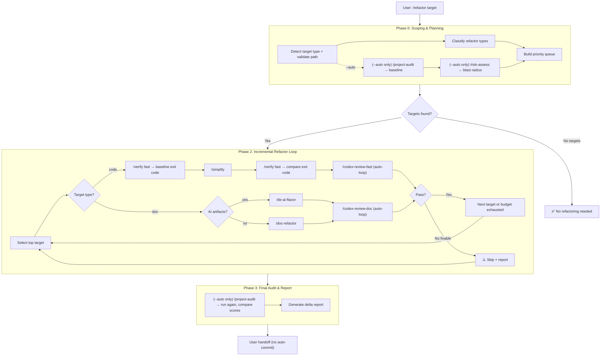
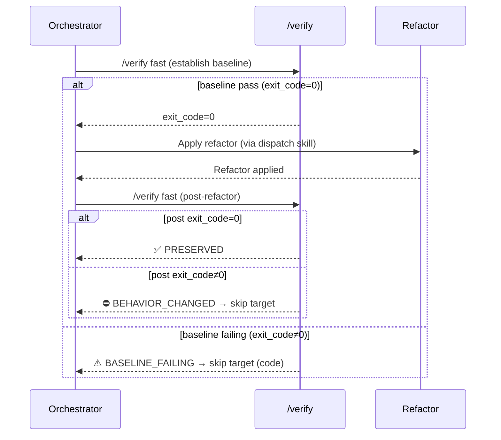

# Universal Refactor — Multi-Target Refactoring Orchestrator

## 1. Requirement Summary

- **Problem**: sd0x-dev-flow 現有 3 個重構 skill（`/simplify`、`/doc-refactor`、`/de-ai-flavor`），各自只處理單一目標類型。使用者面臨：(1) 不知道該用哪個 skill；(2) config/test/script 無重構能力；(3) 無法「端對端」重構一個 feature（code+test+doc+config）；(4) 無自動 smell 偵測。市面上亦無任何工具做到 multi-target 統一重構。
- **Goals**:
  1. 新建 `/refactor` skill — multi-target refactoring orchestrator
  2. 自動偵測目標類型 → 分派到對應 skill/agent
  3. 先分類重構類型再執行（成功率 15.6% → 86.7%）
  4. Behavioral equivalence gate — before/after snapshot 驗證行為保持
  5. Incremental loop — 逐步重構，每步獨立驗證
  6. **Compose, don't replace** — 71% 能力直接復用現有 skill
- **Scope**: v1 — SKILL.md + command + reference files + tests
- **Source**: 2 rounds `/deep-research`（parallel 3-agent: code/impl + web/official + community）

## 2. Existing Code Analysis

### Related Modules

| Invocation | Module | 關聯 | Reuse |
|-----------|--------|------|-------|
| `/simplify` | `commands/simplify.md` + `agents/code-simplifier.md` | Code 重構（dead code, duplication, nesting） | Phase 2 code dispatch |
| `/doc-refactor` | `commands/doc-refactor.md` + `agents/doc-refactor.md` | Doc 結構精簡 | Phase 2 doc dispatch |
| `/de-ai-flavor` | `commands/de-ai-flavor.md` + `skills/de-ai-flavor/SKILL.md` | Doc AI artifact 清理 | Phase 2 doc dispatch |
| `/verify` | `commands/verify.md` | Verification loop (lint → test) | Phase 2 behavioral gate |
| `/codex-review-fast` | `commands/codex-review-fast.md` + `skills/codex-code-review/SKILL.md` | Code review (auto-loop) | Phase 2 review |
| `/codex-review-doc` | `commands/codex-review-doc.md` + `skills/doc-review/SKILL.md` | Doc review (auto-loop) | Phase 2 review |
| `/project-audit` | `commands/project-audit.md` + `skills/project-audit/SKILL.md` | 5-dimension health score | Phase 0 + Phase 3 delta |
| `/risk-assess` | `commands/risk-assess.md` + `skills/risk-assess/SKILL.md` | 3-dimension blast radius (breaking 45%, blast 35%, scope 20%) | Phase 0 input |
| `/smart-commit` | `commands/smart-commit.md` + `skills/smart-commit/SKILL.md` | Commit message generation | Phase 3 output format |
| — | `skills/feature-dev/SKILL.md` | Multi-gate orchestrator pattern | Architecture reference |
| — | `skills/test-deep/SKILL.md` | Fixer catalog pattern (safety tiers) | Catalog design reference |

### Reusable Patterns

| Pattern | Source | How |
|---------|--------|-----|
| Multi-gate workflow | `feature-dev/SKILL.md` | Design → Implement → Test → Precommit gate |
| Fan-out/Gather | `deep-explore/SKILL.md` | Parallel Agent dispatch + background wait |
| Claim registry | `deep-research/references/claim-registry.md` | Normalize → dedup → consensus |
| Completeness score | `deep-research/references/scoring-model.md` | 4-signal weighted model |
| Fixer catalog | `test-deep/SKILL.md` | Safety-tiered action registry |
| Freshness rule | `feature-dev/SKILL.md` | Code change after gate → re-verify |
| Review loop + threadId | `codex-review-fast`, `codex-implement` | `--continue` with saved threadId |

## 3. Technical Solution

### 3.1 Architecture Overview

**v1 scope**: Code + Doc only. Config/Shell/Test dispatch 為 v2（標記為 future）。



**Note**: Phase 1 (parallel exploration) 從 v1 移除。v1 使用 `--target` 明確指定或 `--auto` 簡化 selection。Phase 1 為 v2 候選。

### 3.2 Target Type Detection

Auto-detect file type → map to refactor skill.

**v1 dispatch table** (code + doc only):

| File Pattern | Type | Dispatch Skill | Verification |
|-------------|------|---------------|-------------|
| `*.js`, `*.ts`, `*.py`, `*.go`, `*.rs` | code | `/simplify` | `/verify` (behavioral gate) |
| `*.md` (non-AI) | doc-structure | `/doc-refactor` | `/codex-review-doc` |
| `*.md` (AI artifacts detected) | doc-ai | `/de-ai-flavor` | `/codex-review-doc` |

**v2 dispatch table** (future):

| File Pattern | Type | Dispatch Skill | Verification |
|-------------|------|---------------|-------------|
| `*.json`, `*.yaml`, `*.yml`, `*.toml` | config | Config refactor agent | Schema validation |
| `*.sh`, `*.bash`, `*.zsh` | shell | Shell refactor agent | ShellCheck + test |
| `*.test.js`, `*.spec.ts` | test | Test refactor logic | `/codex-test-review` |

**Path validation**: 同 `/deep-research` — `--target` 必須為 repo-relative path，拒絕 absolute paths、`..` traversal、symlink escape。

AI artifact detection heuristic: scan for patterns from `/de-ai-flavor` detection rules (tool names, boilerplate, self-description). If 3+ matches → `doc-ai`, else → `doc-structure`.

### 3.3 Refactor Catalog

重構類型分類表 — 基於 Fowler 目錄 + 社群驗證，限縮至 AI 成功率高的常規操作：

| ID | Refactor Type | Target | Safety Tier | AI Success Rate |
|----|--------------|--------|-------------|-----------------|
| R01 | Remove dead code | code | safe | Very High |
| R02 | Extract duplicates (3+ repeats) | code | safe | High |
| R03 | Simplify nesting (> 3 levels → early return) | code | safe | High |
| R04 | Rename for clarity | code | side-effect | High |
| R05 | Extract function/method | code | side-effect | Medium |
| R06 | Inline variable | code | safe | High |
| R07 | Simplify conditionals (guard clause) | code | safe | High |
| R08 | Remove AI artifacts | doc | safe | Very High |
| R09 | Condense verbose docs (table/diagram) | doc | safe | High |
| R10 | Deduplicate config blocks | config | side-effect | High |
| R11 | Flatten deep nesting (> 4 levels) | config | side-effect | Medium |
| R12 | Modernize shell idioms | shell | side-effect | Medium |
| R13 | Add error handling (`set -euo pipefail`) | shell | side-effect | High |
| R14 | Extract test fixtures | test | side-effect | Medium |
| R15 | Remove test duplication | test | safe | High |

**Safety Tiers** (from `test-deep` fixer catalog pattern):

| Tier | Definition | Approval |
|------|-----------|----------|
| safe | No behavioral change possible | Auto-apply |
| side-effect | Could affect behavior if wrong | Apply + verify |
| destructive | Structural change, high risk | User confirmation |

**v1 scope**: R01-R09 (code + doc). R10-R15 為 v2。

### 3.4 Behavioral Equivalence Gate (新建)

**設計原則**：v1 使用 `/verify` 的 exit code（0=pass, non-0=fail）作為 gate 判斷依據。不依賴 `/test-deep`（其為 triage/fixer workflow，不適合用作純比較器）。`/test-deep` 僅在 gate 失敗後用於故障調查。



**Gate 判斷邏輯**（基於 `/verify` exit code，而非解析 test count）：

| Pre exit code | Post exit code | Sentinel | Action |
|---------------|---------------|----------|--------|
| 0 (pass) | 0 (pass) | ✅ PRESERVED | Continue to review |
| 0 (pass) | non-0 (fail) | ⛔ BEHAVIOR_CHANGED | Skip target + report |
| non-0 (fail) | 0 (pass) | ✅ PRESERVED (improved) | Continue to review |
| non-0 (fail) | non-0 (fail) | ⚠️ BASELINE_FAILING | Skip target for code；continue for docs |
| All steps skipped | All steps skipped | ⚠️ NO_TESTS | Warn + continue (advisory) |

**`NO_TESTS` 偵測**：`/verify` 使用 `skip-if-missing: true`（見 `commands/verify.md` intent 定義）。當所有 verification steps（lint, test-unit, test-integration, test-e2e）都為 skipped 時（無 package.json scripts 對應），視為 NO_TESTS。具體判斷：`/verify` exit code = 0 但 output 中無任何 `✅` 或 `❌` step result。

**`BASELINE_FAILING` 處理**：
- **Code targets**：baseline 已 failing 表示行為保持無法驗證，skip target 並報告。
- **Doc targets**：不適用 behavioral gate（docs 不跑 `/verify`），直接進入 `/codex-review-doc`。

**失敗調查**：當 gate 為 ⛔ 時，可選用 `/test-deep` 進行 failure triage（但不屬於 gate 本身）。

### 3.5 Incremental Orchestration Loop (新建)

**v1 策略：Skip-and-Report（非 transactional rollback）**

現有 dispatch skill（`/simplify`、`/doc-refactor`、`/de-ai-flavor`）直接編輯 worktree，不提供 per-target transactional rollback。v1 採用「先驗證、失敗則跳過」策略，而非承諾自動回滾。使用者可透過 `git checkout -- <file>` 手動還原。

```
FOR EACH target IN priority_queue:
  IF budget_exhausted() → BREAK

  IF target.type == "code":
    1. pre_exit = run_verify_fast()         ← baseline exit code
       IF pre_exit != 0 →
         log("[REFACTOR_SKIPPED] {target}: baseline failing, cannot verify preservation")
         CONTINUE
    2. apply_refactor(target)               ← /simplify
    3. post_exit = run_verify_fast()        ← post-refactor exit code
    4. behavioral_gate(pre_exit, post_exit)
       IF ⛔ BEHAVIOR_CHANGED →
         log("[REFACTOR_SKIPPED] {target}: behavioral regression")
         CONTINUE
    5. review_gate = codex_review_fast()    ← auto-loop (max 3 rounds)
       IF still ⛔ → log("[REFACTOR_BLOCKED] {target}"); CONTINUE

  ELSE IF target.type == "doc":
    2. apply_refactor(target)               ← /doc-refactor or /de-ai-flavor
    5. review_gate = codex_review_doc()     ← auto-loop (max 3 rounds)
       IF still ⛔ → log("[REFACTOR_BLOCKED] {target}"); CONTINUE

  6. mark_committable(target)
  7. update_budget()
END FOR
```

**Key difference**: Doc targets 不經過 `/verify` behavioral gate（docs 沒有可執行的測試），直接進入 `/codex-review-doc`。

**v2 候選：Git stash-based rollback**（需 `git stash push --keep-index -- <file>` 支援）。

Budget tracking:

| Budget Dimension | Default | Override |
|-----------------|---------|---------|
| Max targets per run | 10 | `--max-targets N` |
| Max rounds per target | 3 | From auto-loop |
| Total max rounds | 30 | `--max-rounds N` |

### 3.6 Target Selection Algorithm (新建)

Priority score = weighted combination of inline metrics + git history:

```
score(target) = 
    0.40 × complexity_signal(target)     # inline: line count + nesting depth
  + 0.35 × change_frequency(target)      # git log --oneline -- <file> | wc -l
  + 0.25 × isolation_signal(target)      # inverse of dependent file count
```

| Signal | Source | Computation |
|--------|--------|------------|
| complexity_signal | Inline: `wc -l <file>` + grep nesting depth | Normalized 0-1 by max in scope |
| change_frequency | `git log --oneline -- <file>` count | Normalized 0-1 by max in scope |
| isolation_signal | `grep -rl "import.*<module>" . --include="*.js"` count | `1 - (count / max_count)`, prefer isolated files |

**Note**: `/risk-assess` 的 `dimensions.blast_radius.score` 和 `dimensions.breaking_surface.score` 可在 `--auto --thorough` 模式下替代 `isolation_signal`，但 v1 使用 inline grep 以避免 heavy script 依賴。

**v1 簡化版**: 若 `--target` 明確指定，跳過 target selection。僅在 `--auto` 模式啟動排序。

### 3.7 Skill Composition Matrix

v1 skill 調用映射（code + doc only）：

| Phase | Step | Skill/Tool | Mode | Condition |
|-------|------|-----------|------|-----------|
| 0 | Target detection + path validation | Inline (Glob + Read) | Foreground | Always |
| 0 | Health baseline | `/project-audit` | Foreground | `--auto` only |
| 0 | Risk analysis | `/risk-assess` | Foreground | `--auto --thorough` only |
| 2 | Code refactor | `/simplify` | Foreground | Target type = code |
| 2 | Doc structure refactor | `/doc-refactor` | Foreground | Target type = doc-structure |
| 2 | Doc AI cleanup | `/de-ai-flavor` | Foreground | Target type = doc-ai |
| 2 | Behavioral verification | `/verify fast` | Foreground | Target type = code |
| 2 | Code review | `/codex-review-fast` (auto-loop) | Foreground | Code changes |
| 2 | Doc review | `/codex-review-doc` (auto-loop) | Foreground | Doc changes |
| 3 | Delta health | `/project-audit` (run again, compare externally) | Foreground | `--auto` only |
| 3 | Commit prep | `/smart-commit` format (suggest only) | Output only | Always |

**v2 新增**：config/shell/test dispatch、`/pre-pr-audit --mode deep` final gate、parallel exploration Phase 1。

## 4. Risks and Dependencies

| Risk | Impact | Mitigation |
|------|--------|-----------|
| Refactor 導入 subtle bug（研究顯示 AI 無驗證時正確率僅 37%，見 Augment Code/Thoughtworks） | High | Behavioral equivalence gate（/verify exit code 比較）mandatory；每步驗證 |
| Context window exhaustion（多 skill 串接消耗大量 token） | Medium | Budget system 限制 max targets；`--target` 模式避免 heavy Phase 0 |
| `/project-audit` 執行時間長，Phase 0 過慢 | Medium | `--auto` 才啟動 Phase 0 heavy analysis；`--target` 直接進入 Phase 2 |
| 無測試的檔案無法驗證 behavioral equivalence | Medium | v1: advisory mode (`⚠️ NO_TESTS`)；v2: characterization testing |
| Existing skill 版本更新導致 composition 斷裂 | Low | Sentinel-based 整合（只依賴 ✅/⛔ sentinels + exit codes） |
| Dispatch skill 無 per-target rollback | Medium | v1: skip-and-report（使用者手動 `git checkout`）；v2: git stash-based rollback |
| 髒 worktree 影響 behavioral gate baseline | Medium | Phase 2 開始前檢查 `git status`；若有未追蹤變更，warn user |

## 5. Work Breakdown

### v1: Code + Doc Refactoring (Compose-only)

| # | Task | Est. | Dependency | 新建 vs 復用 |
|---|------|------|-----------|-------------|
| 1 | 建立 `skills/refactor/SKILL.md` — orchestrator 主流程（Phase 0 + 2 + 3） | M | — | 新建 |
| 2 | 建立 `commands/refactor.md` — command dispatcher | S | #1 | 新建 |
| 3 | 建立 `skills/refactor/references/refactor-catalog.md` — v1 重構類型分類 (R01-R09) | S | — | 新建 |
| 4 | 建立 `skills/refactor/references/target-detection.md` — 檔案類型偵測 + path validation | S | — | 新建 |
| 5 | 建立 `skills/refactor/references/behavioral-gate.md` — /verify exit code 比較 protocol | S | — | 新建 |
| 6 | 建立 `skills/refactor/references/output-template.md` — 報告格式 | S | — | 新建 |
| 7 | SKILL.md: target selection (inline, `--auto` mode) | S | #3, #4 | 新建 |
| 8 | SKILL.md: incremental loop + skip-and-report | M | #5 | 新建（pattern from feature-dev） |
| 9 | SKILL.md: `/simplify` dispatch + behavioral gate integration | M | #5, #8 | 復用 + glue |
| 10 | SKILL.md: `/doc-refactor` + `/de-ai-flavor` dispatch | S | #8 | 復用 + glue |
| 11 | SKILL.md: `/codex-review-fast` + `/codex-review-doc` auto-loop | S | #9 | 復用 |
| 12 | SKILL.md: delta reporting (compare two `/project-audit` runs) | S | #8 | 復用 |
| 13 | 測試：`test/commands/refactor.test.js` | M | #1-#12 | 新建 |

**Size**: S = small (< 50 lines), M = medium (50-150 lines)

### v2: Expanded Target Types + Advanced Features (Future)

| # | Task | Dependency |
|---|------|-----------|
| v2.1 | Config refactor agent (JSON/YAML dedup, nesting) | v1 complete |
| v2.2 | Shell refactor agent (ShellCheck + modernize) | v1 complete |
| v2.3 | Test refactor logic (fixture extract, dedup) | v1 complete |
| v2.4 | Characterization testing for untested code | v1 complete |
| v2.5 | Cross-file dependency graph + parallel exploration (Phase 1) | v1 complete |
| v2.6 | `/pre-pr-audit --mode deep` final gate | v1 complete |
| v2.7 | Git stash-based per-target rollback | v1 complete |

## 6. Testing Strategy

### Test Mapping

v1 logic 全部在 SKILL.md + references/ 中（純 Markdown orchestration，無 JS script）。測試為 command contract tests，驗證 dispatch 行為和 gate 邏輯。

| Source | Test File | Type |
|--------|----------|------|
| `commands/refactor.md` + `skills/refactor/SKILL.md` | `test/commands/refactor.test.js` | Contract |

**Note**: 若 v2 將 target selection 或 behavioral gate 抽為 `skills/refactor/scripts/*.js`，則對應增加 `test/scripts/refactor-*.test.js`。

### Test Cases (Contract/Content Assertions)

v1 為純 Markdown orchestration，測試驗證 command/skill 的結構、dispatch 規則、和 gate 定義的正確性（contract tests），而非 runtime 行為。

| Category | Test Case | Assertion Type |
|----------|----------|---------------|
| Target detection | .js → code, .md → doc 正確分類（classification table in references） | Content assertion |
| Target detection | .yaml/.json 分類為 config 但 v1 dispatch 跳過（v2 only） | Content assertion |
| Target detection | AI artifact heuristic 定義：3+ matches → doc-ai | Content assertion |
| Catalog | R01-R09 每種類型在 refactor-catalog.md 中有定義 | Content assertion |
| Catalog | Safety tier: safe/side-effect/destructive 定義完整 | Content assertion |
| Behavioral gate | Gate table 定義 PRESERVED/BEHAVIOR_CHANGED/BASELINE_FAILING/NO_TESTS | Content assertion |
| Behavioral gate | Code target + BASELINE_FAILING → skip（非 continue） | Content assertion |
| Behavioral gate | NO_TESTS 偵測條件明確定義（all verify steps skipped） | Content assertion |
| Skill dispatch | SKILL.md 中 code target → `/simplify` dispatch 存在 | Content assertion |
| Skill dispatch | SKILL.md 中 doc target → `/doc-refactor` 或 `/de-ai-flavor` dispatch 存在 | Content assertion |
| Skill dispatch | Doc target 不經過 `/verify`，直接到 `/codex-review-doc` | Content assertion |
| Loop | Skip-and-report log format `[REFACTOR_SKIPPED]` 定義 | Content assertion |
| Loop | Budget defaults 定義（max-targets=10, max-rounds=30） | Content assertion |
| Path validation | `--target` 拒絕 absolute path 和 `..` traversal | Content assertion |

### Coverage Requirements

| Type | Required |
|------|---------|
| Happy path | ✅ Each v1 refactor type has dispatch mapping |
| Error handling | ✅ Skip-and-report on gate failure |
| Edge cases | ✅ Empty target list, no tests, budget = 0 |
| Boundary | ✅ Max targets reached, max rounds reached |
| v1/v2 boundary | ✅ Config/shell/test classified but not dispatched in v1 |

## 7. Open Questions

| # | Question | Impact | Decision Needed By |
|---|---------|--------|-------------------|
| Q1 | Command name: `/refactor` vs `/universal-refactor` vs `/cleanup`？ | UX | v1 implementation |
| Q2 | Phase 0 要不要預設跑 `/best-practices`？（成本高但資訊價值高） | Performance vs quality | v1 implementation |
| Q3 | `--dry-run` 模式是否需要（僅分析不修改）？ | UX | v1 implementation |
| Q4 | Config/Shell refactor 是否需要獨立 agent 定義？還是 inline 在 SKILL.md？ | Architecture | v2 design |
| Q5 | Delta report 要用 project-audit（重，但全面）還是簡單的 line count / complexity 比較？ | Performance | v1 implementation |

## Appendix: Research Sources

本 spec 基於兩輪 `/deep-research` 產出：

| Round | Focus | Key Findings |
|-------|-------|-------------|
| 1 | 通用重構模式、現有能力、業界實踐 | 71% 復用、multi-target 為市場空白、classify-first 5.5x 成功率 |
| 2 | Skill 疊加策略 | 完整 composition matrix、4 個必須新建能力、orchestrator 架構 |

Key references (with traceable citations for quantitative claims):

| Claim | Source | URL |
|-------|--------|-----|
| 68 refactoring transforms | Fowler, Refactoring Catalog | <https://refactoring.com/catalog/> |
| AI simple/localized = high success, complex = fail | ICSE 2025 IDE Workshop paper | <https://seal-queensu.github.io/publications/pdf/IDE-Jonathan-2025.pdf> |
| Routine maintenance 86.9% merge rate (15K+ ops) | LinearB blog analysis | <https://linearb.io/blog/ai-coding-agents-code-refactoring> |
| Specify refactor type → 15.6% → 86.7% success | ScienceDirect SLR (2025) | <https://www.sciencedirect.com/science/article/abs/pii/S0164121225004315> |
| AI correct only 37% without risk assessment | Augment Code (citing Thoughtworks) | <https://www.augmentcode.com/tools/ai-code-refactoring-tools-tactics-and-best-practices> |
| 65% context loss, 8x duplication | GitClear via Medium; SoftwareSeni | <https://www.softwareseni.com/understanding-anti-patterns-and-quality-degradation-in-ai-generated-code/> |
| Iterative agent loop (160+ files) | Atlassian Rovo Dev blog | <https://www.atlassian.com/blog/developer/rovo-dev-for-large-scale-test-refactoring> |
| Hotspot heuristic (change freq × complexity) | CodeScene Behavioral Analysis | <https://codescene.com/product/behavioral-code-analysis> |

**「71% 復用」**為本專案 deep-research 結果的推估值（35 directly reusable skills / 49 total needed capabilities），非外部引用。
