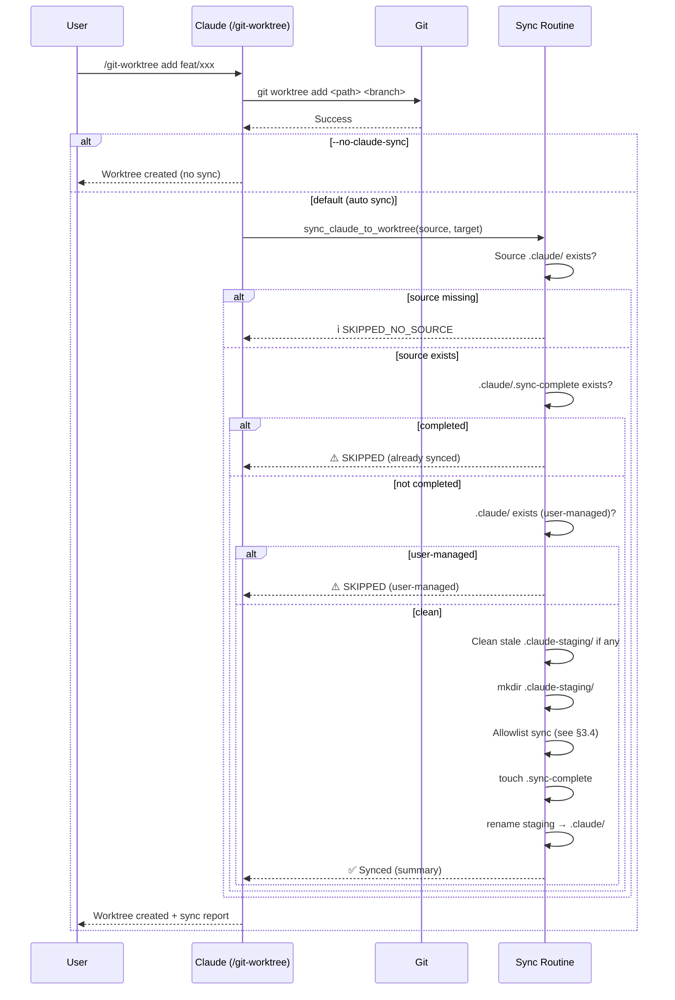
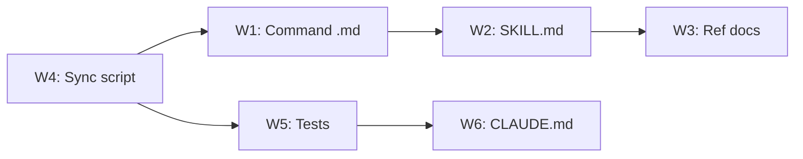

# Worktree `.claude/` Sync — Technical Spec

## 1. Requirement Summary

### Problem

使用者將 `.claude/` 加入 `.gitignore`（保持本地設定不進版控），建立 git worktree 後 `.claude/` 完全缺失。Claude Code 在 worktree 中無法載入 hooks、rules、skills、CLAUDE.md 或 settings，功能嚴重殘缺。

現有文件（SKILL.md:117、commands.md:75）錯誤宣稱「`.claude/` shared via git」。

### Goals

| # | Goal | 成功指標 |
|---|------|---------|
| G1 | `/git-worktree add` 後 worktree 有完整 `.claude/` | Claude Code 可正常載入所有 hooks/rules/skills |
| G2 | 預設自動同步，不需額外手動操作 | Zero manual steps for default case |
| G3 | 安全不破壞現有設定 | 已存在 `.claude/` 不被覆蓋 |
| G4 | 支援 opt-out | `--no-claude-sync` 可跳過 |

### Scope

| In Scope | Out of Scope (v2+) |
|----------|-------------------|
| Allowlist sync on `git worktree add` | Marker-based idempotent update-in-place merge（`.sync-complete` 僅作完成標記，非 merge 機制） |
| Symlink + Copy hybrid strategy | `--share-settings-local` flag |
| Conflict detection (existence check) | Windows symlink junction fallback |
| Opt-out flag | Auto `npm install` post-create |
| Doc fix (SKILL.md, commands.md) | Cross-worktree settings sync daemon |

## 2. Existing Code Analysis

### Related Modules

| Module | Path | Relevance |
|--------|------|-----------|
| git-worktree skill | `skills/git-worktree/SKILL.md` | 主要修改目標 |
| git-worktree command | `commands/git-worktree.md` | 行為層修改 |
| git-worktree ref | `skills/git-worktree/references/commands.md` | 文件修正 |
| install-hooks | `commands/install-hooks.md` | 參考 `.claude/` setup 模式 |
| install-rules | `commands/install-rules.md` | 參考 manifest 結構 |
| install-state | `.claude/.sd0x-install-state.json` | 可能需讀取 |

### `.claude/` 目錄結構（現狀）

```
.claude/
├── agents    → ../agents      (symlink, relative)
├── commands  → ../commands    (symlink, relative)
├── hooks     → ../hooks       (symlink, relative)
├── rules     → ../rules       (symlink, relative)
├── scripts   → ../scripts     (symlink, relative)
├── skills    → ../skills      (symlink, relative)
├── CLAUDE.md                  (local file, ~8KB)
├── .gitignore                 (local file, 7 lines)
├── .sd0x-install-state.json   (mutable state, ~1KB)
├── settings.local.json        (user settings, contains absolute paths)
├── cache/                     (runtime cache)
└── .git/                      (internal git metadata)
```

**關鍵特性**：6 個 symlink 使用**相對路徑**（`../agents`），在 worktree 中會自動解析到 worktree 自己的 tracked 目錄。

### Reusable Patterns

- `/install-hooks` Phase 4a 的 conflict detection（exists → skip, identical → skip, differs → warn）
- `/install-rules` Phase 4.5 的 manifest update pattern
- `git-profile` 的 worktree detection（`git rev-parse --git-common-dir` vs `--git-dir`）

## 3. Technical Solution

### 3.1 Architecture Design



### 3.2 Data Model

無新增 data model。同步使用 filesystem 操作（symlink + copy），不引入新的 state file。使用 `.sync-complete` 作為完成標記（防重複同步），但不做 marker-based update-in-place merge。

### 3.3 Command Interface

修改 `/git-worktree add` sub-command，新增 flag：

| Flag | Default | Description |
|------|---------|-------------|
| `--no-claude-sync` | `false` | 跳過 `.claude/` 同步 |

#### Permission Model

| Layer | `allowed-tools` | Rationale |
|-------|----------------|-----------|
| `commands/git-worktree.md` | `Bash(git:*), Bash(bash:*), Read, Grep, Glob` | 需要 `bash` 來執行 sync 腳本 |
| `scripts/worktree-claude-sync.sh` | N/A（由 command 透過 `Bash(bash:*)` 呼叫） | 腳本本身不是 command，不需 `allowed-tools` |

> **Note**：現有 `commands/git-worktree.md` 的 `allowed-tools: Bash(git:*), Read, Grep, Glob` 需新增 `Bash(bash:*)` 以支援呼叫 sync 腳本。

#### Sync Failure Semantics

| 情境 | 行為 | 對 `/git-worktree add` 的影響 |
|------|------|------------------------------|
| Sync 成功 | 輸出 sync report | `git worktree add` 視為成功 |
| Sync 失敗（部分完成） | Staging 目錄保留，輸出 warn | `git worktree add` 仍成功（worktree 可用，`.claude/` 缺失需重試） |
| Source `.claude/` 不存在 | 輸出 info 提示使用 `/project-setup` | `git worktree add` 仍成功 |
| `--no-claude-sync` | 不執行 sync | `git worktree add` 正常 |

**設計原則**：Sync 失敗不應阻擋 worktree 建立。Worktree 本身是 git 操作的產物，`.claude/` sync 是附加功能。

**整合約束**：`commands/git-worktree.md` 呼叫 sync 腳本時，應記錄 warning 並繼續（`bash scripts/worktree-claude-sync.sh <path>` 的非零 exit code 不阻擋工作流程，command 層需處理 stderr 輸出並向使用者報告）。

**不新增的 flag**（v2 考量）：

| Flag | 理由 |
|------|------|
| `--share-settings-local` | v1 用預設 copy；手動 symlink 已在文件說明 |
| `--claude-sync=auto\|off` | 簡化為 boolean `--no-claude-sync` |

### 3.4 Core Logic — Allowlist Sync

#### Sync Allowlist Definition

```
SYNC_ENTRIES = {
  # Relative symlinks — recreate in target
  symlink_dirs: [
    "agents",
    "commands",
    "hooks",
    "rules",
    "scripts",
    "skills"
  ],

  # Special symlink — point to worktree-local tracked file
  symlink_special: {
    "CLAUDE.md": "../CLAUDE.md"
  },

  # Copy files — isolated per worktree
  copy_files: [
    ".gitignore",
    ".sd0x-install-state.json",
    "settings.local.json"
  ],

  # Explicit skip — never sync
  skip: [
    "cache/",
    ".git/",
    ".claude_review_state.json",
    "*.tmp",
    "*.zip"
  ]
}
```

#### Sync Algorithm

```
EXPECTED_TARGETS = {
  "agents":   "../agents",
  "commands": "../commands",
  "hooks":    "../hooks",
  "rules":    "../rules",
  "scripts":  "../scripts",
  "skills":   "../skills"
}

function sync_claude_to_worktree(main_claude_dir, target_worktree_root):
  target_claude = target_worktree_root + "/.claude"
  staging_dir   = target_worktree_root + "/.claude-staging"

  # Guard: source .claude/ must exist
  if not exists(main_claude_dir):
    info("ℹ️ Source .claude/ not found. Run /project-setup to initialize.")
    return SKIPPED_NO_SOURCE  # no staging, no marker — retryable

  # Guard: completed sync exists → skip
  if exists(target_claude + "/.sync-complete"):
    warn("⚠️ .claude/ already synced in worktree, skipping")
    return SKIPPED

  # Guard: user-managed .claude/ exists → skip (and clean stale staging if any)
  if exists(target_claude):
    if exists(staging_dir):
      rmdir(staging_dir)  # clean stale staging, but preserve user .claude/
    warn("⚠️ .claude/ exists (user-managed), skipping sync")
    return SKIPPED

  # Partial failure recovery: clean stale staging only (target_claude absent)
  if exists(staging_dir):
    warn("⚠️ Previous sync incomplete, cleaning staging and retrying...")
    rmdir(staging_dir)  # only remove staging

  mkdir(staging_dir)
  results = []

  # 1. Symlink directories (exact target validation)
  for dir in SYNC_ENTRIES.symlink_dirs:
    source_link = main_claude_dir + "/" + dir
    if is_symlink(source_link):
      actual_target = readlink(source_link)  # e.g. "../agents"
      expected = EXPECTED_TARGETS[dir]       # e.g. "../agents"

      # Security: exact match + realpath boundary check (segment-safe)
      if actual_target == expected:
        resolved = realpath(staging_dir + "/" + actual_target)
        root_canonical = realpath(target_worktree_root)
        if resolved == root_canonical or starts_with(resolved, root_canonical + "/"):
          symlink(actual_target, staging_dir + "/" + dir)
          results.push({dir, "symlink", "✅"})
        else:
          warn("⚠️ Symlink escapes worktree boundary: " + dir)
          results.push({dir, "skip", "⚠️ boundary escape"})
      else:
        # Non-canonical: skip with warning + remediation commands
        warn("⚠️ Non-canonical link: " + dir + " → " + actual_target)
        warn("   Fix: ln -s " + expected + " " + target_claude + "/" + dir)
        warn("   Or:  cp -R " + source_link + " " + target_claude + "/" + dir)
        results.push({dir, "skip", "⚠️ non-canonical"})
    elif is_directory(source_link):
      warn("⚠️ Expected symlink but found directory: " + dir)
      results.push({dir, "skip", "⚠️ expected symlink"})
    else:
      results.push({dir, "skip", "not found"})

  # 2. Special symlinks
  for name, target in SYNC_ENTRIES.symlink_special:
    # Verify target exists in worktree (explicit path join)
    resolved = target_worktree_root + "/" + basename(target)  # e.g. "CLAUDE.md"
    if exists(resolved):
      symlink(target, staging_dir + "/" + name)
      results.push({name, "symlink", "✅"})
    else:
      # Fallback: copy from source
      if exists(main_claude_dir + "/" + name):
        copy(main_claude_dir + "/" + name, staging_dir + "/" + name)
        results.push({name, "copy (fallback)", "✅"})
      else:
        results.push({name, "skip", "not found"})

  # 3. Copy files
  for file in SYNC_ENTRIES.copy_files:
    source = main_claude_dir + "/" + file
    if exists(source):
      copy(source, staging_dir + "/" + file)
      results.push({file, "copy", "✅"})
    else:
      results.push({file, "skip", "not found"})

  # 4. Atomic commit: staging → final
  touch(staging_dir + "/.sync-complete")
  rename(staging_dir, target_claude)

  return results
```

**Partial Failure Recovery**：使用 staging 目錄 + `.sync-complete` marker + atomic `rename`。

| 狀態 | 偵測條件 | 行為 |
|------|---------|------|
| Source 缺失 | `main_claude_dir` 不存在 | SKIPPED_NO_SOURCE（不建任何檔案） |
| 從未 sync | 無 `.claude/` 且無 staging | 正常 sync |
| Sync 完成 | `.claude/.sync-complete` 存在 | Skip |
| Sync 中斷 | `.claude-staging/` 存在，無 `.claude/` | 清理 staging → 重新 sync |
| Staging + user `.claude/` | 兩者同時存在 | 清理 staging → skip（保護 user `.claude/`） |
| 使用者手動建立 | `.claude/` 存在，無 staging | Skip（不 clobber） |

#### CLAUDE.md Symlink 策略（核心設計決策）

```
                Main Worktree                    Linked Worktree
                ─────────────                    ───────────────
                repo/                            ../wt-repo-hotfix/
                ├── CLAUDE.md  (tracked)         ├── CLAUDE.md  (tracked, same)
                ├── .claude/                     ├── .claude/
                │   └── CLAUDE.md (local)        │   └── CLAUDE.md → ../CLAUDE.md
                ├── agents/  (tracked)           ├── agents/  (tracked, same)
                └── ...                          └── ...
```

Worktree 的 `.claude/CLAUDE.md` symlink 到 **worktree 自己的** `../CLAUDE.md`（tracked root file），而非主 worktree 的檔案。

**理由**（來自 Phase 3 辯論結論）：
1. Root `CLAUDE.md` 是 git tracked → worktree 建立時自動存在
2. 避免跨 worktree lifecycle dependency（主 worktree 被移動/刪除不影響）
3. 內容與 `.claude/CLAUDE.md` 相同（經 `cmp` 驗證）

#### `settings.local.json` Copy 策略

**Copy 而非 Symlink 的理由**：
- 檔案包含絕對路徑的權限設定（如 `git -C /Users/.../sd0x-dev-flow ...`）
- Symlink 共享會讓不同 worktree 的操作互相干擾
- 使用者可能需要 per-worktree 的不同權限設定

**Post-sync 提示**（輸出中包含）：

```
💡 settings.local.json 已複製（隔離模式）。
   如需共享設定：ln -sf <main>/.claude/settings.local.json <worktree>/.claude/settings.local.json
```

#### Non-Canonical Entry Handling

對於不符合預期格式的 `.claude/` 條目（絕對 symlink、真實目錄、broken link）：

| 情境 | 行為 |
|------|------|
| Absolute symlink | Skip + warn + 建議 `ln -s` / `cp` 指令 |
| Real directory (not symlink) | Skip + warn |
| Broken symlink | Skip + warn |
| Extra unknown files | Ignore（不在 allowlist 中） |

### 3.5 Sync Output Format

```markdown
## .claude/ Sync Report

| Entry | Strategy | Status |
|-------|----------|--------|
| agents → ../agents | symlink | ✅ |
| commands → ../commands | symlink | ✅ |
| hooks → ../hooks | symlink | ✅ |
| rules → ../rules | symlink | ✅ |
| scripts → ../scripts | symlink | ✅ |
| skills → ../skills | symlink | ✅ |
| CLAUDE.md → ../CLAUDE.md | symlink | ✅ |
| .gitignore | copy | ✅ |
| .sd0x-install-state.json | copy | ✅ |
| settings.local.json | copy | ✅ |

**Synced**: 10 / **Skipped**: 0 / **Warnings**: 0

💡 settings.local.json copied (isolated). To share: `ln -sf ...`
```

## 4. Risks and Dependencies

| # | Risk | Impact | Probability | Mitigation |
|---|------|--------|------------|-----------|
| R1 | 使用者 `.claude/` 結構與預期不同（非 plugin 安裝） | Sync 失敗或產生錯誤結構 | Medium | Non-canonical entry handling + skip-with-warning |
| R2 | `settings.local.json` 含 main worktree 專屬路徑 | Worktree 中權限不正確 | High | Copy（隔離）+ 文件提示使用者檢查 |
| R3 | Root `CLAUDE.md` 不存在（使用者刪除或非標準專案） | Symlink 斷裂 | Low | Fallback: copy from source `.claude/CLAUDE.md` |
| R4 | `.claude/` 已存在（使用者手動建立） | 自動同步覆蓋使用者設定 | Medium | Existence check → skip + warn |
| R5 | Git worktree add 失敗後 sync 仍執行 | 在無效目錄建立 `.claude/` | Low | 先驗證 `git worktree add` exit code |

### Dependencies

| Dependency | Type | Status |
|------------|------|--------|
| `git worktree add` 成功 | Hard | Git built-in |
| `.claude/` 存在於主 worktree | Hard | `/project-setup` 或 `/install-*` 已建立 |
| Root `CLAUDE.md` tracked | Soft | Fallback to copy |

## 5. Work Breakdown

| # | Task | Files | Effort | Status |
|---|------|-------|--------|--------|
| W1 | 修改 `commands/git-worktree.md` — 在 `add` sub-command中加入 sync 邏輯 | `commands/git-worktree.md` | S | Done |
| W2 | 修改 `skills/git-worktree/SKILL.md` — 新增 Sync 章節 + 修正錯誤文件 | `skills/git-worktree/SKILL.md` | S | Done |
| W3 | 修改 `skills/git-worktree/references/commands.md` — 修正 `.claude sharing` 描述 | `skills/git-worktree/references/commands.md` | XS | Done |
| W4 | 撰寫 sync 腳本 `scripts/worktree-claude-sync.sh` | `scripts/worktree-claude-sync.sh` | M | Done |
| W5 | 撰寫 unit tests | `test/scripts/worktree-claude-sync.test.js` | M | Done (18 tests) |
| W6 | 更新 `CLAUDE.md` command reference（如需要） | `CLAUDE.md`, `.claude/CLAUDE.md` | XS | Done |

### Execution Order



**建議順序**: W4 → W5 → W1 → W2 → W3 → W6

## 6. Testing Strategy

### Unit Tests (`test/scripts/worktree-claude-sync.test.js`)

| # | Test Case | Type | Description |
|---|-----------|------|-------------|
| T1 | Happy path: full sync with symlinks and copies | Happy | 模擬完整 `.claude/` 結構，驗證 6 symlinks + copies + marker |
| T2 | Idempotent — already synced skips | Happy | `.sync-complete` 存在 → skip + SKIPPED |
| T3 | User-managed `.claude/` exists — skip | Edge | 目標已有 `.claude/` → 應 skip 不覆蓋 |
| T4 | Source `.claude/` missing — SKIPPED_NO_SOURCE | Edge | Source 不存在 → SKIPPED_NO_SOURCE |
| T5 | `--dry-run` does not create any files | Happy | 預覽模式不建立任何檔案 |
| T6 | Non-canonical symlink target — skip with warning | Edge | Source 含非預期 symlink target → skip + warn |
| T7 | Symlink boundary escape — skip with warning | Security | Source symlink 解析到 worktree 外部 → skip + warn |
| T8 | Stale staging cleaned and retry succeeds | Edge | Staging 目錄殘留 → 清理並重新 sync |
| T9 | CLAUDE.md symlinks to `../CLAUDE.md` | Happy | 驗證 CLAUDE.md symlink target 正確 |
| T10 | `.gitignore` is copied not symlinked | Happy | 驗證 copy 策略（非 symlink） |
| T11 | `settings.local.json` is copied and isolated | Happy | 修改 copy 後不影響 source |
| T12 | `.sd0x-install-state.json` is copied | Happy | 驗證 mutable state 被 copy |
| T13 | Staging directory is atomically renamed to `.claude` | Happy | 驗證 atomic rename 機制 |
| T14 | Invalid worktree path — error exit 1 | Error | 無效路徑 → exit code 1 |
| T15 | Staging + user `.claude/` coexist | Security | staging 殘留且 .claude/ 存在 → 只清 staging，不動 .claude/ |
| T16 | `--help` exits 0 and shows usage | CLI | CLI help 正常 |
| T17 | No arguments exits 2 | CLI | 缺少必要參數 → exit code 2 |
| T18 | CLAUDE.md fallback — copy from source | Edge | Root `CLAUDE.md` 不存在 → fallback copy from source |

### Integration Test Considerations

| Scenario | Validation |
|----------|-----------|
| `/git-worktree add` + Claude Code 載入 | 驗證 hooks/rules/skills 正常載入 |
| `/git-worktree remove` | 驗證 `.claude/` 隨 worktree 刪除 |
| 重複 sync 嘗試 | 驗證 existence guard 阻擋二次 sync |

## 7. Open Questions

| # | Question | Impact | Proposed Resolution |
|---|----------|--------|-------------------|
| Q1 | 是否需要 `scripts/worktree-claude-sync.sh` 獨立腳本，還是直接在 `commands/git-worktree.md` 的行為層描述即可？ | Implementation approach | **建議腳本**：可測試、可複用、可被其他工具呼叫 |
| ~~Q2~~ | ~~腳本的 `allowed-tools` 需要什麼？~~ | ~~Permission model~~ | **已定版** — 見 §3.3 Command Interface |
| Q3 | 是否需要支援 Claude Code 內建的 `EnterWorktree` tool？ | Scope | **v2**：目前 codebase 無使用 `EnterWorktree`，不在 v1 scope |
| Q4 | `settings.local.json` 複製後是否需要自動修正絕對路徑？ | UX | **不建議**：路徑修正邏輯複雜且易錯，改為文件提示使用者手動檢查 |

---

## Appendix A: Best Practices Audit Reference

本 spec 基於 `/best-practices` 審計（2026-03-11）的 Nash Equilibrium 方案設計。

**Debate threadId**: `019cdc74-a69e-76a3-a21c-8d4d4fc20a13`

| Phase | 結論 |
|-------|------|
| Phase 1 Industry Research | Git 官方無 non-tracked file sharing 機制；業界用 symlink / copy / setup script |
| Phase 2 Codebase Analysis | `.claude/` 被 gitignore，文件錯誤宣稱 shared；相對 symlink 結構天然適合 worktree |
| Phase 3 Adversarial Debate | 3 輪辯論收斂：allowlist sync + CLAUDE.md symlink to local tracked + copy settings |

## Appendix B: File-Level Strategy Summary

| Entry | Strategy | Target | Rationale |
|-------|----------|--------|-----------|
| `agents` | `ln -s ../agents` | Worktree tracked dir | 相對路徑自動解析 |
| `commands` | `ln -s ../commands` | Worktree tracked dir | 同上 |
| `hooks` | `ln -s ../hooks` | Worktree tracked dir | 同上 |
| `rules` | `ln -s ../rules` | Worktree tracked dir | 同上 |
| `scripts` | `ln -s ../scripts` | Worktree tracked dir | 同上 |
| `skills` | `ln -s ../skills` | Worktree tracked dir | 同上 |
| `CLAUDE.md` | `ln -s ../CLAUDE.md` | Worktree tracked root file | 避免 drift + 避免跨 worktree dependency |
| `.gitignore` | `cp` | Isolated copy | 靜態檔案 |
| `.sd0x-install-state.json` | `cp` | Isolated copy | Mutable state 不應跨 worktree 共享。首次複製後作為 worktree 的獨立基線；若 worktree 的 branch 有不同的 plugin 版本，使用者可重新執行 `/install-rules --all` 來對齊。 |
| `settings.local.json` | `cp` | Isolated copy | 含絕對路徑，跨 worktree 共享會干擾 |
| `cache/` | skip | — | Per-worktree，自動建立 |
| `.git/` | skip | — | Internal metadata |
| `.claude_review_state.json` | skip | — | Session-specific，hooks 初始化 |

## Appendix C: Implementation Notes

| Item | Spec | Actual | Reason |
|------|------|--------|--------|
| Path resolution | `realpath -m` | `cd + pwd -P` | macOS 無 `realpath -m`；`pwd -P` 回傳 physical path |
| Test count | 15 cases (T1–T15, initial spec) | 18 cases (T1–T18, added CLI + fallback edge cases) | 增加 `--help`、`no-args`、`CLAUDE.md fallback` |
| Boundary check | `realpath` + prefix check | `pwd -P` + segment-safe prefix check | 同上（macOS 相容性） |
