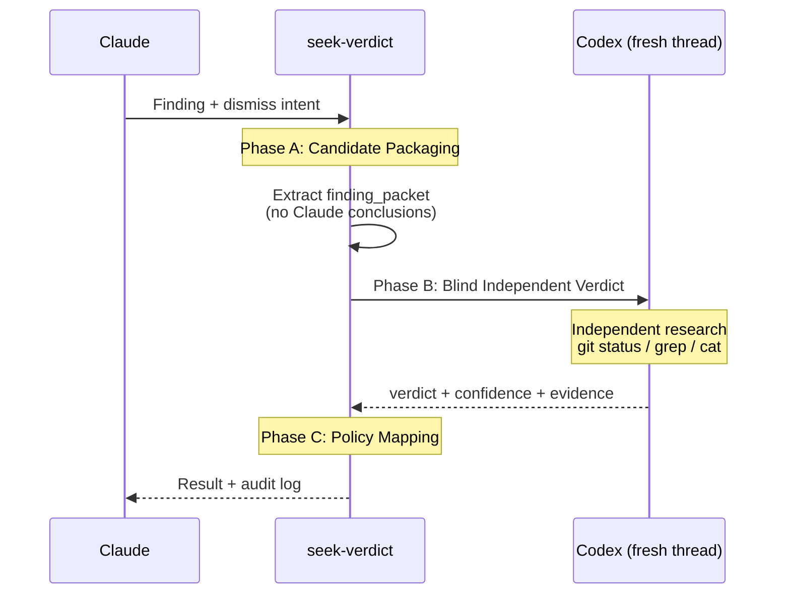

# seek-verdict: Blind Verification for P2 Dismiss

## When NOT to Use

- General code review (use `/codex-review-fast`)
- P0/P1 findings (must fix per `fix-all-issues.md`)
- Nit findings (use `[NIT_DEFERRED]`)
- Architecture debates (use `/codex-brainstorm`)

## Scope

| Severity | Allowed | Mechanism |
|----------|---------|-----------|
| P0/P1 | No — must fix | `fix-all-issues.md` |
| P2 | Yes | This skill |
| Nit | No — use existing | `[NIT_DEFERRED]` |

## 3-Phase Protocol



### Phase A: Candidate Packaging

Extract finding artifact from review output:

| Field | Source |
|-------|--------|
| `finding_key` | `file + canonical_issue_text` |
| `severity` | P2 |
| `original_finding_text` | Codex review original (secrets redacted) |
| `origin_thread_id` | Review session threadId |
| `current_head_sha` | `git rev-parse HEAD` |
| `relevant_diff` | `git diff HEAD -- <file>` |

**Critical**: Record Claude's dismiss hypothesis locally. **Never send it to Codex.**

### Phase B: Blind Independent Verdict

Use the prompt template in [Verdict Prompt](references/verdict-prompt.md).

| Requirement | Detail |
|-------------|--------|
| Thread | **Fresh** `mcp__codex__codex` (never reuse review thread) |
| Sandbox | `read-only` |
| Approval policy | `never` |
| Anti-anchoring | No Claude conclusions in prompt |

### Phase C: Policy Mapping

Apply thresholds from [Policy Mapping](references/policy-mapping.md).

| Result | Condition | Next Action |
|--------|-----------|-------------|
| `DISMISS_VERIFIED` | NON_ACTIONABLE + confidence >= 0.80 + evidence >= 2 | Log `[DISMISS_VERDICT]`, continue |
| `FIX_REQUIRED` | ACTIONABLE + confidence >= 0.70 | Return to fix loop |
| `NEED_HUMAN` | UNCERTAIN or low confidence | Stop, escalate |

Output `[DISMISS_VERDICT]` audit trail (format in `references/policy-mapping.md`).

## Rebuttal

If Codex returns `FIX_REQUIRED` and Claude has objective counter-evidence:

- **1 round max** via `mcp__codex__codex-reply` (same verdict thread)
- Only objective artifacts (tests, specs, language semantics)
- After rebuttal: still FIX_REQUIRED -> fix; ambiguous -> `NEED_HUMAN`

## Anti-Abuse Guard

See [Policy Mapping](references/policy-mapping.md) for thresholds and session scope.

- 3 consecutive `DISMISS_VERIFIED` -> `[DISMISS_PATTERN_WARN]` + heightened thresholds
- Session end or branch switch resets counter

## Output

```
[DISMISS_VERDICT] key=<file|canonical_issue> | severity=P2 | verdict=<DISMISS_VERIFIED|FIX_REQUIRED|NEED_HUMAN> | confidence=<0..1> | codex_thread=<id> | evidence=<brief> | timestamp=<ISO8601>
```

## Verification

- [ ] Finding is P2 severity (P0/P1/Nit rejected)
- [ ] Codex prompt contains no Claude conclusions (anti-anchoring)
- [ ] Fresh Codex thread used (not review session thread)
- [ ] `[DISMISS_VERDICT]` audit trail output with all required fields
- [ ] Anti-abuse streak tracked (warning at 3 consecutive dismissals)

## References

| File | Purpose |
|------|---------|
| [Verdict Prompt](references/verdict-prompt.md) | Codex blind verification prompt template |
| [Policy Mapping](references/policy-mapping.md) | Confidence thresholds, audit format, anti-abuse |
