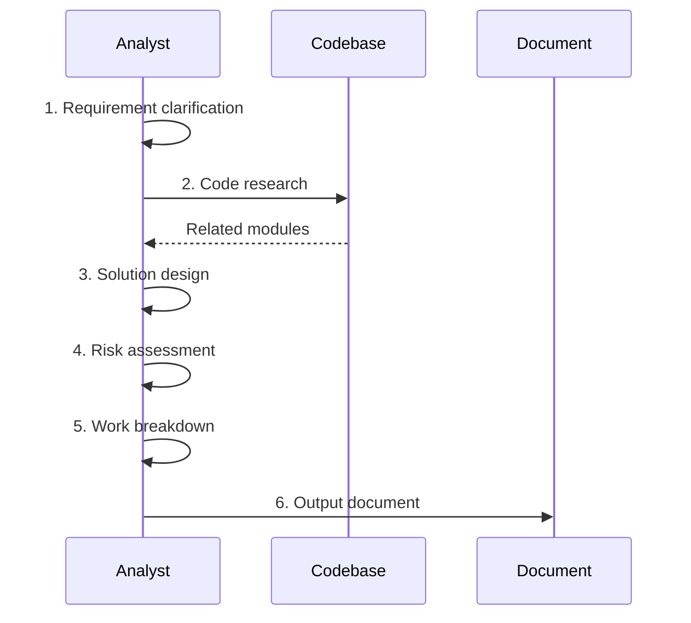

# Tech Spec Skill

## Trigger

- Keywords: tech spec, technical specification, spec review, review spec, feature design

## When NOT to Use

- Creating request documents (use /create-request)
- Code implementation (use feature-dev)
- Architecture consulting (use /codex-architect)

## Commands

| Command         | Purpose              | When                    |
| --------------- | -------------------- | ----------------------- |
| `/tech-spec`    | Create or update tech spec | Auto-detects create/update from filesystem state |
| `/deep-analyze` | Deepen spec + roadmap | After initial concept   |
| `/review-spec`  | Review tech spec     | Spec confirmation       |

## Context-Aware Mode (Upsert)

When invoked without a full requirement description, the skill auto-detects the target feature using the 5-level cascade from `references/feature-context-resolution.md`.

| Filesystem State | Action |
|-----------------|--------|
| `docs/features/<key>/2-tech-spec.html` exists | **Update mode**: read existing spec, research code changes since last update, incrementally update changed sections (preserve template structure) |
| `docs/features/<key>/2-tech-spec.html` absent | **Create mode**: generate new spec by cloning `references/template.html` and replacing sample content |
| Feature not resolved | Gate: Need Human |

In **update mode**, focus on sections affected by recent code changes (use `git diff` to identify). Preserve unchanged sections and the template's CSS/script blocks verbatim.

## Workflow



## Spec Structure

The output is a **self-contained HTML file** rendered from `references/template.html`. It must contain seven `<section>` blocks matching the template:

1. Requirement summary (problem + goals + scope)
2. Existing code analysis
3. Technical solution (architecture + data model + API + core logic)
4. Risks and dependencies
5. Work breakdown
6. Testing strategy
7. Open questions

## Output

**Primary deliverable**: `2-tech-spec.html` — a self-contained HTML document cloned from `references/template.html`, with sample content replaced by the actual spec.

Generation steps:
1. Read `references/template.html` verbatim
2. Replace `<title>`, `<header class="doc">` (feature name, owner, date, status badge)
3. Replace each `<section>` body with real content — preserve the `id`, `<h2>`, and `<h3>` structure
4. Keep `<style>`, `<script>`, sidebar `<aside>`, and Mermaid CDN link unchanged
5. Mermaid diagrams go inside `<div class="mermaid">…</div>` blocks (raw Mermaid syntax, no fences)
6. Use `<table>` for comparisons, `<table class="kv">` for key-value rows, `<pre><code>` for code/data-models, `<span class="badge ok|warn|risk">` for status

## Verification

- Output file ends in `.html` and opens cleanly in a browser (no missing tags, Mermaid renders)
- All seven sections present in order; section `id`s match the sidebar TOC
- Solution covers all requirement points
- Architecture diagrams use Mermaid (inside `<div class="mermaid">`)
- Risks have mitigation strategies and severity badges
- Work can be broken into trackable items
- Template's `<style>` and `<script>` blocks unchanged

## References

- `references/template.html` — **Output template** (clone this for every spec)
- `references/template.md` — Review report template + review dimensions (used by `/review-spec`)
- `references/feature-context-resolution.md` — Feature auto-detection cascade

## File Location

```
docs/features/{feature}/
├── 2-tech-spec.html  # Technical spec (HTML for visual readability)
├── requests/         # Request documents
└── README.md         # Feature description
```

> **Note on docs-numbering**: `rules/docs-numbering.md` currently specifies `<N>-<kebab-case-name>.md` as the lifecycle doc format. This skill emits `.html` for the tech-spec phase as a deliberate exception, since rich tables + Mermaid render poorly in raw Markdown. Other lifecycle phases (0/1/3/4) remain `.md`.

## Examples

```
Input: /tech-spec "Implement user asset snapshot feature"
Action: Requirement clarification -> Code research -> Solution design -> Output document
```

```
Input: /review-spec docs/features/xxx/2-tech-spec.md
Action: Read -> Research -> Review -> Output report + Gate
```
